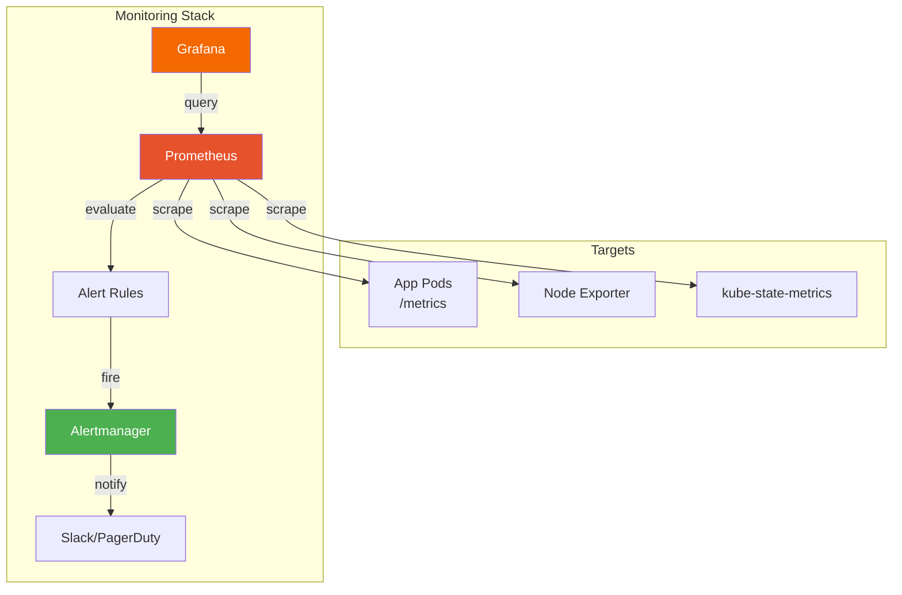

> 💡 **Quick Answer:** Deploy the full monitoring stack with `helm install kube-prometheus-stack prometheus-community/kube-prometheus-stack -n monitoring`. This installs Prometheus, Grafana, Alertmanager, node-exporter, and kube-state-metrics with pre-built dashboards and alerting rules. Define custom monitoring with `ServiceMonitor` and `PrometheusRule` CRDs.

## The Problem

Kubernetes clusters without monitoring are flying blind:

- No visibility into resource utilization trends
- Outages detected by users, not alerts
- No capacity planning data
- Pod failures go unnoticed in large clusters
- No historical data for post-incident analysis

## The Solution

### Install kube-prometheus-stack

```bash
# Add Helm repo
helm repo add prometheus-community https://prometheus-community.github.io/helm-charts
helm repo update

# Install with defaults
helm install kube-prometheus-stack \
  prometheus-community/kube-prometheus-stack \
  --namespace monitoring \
  --create-namespace \
  --set grafana.adminPassword='admin' \
  --set prometheus.prometheusSpec.retention=30d \
  --set prometheus.prometheusSpec.storageSpec.volumeClaimTemplate.spec.resources.requests.storage=50Gi
```

### ServiceMonitor (Monitor a Service)

```yaml
apiVersion: monitoring.coreos.com/v1
kind: ServiceMonitor
metadata:
  name: api-monitor
  namespace: monitoring
  labels:
    release: kube-prometheus-stack    # Must match Prometheus selector
spec:
  namespaceSelector:
    matchNames:
    - production
  selector:
    matchLabels:
      app: api-server
  endpoints:
  - port: metrics          # Named port in the Service
    interval: 15s
    path: /metrics
```

### PodMonitor (Monitor Pods Directly)

```yaml
apiVersion: monitoring.coreos.com/v1
kind: PodMonitor
metadata:
  name: batch-jobs
  namespace: monitoring
spec:
  namespaceSelector:
    matchNames:
    - batch
  selector:
    matchLabels:
      app: data-pipeline
  podMetricsEndpoints:
  - port: metrics
    interval: 30s
```

### PrometheusRule (Alerting)

```yaml
apiVersion: monitoring.coreos.com/v1
kind: PrometheusRule
metadata:
  name: app-alerts
  namespace: monitoring
  labels:
    release: kube-prometheus-stack
spec:
  groups:
  - name: application.rules
    rules:
    - alert: HighErrorRate
      expr: |
        sum(rate(http_requests_total{status=~"5.."}[5m])) by (service)
        / sum(rate(http_requests_total[5m])) by (service)
        > 0.05
      for: 5m
      labels:
        severity: critical
      annotations:
        summary: "High error rate on {{ $labels.service }}"
        description: "{{ $labels.service }} has >5% error rate"
    
    - alert: PodCrashLooping
      expr: rate(kube_pod_container_status_restarts_total[15m]) * 60 * 15 > 5
      for: 5m
      labels:
        severity: warning
      annotations:
        summary: "Pod {{ $labels.pod }} crash looping"
    
    - alert: HighMemoryUsage
      expr: |
        container_memory_working_set_bytes{container!=""}
        / container_spec_memory_limit_bytes{container!=""}
        > 0.9
      for: 10m
      labels:
        severity: warning
      annotations:
        summary: "Container {{ $labels.container }} using >90% memory"
```

### Alertmanager Configuration

```yaml
# alertmanager-config.yaml
apiVersion: monitoring.coreos.com/v1alpha1
kind: AlertmanagerConfig
metadata:
  name: team-alerts
  namespace: monitoring
spec:
  route:
    receiver: slack-critical
    groupBy: ['alertname', 'namespace']
    groupWait: 30s
    groupInterval: 5m
    repeatInterval: 4h
  receivers:
  - name: slack-critical
    slackConfigs:
    - channel: '#alerts-critical'
      apiURL:
        name: slack-webhook
        key: url
      title: '{{ .GroupLabels.alertname }}'
      text: '{{ range .Alerts }}{{ .Annotations.description }}{{ end }}'
```

### Useful PromQL Queries

```promql
# CPU usage by namespace
sum(rate(container_cpu_usage_seconds_total{container!=""}[5m])) by (namespace)

# Memory usage by pod
container_memory_working_set_bytes{container!=""} / 1024 / 1024

# Request rate by service
sum(rate(http_requests_total[5m])) by (service)

# Pod restart count (last hour)
increase(kube_pod_container_status_restarts_total[1h])

# Node disk usage percentage
1 - (node_filesystem_avail_bytes / node_filesystem_size_bytes)

# Top 10 CPU consumers
topk(10, sum(rate(container_cpu_usage_seconds_total{container!=""}[5m])) by (pod))
```



### Instrument Your Application

Prometheus scrapes `/metrics`, but your app has to expose it — client libraries handle the counter/histogram bookkeeping:

```python
from prometheus_client import Counter, Histogram, generate_latest
from flask import Flask, Response

app = Flask(__name__)
REQUEST_COUNT = Counter('http_requests_total', 'Total HTTP requests', ['method', 'endpoint', 'status'])
REQUEST_LATENCY = Histogram('http_request_duration_seconds', 'HTTP request latency', ['method', 'endpoint'])

@app.route('/api/data')
def get_data():
    with REQUEST_LATENCY.labels('GET', '/api/data').time():
        result = process_data()
    REQUEST_COUNT.labels('GET', '/api/data', '200').inc()
    return result

@app.route('/metrics')
def metrics():
    return Response(generate_latest(), mimetype='text/plain')
```

### Recording Rules (Pre-Compute Expensive Queries)

A dashboard re-running a heavy aggregation on every page load is slow — a recording rule computes it once on a schedule instead:

```yaml
apiVersion: monitoring.coreos.com/v1
kind: PrometheusRule
metadata: {name: recording-rules, namespace: monitoring}
spec:
  groups:
    - name: aggregations
      interval: 30s
      rules:
        - record: job:http_requests_total:rate5m
          expr: sum(rate(http_requests_total[5m])) by (job)
        - record: job:http_request_duration_seconds:p99
          expr: histogram_quantile(0.99, sum(rate(http_request_duration_seconds_bucket[5m])) by (job, le))
```

## Common Issues

**ServiceMonitor not picked up by Prometheus**

Labels must match the Prometheus operator's `serviceMonitorSelector`. Default: `release: kube-prometheus-stack`. Check with `kubectl get prometheus -o yaml | grep -A5 serviceMonitorSelector`.

**High cardinality causing OOM**

Too many unique label combinations. Use `metric_relabel_configs` to drop high-cardinality labels or use recording rules to pre-aggregate.

**Grafana shows "No data"**

Check Prometheus data source URL in Grafana (usually `http://kube-prometheus-stack-prometheus.monitoring:9090`).

## Best Practices

- **Use recording rules** for complex queries — pre-compute expensive aggregations
- **Set retention based on storage** — 30d is typical, use Thanos for long-term
- **Alert on symptoms, not causes** — "high error rate" not "CPU is high"
- **Use `for` duration on alerts** — prevents flapping (minimum 5m for most alerts)
- **Separate critical/warning severity** — different routing and escalation
- **Label everything** — team, service, environment labels enable filtering

## Key Takeaways

- kube-prometheus-stack deploys the full monitoring stack in one Helm install
- ServiceMonitor/PodMonitor CRDs define what Prometheus scrapes
- PrometheusRule CRDs define alerting rules declaratively
- Alert on symptoms (error rate, latency) not causes (CPU, memory)
- Pre-built dashboards cover nodes, pods, namespaces, and API server out of the box
