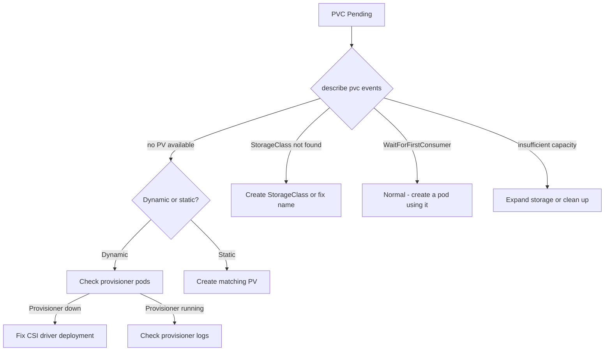

> 💡 **Quick Answer:** PVC stuck in Pending means no PV can satisfy the claim. Check `kubectl describe pvc` for the reason: no matching StorageClass, provisioner not installed, insufficient capacity, or access mode mismatch. For dynamic provisioning, verify the StorageClass provisioner pod is running.

## The Problem

```bash
$ kubectl get pvc
NAME       STATUS    VOLUME   CAPACITY   ACCESS MODES   STORAGECLASS   AGE
my-claim   Pending                                       standard       5m
```

## The Solution

```bash
# Get the exact failure reason
kubectl describe pvc my-claim | grep -A10 Events

# Common messages:
# "no persistent volumes available for this claim"
# "storageclass.storage.k8s.io \"fast\" not found"
# "waiting for first consumer to be created"
```

**"no persistent volumes available"** — no PV matches:
```bash
# List available PVs
kubectl get pv
# Check if any match the PVC's size, access mode, and storage class

# For static provisioning, create a matching PV
```

**"storageclass not found":**
```bash
# List available storage classes
kubectl get storageclass
# Use one that exists, or create the missing one
```

**"waiting for first consumer"** — this is NORMAL:
```bash
# StorageClass has volumeBindingMode: WaitForFirstConsumer
# PVC binds only when a pod using it is scheduled
# This is expected behavior, not an error
```

**Provisioner not running:**
```bash
# Check if the CSI driver / provisioner is healthy
kubectl get pods -n kube-system | grep -E "csi|provisioner|ebs|ceph|nfs"
```



## Common Issues

### PVC bound but pod can't mount
Check access modes: `ReadWriteOnce` means only one node. If your pod lands on a different node than where the PV is, use `ReadWriteMany` (requires NFS or a shared filesystem).

### PVC stuck after deleting the pod
PV reclaim policy may be `Retain`. Manually clear the `claimRef`:
```bash
kubectl patch pv my-pv -p '{"spec":{"claimRef": null}}'
```

### StatefulSet PVCs not reused after pod reschedule
StatefulSet PVCs persist across rescheduling by design. If a PVC is stuck, check if the PV's node affinity matches where the new pod was scheduled.

## Best Practices

- **Use `WaitForFirstConsumer`** for topology-aware storage to avoid cross-zone issues
- **Set `allowVolumeExpansion: true`** on StorageClass if your provisioner supports it
- **Monitor provisioner pods** — a failed CSI driver causes all PVCs to hang
- **Use `ReadWriteMany` only when needed** — it limits storage backend choices

## Key Takeaways

- `kubectl describe pvc` events tell you exactly why it's Pending
- "WaitForFirstConsumer" is normal behavior, not an error
- Dynamic provisioning requires a healthy CSI driver / provisioner
- Access mode and StorageClass must match available PVs
