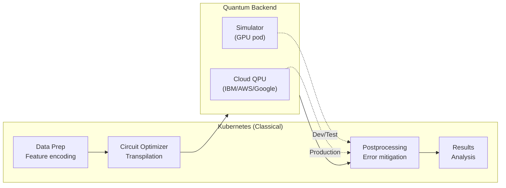

> 💡 **Quick Answer:** Quantum computing workloads on Kubernetes follow a hybrid model: classical preprocessing (K8s pods) → quantum circuit execution (cloud QPU or simulator) → classical postprocessing (K8s pods). Deploy Qiskit/Cirq/PennyLane as Jobs, use Argo Workflows for orchestration, and run quantum simulators as GPU-accelerated pods for development.

## The Problem

2026 is a momentum year for quantum computing — Google's Willow milestones, IBM's 1000+ qubit systems, and Amazon Braket access programs are making quantum more than lab experiments. But quantum computers don't run standalone — they need classical infrastructure for data preparation, circuit optimization, error mitigation, and result analysis. Kubernetes orchestrates this hybrid classical-quantum pipeline.



## The Solution

### Qiskit Quantum Job

```yaml
apiVersion: batch/v1
kind: Job
metadata:
  name: quantum-vqe-optimization
spec:
  template:
    spec:
      containers:
        - name: qiskit
          image: myorg/qiskit-runtime:v1.3
          command: ["python", "vqe_molecule.py"]
          args:
            - "--molecule=H2O"
            - "--backend=aer_simulator_statevector"
            - "--shots=10000"
            - "--optimizer=COBYLA"
            - "--output=/results/vqe_result.json"
          env:
            - name: IBMQ_TOKEN
              valueFrom:
                secretKeyRef:
                  name: quantum-credentials
                  key: ibmq-token
            # For cloud QPU:
            # - name: QISKIT_RUNTIME_SERVICE
            #   value: "ibm_quantum"
          resources:
            requests:
              cpu: "4"
              memory: "16Gi"
            limits:
              cpu: "8"
              memory: "32Gi"
          volumeMounts:
            - name: results
              mountPath: /results
      volumes:
        - name: results
          persistentVolumeClaim:
            claimName: quantum-results
      restartPolicy: Never
  backoffLimit: 2
```

### GPU-Accelerated Quantum Simulator

```yaml
# NVIDIA cuQuantum simulator for development
apiVersion: apps/v1
kind: Deployment
metadata:
  name: quantum-simulator
spec:
  replicas: 1
  template:
    spec:
      containers:
        - name: cuquantum
          image: nvcr.io/nvidia/cuquantum-appliance:24.03
          ports:
            - containerPort: 8080
          env:
            - name: CUSTATEVEC_MAX_QUBITS
              value: "34"              # Up to 34 qubits on A100 80GB
          resources:
            limits:
              nvidia.com/gpu: 1        # GPU-accelerated simulation
              memory: "80Gi"
---
apiVersion: v1
kind: Service
metadata:
  name: quantum-simulator
spec:
  selector:
    app: quantum-simulator
  ports:
    - port: 8080
```

### Argo Workflow: Hybrid Quantum Pipeline

```yaml
apiVersion: argoproj.io/v1alpha1
kind: Workflow
metadata:
  name: quantum-ml-pipeline
spec:
  entrypoint: quantum-pipeline
  templates:
    - name: quantum-pipeline
      dag:
        tasks:
          - name: prepare-data
            template: classical-prep

          - name: encode-features
            dependencies: [prepare-data]
            template: quantum-encoding

          - name: quantum-kernel
            dependencies: [encode-features]
            template: quantum-execute

          - name: classical-ml
            dependencies: [quantum-kernel]
            template: postprocess

    - name: classical-prep
      container:
        image: myorg/data-pipeline:v1.0
        command: ["python", "prepare.py"]
        resources:
          requests:
            cpu: "4"
            memory: "16Gi"

    - name: quantum-encoding
      container:
        image: myorg/qiskit-runtime:v1.3
        command: ["python", "encode_features.py"]
        args: ["--method=amplitude_encoding"]

    - name: quantum-execute
      container:
        image: myorg/qiskit-runtime:v1.3
        command: ["python", "run_circuit.py"]
        args:
          - "--backend=quantum-simulator:8080"
          - "--shots=8192"
          - "--error-mitigation=ZNE"
        resources:
          requests:
            cpu: "2"
            memory: "8Gi"

    - name: postprocess
      container:
        image: myorg/ml-pipeline:v1.0
        command: ["python", "classify.py"]
        args: ["--method=quantum_kernel_svm"]
```

### Multi-Backend Configuration

```yaml
# ConfigMap for quantum backend selection
apiVersion: v1
kind: ConfigMap
metadata:
  name: quantum-backends
data:
  backends.yaml: |
    development:
      type: simulator
      endpoint: http://quantum-simulator:8080
      max_qubits: 34
      
    staging:
      type: cloud_simulator
      provider: ibm_quantum
      backend: ibmq_qasm_simulator
      max_shots: 100000
      
    production:
      type: cloud_qpu
      provider: ibm_quantum
      backend: ibm_fez               # 156-qubit Eagle processor
      max_shots: 10000
      error_mitigation: true
      
    alternative:
      type: cloud_qpu
      provider: amazon_braket
      backend: arn:aws:braket:us-east-1::device/qpu/ionq/Aria-1
```

### Quantum Job Scheduling with Priority

```yaml
# Quantum jobs are expensive — prioritize correctly
apiVersion: scheduling.k8s.io/v1
kind: PriorityClass
metadata:
  name: quantum-production
value: 500000
description: "Production quantum workloads (real QPU time costs $$$)"
---
apiVersion: scheduling.k8s.io/v1
kind: PriorityClass
metadata:
  name: quantum-research
value: 100000
description: "Research quantum experiments (simulator-based)"
```

### Use Cases on Kubernetes

| Use Case | Quantum Advantage | K8s Role |
|----------|-------------------|----------|
| **Drug discovery** | Molecular simulation | Pipeline orchestration, data prep |
| **Portfolio optimization** | Combinatorial optimization | Pre/postprocessing, result aggregation |
| **ML feature maps** | Quantum kernel methods | Training pipeline, model serving |
| **Cryptanalysis** | Factoring, discrete log | Security testing workflows |
| **Materials science** | Electronic structure | Simulation management, visualization |
| **Logistics** | Route optimization (QAOA) | Fleet data pipeline, result serving |

## Common Issues

| Issue | Cause | Fix |
|-------|-------|-----|
| Simulator OOM | Too many qubits | Reduce qubits or use GPU simulator (cuQuantum) |
| Cloud QPU queue time | Limited quantum hardware | Use simulator for dev, queue jobs async |
| Noisy results | Quantum hardware errors | Enable error mitigation (ZNE, PEC) |
| Job timeout | Complex circuits on real QPU | Split into smaller sub-circuits |
| API token expired | Cloud QPU credentials rotated | Use ExternalSecret with auto-refresh |

## Best Practices

- **Develop on simulators, validate on QPUs** — real quantum time is expensive
- **Use GPU-accelerated simulators** — cuQuantum simulates 30+ qubits efficiently
- **Implement error mitigation** — real QPU results need postprocessing correction
- **Async job submission** — cloud QPU queues can be hours; use callbacks
- **Version quantum circuits** — store circuit definitions in Git alongside classical code
- **Monitor QPU costs** — track shots × circuit depth × QPU pricing

## Key Takeaways

- Quantum workloads are hybrid: classical prep → quantum execution → classical analysis
- Kubernetes orchestrates the classical side; QPUs are accessed as external services
- GPU-accelerated simulators (cuQuantum) enable 30+ qubit development on-cluster
- Argo Workflows provides DAG orchestration for multi-step quantum pipelines
- 2026 is the year quantum moves from lab to cloud-accessible production workflows
- Start with simulators — quantum hardware access is limited and expensive
