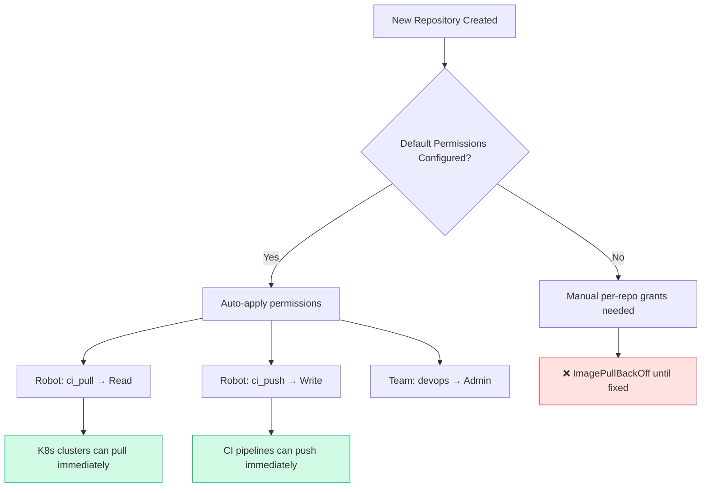

> 💡 **Quick Answer:** In Quay, go to **Organization → Settings → Default Permissions → Create Default Permission**. Select the robot account (e.g., `orgname+ci_pull`), set permission to **Read**, and choose "Anyone" as the creator scope. Every new repository created in the organization will automatically grant the robot read (pull) access — no manual per-repo configuration needed.

## The Problem

In large organizations with hundreds of Quay repositories, manually granting pull access to robot accounts on each new repository is:

- **Error-prone** — developers forget to add the CI/CD robot account
- **Time-consuming** — each repo needs individual permission configuration
- **Inconsistent** — some repos accessible, others return `401 Unauthorized`
- **Hard to audit** — no single place to verify which repos the robot can access

Kubernetes `ImagePullBackOff` errors appear when a new repository is created but the robot account used in pull secrets hasn't been granted access yet.

## The Solution

### Step 1: Create the Robot Account

```bash
# Via Quay API — create organization-level robot account
curl -X PUT "https://quay.example.com/api/v1/organization/myorg/robots/ci_pull" \
  -H "Authorization: Bearer ${QUAY_API_TOKEN}" \
  -H "Content-Type: application/json" \
  -d '{"description": "CI/CD pull-only robot for Kubernetes clusters"}'

# Response includes the robot token
# {
#   "name": "myorg+ci_pull",
#   "token": "ABC123...",
#   "description": "CI/CD pull-only robot for Kubernetes clusters"
# }
```

### Step 2: Configure Default Permissions (UI)

1. Navigate to **Organization → Settings → Default Permissions**
2. Click **Create Default Permission**
3. Configure:
   - **Permission**: `Read` (pull only)
   - **Applied to**: Select robot account `myorg+ci_pull`
   - **Creator**: `Anyone` (applies regardless of who creates the repo)
4. Click **Create Default Permission**

### Step 3: Configure Default Permissions (API)

```bash
# Create default permission via API
# Grant read access to robot 'ci_pull' on all new repos
curl -X POST "https://quay.example.com/api/v1/organization/myorg/prototypes" \
  -H "Authorization: Bearer ${QUAY_API_TOKEN}" \
  -H "Content-Type: application/json" \
  -d '{
    "role": "read",
    "delegate": {
      "kind": "user",
      "name": "myorg+ci_pull"
    }
  }'

# Verify default permissions are set
curl -s "https://quay.example.com/api/v1/organization/myorg/prototypes" \
  -H "Authorization: Bearer ${QUAY_API_TOKEN}" | jq '.prototypes[] | {
    role: .role,
    delegate: .delegate.name,
    activating_user: .activating_user.name
  }'
```

### Step 4: Apply to Existing Repositories

Default permissions only affect **new** repositories. For existing repos, batch-apply:

```bash
#!/bin/bash
# grant-robot-read-all-repos.sh
# Grants read access to robot account on all existing repos

ORG="myorg"
ROBOT="myorg+ci_pull"
QUAY_URL="https://quay.example.com"

# List all repositories in the organization
REPOS=$(curl -s "${QUAY_URL}/api/v1/repository?namespace=${ORG}" \
  -H "Authorization: Bearer ${QUAY_API_TOKEN}" | \
  jq -r '.repositories[].name')

for REPO in $REPOS; do
  echo -n "Granting read on ${ORG}/${REPO}... "
  
  HTTP_CODE=$(curl -s -o /dev/null -w "%{http_code}" \
    -X PUT "${QUAY_URL}/api/v1/repository/${ORG}/${REPO}/permissions/user/${ROBOT}" \
    -H "Authorization: Bearer ${QUAY_API_TOKEN}" \
    -H "Content-Type: application/json" \
    -d '{"role": "read"}')
  
  if [ "$HTTP_CODE" = "200" ]; then
    echo "✅"
  else
    echo "❌ (HTTP $HTTP_CODE)"
  fi
done
```

### Step 5: Use in Kubernetes

```yaml
# Create pull secret from robot token
kubectl create secret docker-registry quay-pull-secret \
  --docker-server=quay.example.com \
  --docker-username="myorg+ci_pull" \
  --docker-password="${ROBOT_TOKEN}" \
  --namespace=production

# Reference in Deployment
apiVersion: apps/v1
kind: Deployment
metadata:
  name: myapp
  namespace: production
spec:
  template:
    spec:
      imagePullSecrets:
        - name: quay-pull-secret
      containers:
        - name: app
          image: quay.example.com/myorg/myapp:v1.2.3
```

### Multiple Robot Accounts Pattern

```bash
# Create role-specific robots with different default permissions

# Read-only robot for production clusters
curl -X PUT "${QUAY_URL}/api/v1/organization/myorg/robots/prod_pull" \
  -H "Authorization: Bearer ${QUAY_API_TOKEN}" \
  -H "Content-Type: application/json" \
  -d '{"description": "Production clusters — pull only"}'

curl -X POST "${QUAY_URL}/api/v1/organization/myorg/prototypes" \
  -H "Authorization: Bearer ${QUAY_API_TOKEN}" \
  -H "Content-Type: application/json" \
  -d '{"role": "read", "delegate": {"kind": "user", "name": "myorg+prod_pull"}}'

# Write robot for CI/CD pipelines (push + pull)
curl -X PUT "${QUAY_URL}/api/v1/organization/myorg/robots/ci_push" \
  -H "Authorization: Bearer ${QUAY_API_TOKEN}" \
  -H "Content-Type: application/json" \
  -d '{"description": "CI/CD pipelines — push and pull"}'

curl -X POST "${QUAY_URL}/api/v1/organization/myorg/prototypes" \
  -H "Authorization: Bearer ${QUAY_API_TOKEN}" \
  -H "Content-Type: application/json" \
  -d '{"role": "write", "delegate": {"kind": "user", "name": "myorg+ci_push"}}'
```

### Scoped Default Permissions by Creator

```bash
# Only apply when a specific team/user creates repos
# Useful for team-specific robots

# When anyone on the "platform" team creates a repo,
# grant read to the platform robot
curl -X POST "${QUAY_URL}/api/v1/organization/myorg/prototypes" \
  -H "Authorization: Bearer ${QUAY_API_TOKEN}" \
  -H "Content-Type: application/json" \
  -d '{
    "role": "read",
    "delegate": {
      "kind": "user",
      "name": "myorg+platform_pull"
    },
    "activating_user": {
      "name": "platform_admin"
    }
  }'
```



## Common Issues

### Default Permissions Not Applied to Existing Repos
```bash
# Default permissions only affect NEW repositories
# Use the batch script above for existing repos

# Verify a specific repo's permissions
curl -s "${QUAY_URL}/api/v1/repository/myorg/myapp/permissions/user/" \
  -H "Authorization: Bearer ${QUAY_API_TOKEN}" | jq '.permissions'
```

### Robot Account Missing from Permission Selector
```bash
# Robot must be created at the ORGANIZATION level, not repository level
# Verify it exists
curl -s "${QUAY_URL}/api/v1/organization/myorg/robots" \
  -H "Authorization: Bearer ${QUAY_API_TOKEN}" | \
  jq '.robots[] | .name'
```

### LDAP/SSO Users Not Triggering Default Permissions
```bash
# The "creator" in default permissions matches the Quay username
# For LDAP users, this is the LDAP uid, not email
# Verify with:
curl -s "${QUAY_URL}/api/v1/users/john_doe" \
  -H "Authorization: Bearer ${QUAY_API_TOKEN}" | jq '.username'
```

### Permission Precedence
```
# If both default permission AND team permission exist:
# - Higher permission wins (write > read)
# - Explicit repo-level permissions override defaults
# - Robot with "read" default + "write" via team = "write" effective
```

## Best Practices

1. **One robot per purpose**: `ci_pull` (read), `ci_push` (write), `scanner` (read) — never share tokens across use cases
2. **Always set default permissions**: Prevents ImagePullBackOff on new repos
3. **Batch-apply to existing repos**: Run the script after creating default permissions
4. **Rotate robot tokens**: Use `rotate-quay-robot-tokens` recipe for periodic rotation
5. **Audit permissions**: Periodically list all prototypes and verify they match your security policy
6. **Use "Anyone" creator scope**: Unless you have team-specific isolation requirements
7. **Prefer read over write**: Only CI/CD push pipelines need write; everything else should be read-only
8. **Mirror to cluster pull secret**: Use OpenShift global pull secret or namespace-level `imagePullSecrets`

## Key Takeaways

- Default permissions (prototypes) auto-grant access on **new** repositories only
- Use the Quay API `/organization/{org}/prototypes` endpoint for automation
- Separate robot accounts by role: read for clusters, write for CI/CD
- Batch-apply to existing repos with the provided script
- Combine with Kubernetes `imagePullSecrets` or OpenShift global pull secret for seamless image pulling
