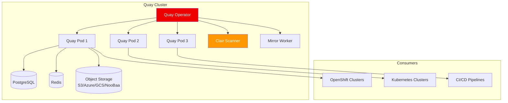

> 💡 **Quick Answer:** Red Hat Quay is a production-grade container registry with image scanning (Clair), RBAC, geo-replication, mirroring, and quota management. Deploy via the Quay Operator on OpenShift with `QuayRegistry` CR — it auto-manages Postgres, Redis, object storage, and horizontal scaling. Use Quay as your disconnected mirror registry after bootstrapping with mirror-registry.

## The Problem

Production Kubernetes environments need more than a basic registry:

- Image vulnerability scanning before deployment
- Role-based access control per team and namespace
- Geo-replication across sites for disaster recovery
- Repository mirroring from upstream registries on schedule
- Quota management to prevent storage abuse
- Audit logging for compliance
- High availability for production clusters depending on the registry 24/7
- Build triggers and notification webhooks

## The Solution

### Architecture



### Deploy Quay Operator on OpenShift

```bash
# Install Quay Operator from OperatorHub
cat <<EOF | oc apply -f -
apiVersion: operators.coreos.com/v1alpha1
kind: Subscription
metadata:
  name: quay-operator
  namespace: openshift-operators
spec:
  channel: stable-3.12
  installPlanApproval: Automatic
  name: quay-operator
  source: redhat-operators
  sourceNamespace: openshift-marketplace
EOF

# Wait for operator
oc get csv -n openshift-operators | grep quay
```

### Create QuayRegistry Instance

```yaml
# quay-registry.yaml
apiVersion: quay.redhat.com/v1
kind: QuayRegistry
metadata:
  name: enterprise-registry
  namespace: quay-system
spec:
  configBundleSecret: quay-config-bundle
  components:
  - kind: clair
    managed: true
  - kind: postgres
    managed: true
  - kind: redis
    managed: true
  - kind: objectstorage
    managed: true        # Uses NooBaa/ODF on OpenShift
  - kind: horizontalpodautoscaler
    managed: true
  - kind: mirror
    managed: true
  - kind: monitoring
    managed: true
  - kind: tls
    managed: true        # Auto-generates TLS via OpenShift routes
  - kind: route
    managed: true
```

```bash
# Create namespace
oc new-project quay-system

# Apply the QuayRegistry
oc apply -f quay-registry.yaml

# Monitor deployment
oc get quayregistry -n quay-system -w

# Get the Quay route URL
oc get route -n quay-system
# NAME                          HOST
# enterprise-registry-quay      enterprise-registry-quay-quay-system.apps.cluster.example.com
```

### External Storage Backend

For production, use external object storage instead of managed NooBaa:

```yaml
# quay-config.yaml (ConfigBundle)
DISTRIBUTED_STORAGE_CONFIG:
  s3Storage:
    - S3Storage
    - host: s3.example.com
      port: 443
      s3_access_key: <access-key>
      s3_secret_key: <secret-key>
      s3_bucket: quay-storage
      storage_path: /datastorage/registry
DISTRIBUTED_STORAGE_DEFAULT_LOCATIONS:
  - s3Storage
DISTRIBUTED_STORAGE_PREFERENCE:
  - s3Storage
```

```bash
# Create config bundle secret
oc create secret generic quay-config-bundle \
  --from-file=config.yaml=quay-config.yaml \
  -n quay-system

# Update QuayRegistry to use external storage
# Set objectstorage.managed: false
```

### Repository Mirroring

Automatically sync from upstream registries on schedule:

```yaml
# In Quay config.yaml
FEATURE_REPO_MIRROR: true
REPO_MIRROR_INTERVAL: 30       # seconds between mirror checks
REPO_MIRROR_TLS_VERIFY: true
```

Configure via UI or API:

```bash
# Create a mirrored repository via API
curl -X POST "https://quay.example.com/api/v1/repository" \
  -H "Authorization: Bearer $QUAY_TOKEN" \
  -H "Content-Type: application/json" \
  -d '{
    "repository": "ubi9-ubi",
    "namespace": "mirrors",
    "visibility": "public",
    "description": "Mirror of registry.redhat.io/ubi9/ubi"
  }'

# Configure mirror settings
curl -X POST "https://quay.example.com/api/v1/repository/mirrors/ubi9-ubi/mirror" \
  -H "Authorization: Bearer $QUAY_TOKEN" \
  -d '{
    "external_reference": "registry.redhat.io/ubi9/ubi",
    "sync_interval": 86400,
    "sync_start_date": "2026-04-29T00:00:00Z",
    "root_rule": {"rule_kind": "tag_glob_csv", "rule_value": ["latest", "9.*"]},
    "is_enabled": true
  }'
```

### Geo-Replication

Replicate images across multiple sites:

```yaml
# In Quay config.yaml
FEATURE_STORAGE_REPLICATION: true
DISTRIBUTED_STORAGE_CONFIG:
  us-east:
    - S3Storage
    - host: s3-us-east.example.com
      s3_bucket: quay-east
  eu-west:
    - S3Storage
    - host: s3-eu-west.example.com
      s3_bucket: quay-west
DISTRIBUTED_STORAGE_DEFAULT_LOCATIONS:
  - us-east
  - eu-west
DISTRIBUTED_STORAGE_PREFERENCE:
  - us-east
  - eu-west
```

### Image Security Scanning (Clair)

```bash
# Clair is auto-deployed when managed: true
# Check vulnerability report via API
curl -s "https://quay.example.com/api/v1/repository/myorg/myapp/manifest/sha256:abc.../security?vulnerabilities=true" \
  -H "Authorization: Bearer $QUAY_TOKEN" | jq '.data.Layer.Features[].Vulnerabilities'

# Or view in the UI: Repository → Tags → Security Scan column
```

### Quota Management

```yaml
# In Quay config.yaml
FEATURE_QUOTA_MANAGEMENT: true
DEFAULT_SYSTEM_REJECT_QUOTA_BYTES: 10737418240   # 10 GB per org
PERMANENTLY_DELETE_TAGS: true
```

### Robot Accounts for Kubernetes

```bash
# Create a robot account for CI/CD pull access
curl -X PUT "https://quay.example.com/api/v1/organization/myorg/robots/ci-puller" \
  -H "Authorization: Bearer $QUAY_TOKEN" \
  -d '{"description": "CI/CD pull account"}'

# Create Kubernetes pull secret from robot token
oc create secret docker-registry quay-pull-secret \
  --docker-server=quay.example.com \
  --docker-username="myorg+ci-puller" \
  --docker-password="$ROBOT_TOKEN" \
  -n my-namespace

# Link to service account
oc secrets link default quay-pull-secret --for=pull -n my-namespace
```

### Garbage Collection

```yaml
# In Quay config.yaml
FEATURE_GARBAGE_COLLECTION: true
TAG_EXPIRATION_OPTIONS:
  - 1w
  - 2w
  - 4w
DEFAULT_TAG_EXPIRATION: 2w
```

## Common Issues

**QuayRegistry stuck in "Progressing"**

Usually a storage issue. Check NooBaa status or external S3 connectivity: `oc get noobaa -n openshift-storage`.

**Clair not scanning images**

Clair needs to index the image first. Check Clair pods: `oc logs -l app=clair -n quay-system`. Ensure the Clair database has enough storage.

**Mirror sync fails with auth errors**

Create robot accounts or external credentials for the upstream registry in the Quay UI under Repository → Mirror → Sync Credentials.

## Best Practices

- **Bootstrap with mirror-registry, graduate to Quay** — use mirror-registry for first cluster, then deploy Quay on it
- **Use external PostgreSQL and S3** for production — managed components are single-instance
- **Enable Clair scanning** — block vulnerable images with Quay's security policy
- **Robot accounts per environment** — separate pull/push credentials for dev, staging, prod
- **Enable geo-replication** for multi-site — reduces pull latency and provides DR
- **Set quotas per organization** — prevent runaway storage consumption
- **Enable garbage collection** with tag expiration — keeps storage clean

## Key Takeaways

- Red Hat Quay is the production-grade registry for OpenShift disconnected environments
- Quay Operator auto-manages all components: Postgres, Redis, Clair, storage, TLS
- Repository mirroring auto-syncs from upstream registries on schedule
- Geo-replication provides multi-site redundancy for image content
- Clair scanner provides vulnerability detection before deployment
- Robot accounts provide secure, scoped credentials for Kubernetes pull secrets
- Graduate from mirror-registry to Quay after bootstrapping your first cluster
