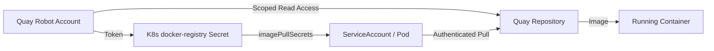

> 💡 **Quick Answer:** Create a Quay robot account with read-only repository permissions, then use its generated credentials to create a Kubernetes `docker-registry` Secret and attach it as an `imagePullSecret` to your ServiceAccount or Pod spec.

## The Problem

You need to pull container images from a private Quay registry into your Kubernetes cluster. Using personal credentials is insecure — they have too many permissions, can't be easily rotated, and get shared across teams. You need a service-level identity with minimal, auditable access.

Robot accounts solve this by providing:
- **Scoped permissions** — read-only access to specific repositories
- **Separate credentials** — no personal account exposure
- **Easy rotation** — regenerate tokens without affecting human users
- **Audit trail** — track which robot pulled what and when

## The Solution

### Step 1: Create a Robot Account in Quay

Navigate to your Quay organization and create a robot account:

**Via Quay Web UI:**
1. Go to **Organization → Robot Accounts → Create Robot Account**
2. Name it descriptively: `k8s_prod_puller`
3. The full name becomes `orgname+k8s_prod_puller`

**Via Quay API:**

```bash
# Create a robot account in your organization
curl -X PUT \
  "https://quay.io/api/v1/organization/myorg/robots/k8s_prod_puller" \
  -H "Authorization: Bearer ${QUAY_API_TOKEN}" \
  -H "Content-Type: application/json" \
  -d '{"description": "Kubernetes production cluster image puller"}'
```

Response includes the robot credentials:

```json
{
  "name": "myorg+k8s_prod_puller",
  "token": "ABC123...ROBOT_TOKEN...XYZ789",
  "created": "2026-02-26T10:00:00Z",
  "description": "Kubernetes production cluster image puller"
}
```

### Step 2: Grant Repository Permissions

Assign **read-only** access to specific repositories:

**Via Quay Web UI:**
1. Go to **Repository → Settings → User and Robot Permissions**
2. Add the robot account with **Read** permission

**Via Quay API:**

```bash
# Grant read permission on a specific repository
curl -X PUT \
  "https://quay.io/api/v1/repository/myorg/my-app/permissions/user/myorg+k8s_prod_puller" \
  -H "Authorization: Bearer ${QUAY_API_TOKEN}" \
  -H "Content-Type: application/json" \
  -d '{"role": "read"}'
```

To grant access to multiple repositories:

```bash
# Grant read access to multiple repos
for repo in my-app backend-api worker-service; do
  curl -X PUT \
    "https://quay.io/api/v1/repository/myorg/${repo}/permissions/user/myorg+k8s_prod_puller" \
    -H "Authorization: Bearer ${QUAY_API_TOKEN}" \
    -H "Content-Type: application/json" \
    -d '{"role": "read"}'
  echo "Granted read access to myorg/${repo}"
done
```

### Step 3: Create Kubernetes Secret

Use the robot account credentials to create a `docker-registry` Secret:

```bash
# Create the imagePullSecret
kubectl create secret docker-registry quay-pull-secret \
  --docker-server=quay.io \
  --docker-username="myorg+k8s_prod_puller" \
  --docker-password="ABC123...ROBOT_TOKEN...XYZ789" \
  --docker-email="robot@myorg.example.com" \
  -n my-namespace
```

For self-hosted Quay registries, replace `quay.io` with your registry URL:

```bash
kubectl create secret docker-registry quay-pull-secret \
  --docker-server=quay.example.com \
  --docker-username="myorg+k8s_prod_puller" \
  --docker-password="${ROBOT_TOKEN}" \
  --docker-email="robot@myorg.example.com" \
  -n my-namespace
```

Verify the Secret was created:

```bash
kubectl get secret quay-pull-secret -n my-namespace -o jsonpath='{.type}'
# Output: kubernetes.io/dockerconfigjson
```

### Step 4: Attach to ServiceAccount

The recommended approach is to add the Secret to the default ServiceAccount so all Pods in the namespace use it automatically:

```yaml
# patch-sa.yaml
apiVersion: v1
kind: ServiceAccount
metadata:
  name: default
  namespace: my-namespace
imagePullSecrets:
  - name: quay-pull-secret
```

```bash
# Patch the default ServiceAccount
kubectl patch serviceaccount default \
  -n my-namespace \
  -p '{"imagePullSecrets": [{"name": "quay-pull-secret"}]}'
```

### Step 5: Use in Pod Spec

Alternatively, reference the Secret directly in your Pod or Deployment:

```yaml
apiVersion: apps/v1
kind: Deployment
metadata:
  name: my-app
  namespace: my-namespace
spec:
  replicas: 3
  selector:
    matchLabels:
      app: my-app
  template:
    metadata:
      labels:
        app: my-app
    spec:
      containers:
        - name: my-app
          image: quay.io/myorg/my-app:v1.2.3
          ports:
            - containerPort: 8080
      imagePullSecrets:
        - name: quay-pull-secret
```

### Step 6: Verify the Pull Works

```bash
# Deploy and watch
kubectl apply -f deployment.yaml
kubectl rollout status deployment/my-app -n my-namespace

# Check events for pull success
kubectl describe pod -l app=my-app -n my-namespace | grep -A5 "Events:"
```

You should see:

```
Events:
  Type    Reason     Age   From               Message
  ----    ------     ----  ----               -------
  Normal  Pulling    10s   kubelet            Pulling image "quay.io/myorg/my-app:v1.2.3"
  Normal  Pulled     8s    kubelet            Successfully pulled image
  Normal  Created    8s    kubelet            Created container my-app
  Normal  Started    7s    kubelet            Started container my-app
```



## Multi-Namespace Setup

For clusters with many namespaces, automate Secret creation:

```bash
#!/bin/bash
# create-pull-secrets.sh — Replicate Quay pull secret across namespaces

NAMESPACES=("production" "staging" "dev" "monitoring")
REGISTRY="quay.io"
ROBOT_USER="myorg+k8s_prod_puller"
ROBOT_TOKEN="${QUAY_ROBOT_TOKEN}"

for ns in "${NAMESPACES[@]}"; do
  # Create namespace if it doesn't exist
  kubectl create namespace "$ns" --dry-run=client -o yaml | kubectl apply -f -

  # Create or update the pull secret
  kubectl create secret docker-registry quay-pull-secret \
    --docker-server="$REGISTRY" \
    --docker-username="$ROBOT_USER" \
    --docker-password="$ROBOT_TOKEN" \
    --docker-email="robot@myorg.example.com" \
    -n "$ns" \
    --dry-run=client -o yaml | kubectl apply -f -

  # Patch default ServiceAccount
  kubectl patch serviceaccount default \
    -n "$ns" \
    -p '{"imagePullSecrets": [{"name": "quay-pull-secret"}]}'

  echo "✅ Configured quay-pull-secret in namespace: $ns"
done
```

## Token Rotation

Rotate robot tokens without downtime:

```bash
#!/bin/bash
# rotate-quay-token.sh — Regenerate robot token and update K8s secrets

ORG="myorg"
ROBOT="k8s_prod_puller"

# 1. Regenerate the token via Quay API
NEW_TOKEN=$(curl -s -X POST \
  "https://quay.io/api/v1/organization/${ORG}/robots/${ROBOT}/regenerate" \
  -H "Authorization: Bearer ${QUAY_API_TOKEN}" | jq -r '.token')

echo "New token generated for ${ORG}+${ROBOT}"

# 2. Update all Kubernetes secrets
for ns in $(kubectl get namespaces -o jsonpath='{.items[*].metadata.name}'); do
  if kubectl get secret quay-pull-secret -n "$ns" &>/dev/null; then
    kubectl create secret docker-registry quay-pull-secret \
      --docker-server=quay.io \
      --docker-username="${ORG}+${ROBOT}" \
      --docker-password="${NEW_TOKEN}" \
      --docker-email="robot@${ORG}.example.com" \
      -n "$ns" \
      --dry-run=client -o yaml | kubectl apply -f -
    echo "✅ Updated secret in namespace: $ns"
  fi
done

# 3. Rolling restart deployments to pick up new credentials
# (only needed if tokens are cached by container runtime)
echo "Secrets updated. Existing running containers are unaffected."
echo "New pulls will use the rotated token automatically."
```

## Common Issues

### ImagePullBackOff — Authentication Required

```
Failed to pull image "quay.io/myorg/my-app:v1.2.3":
  unauthorized: access to the requested resource is not authorized
```

**Fix:** Check that the robot account has **read** permission on the repository and the Secret credentials match:

```bash
# Verify credentials work outside K8s
podman login quay.io \
  --username "myorg+k8s_prod_puller" \
  --password "${ROBOT_TOKEN}"

# Decode and inspect the K8s secret
kubectl get secret quay-pull-secret -n my-namespace \
  -o jsonpath='{.data.\.dockerconfigjson}' | base64 -d | jq .
```

### Secret Not Found in Namespace

```
Error: secrets "quay-pull-secret" not found
```

**Fix:** Kubernetes Secrets are namespace-scoped. You must create the Secret in every namespace where Pods need it.

### Wrong Registry URL

If using a self-hosted Quay with a custom domain or port:

```bash
# Include the port if non-standard
kubectl create secret docker-registry quay-pull-secret \
  --docker-server=quay.internal.example.com:8443 \
  --docker-username="myorg+k8s_prod_puller" \
  --docker-password="${ROBOT_TOKEN}" \
  -n my-namespace
```

### Robot Account Permission Levels

| Permission | Can Pull | Can Push | Can Admin |
|-----------|----------|----------|-----------|
| **Read**  | ✅       | ❌       | ❌        |
| **Write** | ✅       | ✅       | ❌        |
| **Admin** | ✅       | ✅       | ✅        |

> ⚠️ **Always use Read for Kubernetes pull secrets.** Write and Admin are only needed for CI/CD push pipelines.

## Best Practices

- **One robot per environment** — Create separate robots for dev, staging, and production (`k8s_dev_puller`, `k8s_staging_puller`, `k8s_prod_puller`)
- **Least privilege** — Grant **read-only** access to only the repositories each cluster needs
- **Rotate tokens quarterly** — Use the rotation script above on a schedule
- **Avoid org-level permissions** — Grant per-repository access instead of org-wide read
- **Use External Secrets Operator** — For production, store the robot token in a vault and sync to K8s via ESO rather than manual `kubectl create secret`
- **Audit regularly** — Review robot account activity in Quay's usage logs
- **Name descriptively** — `k8s_prod_puller` is better than `robot1`
- **Never commit tokens** — Use environment variables or sealed secrets for GitOps workflows

## Key Takeaways

- Quay robot accounts provide **service-level identities** with scoped, auditable access — never use personal credentials in Kubernetes
- Create a `docker-registry` Secret from the robot token and attach it via `imagePullSecrets` on ServiceAccounts or Pod specs
- Automate multi-namespace setup and token rotation with simple shell scripts
- Always grant **read-only** repository access for pull-only use cases
- Combine with External Secrets Operator or Sealed Secrets for production-grade GitOps workflows
