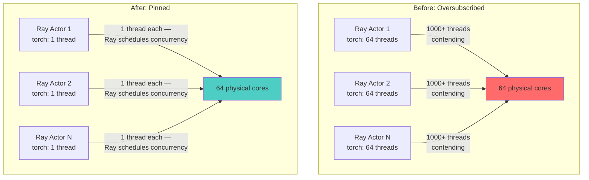

> 💡 **Quick Answer:** Ray Data spawns many worker actors to parallelize CPU preprocessing, but PyTorch's default intra-op thread pool sizes itself to the **node's total CPU count**, not the actor's actual CPU allocation. N actors × a full-width thread pool each = massive oversubscription — GPUs sit idle waiting for batches while every CPU core thrashes on context switches. Call `torch.set_num_threads(1)` and `torch.set_num_interop_threads(1)` at the top of every Ray worker process, and set `OMP_NUM_THREADS=1` as an environment-level backstop for any BLAS/OpenMP code that doesn't go through PyTorch's thread control.

## The Problem

A typical GPU training job uses Ray Data to parallelize CPU-side preprocessing (image decode, resize, augmentation) ahead of a GPU training step. Ray Data does this by scheduling many concurrent tasks/actors — often one per requested CPU. Each of those tasks, however, runs full application code, including `import torch` and any torchvision transforms.

PyTorch (and the MKL/OpenBLAS/OpenMP libraries underneath it) defaults `torch.get_num_threads()` to the **number of logical CPUs visible to the process** — which, in a container, is frequently the **host node's total core count**, not the CPU quota in the Pod's `resources.requests.cpu`. Every Ray Data worker process independently spins up that many intra-op threads for its own tensor ops.

The math breaks down fast: 16 Ray Data actors on a 64-core node, each defaulting to 64 PyTorch threads, is **1,024 threads contending for 64 cores** — before the GPU training process's own DataLoader workers are even counted. The symptoms are distinctive:

- GPU utilization near 0% during data-loading phases — the GPU is starved, not busy
- Every CPU core pegged at 100%, but end-to-end throughput is far worse than a single-threaded baseline
- `htop`/`top` inside a worker Pod shows thousands of threads for a job whose Pod only requested a handful of CPUs



### Why This Is Especially Sneaky on Kubernetes

Container CPU limits are enforced by the cgroup CFS quota, but many CPU-detection code paths (including older PyTorch/OpenMP builds) call `os.cpu_count()` or read `/proc/cpuinfo`, both of which report the **node's** physical CPU count — not the cgroup quota. A Pod that requested `cpu: "4"` can still have PyTorch spin up threads sized for all 64 cores on the node it landed on, because nothing in that detection path consulted the cgroup limit or `sched_getaffinity()`.

## The Solution

### 1. Pin thread counts at the top of every Ray worker entrypoint

```python
import torch
torch.set_num_threads(1)
torch.set_num_interop_threads(1)

# ─────────────────────────────────────────────
#  CPU PREPROCESSING — executed by Ray Data
# ─────────────────────────────────────────────
def preprocess_batch(batch):
    # torchvision transforms, tensor ops, etc. now run
    # single-threaded per actor — Ray's own actor/task
    # count provides the real parallelism.
    ...
```

`torch.set_num_threads()` must run **before** any tensor op executes in that process — Ray Data actors are separate processes, so this has to be set inside the actor/task code itself (or its `__init__`), not just once in the driver script. Setting it in the driver only controls the driver's own threading, not the remote workers Ray spawns.

### 2. Set the environment variable backstop

Not every CPU-heavy operation in a preprocessing pipeline routes through `torch`'s thread control — NumPy, OpenCV, and other BLAS/OpenMP-linked libraries read their thread count from environment variables at process start:

```yaml
# RayCluster worker group env
env:
  - name: OMP_NUM_THREADS
    value: "1"
  - name: MKL_NUM_THREADS
    value: "1"
  - name: OPENBLAS_NUM_THREADS
    value: "1"
```

Set these on the Ray worker Pods (or in the Ray `runtime_env`), not just in the training script — some native extensions read them at import time, before your Python code has a chance to call `torch.set_num_threads()`.

### 3. Tell Ray explicitly how many CPUs it actually has

In containerized environments, don't rely on Ray's autodetection matching your Pod's CPU request — pass it explicitly:

```python
import ray

ray.init(
    address=args.ray_address,
    num_cpus=int(os.environ.get("RAY_WORKER_CPUS", "4")),  # match Pod's cpu request
    ignore_reinit_error=True,
)
```

```bash
# Verify Ray's view of available resources matches your Pod's actual CPU request
python3 -c "import ray; ray.init(address='auto'); print(ray.cluster_resources())"
```

If `ray.cluster_resources()['CPU']` is larger than the sum of your worker Pods' `resources.requests.cpu`, Ray will over-schedule concurrent tasks onto CPU capacity that isn't really guaranteed by Kubernetes — reinforcing the same oversubscription problem from the scheduling side, not just the threading side.

### 4. Right-size `num_cpus` per Ray Data task

```python
ds = ray.data.read_images(path)
ds = ds.map_batches(
    preprocess_batch,
    num_cpus=1,          # matches torch.set_num_threads(1) inside preprocess_batch
    concurrency=(4, 16),  # let Ray scale actors within this range instead of over-threading each one
)
```

Let Ray's own actor/task concurrency do the parallelizing — one thread per actor, many actors — rather than a handful of actors each internally multithreaded.

## Debugging a Hanging `ray.init()`

Bracket the call with logging while diagnosing — a hang here (rather than a slow-but-completing call) is almost always a **connectivity** problem, not a CPU one:

```python
print("Before ray init...")
ray.init(address=args.ray_address, ignore_reinit_error=True)
print("After ray init...")
```

Common causes on Kubernetes/OpenShift:

| Symptom | Cause | Fix |
|---------|-------|-----|
| Hangs indefinitely, no error | NetworkPolicy blocking the GCS port (default 6379) or object manager ports between head and worker Pods | Allow intra-namespace traffic on Ray's port range, or explicitly open the ports your RayCluster config uses |
| Hangs then times out | `ray_address` points at a Service name that doesn't resolve, or the head Pod isn't Ready yet | Add a readiness-gate/wait step before launching workers; verify with `kubectl exec -it <worker> -- nslookup <head-service>` |
| Connects, then immediately errors on version mismatch | Head and worker Pods use different Ray image tags | Pin the same `rayproject/ray:<version>` tag across `headGroupSpec` and `workerGroupSpecs` |

## Common Issues

| Issue | Cause | Fix |
|-------|-------|-----|
| GPU utilization near 0% during "data loading" | CPU preprocessing actors thread-oversubscribed, starving the pipeline that feeds the GPU | `torch.set_num_threads(1)` + `OMP_NUM_THREADS=1` in every Ray worker |
| Throughput doesn't improve after requesting more CPU | PyTorch detected the node's full core count, not the Pod's cgroup quota, so more replicas just multiply the oversubscription | Set `num_cpus` explicitly on `ray.init()` and each `map_batches` call |
| Works fine with 1 worker Pod on a node, degrades badly with many | Multiple Ray Data actor Pods scheduled on the same node each independently detect and use the full node core count | Same fix — thread pinning is per-process, so it must apply to every actor regardless of colocation |
| `ray.init()` hangs in CI/cluster but not locally | Network policy or DNS difference between environments | See the connectivity table above |

## Best Practices

- **Pin threads at the top of the worker entrypoint, before any tensor op runs** — setting it later (e.g., mid-training) may not undo threads already spawned by an earlier operation
- **Set both the `torch` call and the `OMP_NUM_THREADS`/`MKL_NUM_THREADS` env vars** — the env vars catch native code paths that `torch.set_num_threads()` doesn't cover
- **Pass `num_cpus` explicitly to `ray.init()` and to `map_batches`/actor definitions** — don't trust container CPU autodetection in Kubernetes
- **Verify with `ray.cluster_resources()`** that Ray's view of available CPU matches what you actually requested in Pod specs
- **Prefer more single-threaded actors over fewer multi-threaded ones** for CPU-bound Ray Data preprocessing — Ray's own scheduler already provides the parallelism

## Key Takeaways

- Ray Data actors are separate processes — thread limits must be set inside each worker's own code, not just in the driver
- PyTorch's default thread count follows the node's total CPU count, not the container's cgroup CPU limit — a frequent and easy-to-miss Kubernetes gotcha
- `torch.set_num_threads(1)` + `torch.set_num_interop_threads(1)` + `OMP_NUM_THREADS=1` together close the gap that any single fix alone leaves open
- N actors × a full-width thread pool each is the oversubscription math to watch for — it scales badly with node core count, not better
- A hanging `ray.init()` is a connectivity problem (NetworkPolicy, DNS, version mismatch), not a CPU/threading one — diagnose it separately
