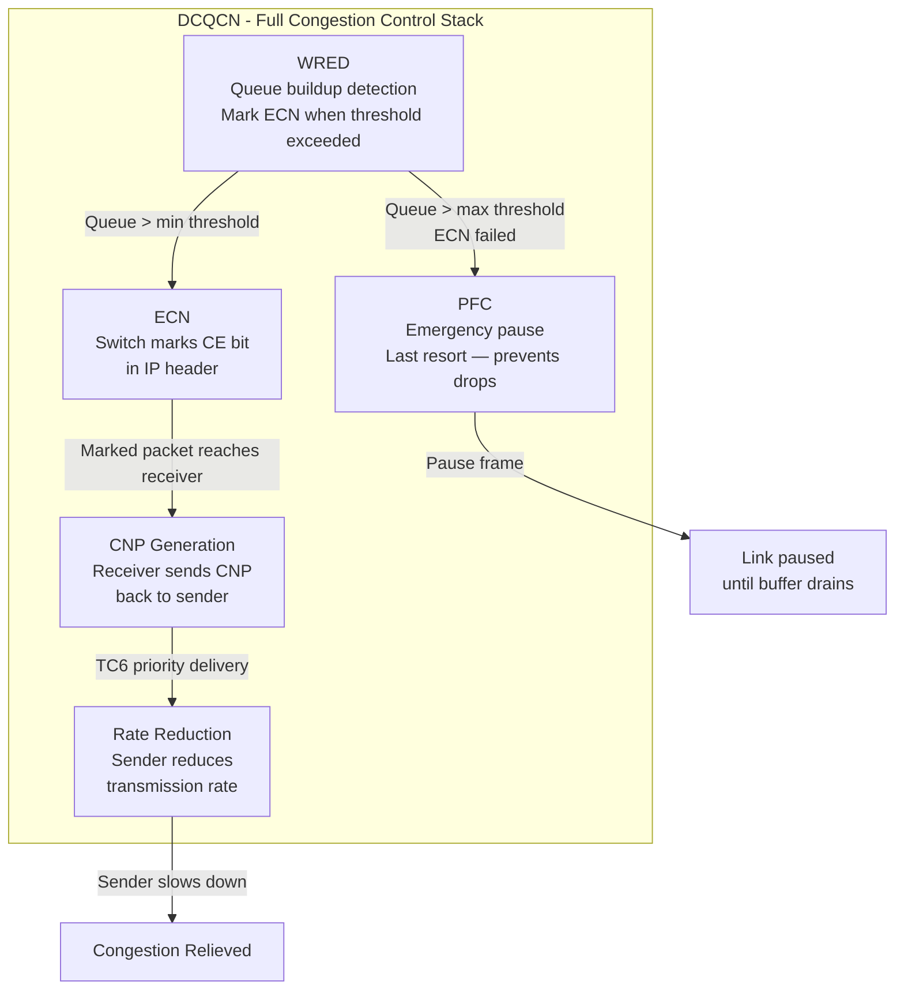
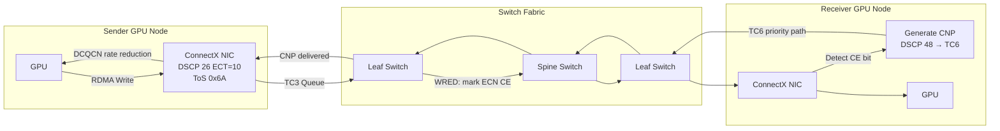

> 💡 **Quick Answer:** RDMA QoS uses three traffic classes: **TC0** (lossy best-effort), **TC3** (lossless RDMA, DSCP 24/26), and **TC6** (CNP congestion notification). PFC makes TC3 lossless, ECN+WRED mark congestion, and DCQCN is the end-to-end congestion control algorithm combining all three mechanisms.

## The Problem

A data center fabric carrying RDMA, iSCSI, and regular traffic must isolate these flows to prevent mutual interference. Without QoS:
- RDMA packets get dropped alongside bulk data → NCCL retransmissions → GPU idle time
- Congestion notification packets (CNP) get delayed → DCQCN can't react fast enough
- iSCSI storage traffic competes with everything → storage latency spikes

The solution is traffic classification: map each traffic type to a dedicated queue with appropriate loss/lossless behavior and congestion control.

## The Solution

### Traffic Class Architecture

| Traffic Class | Type | DSCP Values | dot1p | Behavior | Use Case |
|---|---|---|---|---|---|
| **TC0** | Lossy | All others | 0-2, 5, 7 | Best-effort, tail-drop | Regular traffic, management |
| **TC3** | **Lossless** | **24 (CS3), 26 (AF31)** | **3** | PFC no-drop | **RDMA data traffic** |
| **TC4** | Lossless | 4 | 4 | PFC no-drop | iSCSI storage |
| **TC6** | Lossy | 48 (CS6) | 6 | Priority queuing | CNP (congestion notification) |

### DSCP Mapping

```
DSCP 24 (CS3)  ──→ TC3 (Lossless RDMA)
DSCP 26 (AF31) ──→ TC3 (Lossless RDMA)
DSCP 4         ──→ TC4 (Lossless iSCSI)
DSCP 48 (CS6)  ──→ TC6 (CNP)
All other DSCP ──→ TC0 (Lossy best-effort)
```

### dot1p (802.1Q Priority) Mapping

```
dot1p 3 ──→ TC3 (Lossless RDMA)
dot1p 4 ──→ TC4 (Lossless iSCSI)
dot1p 6 ──→ TC6 (CNP)
All other ──→ TC0 (Lossy)
```

> dot1p is the L2 priority marking in the 802.1Q VLAN tag. DSCP is the L3 marking in the IP header. For RoCEv2 (UDP-encapsulated), DSCP is preferred because it survives L3 routing.

### Congestion Control Mechanisms



#### PFC (Priority Flow Control)

```
Purpose: Provide lossless behavior for selected traffic classes
Mechanism: L2 pause frames per-priority (IEEE 802.1Qbb)
Scope: Per-link (hop-by-hop)
Applied to: TC3 (RDMA), TC4 (iSCSI)

When switch buffer for TC3 exceeds XOFF threshold:
  → Send PFC pause frame for priority 3
  → Upstream port stops sending TC3 traffic
  → Other priorities (TC0, TC6) continue unaffected
```

#### ECN (Explicit Congestion Notification)

```
Purpose: Signal congestion WITHOUT dropping packets
Mechanism: Switch sets CE (Congestion Experienced) bits in IP header
Scope: End-to-end (IP layer)
Applied to: TC3 traffic marked ECN-capable (ECT bits)

IP ToS byte for RoCEv2: 0x6A = DSCP 26 + ECT(0)
  → DSCP 26 (AF31): maps to TC3
  → ECT(0): signals "I support ECN, mark me if congested"
```

#### WRED (Weighted Random Early Detection)

```
Purpose: Control queue buildup and trigger ECN marking
Mechanism: Probabilistic marking based on queue depth

Configuration:
  Minimum threshold: 150 KB → Start ECN marking
  Maximum threshold: 1500 KB → Mark 100% of packets
  Probability: 100% → Always mark between min/max (for ECN)

Note: For lossless TC3, WRED only ECN-marks — it does NOT drop.
      Dropping is prevented by PFC.
```

#### DCQCN (Data Center Quantized Congestion Notification)

DCQCN is the complete algorithm combining WRED + ECN + PFC:

```
1. Sender transmits RDMA data at line rate (DSCP 26, ECT enabled)
2. Switch queue builds up → WRED marks packets with ECN CE bit
3. Receiver detects CE bit → generates CNP (Congestion Notification Packet)
4. CNP is sent back to sender in TC6 (high priority, always delivered fast)
5. Sender receives CNP → reduces transmission rate (multiplicative decrease)
6. After timeout without CNP → sender increases rate (additive increase)
7. If ECN/DCQCN fails to control congestion → PFC activates as last resort
```

### Node-Side Configuration

#### Verify ECN is Enabled

```bash
# Kernel ECN support
sysctl -a | grep ecn
# net.ipv4.tcp_ecn = 1
# net.ipv4.tcp_ecn_fallback = 1

# tcp_ecn values:
# 0 = disabled
# 1 = enabled (initiate and accept ECN)
# 2 = negotiate only (accept but don't initiate) — default
```

#### Mellanox NIC QoS Configuration

```bash
# Trust DSCP markings (not dot1p)
mlnx_qos -i ens2f0 --trust dscp

# Enable PFC on priority 3 only
mlnx_qos -i ens2f0 --pfc 0,0,0,1,0,0,0,0

# Enable ECN on priority 3
mlnx_qos -i ens2f0 --ecn 0,0,0,1,0,0,0,0

# Set RoCE ToS = 106 (DSCP 26 + ECT(0))
cma_roce_tos -d mlx5_0 -t 106

# Verify full QoS configuration
mlnx_qos -i ens2f0
```

#### MachineConfig for Persistent ECN

```yaml
apiVersion: machineconfiguration.openshift.io/v1
kind: MachineConfig
metadata:
  labels:
    machineconfiguration.openshift.io/role: gpu-worker
  name: 99-ecn-rdma
spec:
  config:
    ignition:
      version: 3.4.0
    storage:
      files:
        - path: /etc/sysctl.d/99-ecn.conf
          mode: 0644
          contents:
            source: data:text/plain;charset=utf-8,net.ipv4.tcp_ecn=1%0Anet.ipv4.tcp_ecn_fallback=1%0A
```

### Switch-Side Configuration (Dell OS10)

```
! Traffic class mapping
qos-map dscp-tc rdma-map
  dscp 24 traffic-class 3
  dscp 26 traffic-class 3
  dscp 4  traffic-class 4
  dscp 48 traffic-class 6

! PFC on TC3 and TC4 (lossless)
interface ethernet1/1/1-1/1/32
  trust dscp
  priority-flow-control mode on
  priority-flow-control priority 3 no-drop
  priority-flow-control priority 4 no-drop

! WRED/ECN profile for RDMA queue
wred ecn-profile rdma-wred
  ecn enable
  threshold minimum 150 maximum 1500 probability 100

interface ethernet1/1/1-1/1/32
  wred-profile rdma-wred queue 3

! ETS bandwidth allocation
interface ethernet1/1/1-1/1/32
  ets mode on
  ets traffic-class 0 bandwidth 20
  ets traffic-class 3 bandwidth 60
  ets traffic-class 4 bandwidth 10
  ets traffic-class 6 bandwidth 10
```

### DCQCN Tuning Parameters

```bash
# NCCL DCQCN-related environment variables
export NCCL_IB_TC=106                    # Traffic class (DSCP 26 + ECT)
export NCCL_IB_QPS_PER_CONNECTION=4      # Queue pairs per connection
export NCCL_IB_TIMEOUT=22                # IB timeout exponent
export NCCL_IB_RETRY_CNT=7              # Retry count before failure

# Mellanox NIC DCQCN parameters (via sysfs)
# Rate reduction on CNP reception
echo 1 > /sys/class/net/ens2f0/ecn/roce_np/enable/3
echo 1 > /sys/class/net/ens2f0/ecn/roce_rp/enable/3

# Rate limiter parameters
echo 5   > /sys/class/net/ens2f0/ecn/roce_rp/rp_ai/3       # Additive increase (Mbps)
echo 50  > /sys/class/net/ens2f0/ecn/roce_rp/rp_hai/3      # Hyper additive increase
echo 128 > /sys/class/net/ens2f0/ecn/roce_rp/rp_threshold/3 # Min rate (Kbps)
```

### Verification

```bash
# 1. Check ECN sysctl
sysctl net.ipv4.tcp_ecn
# Expected: net.ipv4.tcp_ecn = 1

# 2. Check NIC QoS
mlnx_qos -i ens2f0 | grep -A2 "trust\|pfc\|ecn"
# trust state: dscp
# PFC: 0,0,0,1,0,0,0,0
# ECN: 0,0,0,1,0,0,0,0

# 3. Check ECN counters (should increment during congestion)
ethtool -S ens2f0 | grep ecn
# rx_prio3_ecn_mark: 1234  ← Switch marked packets
# tx_prio3_cnp: 567         ← CNP sent back to sender

# 4. Check PFC counters
ethtool -S ens2f0 | grep pfc
# rx_prio3_pfc_pause: 12   ← Low count = ECN handling congestion well
# tx_prio3_pfc_pause: 8

# 5. NCCL transport verification
# In training pod logs with NCCL_DEBUG=INFO:
# NCCL INFO NET/IB : Using [0]mlx5_2:1/RoCE [RO]
# NCCL INFO GPU Direct RDMA Enabled
```



## Common Issues

**High PFC pause count but ECN counters are zero**

ECN is not enabled on the switch or NIC. DCQCN can't activate, so PFC is doing all the work (bad — causes head-of-line blocking). Enable ECN on both sides.

**CNP packets getting dropped**

TC6 should be lossy but high-priority. If CNPs are lost, DCQCN can't reduce sender rate. Ensure ETS allocates bandwidth to TC6 and switch queues aren't dropping TC6.

**DCQCN too aggressive — throughput drops below expected**

Tune additive increase (`rp_ai`) and hyper-additive increase (`rp_hai`) parameters. Higher values = faster recovery after rate reduction.

**iSCSI and RDMA competing for PFC**

Both TC3 and TC4 are lossless. Ensure ETS allocates sufficient bandwidth to each. A PFC storm on TC4 (storage) should not affect TC3 (RDMA).

**dot1p vs DSCP confusion**

Use `trust dscp` on switch ports (L3 marking). dot1p only works within a VLAN (L2). For RoCEv2 (which is UDP/IP), DSCP is the correct trust mode.

## Best Practices

- **DSCP trust over dot1p** — RoCEv2 is L3, DSCP survives routing
- **TC3 for RDMA, TC4 for iSCSI, TC6 for CNP** — standard mapping, don't deviate
- **PFC + ECN + WRED together = DCQCN** — all three must be enabled for optimal congestion control
- **ECN should handle 95%+ of congestion** — PFC should rarely activate (monitor counters)
- **Allocate 60%+ ETS bandwidth to TC3** for GPU-heavy clusters
- **TC6 (CNP) needs guaranteed delivery** — allocate 10% ETS bandwidth minimum
- **Monitor PFC vs ECN ratio** — high PFC/low ECN means ECN isn't working
- **Set `tcp_ecn=1` on all GPU nodes** — `2` (default) only negotiates, doesn't initiate
- **ToS 106 = DSCP 26 + ECT(0)** — the standard RoCEv2 marking

## Key Takeaways

- RDMA QoS uses traffic classes to separate lossy (TC0), lossless RDMA (TC3), lossless iSCSI (TC4), and CNP (TC6)
- DSCP 24/26 → TC3 is the industry standard RDMA mapping
- DCQCN = WRED (detect congestion) + ECN (mark packets) + CNP (notify sender) + PFC (last resort)
- ECN handles congestion proactively; PFC is the emergency brake
- `sysctl net.ipv4.tcp_ecn = 1` enables ECN on Linux nodes — verify with `sysctl -a | grep ecn`
- Both switch AND NIC must enable ECN for DCQCN to function
- Monitor ECN mark count vs PFC pause count — ECN should dominate
- CNP packets travel in TC6 at high priority — ensure they're never dropped
- DCQCN tuning via NIC sysfs controls rate reduction/recovery behavior
