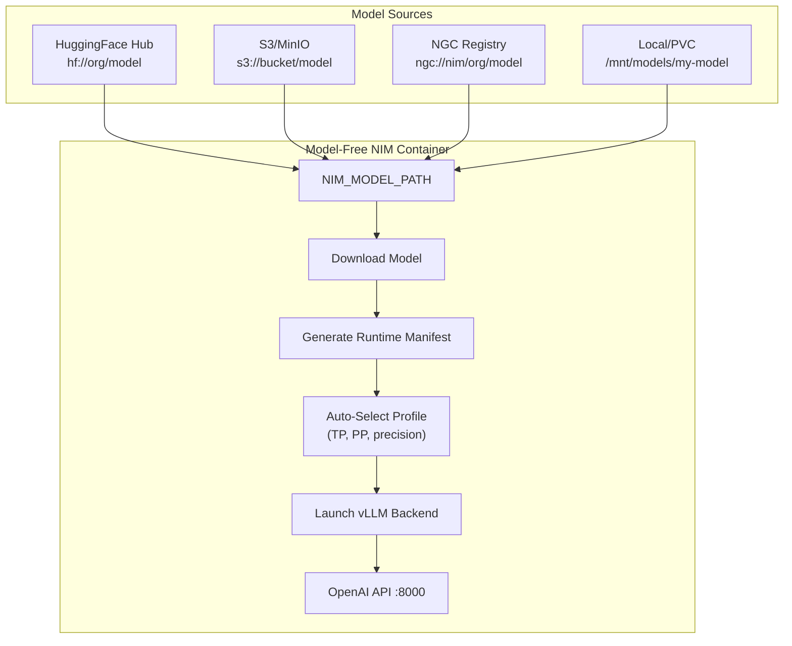

> 💡 **Quick Answer:** Use model-free NIM (`nvcr.io/nim/nim-llm`) with `NIM_MODEL_PATH` pointing to your custom model on HuggingFace, S3, NGC, or a local directory. NIM auto-generates a manifest at startup, selects an optimal profile, and serves your model via OpenAI-compatible API. One container image serves any vLLM-supported architecture.

## The Problem

You have a fine-tuned, custom, or newly released model that doesn't have a dedicated NIM container on NGC. You need to serve it with NIM's optimized inference stack (vLLM backend, automatic profiling, OpenAI-compatible API) on Kubernetes without waiting for NVIDIA to publish a model-specific container.



## The Solution

### Step 1: Understand the Two Approaches

| Approach | Container Image | Use Case |
|----------|----------------|----------|
| **Model-specific NIM** | `nvcr.io/nim/meta/llama-3.1-8b-instruct:1.7.3` | NVIDIA-optimized, pre-validated profiles |
| **Model-free NIM** | `nvcr.io/nim/nim-llm:2.0.2` | Custom, fine-tuned, or any vLLM-supported model |

Model-free NIM uses the **same inference engine** — it just generates the manifest at runtime instead of shipping with one. Any model architecture supported by vLLM works.

### Step 2: Prepare Your Model

Your model needs to be accessible from one of these sources:

| Source | URI Prefix | Auth Secret |
|--------|-----------|-------------|
| HuggingFace Hub | `hf://` | `HF_TOKEN` |
| NVIDIA NGC | `ngc://` | `NGC_API_KEY` |
| AWS S3 / MinIO | `s3://` | `AWS_ACCESS_KEY_ID` + `AWS_SECRET_ACCESS_KEY` |
| Google Cloud Storage | `gs://` | `GOOGLE_APPLICATION_CREDENTIALS` |
| ModelScope | `modelscope://` | `MODELSCOPE_API_TOKEN` |
| Local directory / PVC | Absolute path | None |

### Step 3: Create Kubernetes Secrets

```bash
# For HuggingFace models
kubectl create secret generic hf-token \
  --from-literal=HF_TOKEN=hf_xxxxxxxxxxxxxxxxxxxxxxxx \
  -n nim

# For NGC models
kubectl create secret generic ngc-api \
  --from-literal=NGC_API_KEY=xxxxxxxxxxxxxxxxxxxxxxxx \
  -n nim

# For S3/MinIO models
kubectl create secret generic s3-creds \
  --from-literal=AWS_ACCESS_KEY_ID=AKIA... \
  --from-literal=AWS_SECRET_ACCESS_KEY=xxxxx \
  --from-literal=AWS_REGION=us-east-1 \
  -n nim

# For S3-compatible (MinIO)
kubectl create secret generic minio-creds \
  --from-literal=AWS_ACCESS_KEY_ID=minioadmin \
  --from-literal=AWS_SECRET_ACCESS_KEY=minioadmin \
  --from-literal=AWS_ENDPOINT_URL=http://minio.storage.svc:9000 \
  --from-literal=AWS_S3_USE_PATH_STYLE=true \
  -n nim

# Image pull secret for NGC registry
kubectl create secret docker-registry nvcr-pull \
  --docker-server=nvcr.io \
  --docker-username='$oauthtoken' \
  --docker-password=<ngc-api-key> \
  -n nim
```

### Step 4: List Available Profiles

Before deploying, check which profiles NIM generates for your model:

```yaml
# list-profiles-job.yaml
apiVersion: batch/v1
kind: Job
metadata:
  name: nim-list-profiles
  namespace: nim
spec:
  template:
    spec:
      restartPolicy: Never
      imagePullSecrets:
        - name: nvcr-pull
      containers:
        - name: list-profiles
          image: nvcr.io/nim/nim-llm:2.0.2
          command: ["list-model-profiles"]
          env:
            - name: NIM_MODEL_PATH
              value: "hf://my-org/my-fine-tuned-llama-8b"
            - name: HF_TOKEN
              valueFrom:
                secretKeyRef:
                  name: hf-token
                  key: HF_TOKEN
          resources:
            limits:
              nvidia.com/gpu: "1"
          volumeMounts:
            - name: nim-cache
              mountPath: /opt/nim/.cache
      volumes:
        - name: nim-cache
          emptyDir: {}
```

```bash
kubectl apply -f list-profiles-job.yaml
kubectl logs job/nim-list-profiles -n nim
```

Example output:

```
MODEL PROFILES
- Compatible with system and runnable:
  - c214460d... (vllm-tp1-pp1-...) [requires >=18 GB/gpu]
  - With LoRA support:
    - 289b03eb... (vllm-tp1-pp1-feat_lora-...) [requires >=22 GB/gpu]
- Incompatible with system:
  - 27af459c... (vllm-tp2-pp1-...) [requires >=18 GB/gpu per 2 GPUs]
```

### Step 5: Deploy Custom Model on Kubernetes

#### Option A: HuggingFace Model

```yaml
# nim-custom-hf.yaml
apiVersion: apps/v1
kind: Deployment
metadata:
  name: nim-custom-model
  namespace: nim
spec:
  replicas: 1
  selector:
    matchLabels:
      app: nim-custom
  template:
    metadata:
      labels:
        app: nim-custom
    spec:
      imagePullSecrets:
        - name: nvcr-pull
      containers:
        - name: nim
          image: nvcr.io/nim/nim-llm:2.0.2
          ports:
            - containerPort: 8000
              name: http
          env:
            - name: NIM_MODEL_PATH
              value: "hf://my-org/my-fine-tuned-llama-8b"
            - name: HF_TOKEN
              valueFrom:
                secretKeyRef:
                  name: hf-token
                  key: HF_TOKEN
          resources:
            limits:
              nvidia.com/gpu: "1"
          volumeMounts:
            - name: nim-cache
              mountPath: /opt/nim/.cache
            - name: dshm
              mountPath: /dev/shm
          readinessProbe:
            httpGet:
              path: /v1/health/ready
              port: 8000
            initialDelaySeconds: 120
            periodSeconds: 10
          livenessProbe:
            httpGet:
              path: /v1/health/live
              port: 8000
            initialDelaySeconds: 120
            periodSeconds: 30
      volumes:
        - name: nim-cache
          persistentVolumeClaim:
            claimName: nim-cache-pvc
        - name: dshm
          emptyDir:
            medium: Memory
            sizeLimit: 8Gi
---
apiVersion: v1
kind: Service
metadata:
  name: nim-custom
  namespace: nim
spec:
  selector:
    app: nim-custom
  ports:
    - port: 8000
      targetPort: 8000
      name: http
---
# Persistent cache to avoid re-downloading on restarts
apiVersion: v1
kind: PersistentVolumeClaim
metadata:
  name: nim-cache-pvc
  namespace: nim
spec:
  accessModes:
    - ReadWriteOnce
  resources:
    requests:
      storage: 50Gi
  storageClassName: gp3
```

#### Option B: S3 / MinIO Model

```yaml
env:
  - name: NIM_MODEL_PATH
    value: "s3://ml-models/fine-tuned/llama-8b-custom-v2"
  - name: AWS_ACCESS_KEY_ID
    valueFrom:
      secretKeyRef:
        name: s3-creds
        key: AWS_ACCESS_KEY_ID
  - name: AWS_SECRET_ACCESS_KEY
    valueFrom:
      secretKeyRef:
        name: s3-creds
        key: AWS_SECRET_ACCESS_KEY
  - name: AWS_REGION
    valueFrom:
      secretKeyRef:
        name: s3-creds
        key: AWS_REGION
```

#### Option C: NGC Model

```yaml
env:
  - name: NIM_MODEL_PATH
    value: "ngc://nim/meta/llama-3.3-70b-instruct:hf"
  - name: NGC_API_KEY
    valueFrom:
      secretKeyRef:
        name: ngc-api
        key: NGC_API_KEY
```

#### Option D: Local / Pre-Staged Model (Air-Gap)

```yaml
env:
  - name: NIM_MODEL_PATH
    value: "/mnt/models/my-fine-tuned-llama"
# No auth needed for local paths
volumeMounts:
  - name: model-volume
    mountPath: /mnt/models
    readOnly: true
volumes:
  - name: model-volume
    persistentVolumeClaim:
      claimName: model-storage-pvc
```

### Step 6: Pin a Specific Profile

For production, pin the profile after discovering it with `list-model-profiles`:

```yaml
env:
  - name: NIM_MODEL_PATH
    value: "hf://my-org/my-fine-tuned-llama-8b"
  - name: NIM_MODEL_PROFILE
    value: "vllm-bf16-tp1-pp1"   # Pin by friendly name
  # Or pin by exact ID (survives version changes):
  # - name: NIM_MODEL_PROFILE
  #   value: "c214460d2ad7a379660126062912d2aeecaa74a3ce14ab9966cd135de49a73f2"
  - name: HF_TOKEN
    valueFrom:
      secretKeyRef:
        name: hf-token
        key: HF_TOKEN
```

### Step 7: Multi-GPU with Custom Model

For larger custom models that need tensor parallelism:

```yaml
env:
  - name: NIM_MODEL_PATH
    value: "hf://my-org/my-70b-instruct"
  - name: HF_TOKEN
    valueFrom:
      secretKeyRef:
        name: hf-token
        key: HF_TOKEN
args:
  - "--tensor-parallel-size"
  - "4"
resources:
  limits:
    nvidia.com/gpu: "4"
```

Or use `NIM_MODEL_PROFILE`:

```yaml
env:
  - name: NIM_MODEL_PATH
    value: "hf://my-org/my-70b-instruct"
  - name: NIM_MODEL_PROFILE
    value: "vllm-bf16-tp4-pp1"
```

### Step 8: Verify and Test

```bash
# Check pod status
kubectl get pods -n nim
# nim-custom-model-xxx   1/1   Running   0   5m

# Watch startup logs
kubectl logs -f deployment/nim-custom-model -n nim

# Look for:
# INFO: NIM_MODEL_PATH=hf://my-org/my-fine-tuned-llama-8b
# INFO: Generated runtime manifest with 3 profiles
# INFO: Selected profile: vllm-bf16-tp1-pp1
# INFO: Downloading model from Hugging Face...
# INFO: Model loaded successfully
# INFO: Uvicorn running on http://0.0.0.0:8000

# Port forward and test
kubectl port-forward svc/nim-custom 8000:8000 -n nim

curl -s http://localhost:8000/v1/models | jq .

curl -s http://localhost:8000/v1/chat/completions \
  -H "Content-Type: application/json" \
  -d '{
    "model": "my-org/my-fine-tuned-llama-8b",
    "messages": [{"role": "user", "content": "Hello, how are you?"}],
    "max_tokens": 128
  }' | jq .
```

### Step 9: Air-Gap Workflow

For disconnected environments:

```bash
# Phase 1: Connected environment — download and cache
# Run NIM once with network access to populate the cache PVC
kubectl apply -f nim-custom-hf.yaml
# Wait for model to download and NIM to start
# The cache PVC now contains the model + runtime manifest

# Phase 2: Transfer the PVC to air-gapped cluster
# (use Velero backup/restore, rsync, or physical media)

# Phase 3: Air-gapped deployment — use local path
```

```yaml
# nim-airgap.yaml — no auth needed, reads from cached PVC
env:
  - name: NIM_MODEL_PATH
    value: "hf://my-org/my-fine-tuned-llama-8b"
  # NIM finds the cached manifest in /opt/nim/.cache
  # and reuses it — no network calls needed
volumeMounts:
  - name: nim-cache
    mountPath: /opt/nim/.cache
volumes:
  - name: nim-cache
    persistentVolumeClaim:
      claimName: nim-cache-pvc  # Pre-populated from connected env
```

> 💡 To force manifest regeneration after a model update, delete `nim_runtime_manifest.yaml` from the cache PVC before restarting.

### Deploy with Helm

```yaml
# values-custom-model.yaml
image:
  repository: nvcr.io/nim/nim-llm
  tag: "2.0.2"

model:
  modelPath: "hf://my-org/my-fine-tuned-llama-8b"
  hfTokenSecret: hf-token

resources:
  limits:
    nvidia.com/gpu: 1
  requests:
    nvidia.com/gpu: 1

persistence:
  enabled: true
  size: 50Gi
  accessMode: ReadWriteOnce
  storageClass: gp3

imagePullSecrets:
  - name: nvcr-pull
```

```bash
helm install nim-custom nim-llm/ -f values-custom-model.yaml
```

For multi-node custom model deployment:

```yaml
# values-custom-multinode.yaml
image:
  repository: nvcr.io/nim/nim-llm
  tag: "2.0.2"

model:
  modelPath: "hf://my-org/my-custom-405b"
  hfTokenSecret: hf-token
  jsonLogging: false          # REQUIRED for multi-node

multiNode:
  enabled: true
  workers: 1
  tensorParallelSize: 8
  pipelineParallelSize: 2

resources:
  limits:
    nvidia.com/gpu: 8

persistence:
  enabled: true
  size: 300Gi
  accessMode: ReadWriteMany   # REQUIRED for multi-node
  storageClass: nfs-csi
```

## Common Issues

| Issue | Cause | Fix |
|-------|-------|-----|
| `Model architecture not supported` | vLLM doesn't support this architecture | Check vLLM supported models list; NIM can only serve vLLM-compatible architectures |
| Download hangs | HF/S3 auth wrong or network issue | Verify secrets, check `kubectl logs` for auth errors |
| `No compatible profiles` | GPU VRAM too small | Use `--tensor-parallel-size` to spread across more GPUs, or use a quantized model |
| Slow first start | Model downloading from scratch | Use a PVC for `/opt/nim/.cache` — subsequent starts use cache |
| Air-gap fails | No cached manifest | Run once connected to populate cache, then transfer PVC |
| Profile mismatch in air-gap | Cached manifest from different GPU | Delete `nim_runtime_manifest.yaml` from cache to force regeneration |
| MinIO connection refused | Missing `AWS_ENDPOINT_URL` | Set `AWS_ENDPOINT_URL` and `AWS_S3_USE_PATH_STYLE=true` for S3-compatible stores |
| LoRA not loading | Wrong profile | Use a profile with `-feat_lora` suffix or pass `--enable-lora` |

## Best Practices

- **Use model-free NIM for custom models** — one container image for all models simplifies security review
- **Cache on PVC** — persist `/opt/nim/.cache` to avoid re-downloading on restarts
- **Pin image versions** — use `nim-llm:2.0.2` not `latest` for reproducibility
- **List profiles before deploying** — know your VRAM requirements upfront
- **Pin profiles in production** — use `NIM_MODEL_PROFILE` for deterministic deployments
- **Test locally first** — run `docker run` with your model before writing K8s manifests
- **Air-gap in two phases** — connected download → transfer PVC → air-gapped deploy

## Key Takeaways

- Model-free NIM (`nvcr.io/nim/nim-llm`) serves any vLLM-supported model from HF, S3, NGC, GCS, or local path
- Set `NIM_MODEL_PATH` to your model URI — NIM auto-generates profiles and selects the best one
- The same container image serves any model — simplifies image governance and security scanning
- Air-gap workflow: download once connected, cache to PVC, redeploy disconnected
- For multi-node custom models, combine model-free NIM with LeaderWorkerSet + shared RWX storage
