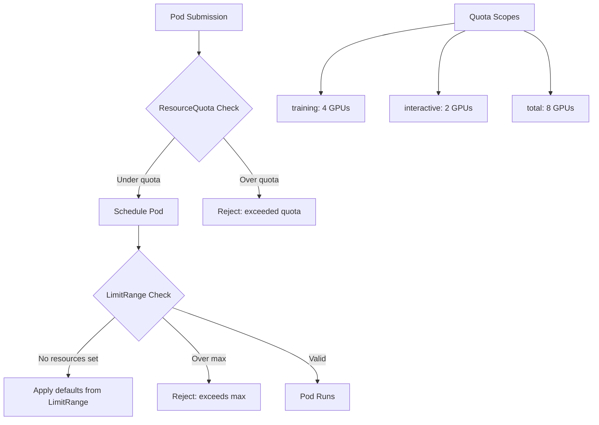

> 💡 **Quick Answer:** Set `requests.nvidia.com/gpu` and `limits.nvidia.com/gpu` in ResourceQuota to cap GPU allocation per namespace. Combine with LimitRange for container defaults and maximums. Without quotas, the loudest team wins.

## The Problem

Without explicit GPU quotas, one team can request all available GPUs, starving other tenants. Standard Kubernetes ResourceQuota supports GPU resource types but requires careful configuration for GPU + CPU + memory together. Pods that don't set resource requests will bypass quotas.

## The Solution

### GPU ResourceQuota

```yaml
apiVersion: v1
kind: ResourceQuota
metadata:
  name: gpu-compute-quota
  namespace: tenant-alpha
spec:
  hard:
    # GPU limits
    requests.nvidia.com/gpu: "8"
    limits.nvidia.com/gpu: "8"
    # CPU limits
    requests.cpu: "64"
    limits.cpu: "128"
    # Memory limits
    requests.memory: 256Gi
    limits.memory: 512Gi
    # Object counts
    pods: "50"
    persistentvolumeclaims: "20"
    services: "10"
    secrets: "50"
    configmaps: "50"
---
# Separate quota for priority classes
apiVersion: v1
kind: ResourceQuota
metadata:
  name: training-quota
  namespace: tenant-alpha
spec:
  hard:
    requests.nvidia.com/gpu: "4"
  scopeSelector:
    matchExpressions:
      - scopeName: PriorityClass
        operator: In
        values: ["gpu-training"]
---
apiVersion: v1
kind: ResourceQuota
metadata:
  name: interactive-quota
  namespace: tenant-alpha
spec:
  hard:
    requests.nvidia.com/gpu: "2"
  scopeSelector:
    matchExpressions:
      - scopeName: PriorityClass
        operator: In
        values: ["gpu-interactive"]
```

### LimitRange for Defaults

```yaml
apiVersion: v1
kind: LimitRange
metadata:
  name: gpu-limits
  namespace: tenant-alpha
spec:
  limits:
    - type: Container
      default:
        cpu: "2"
        memory: 8Gi
      defaultRequest:
        cpu: 500m
        memory: 2Gi
      max:
        cpu: "32"
        memory: 256Gi
        nvidia.com/gpu: "8"
      min:
        cpu: 100m
        memory: 256Mi
    - type: Pod
      max:
        cpu: "64"
        memory: 512Gi
        nvidia.com/gpu: "8"
    - type: PersistentVolumeClaim
      max:
        storage: 1Ti
      min:
        storage: 1Gi
```

### Monitor Quota Usage

```bash
# Check quota status
kubectl describe resourcequota gpu-compute-quota -n tenant-alpha

# Output:
# Name:                    gpu-compute-quota
# Resource                 Used  Hard
# --------                 ----  ----
# limits.nvidia.com/gpu    4     8
# requests.nvidia.com/gpu  4     8
# requests.cpu             16    64
# requests.memory          64Gi  256Gi
# pods                     12    50

# Prometheus query for quota utilization
# kube_resourcequota{namespace="tenant-alpha", resource="requests.nvidia.com/gpu", type="used"}
# / kube_resourcequota{namespace="tenant-alpha", resource="requests.nvidia.com/gpu", type="hard"}
```



## Common Issues

- **Pod rejected but quota shows space** — LimitRange max may be lower than quota; check both; also check if PriorityClass scope restricts the request
- **GPU quota not enforced** — pods must explicitly set `resources.limits.nvidia.com/gpu`; without LimitRange defaults, quota can't count implicit GPUs
- **Quota shows 0 used but pods running** — quota only counts resources from pods with explicit requests; use LimitRange to force defaults

## Best Practices

- Always pair ResourceQuota with LimitRange — quota enforces caps, LimitRange sets defaults
- Use scoped quotas per PriorityClass to subdivide GPU allocation within a tenant
- Set both `requests` and `limits` for GPU in quota — they should match (GPUs can't be overcommitted)
- Monitor quota utilization with Prometheus `kube_resourcequota` metrics
- Alert when any tenant exceeds 80% GPU quota utilization

## Key Takeaways

- ResourceQuota caps total GPU/CPU/memory per namespace
- LimitRange sets defaults and maximums per container and pod
- Scoped quotas allow per-PriorityClass GPU allocation within a tenant
- Without quotas, the loudest team wins — explicit caps make fairness deterministic
- GPU requests and limits should always match — GPUs are not overcommittable
