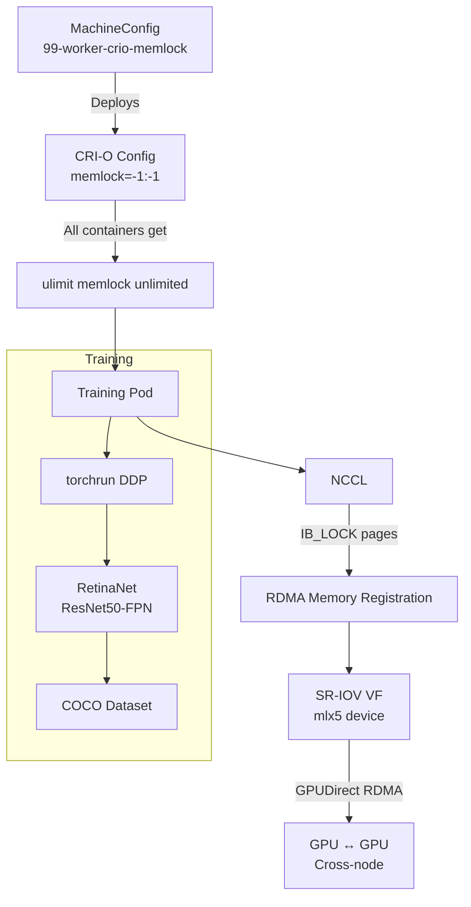

> 💡 **Quick Answer:** RetinaNet training on GPU clusters requires `memlock unlimited` for RDMA memory registration. On OpenShift/CRI-O nodes, drop a custom ulimits config at `/etc/crio/crio.conf.d/99-ulimits.conf` via MachineConfig, then run distributed training with PyTorch DDP or torchrun.

## The Problem

RetinaNet (focal loss object detection) training on Kubernetes GPU clusters fails or degrades when:
- `memlock` ulimit is too low — RDMA memory registration fails, NCCL falls back to TCP
- CRI-O default ulimits don't include unlimited memlock — containers can't pin GPU memory for DMA
- Multi-node training requires NCCL + InfiniBand/RoCE, which needs pinned memory pages
- Default container runtimes restrict `RLIMIT_MEMLOCK` to 64KB

## The Solution

### Step 1: Configure CRI-O Memlock Unlimited

Create a MachineConfig to deploy the CRI-O ulimits drop-in:

```yaml
apiVersion: machineconfiguration.openshift.io/v1
kind: MachineConfig
metadata:
  name: 99-worker-crio-memlock
  labels:
    machineconfiguration.openshift.io/role: worker
spec:
  config:
    ignition:
      version: 3.2.0
    storage:
      files:
        - path: /etc/crio/crio.conf.d/99-ulimits.conf
          mode: 0644
          overwrite: true
          contents:
            source: data:text/plain;charset=utf-8;base64,W2NyaW8ucnVudGltZV0KZGVmYXVsdF91bGltaXRzID0gWwoJIm1lbWxvY2s9LTE6LTEiLAoJIm5vcHJvYz0xMDQ4NTc2OjEwNDg1NzYiLAoJIm5vZmlsZT02NTUzNjo2NTUzNiIKXQ==
```

The base64 content decodes to:

```ini
[crio.runtime]
default_ulimits = [
	"memlock=-1:-1",
	"noproc=1048576:1048576",
	"nofile=65536:65536"
]
```

For non-OpenShift clusters, place the file directly on nodes:

```bash
# /etc/crio/crio.conf.d/99-ulimits.conf
cat > /etc/crio/crio.conf.d/99-ulimits.conf << 'EOF'
[crio.runtime]
default_ulimits = [
	"memlock=-1:-1",
	"noproc=1048576:1048576",
	"nofile=65536:65536"
]
EOF

systemctl restart crio
```

### Step 2: Verify Memlock Inside a Pod

```bash
kubectl exec -it gpu-test -- bash -c "ulimit -l"
# Expected: unlimited

# If it shows 65536 or similar, CRI-O hasn't picked up the config
kubectl exec -it gpu-test -- bash -c "cat /proc/self/limits | grep 'Max locked memory'"
# Expected: Max locked memory    unlimited            unlimited            bytes
```

### Step 3: RetinaNet Training Job (Single-Node Multi-GPU)

```yaml
apiVersion: batch/v1
kind: Job
metadata:
  name: retinanet-training
  namespace: ai-training
spec:
  template:
    spec:
      restartPolicy: Never
      containers:
        - name: training
          image: nvcr.io/nvidia/pytorch:24.05-py3
          command:
            - torchrun
            - --standalone
            - --nproc_per_node=8
            - train_retinanet.py
            - --dataset=/data/coco
            - --epochs=26
            - --batch-size=4
            - --lr=0.01
            - --backbone=resnet50
            - --amp
          resources:
            requests:
              nvidia.com/gpu: 8
              cpu: "32"
              memory: 128Gi
            limits:
              nvidia.com/gpu: 8
              cpu: "32"
              memory: 128Gi
          volumeMounts:
            - name: dataset
              mountPath: /data
            - name: checkpoints
              mountPath: /checkpoints
            - name: dshm
              mountPath: /dev/shm
          env:
            - name: NCCL_DEBUG
              value: "INFO"
      volumes:
        - name: dataset
          persistentVolumeClaim:
            claimName: coco-dataset
        - name: checkpoints
          persistentVolumeClaim:
            claimName: training-checkpoints
        - name: dshm
          emptyDir:
            medium: Memory
            sizeLimit: 64Gi
```

### Step 4: Multi-Node Distributed Training with RDMA

```yaml
apiVersion: batch/v1
kind: Job
metadata:
  name: retinanet-distributed
  namespace: ai-training
spec:
  parallelism: 2
  completions: 2
  completionMode: Indexed
  template:
    metadata:
      annotations:
        k8s.v1.cni.cncf.io/networks: rdma-net
    spec:
      restartPolicy: Never
      subdomain: retinanet-workers
      setHostnameAsFQDN: true
      containers:
        - name: training
          image: nvcr.io/nvidia/pytorch:24.05-py3
          command:
            - bash
            - -c
            - |
              torchrun \
                --nnodes=2 \
                --nproc_per_node=8 \
                --rdzv_backend=c10d \
                --rdzv_endpoint=retinanet-distributed-0.retinanet-workers:29500 \
                train_retinanet.py \
                --dataset=/data/coco \
                --epochs=26 \
                --batch-size=2 \
                --lr=0.02 \
                --backbone=resnet50 \
                --amp \
                --sync-bn
          resources:
            requests:
              nvidia.com/gpu: 8
              openshift.io/mlxrdma: "1"
              cpu: "32"
              memory: 128Gi
            limits:
              nvidia.com/gpu: 8
              openshift.io/mlxrdma: "1"
              cpu: "32"
              memory: 128Gi
          securityContext:
            capabilities:
              add: ["IPC_LOCK"]
          volumeMounts:
            - name: dataset
              mountPath: /data
            - name: dshm
              mountPath: /dev/shm
          env:
            - name: NCCL_DEBUG
              value: "INFO"
            - name: NCCL_IB_HCA
              value: "mlx5"
            - name: NCCL_IB_GID_INDEX
              value: "3"
      volumes:
        - name: dataset
          persistentVolumeClaim:
            claimName: coco-dataset
        - name: dshm
          emptyDir:
            medium: Memory
            sizeLimit: 64Gi
---
apiVersion: v1
kind: Service
metadata:
  name: retinanet-workers
  namespace: ai-training
spec:
  clusterIP: None
  selector:
    job-name: retinanet-distributed
  ports:
    - port: 29500
      name: rdzv
```

### Training Script Reference

```python
# train_retinanet.py (key sections)
import torch
import torchvision
from torchvision.models.detection import retinanet_resnet50_fpn_v2
from torch.nn.parallel import DistributedDataParallel as DDP

def main():
    # Initialize distributed
    torch.distributed.init_process_group(backend="nccl")
    local_rank = int(os.environ["LOCAL_RANK"])
    torch.cuda.set_device(local_rank)

    # Model with SyncBatchNorm for multi-node
    model = retinanet_resnet50_fpn_v2(num_classes=91)
    model = torch.nn.SyncBatchNorm.convert_sync_batchnorm(model)
    model = model.cuda()
    model = DDP(model, device_ids=[local_rank])

    # Mixed precision training
    scaler = torch.amp.GradScaler("cuda")
    with torch.amp.autocast("cuda"):
        losses = model(images, targets)
        total_loss = sum(loss for loss in losses.values())

    scaler.scale(total_loss).backward()
    scaler.step(optimizer)
    scaler.update()
```



## Common Issues

**`NCCL WARN Call to ibv_reg_mr failed`**

The `memlock` ulimit is too low. NCCL can't register GPU memory for RDMA DMA:
```bash
# Check inside the container
ulimit -l
# If not "unlimited", the CRI-O config isn't applied
# Verify the drop-in file exists on the node:
oc debug node/worker-gpu-01 -- chroot /host cat /etc/crio/crio.conf.d/99-ulimits.conf
```

**CRI-O config not picked up after MachineConfig**

MachineConfig triggers a node drain + reboot. Wait for the MCP to finish rolling:
```bash
oc get mcp worker
# UPDATED=True, UPDATING=False means rollout complete
```

**OOM during training with large backbone**

RetinaNet with ResNet-101 or ResNeXt-101 needs more memory. Reduce batch size or use gradient accumulation:
```bash
--batch-size=1 --gradient-accumulation-steps=4
```

**`/dev/shm` too small — DataLoader workers crash**

Always mount an emptyDir with `medium: Memory`:
```yaml
- name: dshm
  emptyDir:
    medium: Memory
    sizeLimit: 64Gi
```

**NCCL timeout on multi-node with RDMA**

Check that RDMA is actually working (not TCP fallback):
```bash
# In NCCL_DEBUG=INFO output, look for:
# NET/IB : Using [0]mlx5_2:1/RoCE    ← RDMA working
# NET/Socket : Using [0]eth0          ← TCP fallback (bad)
```

If TCP: verify `IPC_LOCK` capability, `NCCL_IB_HCA=mlx5`, and that SR-IOV VF is allocated.

**SyncBatchNorm slows training significantly**

SyncBN synchronizes across all GPUs every forward pass. Only use it for multi-node; for single-node, regular BN is fine:
```python
if args.distributed and args.sync_bn:
    model = torch.nn.SyncBatchNorm.convert_sync_batchnorm(model)
```

## Best Practices

- Deploy `99-ulimits.conf` via MachineConfig — survives node reboots and OS upgrades
- Use `memlock=-1:-1` (unlimited soft and hard) — partial limits cause intermittent RDMA failures
- Mount `/dev/shm` as emptyDir Memory for PyTorch DataLoader shared memory
- Use mixed precision (`--amp`) to halve GPU memory and double throughput
- Pin NCCL to the RDMA interface with `NCCL_IB_HCA=mlx5`
- Use `SyncBatchNorm` only for multi-node training where BN stats must be global
- Set `NCCL_DEBUG=INFO` during initial runs, reduce to `WARN` for production
- Use `completionMode: Indexed` for multi-node jobs — each pod gets `JOB_COMPLETION_INDEX`
- Store checkpoints every N epochs to a PVC — resume from last checkpoint on preemption

## Key Takeaways

- `memlock unlimited` is mandatory for RDMA memory registration — without it, NCCL falls back to TCP
- CRI-O ulimits are configured via drop-in files at `/etc/crio/crio.conf.d/`
- Use `99-` prefix for highest priority (CRI-O reads alphabetically, last wins)
- MachineConfig deploys CRI-O config across all worker nodes consistently
- RetinaNet uses focal loss to handle class imbalance — critical for real-world object detection
- `torchrun` replaces `torch.distributed.launch` — handles rendezvous and local rank assignment
- Multi-node RDMA training needs: memlock unlimited + IPC_LOCK capability + SR-IOV VF + PFC on switch
