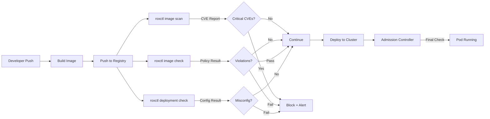

> 💡 **Quick Answer:** Use `roxctl image check` to validate images against RHACS deploy-time policies and `roxctl image scan` for vulnerability reports in any CI/CD pipeline. Create an API token with `Continuous Integration` role, then add roxctl steps to Jenkins, GitLab CI, GitHub Actions, or Tekton pipelines.

## The Problem

Security scanning at deploy-time (admission control) is your last line of defense — but catching vulnerabilities and policy violations earlier in the pipeline is faster and cheaper. You need to shift-left by integrating RHACS scanning into build pipelines so developers get immediate feedback before images reach the cluster.

## The Solution

### Create an API Token

```bash
# Via Central UI:
# Platform Configuration → Integrations → Authentication Tokens → API Token
# Role: Continuous Integration (read-only scanning + policy check)

# Or via roxctl:
roxctl -e $CENTRAL_ENDPOINT \
  central api-token generate \
  --name ci-pipeline-token \
  --role "Continuous Integration" \
  --output token.txt

export ROX_API_TOKEN=$(cat token.txt)
```

### roxctl Commands for CI

```bash
# 1. Image Check — evaluate image against deploy-time policies
# Returns exit code 1 if any enforced policy is violated
roxctl -e $CENTRAL_ENDPOINT \
  image check \
  --image quay.io/myorg/myapp:v2.1.0 \
  --output table

# 2. Image Scan — full vulnerability report
roxctl -e $CENTRAL_ENDPOINT \
  image scan \
  --image quay.io/myorg/myapp:v2.1.0 \
  --output json

# 3. Deployment Check — validate K8s manifest against policies
# Catches misconfigurations before deployment
roxctl -e $CENTRAL_ENDPOINT \
  deployment check \
  --file deployment.yaml \
  --output table
```

### GitHub Actions

```yaml
name: Security Scan
on:
  push:
    branches: [main]
  pull_request:

env:
  ROX_CENTRAL_ADDRESS: central-stackrox.apps.cluster.example.com:443
  IMAGE: quay.io/myorg/myapp

jobs:
  build-and-scan:
    runs-on: ubuntu-latest
    steps:
      - uses: actions/checkout@v4

      - name: Build image
        run: |
          docker build -t $IMAGE:${{ github.sha }} .
          docker push $IMAGE:${{ github.sha }}

      - name: Install roxctl
        run: |
          curl -fsSL -o roxctl \
            "https://$ROX_CENTRAL_ADDRESS/api/cli/download/roxctl-linux"
          chmod +x roxctl
          sudo mv roxctl /usr/local/bin/

      - name: Image scan
        env:
          ROX_API_TOKEN: ${{ secrets.ROX_API_TOKEN }}
        run: |
          roxctl --insecure-skip-tls-verify \
            -e $ROX_CENTRAL_ADDRESS \
            image scan \
            --image $IMAGE:${{ github.sha }} \
            --output table

      - name: Image policy check
        env:
          ROX_API_TOKEN: ${{ secrets.ROX_API_TOKEN }}
        run: |
          roxctl --insecure-skip-tls-verify \
            -e $ROX_CENTRAL_ADDRESS \
            image check \
            --image $IMAGE:${{ github.sha }} \
            --output table

      - name: Deployment check
        env:
          ROX_API_TOKEN: ${{ secrets.ROX_API_TOKEN }}
        run: |
          roxctl --insecure-skip-tls-verify \
            -e $ROX_CENTRAL_ADDRESS \
            deployment check \
            --file k8s/deployment.yaml \
            --output table
```

### GitLab CI

```yaml
stages:
  - build
  - scan
  - deploy

variables:
  ROX_CENTRAL_ADDRESS: central-stackrox.apps.cluster.example.com:443
  IMAGE: quay.io/myorg/myapp

build:
  stage: build
  script:
    - docker build -t $IMAGE:$CI_COMMIT_SHA .
    - docker push $IMAGE:$CI_COMMIT_SHA

acs-image-scan:
  stage: scan
  image: registry.redhat.io/advanced-cluster-security/roxctl-rhel8:latest
  script:
    - roxctl --insecure-skip-tls-verify
        -e $ROX_CENTRAL_ADDRESS
        image scan
        --image $IMAGE:$CI_COMMIT_SHA
        --output table
  allow_failure: true    # Scan is informational

acs-policy-check:
  stage: scan
  image: registry.redhat.io/advanced-cluster-security/roxctl-rhel8:latest
  script:
    - roxctl --insecure-skip-tls-verify
        -e $ROX_CENTRAL_ADDRESS
        image check
        --image $IMAGE:$CI_COMMIT_SHA
        --output table
  # Exit code 1 = policy violation → blocks pipeline

acs-deployment-check:
  stage: scan
  image: registry.redhat.io/advanced-cluster-security/roxctl-rhel8:latest
  script:
    - roxctl --insecure-skip-tls-verify
        -e $ROX_CENTRAL_ADDRESS
        deployment check
        --file k8s/deployment.yaml
        --output table

deploy:
  stage: deploy
  script:
    - kubectl set image deployment/myapp myapp=$IMAGE:$CI_COMMIT_SHA
  only:
    - main
```

### Tekton Pipeline (OpenShift Pipelines)

```yaml
apiVersion: tekton.dev/v1
kind: Task
metadata:
  name: acs-image-check
  namespace: ci
spec:
  params:
    - name: image
      type: string
    - name: rox-central-endpoint
      type: string
    - name: insecure-skip-tls-verify
      type: string
      default: "true"
  steps:
    - name: image-check
      image: registry.redhat.io/advanced-cluster-security/roxctl-rhel8:latest
      env:
        - name: ROX_API_TOKEN
          valueFrom:
            secretKeyRef:
              name: roxctl-api-token
              key: token
      script: |
        #!/bin/bash
        set -e
        roxctl --insecure-skip-tls-verify=$(params.insecure-skip-tls-verify) \
          -e $(params.rox-central-endpoint) \
          image check \
          --image $(params.image) \
          --output table
---
apiVersion: tekton.dev/v1
kind: Task
metadata:
  name: acs-image-scan
  namespace: ci
spec:
  params:
    - name: image
      type: string
    - name: rox-central-endpoint
      type: string
  results:
    - name: scan-output
      description: Vulnerability scan results
  steps:
    - name: image-scan
      image: registry.redhat.io/advanced-cluster-security/roxctl-rhel8:latest
      env:
        - name: ROX_API_TOKEN
          valueFrom:
            secretKeyRef:
              name: roxctl-api-token
              key: token
      script: |
        #!/bin/bash
        roxctl --insecure-skip-tls-verify \
          -e $(params.rox-central-endpoint) \
          image scan \
          --image $(params.image) \
          --output json | tee $(results.scan-output.path)
---
# Pipeline using both tasks
apiVersion: tekton.dev/v1
kind: Pipeline
metadata:
  name: build-scan-deploy
  namespace: ci
spec:
  params:
    - name: image
      type: string
    - name: rox-central-endpoint
      type: string
      default: central-stackrox.stackrox.svc:443
  tasks:
    - name: build
      taskRef:
        name: buildah
      params:
        - name: IMAGE
          value: $(params.image)

    - name: scan
      taskRef:
        name: acs-image-scan
      runAfter: [build]
      params:
        - name: image
          value: $(params.image)
        - name: rox-central-endpoint
          value: $(params.rox-central-endpoint)

    - name: check
      taskRef:
        name: acs-image-check
      runAfter: [build]
      params:
        - name: image
          value: $(params.image)
        - name: rox-central-endpoint
          value: $(params.rox-central-endpoint)

    - name: deploy
      taskRef:
        name: kubernetes-deploy
      runAfter: [scan, check]
      params:
        - name: IMAGE
          value: $(params.image)
```

### Jenkins Pipeline

```groovy
pipeline {
    agent any
    environment {
        ROX_CENTRAL_ADDRESS = 'central-stackrox.apps.cluster.example.com:443'
        ROX_API_TOKEN = credentials('rhacs-api-token')
        IMAGE = "quay.io/myorg/myapp:${env.BUILD_NUMBER}"
    }
    stages {
        stage('Build') {
            steps {
                sh "docker build -t ${IMAGE} ."
                sh "docker push ${IMAGE}"
            }
        }
        stage('ACS Scan') {
            steps {
                sh """
                    roxctl --insecure-skip-tls-verify \
                      -e ${ROX_CENTRAL_ADDRESS} \
                      image scan \
                      --image ${IMAGE} \
                      --output table
                """
            }
        }
        stage('ACS Policy Check') {
            steps {
                sh """
                    roxctl --insecure-skip-tls-verify \
                      -e ${ROX_CENTRAL_ADDRESS} \
                      image check \
                      --image ${IMAGE} \
                      --output table
                """
            }
        }
        stage('Deployment Check') {
            steps {
                sh """
                    roxctl --insecure-skip-tls-verify \
                      -e ${ROX_CENTRAL_ADDRESS} \
                      deployment check \
                      --file k8s/deployment.yaml \
                      --output table
                """
            }
        }
    }
    post {
        failure {
            slackSend channel: '#security-alerts',
                      message: "ACS policy violation in ${env.JOB_NAME} #${env.BUILD_NUMBER}"
        }
    }
}
```



## Common Issues

- **roxctl connection refused** — verify Central Route is accessible from CI runners; for internal clusters, use `central-stackrox.stackrox.svc:443` from in-cluster Tekton tasks
- **TLS certificate errors** — use `--insecure-skip-tls-verify` for self-signed certs, or mount the CA bundle
- **API token expired** — tokens don't expire by default but can be revoked; check token status in Central UI
- **Image not found by scanner** — ensure image is pushed to registry before scanning; scanner pulls and analyzes the image layers
- **Scan results differ from admission control** — `image check` uses build-time policies; admission controller uses deploy-time policies; ensure same policies are enabled for both stages

## Best Practices

- Use `image check` (exit code gating) as the pipeline blocker — `image scan` is informational
- Run `deployment check` on K8s manifests in PRs — catches misconfigurations before merge
- Store API tokens as CI secrets — never hardcode in pipeline definitions
- Use the official `roxctl-rhel8` container image for CI tasks — always matches Central version
- Set `allow_failure: true` on scan tasks during initial rollout — inform developers without blocking
- Graduate to enforcing mode after 2-4 weeks of informational scanning

## Key Takeaways

- `roxctl image check` validates images against deploy-time policies (exit code 0/1 gates the pipeline)
- `roxctl image scan` provides full CVE vulnerability reports for review
- `roxctl deployment check` validates K8s manifests against config policies without deploying
- Works with any CI/CD: GitHub Actions, GitLab CI, Jenkins, Tekton, Azure DevOps
- API token with `Continuous Integration` role provides least-privilege scanning access
- Shift-left: catching issues in CI is 10x cheaper than catching them at admission or runtime
