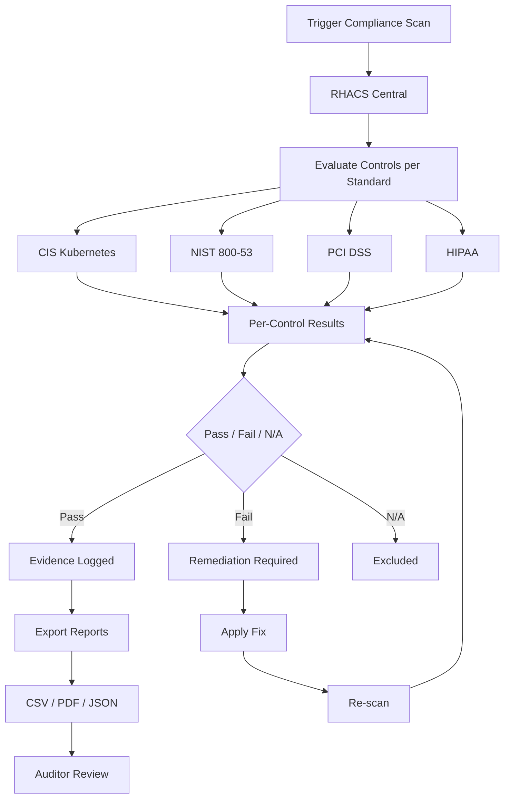

> 💡 **Quick Answer:** RHACS includes built-in compliance scanning for CIS Kubernetes Benchmark, NIST 800-53/800-190, PCI DSS, HIPAA, and NERC-CIP. Trigger scans via UI or `roxctl`, get per-control pass/fail results, and export reports as CSV/PDF for auditors.

## The Problem

Compliance audits require evidence that your Kubernetes clusters meet specific security controls. Manually checking hundreds of CIS benchmark items, NIST controls, or PCI DSS requirements across multiple clusters is impractical. You need automated scanning with exportable evidence.

## The Solution

### Supported Compliance Standards

```yaml
# Built-in compliance profiles:
CIS Kubernetes v1.5:           # 242 checks — API server, etcd, kubelet, policies
CIS Docker v1.2.0:             # Container runtime configuration
NIST SP 800-53 Rev 4:          # Federal security controls (AC, AU, CM, IA, SC, SI)
NIST SP 800-190:               # Container security guide (image, registry, orchestrator, container, host)
PCI DSS 3.2.1:                 # Payment card industry (network segmentation, access control, encryption)
HIPAA 164:                     # Health data protection (access controls, audit, encryption, integrity)
NERC-CIP:                      # Critical infrastructure protection (power grid, utilities)
```

### Run a Compliance Scan

```bash
# Via Central UI:
# Compliance → Scan Environment → Select clusters → Select standards → Run Scan

# Via roxctl CLI:
roxctl -e $CENTRAL_ENDPOINT \
  compliance trigger \
  --standard "CIS Kubernetes v1.5"

# Check scan status
roxctl -e $CENTRAL_ENDPOINT \
  compliance status

# Get results
roxctl -e $CENTRAL_ENDPOINT \
  compliance results \
  --standard "CIS Kubernetes v1.5" \
  --cluster production-cluster \
  --output table
```

### Understanding Compliance Results

```yaml
# Each control returns one of:
# - Pass: control requirements are met
# - Fail: control requirements not met (action needed)
# - N/A: control doesn't apply to this environment
# - Info: informational, requires manual verification

# Example CIS Kubernetes results:
# Control 1.1.1  - Ensure API server --anonymous-auth is false      → Pass
# Control 1.1.2  - Ensure API server --token-auth-file not set      → Pass
# Control 1.2.1  - Ensure etcd encryption is configured             → Pass
# Control 1.3.7  - Ensure RotateKubeletServerCertificate is true    → Pass
# Control 4.2.6  - Ensure --protect-kernel-defaults is true         → Fail
# Control 5.1.1  - Ensure RBAC is enabled                           → Pass
# Control 5.2.2  - Minimize privileged containers                   → Fail (3 violations)
# Control 5.3.2  - Ensure NetworkPolicy for every namespace         → Fail (5 namespaces)
```

### Export Reports for Auditors

```bash
# CSV export (machine-readable)
roxctl -e $CENTRAL_ENDPOINT \
  compliance results \
  --standard "PCI DSS 3.2.1" \
  --cluster production-cluster \
  --output csv > pci-dss-report-$(date +%Y%m%d).csv

# PDF report (via UI):
# Compliance → Select standard → Export → Download PDF

# JSON export for automation
roxctl -e $CENTRAL_ENDPOINT \
  compliance results \
  --standard "NIST SP 800-53" \
  --cluster production-cluster \
  --output json > nist-800-53-$(date +%Y%m%d).json

# All standards at once
for standard in "CIS Kubernetes v1.5" "NIST SP 800-53" "PCI DSS 3.2.1" "HIPAA 164"; do
  roxctl -e $CENTRAL_ENDPOINT \
    compliance results \
    --standard "$standard" \
    --cluster production-cluster \
    --output csv > "$(echo $standard | tr ' ' '-')-$(date +%Y%m%d).csv"
done
```

### Map Controls to Remediation

```yaml
# CIS 4.2.6: Ensure --protect-kernel-defaults is true
# Remediation: MachineConfig for kubelet
apiVersion: machineconfiguration.openshift.io/v1
kind: MachineConfig
metadata:
  name: 99-kubelet-protect-kernel-defaults
  labels:
    machineconfiguration.openshift.io/role: worker
spec:
  kubeletConfig:
    protectKernelDefaults: true
---
# CIS 5.2.2: Minimize privileged containers
# Remediation: RHACS policy to block privileged (see rhacs-custom-security-policies)
# Plus SCC restriction:
apiVersion: security.openshift.io/v1
kind: SecurityContextConstraints
metadata:
  name: restricted-no-privileged
allowPrivilegedContainer: false
allowPrivilegeEscalation: false
requiredDropCapabilities:
  - ALL
runAsUser:
  type: MustRunAsRange
seLinuxContext:
  type: MustRunAs
---
# CIS 5.3.2: Ensure NetworkPolicy for every namespace
# Remediation: Apply deny-default NetworkPolicy to all namespaces
# Use RHACS network graph to generate baseline policies first
```

### Automated Compliance Scanning with CronJob

```yaml
# Schedule weekly compliance scans and upload reports
apiVersion: batch/v1
kind: CronJob
metadata:
  name: compliance-scan-weekly
  namespace: stackrox
spec:
  schedule: "0 6 * * 1"    # Every Monday at 6 AM
  jobTemplate:
    spec:
      template:
        spec:
          serviceAccountName: compliance-scanner
          containers:
            - name: scanner
              image: registry.redhat.io/advanced-cluster-security/roxctl-rhel8:latest
              env:
                - name: ROX_CENTRAL_ADDRESS
                  value: central-stackrox.stackrox.svc:443
                - name: ROX_API_TOKEN
                  valueFrom:
                    secretKeyRef:
                      name: roxctl-api-token
                      key: token
              command:
                - /bin/sh
                - -c
                - |
                  set -e
                  DATE=$(date +%Y%m%d)

                  # Trigger scans for all standards
                  for std in "CIS Kubernetes v1.5" "NIST SP 800-53" "PCI DSS 3.2.1"; do
                    echo "Scanning: $std"
                    roxctl --insecure-skip-tls-verify \
                      -e $ROX_CENTRAL_ADDRESS \
                      compliance trigger --standard "$std"
                  done

                  sleep 120  # Wait for scans to complete

                  # Export results
                  mkdir -p /reports
                  for std in "CIS Kubernetes v1.5" "NIST SP 800-53" "PCI DSS 3.2.1"; do
                    FILENAME=$(echo $std | tr ' ' '-')
                    roxctl --insecure-skip-tls-verify \
                      -e $ROX_CENTRAL_ADDRESS \
                      compliance results \
                      --standard "$std" \
                      --output csv > /reports/${FILENAME}-${DATE}.csv
                  done

                  echo "Reports generated at /reports/"
              volumeMounts:
                - name: reports
                  mountPath: /reports
          volumes:
            - name: reports
              persistentVolumeClaim:
                claimName: compliance-reports
          restartPolicy: OnFailure
```

### Multi-Cluster Compliance Dashboard

```bash
# RHACS Central manages compliance across all secured clusters
# Dashboard shows:
# - Overall compliance percentage per standard
# - Per-cluster compliance scores
# - Trend over time (improving/degrading)
# - Top failing controls across all clusters

# Compare clusters:
for cluster in production staging development; do
  echo "=== $cluster ==="
  roxctl -e $CENTRAL_ENDPOINT \
    compliance results \
    --standard "CIS Kubernetes v1.5" \
    --cluster $cluster \
    --output table | grep -c "PASS"
done
```

### HIPAA-Specific Controls

```yaml
# Key HIPAA 164 controls for healthcare Kubernetes:
# 164.312(a)(1) - Access Control: RBAC + namespace isolation
# 164.312(b)    - Audit Controls: RHACS audit logs + cluster audit policy
# 164.312(c)(1) - Integrity: Image signing + admission control
# 164.312(e)(1) - Transmission Security: mTLS + NetworkPolicies
# 164.308(a)(5) - Security Awareness: Policy enforcement training

# Encryption at rest for etcd (OpenShift):
apiVersion: config.openshift.io/v1
kind: APIServer
metadata:
  name: cluster
spec:
  encryption:
    type: aescbc    # or aesgcm
# This satisfies 164.312(a)(2)(iv) - Encryption/Decryption
```



## Common Issues

- **Low compliance score on first scan** — normal; focus on Critical/High controls first, many Medium/Low are informational
- **Controls showing N/A** — some CIS checks require node-level access that Sensor doesn't have; Compliance Operator provides deeper node scanning
- **Scan takes too long** — large clusters with many namespaces; scope scans to specific clusters/namespaces for faster feedback
- **Results differ between scans** — ephemeral workloads (Jobs, CronJobs) may create/destroy resources between scans; schedule scans during stable periods
- **RHACS compliance vs OpenShift Compliance Operator** — RHACS provides application-layer compliance; use OpenShift Compliance Operator for OS/node-level CIS benchmarks (they complement each other)

## Best Practices

- Run initial baseline scan before making changes — document starting compliance posture
- Prioritize CIS Kubernetes controls 1.x (API server) and 5.x (policies) — highest security impact
- Schedule automated weekly scans with report export — auditors expect continuous evidence
- Use RHACS compliance together with OpenShift Compliance Operator for full coverage (app + node levels)
- Track compliance trends over time — degradation indicates configuration drift
- Map failing controls to specific remediation actions (MachineConfig, SCC, NetworkPolicy, RBAC)

## Key Takeaways

- RHACS supports CIS, NIST, PCI DSS, HIPAA, and NERC-CIP compliance scanning out of the box
- Each control returns Pass/Fail/N/A with specific evidence
- Export reports as CSV, JSON, or PDF for audit evidence
- Automate weekly scans via CronJob with `roxctl` CLI
- Multi-cluster dashboard shows compliance posture across all managed clusters
- Complement with OpenShift Compliance Operator for node-level OS hardening checks
