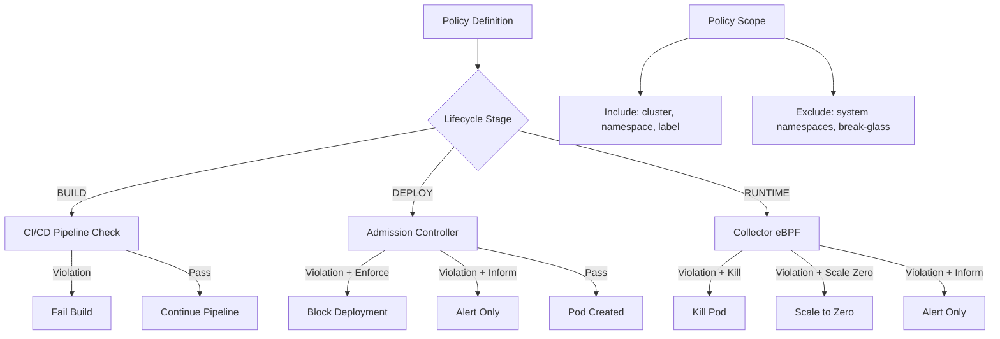

> 💡 **Quick Answer:** RHACS policies combine criteria (image CVEs, deployment config, runtime behavior) with lifecycle stages (build, deploy, runtime) and enforcement actions (inform, block, scale-to-zero, kill). Export/import policies as JSON via `roxctl` for GitOps management.

## The Problem

Default RHACS policies cover common security baselines, but every organization has unique requirements: specific CVE thresholds, required labels for chargeback, approved base images, restricted registries, mandatory resource limits for GPU workloads, or custom runtime detections. You need to codify these as enforceable policies.

## The Solution

### Policy Anatomy

```yaml
# Every RHACS policy has:
# - Name & Description
# - Categories: Vulnerability Management, DevOps Best Practices, Security Best Practices, etc.
# - Lifecycle Stages: BUILD | DEPLOY | RUNTIME (can be multiple)
# - Severity: LOW | MEDIUM | HIGH | CRITICAL
# - Enforcement:
#   - Build: FAIL_BUILD_ENFORCEMENT
#   - Deploy: SCALE_TO_ZERO_ENFORCEMENT
#   - Runtime: KILL_POD_ENFORCEMENT
# - Scope: Cluster, Namespace, Label selectors (include/exclude)
# - Criteria: Policy sections with groups of conditions (AND/OR logic)
```

### Block Critical Fixable CVEs

```json
{
  "name": "Block Critical Fixable CVEs",
  "description": "Prevent deployment of images with fixable CRITICAL CVEs (CVSS >= 9.0)",
  "severity": "CRITICAL_SEVERITY",
  "categories": ["Vulnerability Management"],
  "lifecycleStages": ["BUILD", "DEPLOY"],
  "enforcementActions": ["FAIL_BUILD_ENFORCEMENT", "SCALE_TO_ZERO_ENFORCEMENT"],
  "exclusions": [
    {
      "deployment": {
        "scope": {
          "namespace": "openshift-.*"
        }
      }
    }
  ],
  "policySections": [
    {
      "sectionName": "Critical Fixable CVEs",
      "policyGroups": [
        {
          "fieldName": "Fixed By",
          "booleanOperator": "OR",
          "values": [{ "value": ".*" }]
        },
        {
          "fieldName": "CVSS",
          "booleanOperator": "OR",
          "values": [{ "value": ">= 9.0" }]
        },
        {
          "fieldName": "Severity",
          "booleanOperator": "OR",
          "values": [{ "value": "CRITICAL" }]
        }
      ]
    }
  ]
}
```

### Enforce Required Labels

```json
{
  "name": "Required Deployment Labels",
  "description": "All deployments must have app, team, and cost-center labels for chargeback",
  "severity": "MEDIUM_SEVERITY",
  "categories": ["DevOps Best Practices"],
  "lifecycleStages": ["DEPLOY"],
  "enforcementActions": ["SCALE_TO_ZERO_ENFORCEMENT"],
  "exclusions": [
    {
      "deployment": {
        "scope": { "namespace": "openshift-.*|kube-system|stackrox" }
      }
    }
  ],
  "policySections": [
    {
      "sectionName": "Missing Labels",
      "policyGroups": [
        {
          "fieldName": "Required Label",
          "booleanOperator": "OR",
          "values": [
            { "value": "app=" },
            { "value": "team=" },
            { "value": "cost-center=" }
          ]
        }
      ]
    }
  ]
}
```

### Approved Base Images Only

```json
{
  "name": "Unapproved Base Image",
  "description": "Only approved base images from internal registry allowed",
  "severity": "HIGH_SEVERITY",
  "categories": ["Security Best Practices"],
  "lifecycleStages": ["BUILD", "DEPLOY"],
  "enforcementActions": ["FAIL_BUILD_ENFORCEMENT", "SCALE_TO_ZERO_ENFORCEMENT"],
  "policySections": [
    {
      "sectionName": "Allowed Registries",
      "policyGroups": [
        {
          "fieldName": "Image Registry",
          "negate": true,
          "booleanOperator": "OR",
          "values": [
            { "value": "quay.io/myorg" },
            { "value": "registry.redhat.io" },
            { "value": "nvcr.io/nvidia" },
            { "value": "registry.access.redhat.com" }
          ]
        }
      ]
    }
  ]
}
```

### GPU Workload Resource Enforcement

```json
{
  "name": "GPU Workload Missing Limits",
  "description": "GPU workloads must have memory limits and GPU resource requests",
  "severity": "HIGH_SEVERITY",
  "categories": ["DevOps Best Practices"],
  "lifecycleStages": ["DEPLOY"],
  "enforcementActions": ["SCALE_TO_ZERO_ENFORCEMENT"],
  "scope": {
    "label": { "key": "nvidia.com/gpu.present", "value": "true" }
  },
  "policySections": [
    {
      "sectionName": "Resource Limits Required",
      "policyGroups": [
        {
          "fieldName": "Container Memory Limit",
          "booleanOperator": "OR",
          "values": [{ "value": "0" }]
        }
      ]
    }
  ]
}
```

### Runtime: Detect Crypto Mining

```json
{
  "name": "Cryptocurrency Mining Detected",
  "description": "Detect and kill pods running crypto mining processes",
  "severity": "CRITICAL_SEVERITY",
  "categories": ["Cryptocurrency Mining"],
  "lifecycleStages": ["RUNTIME"],
  "eventSource": "DEPLOYMENT_EVENT",
  "enforcementActions": ["KILL_POD_ENFORCEMENT"],
  "policySections": [
    {
      "sectionName": "Mining Processes",
      "policyGroups": [
        {
          "fieldName": "Process Name",
          "booleanOperator": "OR",
          "values": [
            { "value": "xmrig" },
            { "value": "minerd" },
            { "value": "cpuminer" },
            { "value": "ethminer" },
            { "value": "nbminer" },
            { "value": "phoenixminer" },
            { "value": "t-rex" },
            { "value": "ccminer" }
          ]
        }
      ]
    },
    {
      "sectionName": "Mining Pools",
      "policyGroups": [
        {
          "fieldName": "Unexpected Network Flow Destination",
          "booleanOperator": "OR",
          "values": [
            { "value": ".*pool\\..*:3333" },
            { "value": ".*pool\\..*:4444" },
            { "value": ".*pool\\..*:5555" },
            { "value": ".*nicehash\\.com.*" },
            { "value": ".*minergate\\.com.*" }
          ]
        }
      ]
    }
  ]
}
```

### Runtime: Shell in Production Container

```json
{
  "name": "Interactive Shell in Production",
  "description": "Alert on shell access to production containers — potential compromise or policy violation",
  "severity": "HIGH_SEVERITY",
  "categories": ["Anomalous Activity"],
  "lifecycleStages": ["RUNTIME"],
  "eventSource": "DEPLOYMENT_EVENT",
  "enforcementActions": [],
  "exclusions": [
    {
      "deployment": {
        "scope": { "namespace": "dev|staging|debug" }
      }
    }
  ],
  "policySections": [
    {
      "sectionName": "Shell Processes",
      "policyGroups": [
        {
          "fieldName": "Process Name",
          "booleanOperator": "OR",
          "values": [
            { "value": "bash" },
            { "value": "sh" },
            { "value": "csh" },
            { "value": "zsh" },
            { "value": "dash" }
          ]
        },
        {
          "fieldName": "Process UID",
          "booleanOperator": "OR",
          "values": [{ "value": "0" }]
        }
      ]
    }
  ]
}
```

### Manage Policies via GitOps

```bash
# Export all custom policies
roxctl -e $CENTRAL_ENDPOINT \
  policy export \
  --output-dir ./acs-policies/

# Import policies to new cluster
for policy in ./acs-policies/*.json; do
  roxctl -e $CENTRAL_ENDPOINT \
    policy import "$policy"
done

# Check a specific image against all policies
roxctl -e $CENTRAL_ENDPOINT \
  image check \
  --image quay.io/myorg/myapp:v2.1.0 \
  --output table

# Dry-run policy evaluation
roxctl -e $CENTRAL_ENDPOINT \
  deployment check \
  --file deployment.yaml \
  --output table
```

### Policy Scoping and Exclusions

```bash
# Scope policies to specific clusters/namespaces:
# - Include scope: only evaluate in matching targets
# - Exclude scope: skip system namespaces, break-glass annotations

# Break-glass annotation (bypass admission control):
# Add to deployment metadata:
metadata:
  annotations:
    admission.stackrox.io/break-glass: "JIRA-1234: emergency hotfix approved by @security-team"

# This bypasses admission enforcement but STILL logs the violation
# All break-glass events are audited in Central
```



## Common Issues

- **Policy too broad — blocking system components** — always exclude `openshift-*`, `kube-system`, `stackrox` namespaces
- **Break-glass not working** — verify `bypass: BreakGlassAnnotation` is set in SecuredCluster admission control spec
- **Build policies not triggering in CI** — ensure `roxctl image check` uses the correct `--endpoint` and API token has `Continuous Integration` role
- **Runtime policy false positives** — add process baselines first (Central auto-learns normal processes for 1 hour), then enable enforcement
- **Policy import conflicts** — policies with same name will error; use `--overwrite` flag or delete first

## Best Practices

- Start all new policies with `Inform` enforcement — promote to `Block`/`Kill` after 2 weeks of tuning
- Use process baselines for runtime policies — let RHACS learn normal behavior before alerting
- Export policies to Git and manage via CI/CD — treat security policies as code
- Separate policies by severity: `CRITICAL` → auto-enforce, `HIGH` → enforce after review, `MEDIUM/LOW` → inform only
- Use break-glass annotations for emergency deployments — maintains audit trail while allowing flexibility
- Scope GPU workload policies to namespaces/labels with `nvidia.com/gpu` — avoids false positives on non-GPU workloads

## Key Takeaways

- RHACS policies combine criteria + lifecycle stage + enforcement action + scope
- Build-time policies gate CI/CD pipelines via `roxctl image check`
- Deploy-time policies use admission webhooks to block non-compliant workloads
- Runtime policies use eBPF to detect and respond to anomalous behavior (processes, network, files)
- Break-glass annotations bypass enforcement with full audit logging
- Export/import policies as JSON for GitOps management across clusters
