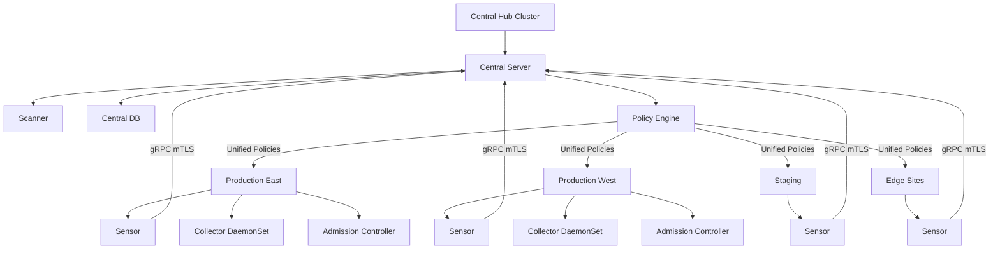

> 💡 **Quick Answer:** Deploy one RHACS Central instance as the security hub, then register each cluster by generating init bundles and deploying `SecuredCluster` CRs. All policies, compliance, vulnerability data, and alerts aggregate in Central for unified management.

## The Problem

Organizations run multiple Kubernetes clusters — production, staging, edge, multi-region, multi-cloud. Each cluster needs security scanning, policy enforcement, and compliance monitoring. Managing separate security tools per cluster creates blind spots and inconsistent policies.

## The Solution

### Hub-and-Spoke Architecture

```yaml
# Hub cluster: Central (management plane)
# - Central server + Scanner + DB
# - Single pane of glass for all clusters
# - Policy engine (policies apply to all or scoped clusters)
# - Vulnerability database (shared across all clusters)
# - Compliance dashboard (per-cluster and aggregate)

# Spoke clusters: SecuredCluster (data plane)
# - Sensor: watches cluster resources, reports to Central
# - Collector: eBPF runtime monitoring on every node
# - Admission Controller: enforces deploy-time policies locally
# - Communication: Sensor → Central over gRPC (mTLS)
```

### Register a New Cluster

```bash
# Step 1: Generate init bundle on Central
roxctl -e $CENTRAL_ENDPOINT \
  central init-bundles generate production-east \
  --output-secrets init-bundle-prod-east.yaml

# Step 2: Apply init bundle to the target cluster
KUBECONFIG=~/.kube/prod-east.kubeconfig \
  oc apply -f init-bundle-prod-east.yaml -n stackrox

# Step 3: Deploy SecuredCluster on the target cluster
cat <<EOF | KUBECONFIG=~/.kube/prod-east.kubeconfig oc apply -f -
apiVersion: platform.stackrox.io/v1alpha1
kind: SecuredCluster
metadata:
  name: stackrox-secured-cluster-services
  namespace: stackrox
spec:
  clusterName: production-east
  centralEndpoint: central-stackrox.apps.hub-cluster.example.com:443
  sensor:
    resources:
      requests:
        cpu: 500m
        memory: 1Gi
  admissionControl:
    listenOnCreates: true
    listenOnUpdates: true
    contactImageScanners: ScanIfMissing
    bypass: BreakGlassAnnotation
  perNode:
    collector:
      collection: CORE_BPF
    taintToleration: TolerateTaints
EOF
```

### Register Multiple Clusters via Script

```bash
#!/bin/bash
# register-clusters.sh — batch register clusters with RHACS Central

CENTRAL_ENDPOINT="central-stackrox.apps.hub.example.com:443"
CLUSTERS=("production-east" "production-west" "staging" "edge-site-1" "edge-site-2")

for cluster in "${CLUSTERS[@]}"; do
  echo "=== Registering: $cluster ==="

  # Generate init bundle
  roxctl -e $CENTRAL_ENDPOINT \
    central init-bundles generate "$cluster" \
    --output-secrets "/tmp/init-bundle-${cluster}.yaml"

  # Apply to target cluster (assumes kubeconfig contexts match names)
  kubectl --context "$cluster" create namespace stackrox --dry-run=client -o yaml | \
    kubectl --context "$cluster" apply -f -

  kubectl --context "$cluster" apply \
    -f "/tmp/init-bundle-${cluster}.yaml" -n stackrox

  # Deploy SecuredCluster
  cat <<EOF | kubectl --context "$cluster" apply -f -
apiVersion: platform.stackrox.io/v1alpha1
kind: SecuredCluster
metadata:
  name: stackrox-secured-cluster-services
  namespace: stackrox
spec:
  clusterName: ${cluster}
  centralEndpoint: ${CENTRAL_ENDPOINT}
  sensor:
    resources:
      requests:
        cpu: 500m
        memory: 1Gi
  admissionControl:
    listenOnCreates: true
    listenOnUpdates: true
    bypass: BreakGlassAnnotation
  perNode:
    collector:
      collection: CORE_BPF
    taintToleration: TolerateTaints
EOF

  echo "✓ $cluster registered"
done
```

### Scoped Policies by Cluster

```json
{
  "name": "Production-Only: Block Privileged",
  "description": "Block privileged containers only in production clusters",
  "severity": "CRITICAL_SEVERITY",
  "lifecycleStages": ["DEPLOY"],
  "enforcementActions": ["SCALE_TO_ZERO_ENFORCEMENT"],
  "scope": [
    {
      "cluster": "production-east"
    },
    {
      "cluster": "production-west"
    }
  ],
  "exclusions": [
    {
      "deployment": {
        "scope": { "namespace": "openshift-.*|kube-system|stackrox" }
      }
    }
  ],
  "policySections": [
    {
      "policyGroups": [
        {
          "fieldName": "Privileged Container",
          "values": [{ "value": "true" }]
        }
      ]
    }
  ]
}
```

### Monitor Fleet Health

```bash
# List all registered clusters
roxctl -e $CENTRAL_ENDPOINT cluster list

# Example output:
# NAME              STATUS    SENSOR VERSION    LAST CONTACT
# production-east   HEALTHY   4.5.2             2 minutes ago
# production-west   HEALTHY   4.5.2             1 minute ago
# staging           HEALTHY   4.5.2             3 minutes ago
# edge-site-1       DEGRADED  4.5.1             15 minutes ago
# edge-site-2       HEALTHY   4.5.2             2 minutes ago

# Check specific cluster health
roxctl -e $CENTRAL_ENDPOINT cluster describe production-east

# Cross-cluster vulnerability summary
roxctl -e $CENTRAL_ENDPOINT \
  vulnerability list \
  --severity CRITICAL \
  --fixable \
  --output table

# Cross-cluster compliance comparison
for cluster in production-east production-west staging; do
  echo "=== $cluster ==="
  roxctl -e $CENTRAL_ENDPOINT \
    compliance results \
    --standard "CIS Kubernetes v1.5" \
    --cluster "$cluster" \
    --output table | tail -1
done
```

### Central HA for Production

```yaml
apiVersion: platform.stackrox.io/v1alpha1
kind: Central
metadata:
  name: stackrox-central-services
  namespace: stackrox
spec:
  central:
    exposure:
      route:
        enabled: true
    persistence:
      persistentVolumeClaim:
        claimName: stackrox-db
        storageClassName: gp3-csi
        size: 200Gi    # Larger for multi-cluster data
    resources:
      requests:
        cpu: "2"
        memory: 8Gi
      limits:
        cpu: "8"
        memory: 16Gi
    db:
      persistence:
        persistentVolumeClaim:
          storageClassName: gp3-csi
          size: 200Gi
      resources:
        requests:
          cpu: "2"
          memory: 8Gi
        limits:
          cpu: "4"
          memory: 16Gi
  scanner:
    analyzer:
      scaling:
        autoScaling: Enabled
        maxReplicas: 10    # More replicas for multi-cluster scanning
        minReplicas: 3
    db:
      resources:
        requests:
          memory: 2Gi
```

### Decommission a Cluster

```bash
# Remove SecuredCluster from the target cluster
KUBECONFIG=~/.kube/edge-site-1.kubeconfig \
  oc delete securedcluster stackrox-secured-cluster-services -n stackrox

# Revoke the init bundle in Central
roxctl -e $CENTRAL_ENDPOINT \
  central init-bundles revoke \
  --name edge-site-1

# Delete cluster record from Central
roxctl -e $CENTRAL_ENDPOINT \
  cluster delete --name edge-site-1
```



## Common Issues

- **Sensor can't reach Central** — ensure the Route/LB is accessible from spoke clusters; check firewall rules for port 443; for air-gapped, set up a network path or use ACM
- **Init bundle already used** — each init bundle is single-use; generate a new one per cluster
- **Sensor version mismatch** — keep Sensor within one minor version of Central; upgrade Central first, then SecuredClusters
- **High Central resource usage with many clusters** — increase Central CPU/memory and Scanner replicas; 10+ clusters need dedicated infra node
- **Edge clusters with intermittent connectivity** — Sensor caches data locally and syncs when Central is reachable; admission controller continues enforcing cached policies offline

## Best Practices

- Deploy Central on a dedicated management/hub cluster — not on a workload cluster
- Use separate init bundles per cluster — enables individual revocation
- Scope policies by cluster label/name — production clusters get stricter enforcement than dev
- Size Central DB storage for cluster count × retention: ~20GB per cluster for 30-day retention
- Keep all Sensors within one minor version of Central — upgrade in lockstep
- Use ACM (Advanced Cluster Management) for automated SecuredCluster deployment across fleet

## Key Takeaways

- One Central manages security across unlimited clusters — single dashboard for all
- Init bundles provide cluster authentication; one bundle per cluster for revocation granularity
- Policies can be global (all clusters) or scoped (specific clusters/namespaces)
- Sensor operates with cached policies during Central disconnection — no security gap
- Central sizing scales with cluster count: more clusters = more CPU, memory, storage, scanner replicas
- Decommissioning is clean: delete SecuredCluster, revoke bundle, remove from Central
