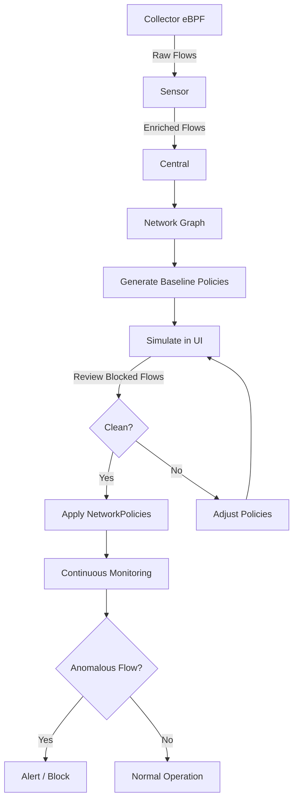

> 💡 **Quick Answer:** RHACS Collector observes actual network flows between pods via eBPF, Central builds a network graph, and you can auto-generate baseline NetworkPolicies from observed traffic — then simulate and apply them for zero-trust micro-segmentation.

## The Problem

Writing NetworkPolicies manually is error-prone: you don't know what's actually talking to what. Overly permissive policies leave gaps; overly restrictive ones break applications. You need visibility into real traffic flows before writing policies, and simulation before enforcing them.

## The Solution

### How Network Flow Discovery Works

```yaml
# RHACS network flow pipeline:
# 1. Collector (DaemonSet) uses eBPF to capture TCP/UDP connections per pod
# 2. Collector sends flow data to Sensor (per-cluster)
# 3. Sensor enriches with Kubernetes metadata (deployment, namespace, labels)
# 4. Sensor reports to Central
# 5. Central builds the Network Graph (directed graph of observed flows)
# 6. Flows are tagged as:
#    - Active: seen in current observation window
#    - Allowed: matches an existing NetworkPolicy
#    - Anomalous: no policy allows this flow (if policies exist)
#    - Baseline: part of the auto-learned baseline for this deployment
```

### View the Network Graph

```bash
# Access via Central UI:
# Network Graph → Select cluster → Select namespace(s)
# - Nodes = deployments/external entities
# - Edges = observed network flows (with port info)
# - Color coding: green=allowed, red=anomalous, gray=no policy

# CLI: list flows for a deployment
roxctl -e $CENTRAL_ENDPOINT \
  network-flow list \
  --cluster production \
  --namespace my-app \
  --deployment frontend

# Example output:
# frontend -> backend (TCP 8080) [ACTIVE]
# frontend -> redis (TCP 6379) [ACTIVE]
# frontend -> EXTERNAL:api.stripe.com (TCP 443) [ACTIVE]
# frontend -> EXTERNAL:169.254.169.254 (TCP 80) [ANOMALOUS]
```

### Generate Baseline NetworkPolicies

```bash
# Generate NetworkPolicies from observed traffic
# RHACS creates one policy per deployment, allowing only observed flows

roxctl -e $CENTRAL_ENDPOINT \
  netpol generate \
  --cluster production \
  --namespace my-app \
  --output-dir ./generated-policies/

# Example generated policy for "frontend" deployment:
```

```yaml
# generated-policies/frontend-networkpolicy.yaml
apiVersion: networking.k8s.io/v1
kind: NetworkPolicy
metadata:
  name: frontend
  namespace: my-app
  labels:
    network-policy-generator.stackrox.io/generated: "true"
spec:
  podSelector:
    matchLabels:
      app: frontend
  policyTypes:
    - Ingress
    - Egress
  ingress:
    # Allow traffic from ingress controller
    - from:
        - namespaceSelector:
            matchLabels:
              network.openshift.io/policy-group: ingress
      ports:
        - port: 8080
          protocol: TCP
  egress:
    # Allow DNS
    - to:
        - namespaceSelector: {}
      ports:
        - port: 53
          protocol: UDP
        - port: 53
          protocol: TCP
    # Allow backend service
    - to:
        - podSelector:
            matchLabels:
              app: backend
      ports:
        - port: 8080
          protocol: TCP
    # Allow Redis
    - to:
        - podSelector:
            matchLabels:
              app: redis
      ports:
        - port: 6379
          protocol: TCP
    # Allow external Stripe API
    - to:
        - ipBlock:
            cidr: 0.0.0.0/0
      ports:
        - port: 443
          protocol: TCP
```

### Simulate Before Applying

```bash
# Use the Network Graph UI simulation mode:
# 1. Click "Network Policy Simulator"
# 2. Upload generated policies or paste YAML
# 3. Graph shows:
#    - Green edges: still allowed
#    - Red edges: would be BLOCKED by new policies
#    - Yellow edges: new allowed flows
# 4. Review blocked flows — are they expected?
# 5. If clean, apply the policies

# CLI simulation:
roxctl -e $CENTRAL_ENDPOINT \
  netpol connectivity diff \
  --cluster production \
  --policy-dir ./generated-policies/ \
  --output table

# Shows which flows would be blocked/allowed by the proposed policies
```

### Namespace-Level Deny-Default + Allow

```yaml
# Step 1: Default deny all in namespace
apiVersion: networking.k8s.io/v1
kind: NetworkPolicy
metadata:
  name: deny-all
  namespace: gpu-inference
spec:
  podSelector: {}
  policyTypes:
    - Ingress
    - Egress
---
# Step 2: Allow DNS for all pods
apiVersion: networking.k8s.io/v1
kind: NetworkPolicy
metadata:
  name: allow-dns
  namespace: gpu-inference
spec:
  podSelector: {}
  policyTypes:
    - Egress
  egress:
    - to:
        - namespaceSelector: {}
      ports:
        - port: 53
          protocol: UDP
        - port: 53
          protocol: TCP
---
# Step 3: Allow only observed flows (generated by RHACS)
# Apply the generated per-deployment policies from roxctl
```

### Monitor Anomalous Flows

```bash
# After applying NetworkPolicies, RHACS detects anomalous flows:
# - Flows that were NOT in the baseline
# - Flows that violate NetworkPolicies (attempted but blocked)
# - New external destinations

# Create alert policy for anomalous network flows:
# Platform Configuration → System Policies → New Policy
# - Lifecycle: RUNTIME
# - Criteria: "Unexpected Network Flow Detected"
# - Enforcement: Inform (initially), then Kill Pod for egress to known-bad IPs

# Alert on new external connections:
roxctl -e $CENTRAL_ENDPOINT \
  alert list \
  --category "Anomalous Activity" \
  --output table
```

### GPU Cluster Network Segmentation

```yaml
# Typical GPU cluster network zones:
# 1. Management: API server, monitoring, operators
# 2. Training: Multi-node GPU jobs, NCCL/RDMA traffic
# 3. Inference: Model serving, client-facing
# 4. Storage: NFS/Lustre/S3 access
# 5. External: Internet egress (model downloads, CVE feeds)

# Training namespace: allow NCCL between training pods, block internet
apiVersion: networking.k8s.io/v1
kind: NetworkPolicy
metadata:
  name: training-isolation
  namespace: gpu-training
spec:
  podSelector:
    matchLabels:
      workload-type: training
  policyTypes:
    - Ingress
    - Egress
  ingress:
    # Allow NCCL from other training pods
    - from:
        - podSelector:
            matchLabels:
              workload-type: training
      ports:
        - port: 29500    # PyTorch distributed
          protocol: TCP
        - port: 29400    # NCCL
          protocol: TCP
    # Allow Prometheus scraping
    - from:
        - namespaceSelector:
            matchLabels:
              name: monitoring
      ports:
        - port: 9090
          protocol: TCP
  egress:
    # DNS
    - to:
        - namespaceSelector: {}
      ports:
        - port: 53
          protocol: UDP
    # Other training pods (NCCL)
    - to:
        - podSelector:
            matchLabels:
              workload-type: training
    # Storage only
    - to:
        - ipBlock:
            cidr: 10.0.50.0/24    # NFS subnet
      ports:
        - port: 2049
          protocol: TCP
    # Block all other egress (no internet)
```

### Continuous Compliance Monitoring

```bash
# Schedule network compliance checks:
# 1. Generate current baseline from RHACS
# 2. Compare against GitOps-managed policies
# 3. Alert on drift

# Export current network flows as baseline
roxctl -e $CENTRAL_ENDPOINT \
  network-flow export \
  --cluster production \
  --since 7d \
  --output json > current-flows.json

# Compare with stored baseline
diff <(jq -S '.flows[] | {src: .source, dst: .destination, port: .port}' baseline-flows.json) \
     <(jq -S '.flows[] | {src: .source, dst: .destination, port: .port}' current-flows.json)
```



## Common Issues

- **Network graph empty** — Collector not running or eBPF not capturing; check Collector pods and kernel version compatibility
- **Generated policies too restrictive** — observe traffic for at least 24-48 hours covering all workload patterns before generating baselines
- **DNS blocked after deny-default** — always include a DNS allow-all egress rule; without it, nothing resolves
- **NCCL training broken after policies** — NCCL uses dynamic high ports; allow full pod-to-pod within training namespace rather than specific ports
- **Flows to metadata service (169.254.169.254)** — cloud provider metadata; block unless pods need IAM roles; RHACS flags this as anomalous by default

## Best Practices

- Observe first, enforce later — run RHACS in monitoring mode for 1-2 weeks before generating policies
- Generate policies per namespace, not per cluster — allows incremental rollout
- Use simulation mode before every policy change — prevents production outages
- Keep DNS egress open in every namespace — it's the #1 cause of post-policy breakage
- Store generated policies in Git — treat NetworkPolicies as code, review changes in PRs
- Re-generate baselines quarterly — applications change, and stale policies create gaps or block new features

## Key Takeaways

- RHACS discovers real network flows via eBPF — no guessing what talks to what
- Auto-generate NetworkPolicies from observed traffic baseline
- Simulation mode shows exactly which flows would be blocked before applying
- Anomalous flow detection catches lateral movement and data exfiltration attempts
- GPU training workloads need special rules: allow NCCL between pods, restrict internet egress
- Incremental approach: observe → generate → simulate → apply → monitor
