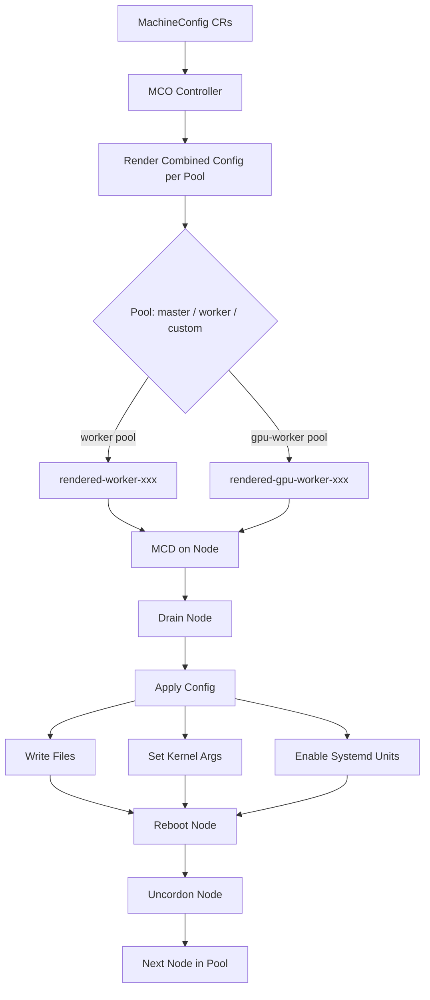

> 💡 **Quick Answer:** RHCOS is an immutable, container-optimized OS managed by the Machine Config Operator (MCO). Customize nodes via `MachineConfig` CRs (files, systemd units, kernel args, extensions), and the MCO handles rolling reboots. Never SSH and modify nodes directly — all changes must go through MachineConfigs.

## The Problem

Traditional Linux administration (SSH in, edit files, install packages, reboot) doesn't work with OpenShift. RHCOS nodes are immutable — the OS is delivered as an OSTree image and managed declaratively. You need to understand how to configure kernel parameters, drop files, add systemd services, manage OS updates, and troubleshoot nodes without breaking the immutable model.

## The Solution

### RHCOS Architecture

```yaml
# Key RHCOS concepts:
# - OSTree: transactional OS updates (atomic, rollback-capable)
# - Ignition: first-boot provisioning (like cloud-init but declarative)
# - MachineConfig: Kubernetes CR that generates Ignition configs
# - MCO (Machine Config Operator): watches MachineConfigs, renders, applies, reboots
# - MCP (MachineConfigPool): groups nodes (master, worker, custom pools)
# - rpm-ostree: layered package management on top of OSTree
# - Immutable rootfs: / is read-only; /etc and /var are writable

# Filesystem layout:
# /              → read-only OSTree deployment
# /etc           → writable, node-specific config (persists across updates)
# /var           → writable, persistent data
# /usr           → read-only, OS binaries and libraries
# /opt           → symlink to /var/opt (writable)
# /run           → tmpfs
# /sysroot       → OSTree repo root
```

### MachineConfig Basics

```yaml
# MachineConfig drops files, sets kernel args, adds systemd units
# MCO renders all MachineConfigs for a pool into a single "rendered" config
# Then drains, applies, and reboots nodes one at a time

apiVersion: machineconfiguration.openshift.io/v1
kind: MachineConfig
metadata:
  name: 99-worker-custom-sysctl
  labels:
    machineconfiguration.openshift.io/role: worker
spec:
  config:
    ignition:
      version: 3.4.0
    storage:
      files:
        # Drop a sysctl config file
        - path: /etc/sysctl.d/99-custom.conf
          mode: 0644
          overwrite: true
          contents:
            inline: |
              # GPU and RDMA optimizations
              net.core.rmem_max = 16777216
              net.core.wmem_max = 16777216
              net.core.rmem_default = 1048576
              net.core.wmem_default = 1048576
              net.ipv4.tcp_rmem = 4096 1048576 16777216
              net.ipv4.tcp_wmem = 4096 1048576 16777216
              vm.max_map_count = 262144
              kernel.pid_max = 4194304
```

### Drop Configuration Files

```yaml
apiVersion: machineconfiguration.openshift.io/v1
kind: MachineConfig
metadata:
  name: 99-worker-chrony-config
  labels:
    machineconfiguration.openshift.io/role: worker
spec:
  config:
    ignition:
      version: 3.4.0
    storage:
      files:
        # Custom NTP configuration
        - path: /etc/chrony.conf
          mode: 0644
          overwrite: true
          contents:
            inline: |
              server ntp1.internal.example.com iburst
              server ntp2.internal.example.com iburst
              driftfile /var/lib/chrony/drift
              makestep 1.0 3
              rtcsync
              logdir /var/log/chrony
        # Custom CA certificate
        - path: /etc/pki/ca-trust/source/anchors/internal-ca.pem
          mode: 0644
          overwrite: true
          contents:
            inline: |
              -----BEGIN CERTIFICATE-----
              MIIDXTCCAkWgAwIBAgIJAJC1...
              -----END CERTIFICATE-----
```

### Add Systemd Units

```yaml
apiVersion: machineconfiguration.openshift.io/v1
kind: MachineConfig
metadata:
  name: 99-worker-custom-service
  labels:
    machineconfiguration.openshift.io/role: worker
spec:
  config:
    ignition:
      version: 3.4.0
    systemd:
      units:
        # Custom systemd service
        - name: custom-network-tuning.service
          enabled: true
          contents: |
            [Unit]
            Description=Custom Network Tuning for RDMA
            After=network-online.target
            Wants=network-online.target

            [Service]
            Type=oneshot
            RemainAfterExit=yes
            ExecStart=/usr/local/bin/network-tuning.sh

            [Install]
            WantedBy=multi-user.target
        # Disable a default service
        - name: zincati.service
          enabled: false
          mask: true
    storage:
      files:
        - path: /usr/local/bin/network-tuning.sh
          mode: 0755
          overwrite: true
          contents:
            inline: |
              #!/bin/bash
              # Set ring buffer sizes for Mellanox NICs
              for iface in $(ls /sys/class/net/ | grep -v lo); do
                if ethtool -i $iface 2>/dev/null | grep -q mlx5_core; then
                  ethtool -G $iface rx 8192 tx 8192 2>/dev/null || true
                  echo "Tuned ring buffers for $iface"
                fi
              done
```

### Kernel Arguments

```yaml
apiVersion: machineconfiguration.openshift.io/v1
kind: MachineConfig
metadata:
  name: 99-worker-kernel-args
  labels:
    machineconfiguration.openshift.io/role: worker
spec:
  kernelArguments:
    # IOMMU for GPU passthrough / SR-IOV
    - intel_iommu=on
    - iommu=pt
    # Hugepages for DPDK / RDMA
    - hugepagesz=1G
    - hugepages=16
    # Isolate CPUs for real-time workloads
    # - isolcpus=4-31
    # - nohz_full=4-31
    # - rcu_nocbs=4-31
```

### OS Extensions (rpm-ostree)

```yaml
# Install additional RPM packages via MachineConfig extensions
apiVersion: machineconfiguration.openshift.io/v1
kind: MachineConfig
metadata:
  name: 99-worker-extensions
  labels:
    machineconfiguration.openshift.io/role: worker
spec:
  extensions:
    # Available extensions (OpenShift curated list):
    - usbguard        # USB device authorization
    # Note: only a limited set of extensions are supported
    # For other packages, use rpm-ostree in a debug pod (not recommended for production)
```

### Custom MachineConfigPool

```yaml
# Create a separate pool for GPU/infra nodes
# Nodes in this pool get their own MachineConfigs and roll independently
apiVersion: machineconfiguration.openshift.io/v1
kind: MachineConfigPool
metadata:
  name: gpu-worker
spec:
  machineConfigSelector:
    matchExpressions:
      - key: machineconfiguration.openshift.io/role
        operator: In
        values:
          - worker       # Inherits all worker MachineConfigs
          - gpu-worker   # Plus GPU-specific ones
  nodeSelector:
    matchLabels:
      node-role.kubernetes.io/gpu-worker: ""
  paused: false
  maxUnavailable: 1
---
# GPU-specific MachineConfig (only applies to gpu-worker pool)
apiVersion: machineconfiguration.openshift.io/v1
kind: MachineConfig
metadata:
  name: 99-gpu-worker-iommu
  labels:
    machineconfiguration.openshift.io/role: gpu-worker
spec:
  kernelArguments:
    - intel_iommu=on
    - iommu=pt
    - rdma_rxe.max_inline=256
```

### Label Nodes for Custom Pool

```bash
# Add role label to GPU nodes
oc label node gpu-node-01 node-role.kubernetes.io/gpu-worker=""
oc label node gpu-node-02 node-role.kubernetes.io/gpu-worker=""

# Verify pool membership
oc get mcp gpu-worker
# NAME         CONFIG                                  UPDATED   UPDATING   DEGRADED
# gpu-worker   rendered-gpu-worker-abc123def456        True      False      False

oc get nodes -l node-role.kubernetes.io/gpu-worker
```

### MCO Operations

```bash
# Check MachineConfigPool status
oc get mcp
# NAME         CONFIG                                  UPDATED   UPDATING   DEGRADED   MACHINECOUNT   READYMACHINECOUNT
# master       rendered-master-abc123                  True      False      False      3              3
# worker       rendered-worker-def456                  True      False      False      5              5
# gpu-worker   rendered-gpu-worker-789abc              True      False      False      2              2

# Watch rolling update progress
oc get mcp -w

# Check rendered MachineConfig (combined config for a pool)
oc get mc rendered-worker-def456 -o yaml

# See which MachineConfigs contribute to a pool
oc get mc -l machineconfiguration.openshift.io/role=worker

# Check node status during update
oc get nodes -o custom-columns=\
NAME:.metadata.name,\
STATUS:.status.conditions[-1].type,\
UPDATED:.metadata.annotations.machineconfiguration\\.openshift\\.io/currentConfig,\
DESIRED:.metadata.annotations.machineconfiguration\\.openshift\\.io/desiredConfig

# Pause a pool (prevent updates during maintenance windows)
oc patch mcp gpu-worker --type merge -p '{"spec":{"paused":true}}'

# Unpause
oc patch mcp gpu-worker --type merge -p '{"spec":{"paused":false}}'
```

### OS Updates and Upgrades

```bash
# RHCOS updates happen automatically during OpenShift upgrades
# MCO updates the OS image on each node (drain → update → reboot → uncordon)

# Check current RHCOS version
oc get nodes -o wide | awk '{print $1, $NF}'

# Check OS image for a node
oc debug node/worker-01 -- chroot /host rpm-ostree status

# Rollback a bad OS update on a node (emergency)
oc debug node/worker-01 -- chroot /host rpm-ostree rollback

# Check MCO logs
oc logs -n openshift-machine-config-operator deploy/machine-config-operator
oc logs -n openshift-machine-config-operator deploy/machine-config-controller
```

### Troubleshooting Degraded Nodes

```bash
# Check for degraded pools
oc get mcp -o custom-columns=NAME:.metadata.name,DEGRADED:.status.degradedMachineCount

# Find degraded node
oc get nodes -o json | jq -r '.items[] |
  select(.metadata.annotations["machineconfiguration.openshift.io/state"] == "Degraded") |
  .metadata.name'

# Check degradation reason
oc describe node <degraded-node> | grep -A5 "machine-config"

# Debug the node directly
oc debug node/<degraded-node>
chroot /host
systemctl status kubelet
journalctl -u machine-config-daemon --since "1 hour ago"

# Force re-apply MachineConfig on a stuck node
# (Caution: last resort — check MCO docs first)
oc debug node/<degraded-node> -- chroot /host \
  touch /run/machine-config-daemon-force

# Check rendered config diff between current and desired
oc get node <node> -o jsonpath='{.metadata.annotations.machineconfiguration\.openshift\.io/currentConfig}'
oc get node <node> -o jsonpath='{.metadata.annotations.machineconfiguration\.openshift\.io/desiredConfig}'
```

### Ignition Config for Day-0 Install

```yaml
# During OpenShift install, worker.ign is generated by the installer
# Custom manifests placed in install-config directory become MachineConfigs
# Example: openshift/99-worker-custom.yaml in the install dir

# Post-install, view the original Ignition config:
oc get mc 99-master-ssh -o jsonpath='{.spec.config}' | python3 -m json.tool

# For bare-metal IPI/UPI installs, you can add custom Ignition:
# 1. Generate install manifests: openshift-install create manifests
# 2. Drop MachineConfig YAML files into openshift/ directory
# 3. Generate Ignition: openshift-install create ignition-configs
# 4. Ignition configs (bootstrap.ign, master.ign, worker.ign) include your customizations
```



## Common Issues

- **MCP stuck in UPDATING** — a node failed to apply config; check `oc describe mcp` and degraded node logs
- **Node stuck in NotReady after reboot** — bad kernel arg or broken systemd unit; use `oc debug node/` to check; rollback with `rpm-ostree rollback`
- **MachineConfig not applied** — check the `role` label matches your MCP's `machineConfigSelector`; labels are case-sensitive
- **File permissions wrong** — Ignition uses decimal mode (0644, not 644); permissions must match exactly
- **Rendered config too large** — MachineConfigs are combined; keep file contents small; use ConfigMaps mounted by DaemonSets for large configs
- **Two MCPs matching same node** — node gets stuck; ensure each node matches exactly one MCP via labels
- **MCO reboot loop** — bad MachineConfig causes apply failure → reboot → retry; pause the MCP, fix the MachineConfig, unpause

## Best Practices

- Never SSH and modify RHCOS nodes manually — all changes via MachineConfig or they're lost on next update
- Use custom MachineConfigPools for GPU/infra/edge nodes — independent rolling updates
- Prefix MachineConfig names with `99-` — MCO applies in lexicographic order; 99 ensures your configs override defaults
- Pause GPU worker MCP before applying new MachineConfigs — unpause during maintenance windows
- Test MachineConfigs on staging clusters first — bad configs can make nodes unbootable
- Keep MachineConfigs small and focused — one concern per MachineConfig (sysctl, chrony, kernel args as separate CRs)
- Use `maxUnavailable: 1` on production MCPs — one node at a time for safe rolling updates

## Key Takeaways

- RHCOS is immutable — the OS is an OSTree image updated atomically with rollback capability
- MachineConfig is the only supported way to customize RHCOS nodes (files, systemd, kernel args)
- MCO renders all MachineConfigs per pool, then applies via drain → apply → reboot → uncordon
- Custom MachineConfigPools isolate GPU/infra nodes for independent rolling updates
- OS updates happen automatically during OpenShift upgrades — MCO manages the full lifecycle
- `rpm-ostree` can layer packages but only via supported extensions — avoid manual rpm-ostree on production nodes
- Ignition handles day-0 first-boot; MachineConfig handles day-1+ ongoing configuration
