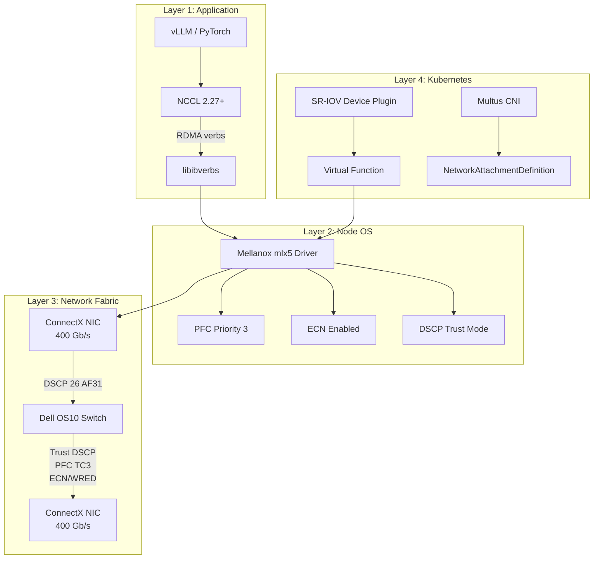
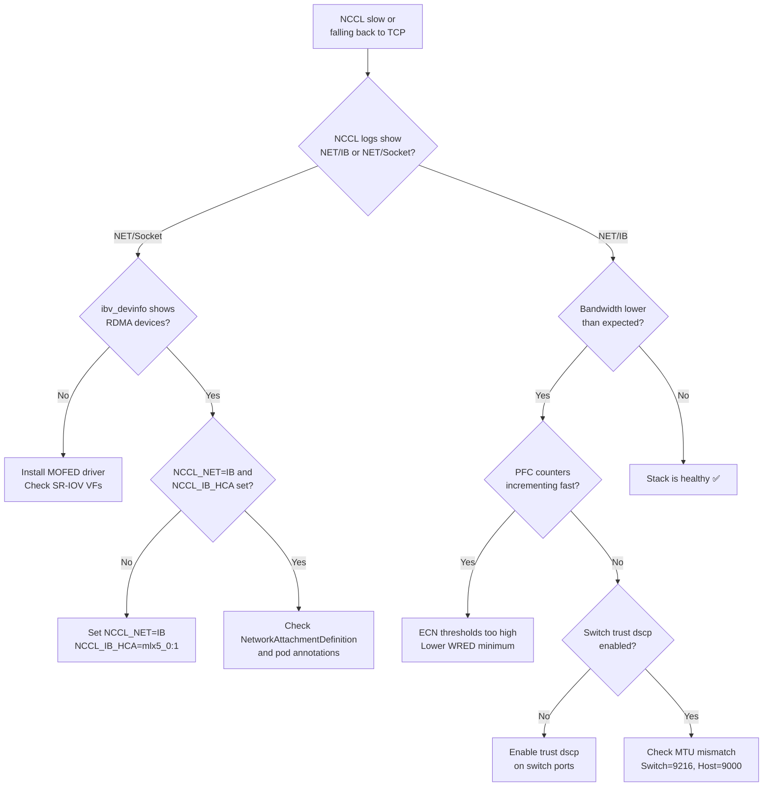

> 💡 **Quick Answer:** A lossless RoCEv2 stack requires three aligned layers: **node** (ECN sysctl + Mellanox PFC/DSCP trust), **switch** (DSCP trust + PFC TC3 + ECN/WRED), and **Kubernetes** (SR-IOV + NCCL env vars). All must agree on DSCP 26 → Priority 3 → Traffic Class 3.

## The Problem

RDMA performance collapses when any single layer of the network stack is misconfigured. Common failures:
- Switch doesn't trust DSCP → RDMA traffic treated as best-effort → drops
- Node PFC disabled → no pause frames → buffer overflow → packet loss → NCCL retransmissions
- ECN disabled → PFC activates too frequently → head-of-line blocking
- DSCP mapping mismatch → RDMA traffic lands in wrong queue → mixed with bulk data

A working lossless fabric requires every component to agree on the same priority mapping.

## The Solution

### Architecture Overview



### Layer-by-Layer Configuration

#### Layer 1: Kubernetes (SR-IOV + NCCL)

```yaml
# SriovNetworkNodePolicy for RDMA
apiVersion: sriovnetwork.openshift.io/v1
kind: SriovNetworkNodePolicy
metadata:
  name: rdma-policy
  namespace: openshift-sriov-network-operator
spec:
  nodeSelector:
    node-role.kubernetes.io/gpu-worker: ""
  resourceName: mellanoxnics
  numVfs: 8
  nicSelector:
    vendor: "15b3"
    deviceID: "101d"
  deviceType: netdevice  # Required for RDMA verbs
  isRdma: true
---
# NetworkAttachmentDefinition
apiVersion: k8s.cni.cncf.io/v1
kind: NetworkAttachmentDefinition
metadata:
  name: rdma-net
  namespace: ai-inference
  annotations:
    k8s.v1.cni.cncf.io/resourceName: openshift.io/mellanoxnics
spec:
  config: |
    {
      "cniVersion": "0.3.1",
      "type": "host-device",
      "ipam": {
        "type": "whereabouts",
        "range": "10.0.100.0/24"
      }
    }
```

NCCL environment variables for pods:
```yaml
env:
  - name: NCCL_DEBUG
    value: "INFO"
  - name: NCCL_SOCKET_IFNAME
    value: "net1"
  - name: NCCL_NET
    value: "IB"
```

#### Layer 2: Node Configuration (MachineConfig)

```yaml
apiVersion: machineconfiguration.openshift.io/v1
kind: MachineConfig
metadata:
  labels:
    machineconfiguration.openshift.io/role: gpu-worker
  name: 99-roce-lossless-stack
spec:
  config:
    ignition:
      version: 3.4.0
    storage:
      files:
        # ECN sysctl
        - path: /etc/sysctl.d/99-ecn.conf
          mode: 0644
          contents:
            source: data:text/plain;charset=utf-8,net.ipv4.tcp_ecn=1%0Anet.ipv4.tcp_ecn_fallback=1%0A
        # NIC configuration script
        - path: /usr/local/bin/configure-roce-lossless.sh
          mode: 0755
          contents:
            source: data:text/plain;charset=utf-8,#!/bin/bash%0Aset -euo pipefail%0Afor dev in /sys/class/infiniband/mlx5_*; do%0A  for nd in %24dev/device/net/*; do%0A    NETDEV=%24(basename %24nd)%0A    echo "Configuring %24NETDEV for lossless RoCEv2"%0A    mlnx_qos -i %24NETDEV --trust dscp 2>/dev/null || true%0A    mlnx_qos -i %24NETDEV --pfc 0,0,0,1,0,0,0,0 2>/dev/null || true%0A    mlnx_qos -i %24NETDEV --ecn 0,0,0,1,0,0,0,0 2>/dev/null || true%0A    echo "Done: %24NETDEV"%0A  done%0Adone%0A
    systemd:
      units:
        - name: configure-roce-lossless.service
          enabled: true
          contents: |
            [Unit]
            Description=Configure lossless RoCEv2 on Mellanox NICs
            After=network-online.target
            [Service]
            Type=oneshot
            ExecStart=/usr/local/bin/configure-roce-lossless.sh
            RemainAfterExit=true
            [Install]
            WantedBy=multi-user.target
```

#### Layer 3: Switch Configuration (Dell OS10)

```
! Per-port configuration for GPU node connections
interface ethernet1/1/1-1/1/16
  description "GPU Nodes - RoCEv2 Lossless"
  mtu 9216
  trust dscp
  priority-flow-control mode on
  priority-flow-control priority 3 no-drop
  ets mode on
  ets traffic-class 0 bandwidth 30
  ets traffic-class 3 bandwidth 70
  wred-profile rdma-ecn queue 3
  no shutdown

! ECN/WRED profile
wred ecn-profile rdma-ecn
  ecn enable
  threshold minimum 150 maximum 1500 probability 100
```

### Validation Checklist

Run this from each GPU node to verify the full stack:

```bash
#!/bin/bash
echo "=== RoCEv2 Lossless Stack Validation ==="

echo -e "\n--- 1. ECN Sysctl ---"
sysctl net.ipv4.tcp_ecn
# Expected: net.ipv4.tcp_ecn = 1

echo -e "\n--- 2. Mellanox NIC Trust Mode ---"
for dev in /sys/class/infiniband/mlx5_*; do
  NETDEV=$(ls $dev/device/net/ | head -1)
  echo "$NETDEV:"
  mlnx_qos -i $NETDEV 2>/dev/null | grep -E "trust|pfc|ecn" || echo "  mlnx_qos not available"
done
# Expected: trust state: dscp, pfc: 0,0,0,1,0,0,0,0

echo -e "\n--- 3. RDMA Devices ---"
ibv_devinfo | grep -E "hca_id|state|active_speed"
# Expected: PORT_ACTIVE, speed matching NIC spec

echo -e "\n--- 4. SR-IOV VFs ---"
ip link show | grep "vf " | head -5
# Expected: VFs listed with MAC addresses

echo -e "\n--- 5. PFC Counters ---"
for dev in /sys/class/infiniband/mlx5_*; do
  NETDEV=$(ls $dev/device/net/ | head -1)
  echo "$NETDEV PFC:"
  ethtool -S $NETDEV 2>/dev/null | grep -E "pfc|pause" | grep -v ": 0$"
done
# Expected: counters may be 0 (good) or small numbers (normal)

echo -e "\n--- 6. NCCL Test ---"
echo "Deploy a test pod with NCCL_DEBUG=INFO and check for:"
echo "  NET/IB : Using [0]mlx5_X:1/RoCE"
echo "  GPU Direct RDMA Enabled"
echo "  Channel XX/0 : 0[0] -> 1[1] via P2P/CUMEM"
```

### Troubleshooting Decision Tree



## Common Issues

**DSCP mapping mismatch between layers**

The most common issue. Verify all three agree:
| Layer | Config | Expected |
|-------|--------|----------|
| Host NIC | `mlnx_qos --trust dscp` | Trust mode: dscp |
| Switch port | `trust dscp` | DSCP 26 → TC3 |
| NCCL | Default (DSCP 26/AF31) | No override needed |

**PFC storms after enabling ECN**

ECN on the switch AND the host must both be enabled. If only one side has ECN, the other can't react to congestion signals:
- Switch: `wred-profile rdma-ecn` with `ecn enable`
- Host: `mlnx_qos --ecn 0,0,0,1,0,0,0,0`

**GPU Direct RDMA not available**

Requires open kernel modules (`useOpenKernelModules: true` in GPU Operator) and DMA-BUF support. Check:
```bash
cat /sys/module/nvidia/parameters/NVreg_OpenRmEnableUnsupportedGpus
```

## Best Practices

- **Configure bottom-up**: Switch → Node → Kubernetes → Application
- **Validate each layer** before proceeding to the next
- **DSCP 26 (AF31) → Priority 3** is the universal RoCEv2 convention — don't invent custom mappings
- **ECN minimum threshold should be ~10% of switch buffer per port** — too low causes over-marking, too high defeats the purpose
- **Test with `ib_write_bw` and `doca_perftest`** before running workloads
- **Monitor in production**: PFC pause counters, ECN mark counters, NCCL throughput
- **Document your topology**: which switch ports connect to which nodes, VLAN assignments, MTU settings

## Key Takeaways

- Lossless RoCEv2 requires alignment across **all layers**: app → OS → NIC → switch → NIC → OS → app
- **Three mandatory configs per layer**: DSCP trust, PFC on priority 3, ECN enabled
- Dell OS10 defaults DSCP 24/26 to TC3 — verify with `show qos-map dscp-tc`
- MachineConfig + systemd oneshot is the OpenShift-native way to configure NIC QoS
- `mlnx_qos` is the Swiss Army knife for Mellanox NIC QoS: trust, PFC, ECN, ETS
- GPU Direct RDMA requires open kernel modules — check NCCL logs for `DMA-BUF is available`
- PFC prevents drops (emergency brake), ECN prevents congestion (proactive) — always use both
- Validate with the checklist script before deploying workloads
