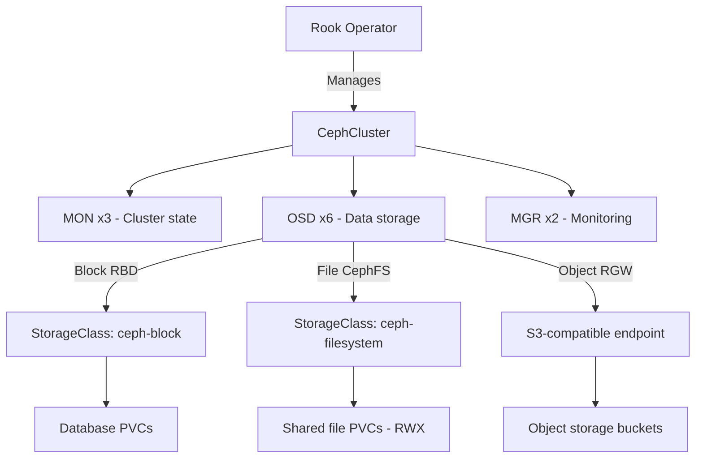

> 💡 **Quick Answer:** Deploy Rook Ceph for enterprise-grade distributed storage on Kubernetes. Block, file, and object storage with self-healing and automatic rebalancing.

## The Problem

You need enterprise-grade storage that provides block (RBD), shared file (CephFS), and object (S3-compatible) storage from the same cluster. Rook automates Ceph lifecycle management on Kubernetes.

## The Solution

### Step 1: Install Rook Operator

```bash
helm repo add rook-release https://charts.rook.io/release
helm repo update

helm install rook-ceph rook-release/rook-ceph \
  --namespace rook-ceph --create-namespace \
  --set csi.enableRBDDriver=true \
  --set csi.enableCephFSDriver=true
```

### Step 2: Create CephCluster

```yaml
apiVersion: ceph.rook.io/v1
kind: CephCluster
metadata:
  name: rook-ceph
  namespace: rook-ceph
spec:
  cephVersion:
    image: quay.io/ceph/ceph:v18.2
  dataDirHostPath: /var/lib/rook
  mon:
    count: 3
    allowMultiplePerNode: false
  mgr:
    count: 2
    allowMultiplePerNode: false
  dashboard:
    enabled: true
    ssl: true
  storage:
    useAllNodes: true
    useAllDevices: false
    devices:
      - name: sdb          # Dedicated disk for Ceph OSD
      - name: sdc
    config:
      osdsPerDevice: "1"
  resources:
    osd:
      requests:
        cpu: "2"
        memory: 4Gi
      limits:
        cpu: "4"
        memory: 8Gi
```

### Step 3: Create StorageClasses

```yaml
# Block storage (RBD) — for databases, stateful apps
apiVersion: ceph.rook.io/v1
kind: CephBlockPool
metadata:
  name: replicapool
  namespace: rook-ceph
spec:
  failureDomain: host
  replicated:
    size: 3
---
apiVersion: storage.k8s.io/v1
kind: StorageClass
metadata:
  name: ceph-block
provisioner: rook-ceph.rbd.csi.ceph.com
parameters:
  clusterID: rook-ceph
  pool: replicapool
  csi.storage.k8s.io/fstype: ext4
reclaimPolicy: Delete
allowVolumeExpansion: true
---
# Shared filesystem (CephFS) — for ReadWriteMany
apiVersion: ceph.rook.io/v1
kind: CephFilesystem
metadata:
  name: ceph-filesystem
  namespace: rook-ceph
spec:
  metadataPool:
    replicated:
      size: 3
  dataPools:
    - replicated:
        size: 3
  metadataServer:
    activeCount: 1
    activeStandby: true
---
apiVersion: storage.k8s.io/v1
kind: StorageClass
metadata:
  name: ceph-filesystem
provisioner: rook-ceph.cephfs.csi.ceph.com
parameters:
  clusterID: rook-ceph
  fsName: ceph-filesystem
reclaimPolicy: Delete
```

```bash
# Verify cluster health
kubectl -n rook-ceph exec deploy/rook-ceph-tools -- ceph status
# Should show: HEALTH_OK
```



## Best Practices

- **Start small and iterate** — don't over-engineer on day one
- **Monitor and measure** — you can't improve what you don't measure
- **Automate repetitive tasks** — reduce human error and toil
- **Document your decisions** — future you will thank present you

## Key Takeaways

- This is essential knowledge for production Kubernetes operations
- Start with the simplest approach that solves your problem
- Monitor the impact of every change you make
- Share knowledge across your team with internal runbooks
