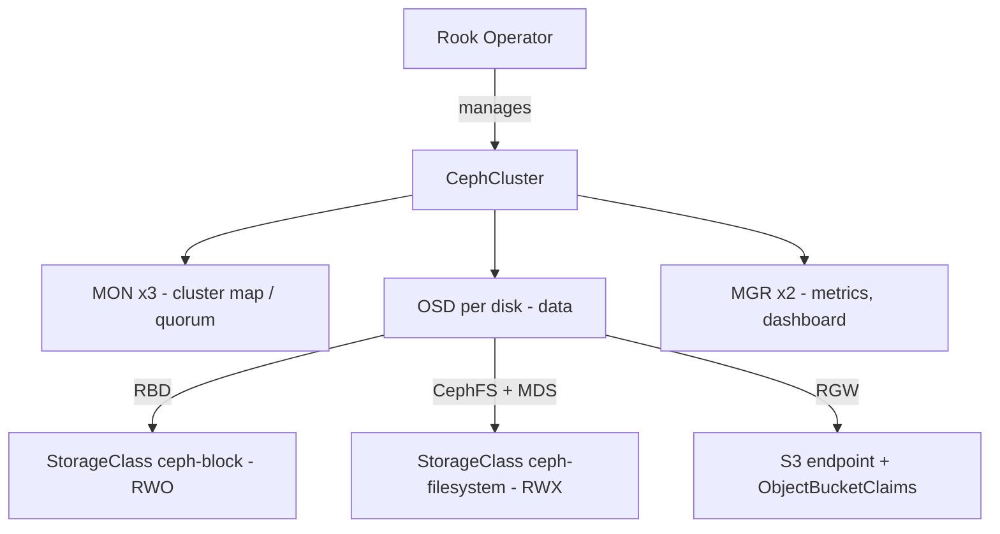

> 💡 **Quick Answer:** Rook is a CNCF-graduated operator that runs Ceph on Kubernetes. Install the operator (`helm install rook-ceph rook-release/rook-ceph -n rook-ceph --create-namespace`), create a `CephCluster` that consumes raw disks on at least 3 nodes, then a `CephBlockPool` + RBD StorageClass (RWO block), a `CephFilesystem` + CephFS StorageClass (RWX), and optionally a `CephObjectStore` (S3). Check health with `kubectl -n rook-ceph exec deploy/rook-ceph-tools -- ceph status` → `HEALTH_OK`.
>
> **Gotcha:** OSDs only use **raw, unformatted** disks/partitions. A disk with a filesystem or leftover LVM/Ceph signature is silently skipped — wipe it first.

## The Problem

You need self-hosted storage that gives block (RBD), shared file (CephFS) and S3-compatible object storage from one system, with replication, self-healing and rebalancing — on bare metal or VMs where no cloud CSI driver exists. Rook automates Ceph deployment, upgrades and failure recovery as Kubernetes resources.

## The Solution

### Prerequisites

- 3+ worker nodes (3 MONs for quorum, replica size 3 across hosts)
- At least one empty raw disk per storage node (`lsblk -f` shows no `FSTYPE`)
- Kernel with `rbd` module (for RBD) — any modern distro
- Plan roughly 4 GiB RAM per OSD plus ~1–2 GiB per MON/MGR

```bash
# Wipe a previously used disk (DESTROYS DATA)
sgdisk --zap-all /dev/sdb
wipefs -a /dev/sdb
dd if=/dev/zero of=/dev/sdb bs=1M count=100 oflag=direct
```

### Step 1: Install the Rook Operator

```bash
helm repo add rook-release https://charts.rook.io/release
helm repo update
helm install rook-ceph rook-release/rook-ceph \
  --namespace rook-ceph --create-namespace \
  --set csi.enableRBDDriver=true \
  --set csi.enableCephFSDriver=true

kubectl -n rook-ceph get pods    # rook-ceph-operator Running
```

The companion chart `rook-release/rook-ceph-cluster` can create the CephCluster, pools, StorageClasses and toolbox from values — handy for GitOps. The manifests below show what it generates.

### Step 2: Create the CephCluster

```yaml
apiVersion: ceph.rook.io/v1
kind: CephCluster
metadata:
  name: rook-ceph
  namespace: rook-ceph
spec:
  cephVersion:
    image: quay.io/ceph/ceph:v19.2.3     # Squid; check Rook's supported versions
  dataDirHostPath: /var/lib/rook
  mon:
    count: 3
    allowMultiplePerNode: false
  mgr:
    count: 2
    allowMultiplePerNode: false
  dashboard:
    enabled: true
    ssl: true
  storage:
    useAllNodes: false
    useAllDevices: false
    nodes:
      - name: worker-1
        devices: [{ name: sdb }, { name: sdc }]
      - name: worker-2
        devices: [{ name: sdb }, { name: sdc }]
      - name: worker-3
        devices: [{ name: sdb }, { name: sdc }]
    config:
      osdsPerDevice: "1"
  resources:
    osd:
      requests: { cpu: "2", memory: 4Gi }
      limits: { memory: 8Gi }
    mgr:
      requests: { cpu: 500m, memory: 512Mi }
```

`useAllNodes: true` + `useAllDevices: true` is convenient in labs but will grab every empty disk on every node — list nodes/devices explicitly in production.

```bash
kubectl -n rook-ceph get cephcluster
# NAME        DATADIRHOSTPATH   MONCOUNT   AGE   PHASE   HEALTH
# rook-ceph   /var/lib/rook     3          8m    Ready   HEALTH_OK
kubectl -n rook-ceph get pods -l app=rook-ceph-osd
```

### Step 3: Toolbox and Health Checks

```bash
kubectl apply -f https://raw.githubusercontent.com/rook/rook/master/deploy/examples/toolbox.yaml
kubectl -n rook-ceph rollout status deploy/rook-ceph-tools

kubectl -n rook-ceph exec deploy/rook-ceph-tools -- ceph status
kubectl -n rook-ceph exec deploy/rook-ceph-tools -- ceph osd tree
kubectl -n rook-ceph exec deploy/rook-ceph-tools -- ceph df
kubectl -n rook-ceph exec deploy/rook-ceph-tools -- ceph health detail
```

Use the toolbox manifest from the same Rook release branch as your operator.

### Step 4: Block Storage (RBD, RWO)

```yaml
apiVersion: ceph.rook.io/v1
kind: CephBlockPool
metadata:
  name: replicapool
  namespace: rook-ceph
spec:
  failureDomain: host
  replicated:
    size: 3
---
apiVersion: storage.k8s.io/v1
kind: StorageClass
metadata:
  name: ceph-block
  annotations:
    storageclass.kubernetes.io/is-default-class: "true"
provisioner: rook-ceph.rbd.csi.ceph.com
parameters:
  clusterID: rook-ceph
  pool: replicapool
  imageFormat: "2"
  imageFeatures: layering
  csi.storage.k8s.io/provisioner-secret-name: rook-csi-rbd-provisioner
  csi.storage.k8s.io/provisioner-secret-namespace: rook-ceph
  csi.storage.k8s.io/controller-expand-secret-name: rook-csi-rbd-provisioner
  csi.storage.k8s.io/controller-expand-secret-namespace: rook-ceph
  csi.storage.k8s.io/node-stage-secret-name: rook-csi-rbd-node
  csi.storage.k8s.io/node-stage-secret-namespace: rook-ceph
  csi.storage.k8s.io/fstype: ext4
reclaimPolicy: Delete
allowVolumeExpansion: true
volumeBindingMode: Immediate
```

The `csi.storage.k8s.io/*-secret-*` parameters are required — without them PVCs stay `Pending` with permission errors. Use `reclaimPolicy: Retain` for data you can't afford to lose on PVC deletion.

### Step 5: Shared Filesystem (CephFS, RWX)

```yaml
apiVersion: ceph.rook.io/v1
kind: CephFilesystem
metadata:
  name: ceph-filesystem
  namespace: rook-ceph
spec:
  metadataPool:
    replicated:
      size: 3
  dataPools:
    - name: data0
      replicated:
        size: 3
  preserveFilesystemOnDelete: true
  metadataServer:
    activeCount: 1
    activeStandby: true
---
apiVersion: storage.k8s.io/v1
kind: StorageClass
metadata:
  name: ceph-filesystem
provisioner: rook-ceph.cephfs.csi.ceph.com
parameters:
  clusterID: rook-ceph
  fsName: ceph-filesystem
  pool: ceph-filesystem-data0          # <fsName>-<dataPool name>
  csi.storage.k8s.io/provisioner-secret-name: rook-csi-cephfs-provisioner
  csi.storage.k8s.io/provisioner-secret-namespace: rook-ceph
  csi.storage.k8s.io/controller-expand-secret-name: rook-csi-cephfs-provisioner
  csi.storage.k8s.io/controller-expand-secret-namespace: rook-ceph
  csi.storage.k8s.io/node-stage-secret-name: rook-csi-cephfs-node
  csi.storage.k8s.io/node-stage-secret-namespace: rook-ceph
reclaimPolicy: Delete
allowVolumeExpansion: true
```

```yaml
apiVersion: v1
kind: PersistentVolumeClaim
metadata:
  name: shared-data
spec:
  accessModes: [ReadWriteMany]
  storageClassName: ceph-filesystem
  resources:
    requests:
      storage: 50Gi
```

### Step 6: Object Storage (S3 via RGW)

```yaml
apiVersion: ceph.rook.io/v1
kind: CephObjectStore
metadata:
  name: my-store
  namespace: rook-ceph
spec:
  metadataPool:
    failureDomain: host
    replicated:
      size: 3
  dataPool:
    failureDomain: host
    erasureCoded:            # cheaper than 3x replication for bulk objects
      dataChunks: 2
      codingChunks: 1
  preservePoolsOnDelete: true
  gateway:
    port: 80
    instances: 2
---
apiVersion: storage.k8s.io/v1
kind: StorageClass
metadata:
  name: ceph-bucket
provisioner: rook-ceph.ceph.rook.io/bucket
parameters:
  objectStoreName: my-store
  objectStoreNamespace: rook-ceph
reclaimPolicy: Delete
---
apiVersion: objectbucket.io/v1alpha1
kind: ObjectBucketClaim
metadata:
  name: app-bucket
  namespace: my-app
spec:
  generateBucketName: app-bucket
  storageClassName: ceph-bucket
```

The OBC creates a ConfigMap (`BUCKET_HOST`, `BUCKET_NAME`, `BUCKET_PORT`) and Secret (`AWS_ACCESS_KEY_ID`, `AWS_SECRET_ACCESS_KEY`) with the same name in the app namespace — mount them with `envFrom`. Erasure coding with 2+1 needs at least 3 hosts.


```mermaid
graph TD
    A[Rook Operator] -->|manages| B[CephCluster]
    B --> C[MON x3 - cluster map / quorum]
    B --> D[OSD per disk - data]
    B --> E[MGR x2 - metrics, dashboard]
    D -->|RBD| F[StorageClass ceph-block - RWO]
    D -->|CephFS + MDS| G[StorageClass ceph-filesystem - RWX]
    D -->|RGW| H[S3 endpoint + ObjectBucketClaims]
```

### Dashboard and Monitoring

```bash
kubectl -n rook-ceph get secret rook-ceph-dashboard-password -o jsonpath='{.data.password}' | base64 -d
kubectl -n rook-ceph port-forward svc/rook-ceph-mgr-dashboard 8443:8443   # user: admin
```

Set `spec.monitoring.enabled: true` in the CephCluster to create a ServiceMonitor for the Prometheus Operator, and import the Ceph Grafana dashboards.

## Common Issues

**No OSD pods created** — disks aren't raw (existing partitions/filesystem/LVM), or the device names don't exist on that node. Check `kubectl -n rook-ceph logs -l app=rook-ceph-osd-prepare`.

**PVC stuck `Pending`** — StorageClass missing the CSI secret parameters, wrong `clusterID`/`pool`, or the pool doesn't exist yet. `kubectl describe pvc` and `kubectl -n rook-ceph logs deploy/csi-rbdplugin-provisioner -c csi-provisioner`.

**`HEALTH_WARN: clock skew detected`** — NTP/chrony not running on the nodes hosting MONs.

**`HEALTH_WARN: ... pgs undersized/degraded`** — fewer failure domains than replica size (e.g. `size: 3` with 2 hosts). Add hosts or lower `failureDomain` to `osd` in labs only.

**`too many PGs per OSD` / slow rebalancing** — leave the PG autoscaler on (`ceph osd pool autoscale-status`) and add OSDs rather than overloading few disks.

## Best Practices

- **Dedicated storage nodes** with taints/tolerations (`placement` in the CephCluster) for large clusters
- **Replica 3 across hosts** (`failureDomain: host`, or `zone` across AZs)
- **Separate networks** for public/cluster traffic via `spec.network` (Multus) at scale
- **NVMe/SSD for OSD metadata** (`metadataDevice`) when data disks are HDDs
- **Upgrade Rook first, then Ceph**, one minor version at a time, with `HEALTH_OK` before and after
- **Back up** cluster resources and critical PVs with Velero; Ceph replication is not a backup

## Frequently Asked Questions

### What is the minimum number of nodes for Rook Ceph?

Three for production: MON quorum needs 3 and replica-3 pools need 3 hosts. Each storage node needs at least one raw disk. For single-node labs set `mon.count: 1`, `allowMultiplePerNode: true` and pool `size: 1` — never in production. For small clusters, Longhorn or a cloud CSI driver is usually simpler.

### Rook Ceph vs Longhorn?

Longhorn is lighter and easier (block only, plus RWX via NFS share-manager). Rook Ceph is heavier but provides block, native RWX filesystem and S3 object storage and scales to petabytes. See [Longhorn distributed storage](/recipes/storage/longhorn-distributed-storage/).

### What is the difference between Rook and Ceph?

Ceph is the distributed storage system (MONs, OSDs, MGRs, MDS, RGW). Rook is the Kubernetes operator that deploys, configures, upgrades and heals Ceph via CRDs, and wires it to Kubernetes through the Ceph CSI drivers.

### How do I use Ceph on OpenShift?

Use **OpenShift Data Foundation** (ODF), Red Hat's supported distribution of Rook-Ceph and NooBaa, installed from OperatorHub. It manages the same CRDs with OpenShift-specific defaults.

## Key Takeaways

- Rook runs and heals Ceph as Kubernetes resources; Ceph provides block, file and object storage
- OSDs need raw disks; production needs 3+ nodes and replica 3 across hosts
- CSI StorageClasses must include the provisioner/node secret parameters
- Use the toolbox (`ceph status`, `ceph osd tree`) and dashboard to verify health
