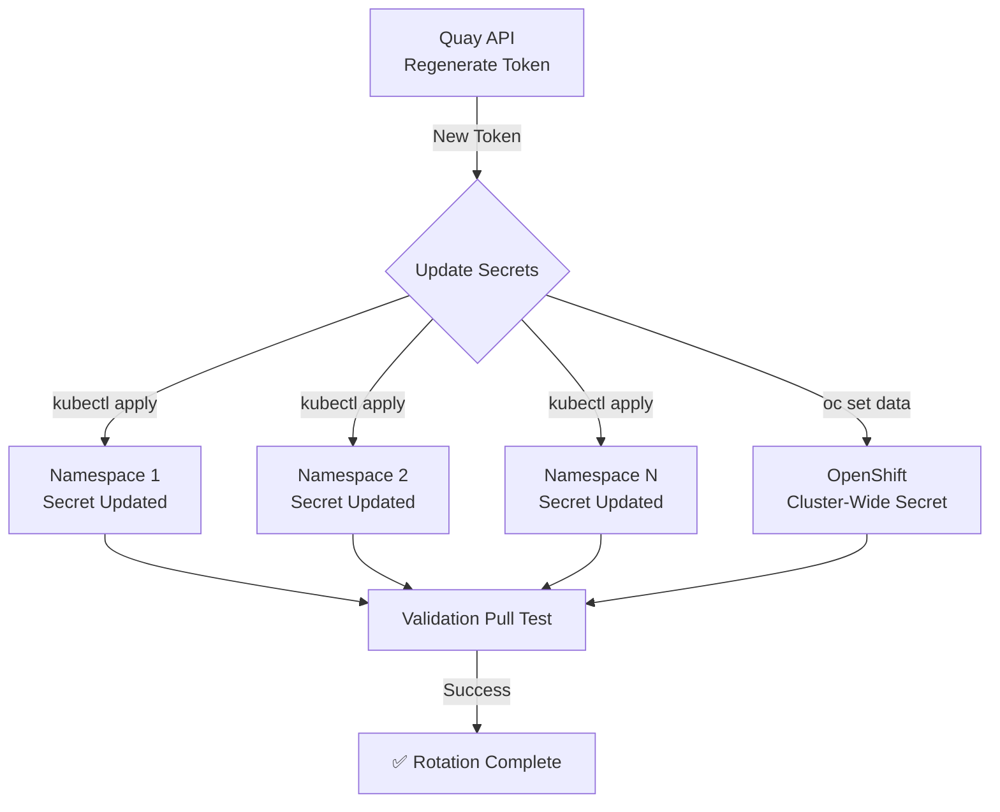

> 💡 **Quick Answer:** Call the Quay API to regenerate the robot token, then update all Kubernetes `docker-registry` secrets with the new credentials using `kubectl create secret --dry-run=client -o yaml | kubectl apply -f -`.

## The Problem

Robot account tokens should be rotated regularly for security:

- **Leaked tokens** — a compromised token gives registry access until rotated
- **Compliance requirements** — SOC2, ISO 27001, and PCI-DSS require periodic credential rotation
- **Employee departures** — tokens may have been shared during onboarding
- **Best practice** — even without incidents, rotation limits the blast radius of a breach

Manual rotation is painful: regenerate the token in Quay, then update secrets in every namespace across every cluster. You need automation.

## The Solution

### Step 1: Regenerate the Robot Token via Quay API

```bash
#!/bin/bash
# rotate-token.sh — Regenerate a Quay robot account token

ORG="myorg"
ROBOT="k8s_prod_puller"
QUAY_URL="https://quay.io"  # or your self-hosted Quay URL

# Regenerate the token
RESPONSE=$(curl -s -X POST \
  "${QUAY_URL}/api/v1/organization/${ORG}/robots/${ROBOT}/regenerate" \
  -H "Authorization: Bearer ${QUAY_API_TOKEN}")

NEW_TOKEN=$(echo "$RESPONSE" | jq -r '.token')

if [ "$NEW_TOKEN" = "null" ] || [ -z "$NEW_TOKEN" ]; then
  echo "❌ Failed to regenerate token"
  echo "$RESPONSE" | jq .
  exit 1
fi

echo "✅ New token generated for ${ORG}+${ROBOT}"
echo "Token preview: ${NEW_TOKEN:0:8}...${NEW_TOKEN: -4}"
```

> ⚠️ **Important:** After regeneration, the old token is immediately invalidated. Any pull using the old token will fail. Update all secrets quickly.

### Step 2: Update Kubernetes Secrets

```bash
# Continue from rotate-token.sh

REGISTRY="${QUAY_URL#https://}"  # Remove protocol prefix
ROBOT_USER="${ORG}+${ROBOT}"
SECRET_NAME="quay-pull-secret"

# Update secrets in all namespaces that have them
for ns in $(kubectl get secrets --all-namespaces \
  -o jsonpath='{range .items[?(@.metadata.name=="'"${SECRET_NAME}"'")]}{.metadata.namespace}{"\n"}{end}' \
  | sort -u); do

  kubectl create secret docker-registry "$SECRET_NAME" \
    --docker-server="$REGISTRY" \
    --docker-username="$ROBOT_USER" \
    --docker-password="$NEW_TOKEN" \
    --docker-email="robot@${ORG}.example.com" \
    -n "$ns" \
    --dry-run=client -o yaml | kubectl apply -f -

  echo "✅ Updated secret in namespace: $ns"
done
```

### Step 3: Update OpenShift Cluster-Wide Pull Secret

If using OpenShift with a cluster-wide pull secret:

```bash
# Extract current pull secret
oc extract secret/pull-secret -n openshift-config --to=. --confirm

# Update the auth for your registry
NEW_AUTH=$(echo -n "${ROBOT_USER}:${NEW_TOKEN}" | base64 -w0)

jq --arg host "$REGISTRY" --arg auth "$NEW_AUTH" \
  '.auths[$host].auth = $auth' \
  .dockerconfigjson > updated-pull-secret.json

# Apply the update
oc set data secret/pull-secret \
  -n openshift-config \
  --from-file=.dockerconfigjson=updated-pull-secret.json

echo "✅ Updated cluster-wide pull secret"

# Clean up local files
rm -f .dockerconfigjson updated-pull-secret.json
```

### Step 4: Validate the Rotation

```bash
# Verify credentials in each namespace
for ns in $(kubectl get secrets --all-namespaces \
  -o jsonpath='{range .items[?(@.metadata.name=="'"${SECRET_NAME}"'")]}{.metadata.namespace}{"\n"}{end}' \
  | sort -u); do

  CURRENT_USER=$(kubectl get secret "$SECRET_NAME" -n "$ns" \
    -o jsonpath='{.data.\.dockerconfigjson}' | base64 -d \
    | jq -r ".auths[\"${REGISTRY}\"].auth" | base64 -d | cut -d: -f1)

  TOKEN_PREVIEW=$(kubectl get secret "$SECRET_NAME" -n "$ns" \
    -o jsonpath='{.data.\.dockerconfigjson}' | base64 -d \
    | jq -r ".auths[\"${REGISTRY}\"].auth" | base64 -d | cut -d: -f2 | head -c8)

  echo "$ns → user: $CURRENT_USER, token: ${TOKEN_PREVIEW}..."
done
```

### Step 5: Test a Pull

```bash
# Force a fresh pull to verify new credentials work
kubectl run rotation-test \
  --image="${REGISTRY}/${ORG}/test-image:latest" \
  --restart=Never \
  --image-pull-policy=Always \
  -n default

kubectl wait pod/rotation-test --for=condition=Ready --timeout=60s
echo "✅ Pull succeeded with rotated credentials"
kubectl delete pod rotation-test
```

### Complete Rotation Script

```bash
#!/bin/bash
# full-rotation.sh — End-to-end Quay robot token rotation
set -euo pipefail

ORG="${1:?Usage: $0 <org> <robot-name>}"
ROBOT="${2:?Usage: $0 <org> <robot-name>}"
QUAY_URL="${QUAY_URL:-https://quay.io}"
SECRET_NAME="${SECRET_NAME:-quay-pull-secret}"
REGISTRY="${QUAY_URL#https://}"
ROBOT_USER="${ORG}+${ROBOT}"

echo "🔄 Rotating token for ${ROBOT_USER} on ${QUAY_URL}"

# 1. Regenerate token
NEW_TOKEN=$(curl -s -X POST \
  "${QUAY_URL}/api/v1/organization/${ORG}/robots/${ROBOT}/regenerate" \
  -H "Authorization: Bearer ${QUAY_API_TOKEN}" | jq -r '.token')

[ "$NEW_TOKEN" != "null" ] && [ -n "$NEW_TOKEN" ] || \
  { echo "❌ Token regeneration failed"; exit 1; }

echo "✅ Token regenerated: ${NEW_TOKEN:0:8}...${NEW_TOKEN: -4}"

# 2. Find and update all matching secrets
UPDATED=0
for ns in $(kubectl get secrets --all-namespaces \
  -o jsonpath='{range .items[?(@.metadata.name=="'"${SECRET_NAME}"'")]}{.metadata.namespace}{"\n"}{end}' \
  | sort -u); do

  kubectl create secret docker-registry "$SECRET_NAME" \
    --docker-server="$REGISTRY" \
    --docker-username="$ROBOT_USER" \
    --docker-password="$NEW_TOKEN" \
    --docker-email="robot@${ORG}.example.com" \
    -n "$ns" \
    --dry-run=client -o yaml | kubectl apply -f -

  ((UPDATED++))
done

echo "✅ Updated ${UPDATED} secrets across namespaces"

# 3. Validation pull
kubectl run rotation-test \
  --image="${REGISTRY}/${ORG}/test-image:latest" \
  --restart=Never --image-pull-policy=Always 2>/dev/null && \
  kubectl wait pod/rotation-test --for=condition=Ready --timeout=60s 2>/dev/null && \
  echo "✅ Validation pull succeeded" && \
  kubectl delete pod rotation-test 2>/dev/null || \
  echo "⚠️  Validation pull skipped (no test image available)"

echo "🎉 Rotation complete for ${ROBOT_USER}"
```

Usage:

```bash
export QUAY_API_TOKEN="your-api-token"
./full-rotation.sh myorg k8s_prod_puller
```



## Common Issues

### Old Token Used by Running Containers

Running containers that already pulled their images are unaffected. Only new pulls use the updated credentials. No restart needed unless you want to verify:

```bash
# Force rolling restart to verify (optional)
kubectl rollout restart deployment/my-app -n production
```

### Race Condition During Update

The old token is invalidated immediately upon regeneration. Update secrets as fast as possible. The script above processes namespaces sequentially — for large clusters, consider parallel updates:

```bash
# Parallel update (GNU parallel required)
echo "$NAMESPACES" | parallel -j10 "kubectl create secret docker-registry $SECRET_NAME ... -n {} --dry-run=client -o yaml | kubectl apply -f -"
```

### CronJob for Automated Rotation

```yaml
apiVersion: batch/v1
kind: CronJob
metadata:
  name: quay-token-rotation
  namespace: kube-system
spec:
  schedule: "0 2 1 */3 *"  # Quarterly: 2 AM on the 1st of every 3rd month
  jobTemplate:
    spec:
      template:
        spec:
          containers:
            - name: rotate
              image: bitnami/kubectl:latest
              command: ["/bin/bash", "/scripts/full-rotation.sh", "myorg", "k8s_prod_puller"]
              env:
                - name: QUAY_API_TOKEN
                  valueFrom:
                    secretKeyRef:
                      name: quay-api-credentials
                      key: token
              volumeMounts:
                - name: scripts
                  mountPath: /scripts
          volumes:
            - name: scripts
              configMap:
                name: rotation-scripts
          restartPolicy: OnFailure
          serviceAccountName: quay-rotator  # Needs get/create/patch secrets permissions
```

## Best Practices

- **Rotate quarterly** as a minimum — monthly for high-security environments
- **Automate with CronJobs** — manual rotation gets forgotten
- **Test after every rotation** — always run a validation pull
- **Log rotations** — record when, who, and which clusters were updated
- **Use External Secrets Operator** for production — it handles rotation automatically from vault backends
- **Keep the API token secure** — the Quay API token that can regenerate robot tokens is more privileged than the robot token itself

## Key Takeaways

- Quay's API regenerates robot tokens in one call — the old token is immediately invalidated
- Use `kubectl create secret --dry-run=client -o yaml | kubectl apply -f -` for idempotent secret updates
- Automate rotation with a shell script or Kubernetes CronJob
- Running containers are unaffected — only new image pulls use the updated credentials
- Combine with External Secrets Operator for fully automated rotation from vault backends
