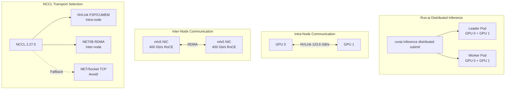

> 💡 **Quick Answer:** Use `runai inference distributed submit` with `--workers`, `-g`, NCCL environment variables, and SR-IOV network annotations to run vLLM with tensor parallelism across multiple GPUs. Set `NCCL_DEBUG=INFO` and `NCCL_DEBUG_SUBSYS=ALL` to verify NVLink/RDMA transport selection.

## The Problem

You need to serve a large language model (100B+ parameters) that doesn't fit on a single GPU. This requires:
- Tensor parallelism across multiple GPUs (intra-node via NVLink, inter-node via RDMA)
- NCCL configuration for optimal transport selection
- SR-IOV network attachment for RDMA-capable NICs
- Offline model serving (air-gapped, no HuggingFace access)
- Verification that NCCL is using NVLink/RDMA and not falling back to TCP

## The Solution

### Run:ai Distributed Inference Submit

```bash
runai inference distributed submit my-model-dist \
  -p my-project \
  -i registry.example.com/ai/vllm-openai:latest \
  --existing-pvc claimname=my-project-data,path=/data \
  --workers 2 \
  -g 2 \
  --serving-port container=8000,authorization-type=authenticatedUsers \
  --environment-variable TRANSFORMERS_OFFLINE=1 \
  --environment-variable HF_HUB_OFFLINE=1 \
  --environment-variable NCCL_DEBUG=INFO \
  --environment-variable NCCL_DEBUG_SUBSYS=ALL \
  --environment-variable NCCL_SOCKET_IFNAME=net1 \
  --extended-resource "openshift.io/mellanoxnics=1" \
  --annotation "k8s.v1.cni.cncf.io/networks=rdma-net" \
  --run-as-uid 2000 \
  --run-as-gid 2000 \
  --run-as-non-root \
  --preemptibility preemptible \
  -- --model /data/input/Models/my-model \
  --served-model-name my-model \
  --tensor-parallel-size 2 \
  --port 8000
```

### CLI Flag Breakdown

| Flag | Purpose |
|------|---------|
| `--workers 2` | Number of worker pods (total pods = 1 leader + N workers) |
| `-g 2` | GPUs per pod |
| `--existing-pvc` | Mount shared storage with model weights |
| `--serving-port` | Expose port 8000 with Run:ai auth |
| `TRANSFORMERS_OFFLINE=1` | Disable HuggingFace API calls (air-gapped) |
| `HF_HUB_OFFLINE=1` | Disable HuggingFace Hub downloads |
| `NCCL_DEBUG=INFO` | Enable NCCL debug logging |
| `NCCL_DEBUG_SUBSYS=ALL` | Log all NCCL subsystems (NET, INIT, COLL) |
| `NCCL_SOCKET_IFNAME=net1` | Use SR-IOV secondary interface for NCCL bootstrap |
| `--extended-resource` | Request SR-IOV VF from device plugin |
| `--annotation` | Attach Multus secondary network |
| `--run-as-uid/gid` | Run non-root (match PVC permissions) |
| `--tensor-parallel-size 2` | Split model across 2 GPUs |

### NCCL Environment Variables

**For intra-node (NVLink):**
```bash
# Minimal — NCCL auto-detects NVLink
--environment-variable NCCL_DEBUG=INFO
--environment-variable NCCL_DEBUG_SUBSYS=ALL
--environment-variable NCCL_SOCKET_IFNAME=net1
```

**For inter-node (RDMA over RoCE):**
```bash
# Force IB transport for inter-node communication
--environment-variable NCCL_NET=IB
--environment-variable NCCL_IB_HCA=mlx5_0:1
--environment-variable NCCL_SOCKET_IFNAME=net1
--environment-variable NCCL_DEBUG=INFO
--environment-variable NCCL_DEBUG_SUBSYS=ALL
```

**Disable RDMA (fallback to TCP — for debugging only):**
```bash
--environment-variable NCCL_IB_DISABLE=1
--environment-variable NCCL_P2P_DISABLE=0
--environment-variable NCCL_SOCKET_IFNAME=eth1
```

### Reading NCCL Debug Logs

After submitting, check logs for transport verification:

```bash
# Get leader pod logs
oc logs -n my-project my-model-dist-0 | grep -E "NCCL INFO (NET/IB|Using network|GPU Direct|NVL|P2P|Channel)"
```

**Key lines to look for:**

```
# ✅ RDMA NIC detected (400 Gb/s RoCE)
NCCL INFO NET/IB: [0] mlx5_0:1/RoCE speed=400000

# ✅ GPU Direct RDMA enabled
NCCL INFO NET/IB : GPU Direct RDMA Enabled for HCA 0 'mlx5_0'

# ✅ DMA-BUF available (zero-copy GPU↔NIC)
NCCL INFO DMA-BUF is available on GPU device 0

# ✅ NVLink detected between GPUs (123.6 GB/s)
NCCL INFO GPU/0-118000 :GPU/0-1b3000 (1/123.6/NVL)

# ✅ Using NVLink for intra-node P2P
NCCL INFO Channel 00/0 : 0[0] -> 1[1] via P2P/CUMEM

# ✅ IB network selected (not Socket/TCP)
NCCL INFO Using network IB
```

**Red flags:**
```
# ❌ Falling back to TCP
NCCL INFO Using network Socket

# ❌ No RDMA NIC found
NCCL INFO NET/IB: No device found

# ❌ GPU Direct RDMA not available
NCCL INFO GPU Direct RDMA Disabled
```

### Understanding the Topology Output

```
NCCL INFO === System : maxBw 123.6 totalBw 123.6 ===
NCCL INFO CPU/0-1 (1/1/3)
NCCL INFO + PCI[48.0] - PCI/0-115000
NCCL INFO               + PCI[48.0] - GPU/0-118000 (0)
NCCL INFO                             + NVL[123.6] - GPU/0-1b3000
NCCL INFO               + PCI[48.0] - NIC/0-119000
NCCL INFO + PCI[48.0] - PCI/0-1b0000
NCCL INFO               + PCI[48.0] - GPU/0-1b3000 (1)
NCCL INFO                             + NVL[123.6] - GPU/0-118000
```

This shows:
- Two GPUs connected via NVLink at 123.6 GB/s
- One NIC (mlx5) on the same PCIe tree
- PCIe bandwidth 48.0 GB/s to each device
- GPU Direct RDMA path: GPU → PCIe → NIC (distance 4, within threshold 5)

### NCCL Communication Patterns

```
# Ring topology (AllReduce, ReduceScatter, AllGather)
NCCL INFO Ring 00 : 0 -> 1 -> 0
NCCL INFO Ring 01 : 0 -> 1 -> 0

# Tree topology (Broadcast, Reduce)
NCCL INFO Tree 0 : -1 -> 0 -> 1/-1/-1
NCCL INFO Tree 2 : 1 -> 0 -> -1/-1/-1

# 8 collective channels, 8 P2P channels
NCCL INFO 8 coll channels, 8 p2p channels, 8 p2p channels per peer
```

For a 2-GPU setup: 4 Ring channels for AllReduce (tensor parallel) + 4 Tree channels for Broadcast/Reduce. The `NVL/PIX` type confirms NVLink for data + PCIe for signaling.

### Algorithm Selection Table

NCCL logs the estimated bandwidth for each algorithm/protocol combination:

```
Algorithm  |    Tree           |    Ring           |  CollNetDirect
Protocol   |  LL  LL128 Simple |  LL  LL128 Simple |  LL  LL128 Simple
AllReduce  | 8.0  16.5  16.4  | 7.8  17.8  15.2  | 0.8   0.8  39.2
AllGather  | 0.0   0.0   0.0  | 7.2  15.9  11.8  | 0.8   0.8  39.2
```

- **Ring + LL128** selected for most AllReduce operations (17.8 GB/s estimated)
- **Simple** protocol for large messages, **LL/LL128** for small messages
- CollNetDirect shows 0 bandwidth (not available — requires Mellanox SHARP)

### Equivalent Kubernetes Manifests

If not using Run:ai CLI, deploy with LeaderWorkerSet:

```yaml
apiVersion: leaderworkerset.x-k8s.io/v1
kind: LeaderWorkerSet
metadata:
  name: vllm-distributed
  namespace: ai-inference
spec:
  replicas: 1
  leaderWorkerTemplate:
    size: 2
    leaderTemplate:
      metadata:
        annotations:
          k8s.v1.cni.cncf.io/networks: rdma-net
      spec:
        containers:
          - name: vllm
            image: registry.example.com/ai/vllm-openai:latest
            command:
              - python3
              - -m
              - vllm.entrypoints.openai.api_server
              - --model
              - /data/input/Models/my-model
              - --served-model-name
              - my-model
              - --tensor-parallel-size
              - "2"
              - --port
              - "8000"
            env:
              - name: TRANSFORMERS_OFFLINE
                value: "1"
              - name: HF_HUB_OFFLINE
                value: "1"
              - name: NCCL_DEBUG
                value: "INFO"
              - name: NCCL_DEBUG_SUBSYS
                value: "ALL"
              - name: NCCL_SOCKET_IFNAME
                value: "net1"
            resources:
              requests:
                nvidia.com/gpu: 2
                openshift.io/mellanoxnics: "1"
              limits:
                nvidia.com/gpu: 2
                openshift.io/mellanoxnics: "1"
            ports:
              - containerPort: 8000
            volumeMounts:
              - name: model-data
                mountPath: /data
              - name: dshm
                mountPath: /dev/shm
            securityContext:
              runAsUser: 2000
              runAsGroup: 2000
              runAsNonRoot: true
        volumes:
          - name: model-data
            persistentVolumeClaim:
              claimName: model-storage
          - name: dshm
            emptyDir:
              medium: Memory
              sizeLimit: 16Gi
```

### Testing the Endpoint

```bash
# Port-forward to the leader pod
kubectl -n ai-inference port-forward pod/vllm-distributed-0 18000:8000

# Test completions endpoint
curl -sS http://127.0.0.1:18000/v1/completions \
  -H "Content-Type: application/json" \
  -d '{
    "model": "my-model",
    "prompt": "Explain Kubernetes in 5 bullet points.",
    "temperature": 0,
    "max_tokens": 200
  }' | jq -r '.choices[0].text'

# Test chat completions endpoint
curl -sS http://127.0.0.1:18000/v1/chat/completions \
  -H "Content-Type: application/json" \
  -d '{
    "model": "my-model",
    "messages": [{"role": "user", "content": "Write a short poem on AI"}]
  }' | jq '.choices[0].message.content'
```

For Run:ai authenticated endpoints, obtain a token first:
```bash
# Get Run:ai API token
TOKEN=$(curl -sS -X POST 'https://runai.example.com/api/v1/token' \
  -H 'Content-Type: application/json' \
  -d '{"grantType":"client_credentials","clientId":"<id>","clientSecret":"<secret>"}' \
  | jq -r '.access_token')

# Call the served model via Run:ai route
curl -sS https://my-model-route.apps.example.com/v1/chat/completions \
  -H "Content-Type: application/json" \
  -H "Authorization: Bearer $TOKEN" \
  -d '{
    "model": "my-model",
    "messages": [{"role": "user", "content": "Hello"}]
  }'
```



## Common Issues

**NCCL falls back to Socket/TCP instead of IB**

Check that SR-IOV VF is attached and NCCL can see the IB device:
```bash
# Inside the pod
ibv_devinfo    # Should show mlx5 devices
ibv_devices    # List available RDMA devices
```
Set `NCCL_NET=IB` and `NCCL_IB_HCA=mlx5_0:1` to force IB transport.

**`libnccl-net.so` not found warning**

This is informational — NCCL falls back to built-in IB plugin:
```
NCCL INFO NET/Plugin: Could not find: libnccl-net.so.
```
The built-in `NET/IB` plugin works fine. The external plugin is only needed for advanced features (SHARP, PXN).

**`dlvsym failed on mlx5dv_get_data_direct_sysfs_path`**

Data Direct (lowest-latency GPU memory mode) requires newer MOFED/libmlx5. NCCL falls back to DMA-BUF, which is nearly as fast. Not a problem unless you need absolute minimum latency.

**vLLM warning: `--model` option will be removed in v0.13**

vLLM 0.18+ prefers positional model argument with `vllm serve`:
```bash
# Old (deprecated)
python -m vllm.entrypoints.openai.api_server --model /path/to/model

# New (recommended)
vllm serve /path/to/model --served-model-name my-model
```

**Symmetric memory multicast operations not supported**

```
SymmMemCommunicator: symmetric memory multicast operations are not supported.
```
Informational — NVLS multicast requires NVSwitch (e.g., DGX H100). Standard NVLink P2P is used instead. No performance impact for 2-GPU setups.

**OMP_NUM_THREADS warning**

```
Reducing Torch parallelism from 96 threads to 1
```
NCCL auto-reduces CPU threads to avoid contention. Set `OMP_NUM_THREADS=1` explicitly to suppress the warning.

## Best Practices

- **Always enable NCCL_DEBUG=INFO for initial deployment** — verify transport, then disable for production (reduces log volume)
- **Use `NCCL_SOCKET_IFNAME=net1`** to ensure NCCL bootstrap uses the SR-IOV interface, not the pod network
- **Set `TRANSFORMERS_OFFLINE=1` and `HF_HUB_OFFLINE=1`** for air-gapped environments — prevents hanging on HuggingFace API calls
- **Run non-root** with `--run-as-uid/gid` matching your PVC permissions
- **Use `--preemptibility preemptible`** for inference workloads that can tolerate interruption
- **Pin vLLM image version** — don't use `latest` in production
- **For inter-node TP**: set `NCCL_NET=IB` + `NCCL_IB_HCA` explicitly — don't rely on auto-detection
- **For intra-node TP**: NCCL auto-selects NVLink — no special config needed
- **Check `P2P/CUMEM` in channel logs** — confirms NVLink direct GPU memory access
- **Monitor `allreduce_rms` fusion** in vLLM compilation config — reduces collective overhead

## Key Takeaways

- `runai inference distributed submit` handles multi-GPU/multi-node vLLM deployment with built-in Run:ai scheduling
- NCCL auto-detects the fastest transport: NVLink for intra-node, IB/RDMA for inter-node
- `NCCL_DEBUG=INFO` + `NCCL_DEBUG_SUBSYS=ALL` is essential for verifying transport selection
- Look for `NET/IB`, `GPU Direct RDMA Enabled`, `P2P/CUMEM`, and `NVL` in logs — these confirm optimal paths
- `NCCL_SOCKET_IFNAME=net1` ensures bootstrap traffic uses the RDMA secondary interface
- DMA-BUF is the default GPU memory mode when Data Direct isn't available — still zero-copy
- 8 Ring + 8 Tree channels for a 2-GPU setup; NCCL selects LL128 protocol for best bandwidth
- `libnccl-net.so` not found is not an error — built-in IB plugin handles standard RDMA
- Air-gapped deployment requires `TRANSFORMERS_OFFLINE=1` + `HF_HUB_OFFLINE=1` + pre-downloaded model weights on PVC
- Equivalent LeaderWorkerSet YAML available for non-Run:ai clusters
