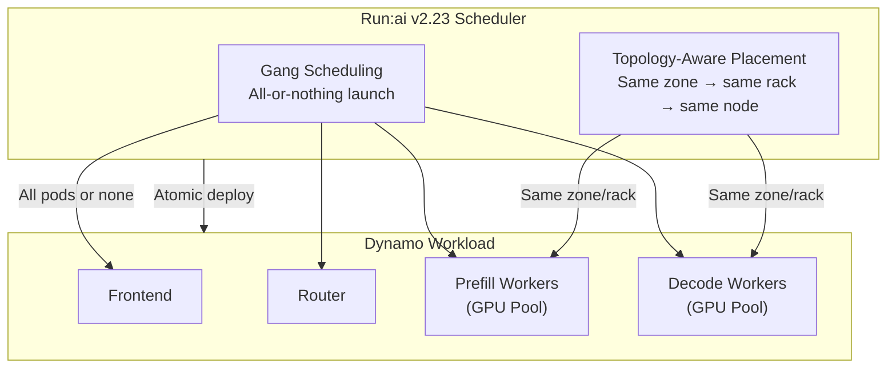

> 💡 **Quick Answer:** NVIDIA Run:ai v2.23 integrates with Dynamo for gang scheduling (all-or-nothing pod launches) and topology-aware placement (co-locate prefill/decode workers in the same zone/rack). Annotate workloads with `kai.scheduler/topology-preferred-placement` and `kai.scheduler/topology` — Run:ai handles the rest automatically.

## The Problem

Dynamo's disaggregated inference creates tightly coupled components — frontends, routers, prefill workers, and decode workers — that must run together. Standard Kubernetes scheduling treats each pod independently, leading to:

- **Partial deployments**: Decode pods running while prefill pods are pending → idle GPUs
- **Poor placement**: Leaders and workers spread across distant racks → high latency, NCCL bottlenecks
- **Resource fragmentation**: Half-deployed workloads consuming resources that could serve complete workloads

You need an orchestration layer that understands multi-component inference workloads and places them together on nodes with the fastest interconnect.



## The Solution

### Prerequisites

- Kubernetes cluster with **Run:ai v2.23+** installed
- A Run:ai project initialized (e.g., `runai-project-a`)
- `kubeconfig` access and Helm installed
- Nodes labeled with topology indicators

### Step 1: Create HuggingFace Token Secret

```bash
kubectl create secret generic hf-token-secret \
  --from-literal=HF_TOKEN='<your-huggingface-token>' \
  -n runai-project-a
```

### Step 2: Label Nodes with Topology

Ensure nodes have standard Kubernetes topology labels:

```bash
# Check existing labels
kubectl get nodes --show-labels | grep topology

# If needed, label nodes manually
kubectl label node gpu-node-01 topology.kubernetes.io/zone=us-west-1a
kubectl label node gpu-node-02 topology.kubernetes.io/zone=us-west-1a
kubectl label node gpu-node-03 topology.kubernetes.io/zone=us-west-1b
kubectl label node gpu-node-04 topology.kubernetes.io/zone=us-west-1b

# Region labels for broader placement
kubectl label node gpu-node-01 topology.kubernetes.io/region=us-west
```

### Step 3: Configure Network Topology in Run:ai

In the Run:ai UI:

1. Open **Cluster Settings**
2. Add topology label keys:
   - `topology.kubernetes.io/zone` (closest)
   - `topology.kubernetes.io/region` (farthest)
3. Create a topology (e.g., `topology-1`) ordering keys from closest → farthest
4. Attach the topology to the relevant **node pool(s)**

> Run:ai applies a "preferred" soft constraint at the closest tier first. If the cluster can't place the entire gang at that level, it relaxes to broader tiers. Combined with gang scheduling, pods land together at the best-available proximity — or wait until they can.

### Step 4: Install Dynamo Platform Components

```bash
# Set environment variables
export DYNAMO_IMAGE=nvcr.io/nvidia/ai-dynamo/vllm-runtime:0.5.1
export NAMESPACE=dynamo-cloud
export RELEASE_VERSION=0.5.1

# Create namespace
kubectl create namespace $NAMESPACE

# Install CRDs
helm fetch https://helm.ngc.nvidia.com/nvidia/ai-dynamo/charts/dynamo-crds-$RELEASE_VERSION.tgz
helm install dynamo-crds dynamo-crds-${RELEASE_VERSION}.tgz \
  --namespace $NAMESPACE

# Install platform components
helm fetch https://helm.ngc.nvidia.com/nvidia/ai-dynamo/charts/dynamo-platform-$RELEASE_VERSION.tgz
helm install dynamo-platform dynamo-platform-${RELEASE_VERSION}.tgz \
  --namespace $NAMESPACE \
  --set dynamo-operator.namespaceRestriction.enabled=false

# Verify
kubectl -n $NAMESPACE get pods
```

### Step 5: Deploy Disaggregated Dynamo Workload

Download the Dynamo disaggregated example YAML and add Run:ai annotations:

```yaml
# disagg.yaml — Dynamo disaggregated inference with Run:ai scheduling
apiVersion: nvidia.com/v1beta1
kind: DynamoGraph
metadata:
  name: vllm-disagg
  namespace: runai-project-a
  annotations:
    # Topology-aware placement: prefer pods in the same zone
    kai.scheduler/topology-preferred-placement: "topology.kubernetes.io/zone"
    kai.scheduler/topology: "topology-1"
    # For strict placement (pods MUST be in the same zone):
    # kai.scheduler/topology-required-placement: "topology.kubernetes.io/zone"
spec:
  model: Qwen/Qwen3-0.6B

  frontend:
    replicas: 1
    port: 8000
    image: nvcr.io/nvidia/ai-dynamo/vllm-runtime:0.5.1

  router:
    type: kv-aware
    replicas: 1

  prefill:
    backend: vllm
    replicas: 1
    resources:
      limits:
        nvidia.com/gpu: 1
    env:
      - name: HF_TOKEN
        valueFrom:
          secretKeyRef:
            name: hf-token-secret
            key: HF_TOKEN

  decode:
    backend: vllm
    replicas: 1
    resources:
      limits:
        nvidia.com/gpu: 1
    env:
      - name: HF_TOKEN
        valueFrom:
          secretKeyRef:
            name: hf-token-secret
            key: HF_TOKEN
```

```bash
kubectl apply -f disagg.yaml
```

### Step 6: Verify Deployment

```bash
# Check pod status — all should start atomically (gang scheduling)
kubectl -n runai-project-a get pods
# NAME                                          READY   STATUS    AGE
# vllm-disagg-frontend-79f459c95-57fm6          1/1     Running   30m
# vllm-disagg-vllmdecodeworker-6c8d64f569-56phf 1/1     Running   30m
# vllm-disagg-vllmprefillworker-755cb88fcf-pflb5 1/1    Running   30m

# Verify topology placement — pods should be in the same zone
kubectl -n runai-project-a get pods -o wide
# Check NODE column — all pods should be on nodes in the same zone
```

### Step 7: Test Inference

```bash
# Port-forward the frontend
kubectl -n runai-project-a port-forward \
  deployment/vllm-disagg-frontend 8000:8000

# Send a request
curl -s localhost:8000/v1/chat/completions \
  -H "Content-Type: application/json" \
  -d '{
    "model": "Qwen/Qwen3-0.6B",
    "messages": [{"role": "user", "content": "What is Kubernetes?"}],
    "max_tokens": 100
  }' | jq .
```

### Large-Scale Production Example

For a production Llama 70B deployment across multiple nodes:

```yaml
apiVersion: nvidia.com/v1beta1
kind: DynamoGraph
metadata:
  name: llama-70b-prod
  namespace: runai-project-a
  annotations:
    kai.scheduler/topology-preferred-placement: "topology.kubernetes.io/zone"
    kai.scheduler/topology: "topology-1"
spec:
  model: meta-llama/Llama-3.1-70B-Instruct

  frontend:
    replicas: 2
    port: 8000

  router:
    type: kv-aware
    replicas: 2

  prefill:
    backend: vllm
    replicas: 4
    tensorParallelSize: 4
    resources:
      limits:
        nvidia.com/gpu: 4
    env:
      - name: HF_TOKEN
        valueFrom:
          secretKeyRef:
            name: hf-token-secret
            key: HF_TOKEN

  decode:
    backend: vllm
    replicas: 8
    tensorParallelSize: 1
    resources:
      limits:
        nvidia.com/gpu: 1
    env:
      - name: HF_TOKEN
        valueFrom:
          secretKeyRef:
            name: hf-token-secret
            key: HF_TOKEN
```

With Run:ai gang scheduling, all 16 pods (2 frontend + 2 router + 4 prefill + 8 decode) either start together or wait. No more idle GPUs from partial deployments.

### Scheduling Annotations Reference

| Annotation | Value | Effect |
|-----------|-------|--------|
| `kai.scheduler/topology-preferred-placement` | Label key (e.g., `topology.kubernetes.io/zone`) | Soft constraint: try to place in same zone, relax if needed |
| `kai.scheduler/topology-required-placement` | Label key | Hard constraint: pods MUST be in same zone, or wait |
| `kai.scheduler/topology` | Topology name (e.g., `topology-1`) | Which topology definition to use |

### How Gang Scheduling Works

```
Without gang scheduling:
  t=0:  Prefill pod 1 starts → 1 GPU idle
  t=5:  Prefill pod 2 starts → 2 GPUs idle
  t=30: Decode pod 1 starts  → still waiting for frontend
  t=60: Frontend starts       → NOW serving (60s wasted)

With Run:ai gang scheduling:
  t=0:  All resources available? No → WAIT
  t=45: All resources available? Yes → ALL pods start atomically
  Result: 0 idle GPUs, 0 partial deployments
```

### How Topology-Aware Placement Works

```
Cluster topology:
  Zone A (rack 1): node-01, node-02 (NVLink between GPUs)
  Zone A (rack 2): node-03, node-04
  Zone B (rack 1): node-05, node-06

Preferred placement: topology.kubernetes.io/zone

Run:ai scheduler:
  1. Try Zone A, rack 1: Can fit all pods? Yes → Place here ✅
     Prefill + Decode on node-01 and node-02 (fastest NVLink/IB)
  2. Fallback: Zone A (any rack) if rack 1 too small
  3. Fallback: Any zone if Zone A is full
```

## Common Issues

| Issue | Cause | Fix |
|-------|-------|-----|
| All pods stuck in Pending | Gang scheduling waiting for full resource availability | Check `kubectl describe pod` — need enough GPUs for ALL components simultaneously |
| Pods in different zones | Using `preferred` placement, not `required` | Switch to `kai.scheduler/topology-required-placement` for strict co-location |
| Topology not applied | Topology not attached to node pool | In Run:ai UI, attach the topology to the correct node pool |
| Node labels missing | Nodes not labeled with topology keys | Label nodes: `kubectl label node <node> topology.kubernetes.io/zone=<zone>` |
| Dynamo operator not found | CRDs not installed | Install `dynamo-crds` Helm chart first |
| Partial deployment (old behavior) | Run:ai version < 2.23 | Upgrade to Run:ai v2.23+ for Dynamo integration |

## Best Practices

- **Use `preferred` placement by default** — strict `required` placement may cause unnecessary waiting
- **Label nodes consistently** — use standard `topology.kubernetes.io/zone` and `topology.kubernetes.io/region` labels
- **Match topology to physical layout** — zones should represent racks or switch domains with fastest interconnect
- **Size GPU pools for complete workloads** — gang scheduling needs enough resources for all components at once
- **Monitor with Run:ai dashboard** — track GPU utilization, queue times, and topology placement decisions
- **Start with small models** — validate gang scheduling + topology with Qwen 0.6B before scaling to 70B+

## Key Takeaways

- Run:ai v2.23 integrates with Dynamo for gang scheduling (atomic all-or-nothing pod launches) and topology-aware placement (zone/rack co-location)
- Gang scheduling eliminates partial deployments and idle GPUs from incomplete workloads
- Topology-aware placement minimizes cross-node latency by co-locating prefill and decode workers
- Two annotations control everything: `topology-preferred-placement` and `topology` name
- Combined with Dynamo's disaggregated serving and KV-aware routing, this delivers predictable, low-latency multi-node inference at scale
