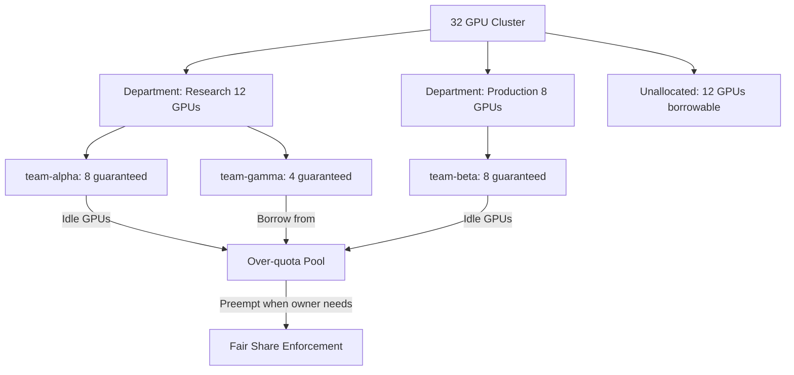

> 💡 **Quick Answer:** Run:AI (now KAI Scheduler) extends Kubernetes scheduling with GPU-aware quotas: each tenant gets a guaranteed GPU allocation, can borrow idle GPUs from other tenants (over-quota), and is preempted back to guaranteed when the owning tenant needs them.

## The Problem

Kubernetes ResourceQuota is binary — you either have quota or you don't. If tenant-alpha has 8 GPUs allocated but only uses 4, those 4 GPUs sit idle. No one else can use them. In a 32-GPU cluster, this means 30-50% GPU utilization is common. You need quotas that guarantee minimums but allow borrowing of idle capacity.

## The Solution

### Run:AI Project (Tenant) Configuration

```yaml
# Run:AI uses "Projects" as GPU tenants
apiVersion: run.ai/v1
kind: Project
metadata:
  name: team-alpha
spec:
  department: research
  # Guaranteed GPUs — always available to this tenant
  deservedGpus: 8
  # Maximum GPUs when borrowing idle capacity
  maxAllowedGpus: 16
  # Node affinity (optional)
  nodeAffinityType: Train
  interactiveJobTimeLimitSecs: 43200  # 12h max for notebooks
  trainJobTimeLimitSecs: 604800       # 7 days max for training
---
apiVersion: run.ai/v1
kind: Project
metadata:
  name: team-beta
spec:
  department: production
  deservedGpus: 8
  maxAllowedGpus: 12
  interactiveJobTimeLimitSecs: 28800  # 8h
---
apiVersion: run.ai/v1
kind: Project
metadata:
  name: team-gamma
spec:
  department: research
  deservedGpus: 4
  maxAllowedGpus: 32   # Can borrow all idle GPUs
```

### Department-Level Quotas

```yaml
apiVersion: run.ai/v1
kind: Department
metadata:
  name: research
spec:
  deservedGpus: 12     # Shared between alpha (8) + gamma (4)
  maxAllowedGpus: 24
---
apiVersion: run.ai/v1
kind: Department
metadata:
  name: production
spec:
  deservedGpus: 8
  maxAllowedGpus: 16
```

### Submit Jobs with Run:AI CLI

```bash
# Training job — uses guaranteed quota
runai submit training-job \
  --project team-alpha \
  --gpu 4 \
  --image nvcr.io/nvidia/pytorch:24.03-py3 \
  --command "python train.py" \
  --pvc model-data:/data \
  --node-type gpu-worker

# Interactive notebook — lower priority, time-limited
runai submit-jupyter notebook-1 \
  --project team-alpha \
  --gpu 1 \
  --image jupyter/pytorch-notebook:latest

# Over-quota job — borrows idle GPUs, may be preempted
runai submit batch-job \
  --project team-gamma \
  --gpu 8 \
  --image nvcr.io/nvidia/pytorch:24.03-py3 \
  --command "python batch_process.py" \
  --preemptible   # Can be preempted when GPUs needed by owners

# Check allocation
runai list jobs --project team-alpha
runai describe project team-alpha
```

### Fairness and Preemption Flow

```yaml
# Scenario: 20 GPU cluster
# team-alpha: deserved=8, using=12 (4 over-quota)
# team-beta:  deserved=8, using=4 (4 idle)
# team-gamma: deserved=4, using=4

# team-beta submits 8-GPU job:
# 1. Scheduler sees team-beta is under-quota (using 4, deserved 8)
# 2. team-alpha is over-quota (using 12, deserved 8)
# 3. Preempt team-alpha's over-quota jobs to free 4 GPUs
# 4. team-beta job scheduled (now using 8 = deserved)
# 5. team-alpha drops to 8 GPUs (= deserved, no more over-quota)

# Result: Fair — every team gets at least their guaranteed allocation
```

### KAI Scheduler (Open Source Successor)

```yaml
# KAI Scheduler is the open-source GPU scheduler from Run:AI
# Install via Helm
helm repo add kai https://github.com/NVIDIA/KAI-Scheduler
helm install kai-scheduler kai/kai-scheduler \
  --namespace kai-scheduler --create-namespace \
  --set defaultSchedulerName=kai-scheduler

# Use in pod spec:
apiVersion: v1
kind: Pod
spec:
  schedulerName: kai-scheduler
  containers:
    - name: training
      resources:
        limits:
          nvidia.com/gpu: 4
```



## Common Issues

- **Over-quota job never scheduled** — no idle GPUs available; wait for other tenants to release or increase cluster capacity
- **Job preempted unexpectedly** — over-quota jobs are preemptible by design; use checkpointing to resume after preemption
- **Interactive job killed at time limit** — `interactiveJobTimeLimitSecs` enforces maximum session duration; save work before timeout
- **Run:AI scheduler conflicts with default** — ensure GPU pods use `schedulerName: runai-scheduler`; don't mix schedulers for GPU workloads

## Best Practices

- Set `deservedGpus` based on team SLAs — this is the guaranteed minimum
- Set `maxAllowedGpus` higher than deserved to allow borrowing idle capacity
- Use departments to group teams and enforce hierarchical quotas
- Always checkpoint training jobs — over-quota jobs will be preempted
- Time-limit interactive sessions to prevent GPU hoarding by idle notebooks
- Monitor over-quota usage — if teams consistently need more, adjust deserved allocations

## Key Takeaways

- Run:AI/KAI Scheduler provides guaranteed GPU quotas with idle capacity borrowing
- `deservedGpus` = guaranteed minimum; `maxAllowedGpus` = ceiling with borrowing
- Over-quota jobs are preemptible — fairness enforced automatically
- Departments provide hierarchical quota management for multiple teams
- KAI Scheduler is the open-source successor to Run:AI's scheduler
- Typical result: GPU utilization jumps from 30-50% to 70-90% with fair sharing
