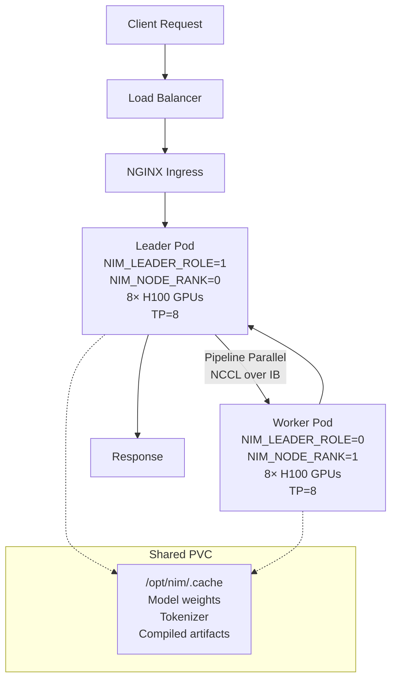

> 💡 **Quick Answer:** Deploy DeepSeek-R1 671B across 2 nodes (16× H100 GPUs) using NVIDIA Run:ai distributed inference API. Uses LeaderWorkerSet with SGLang runtime, TP=8 per node, PP=2 across nodes, and PVC-cached model weights for fast restarts.

## The Problem

DeepSeek-R1 is a 671B parameter Mixture-of-Experts model that requires more GPU memory than a single node provides. You need to split inference across multiple nodes using tensor parallelism (within each node) and pipeline parallelism (across nodes), while managing NGC credentials, model caching, and OpenShift security contexts. The NVIDIA Run:ai platform orchestrates this via its distributed inference API.



## The Solution

### Prerequisites

Before starting, ensure:

1. **Run:ai project** created by your administrator
2. **LeaderWorkerSet (LWS)** installed on the cluster
3. **External access** configured (endpoints ending in `.svc.cluster.local` are cluster-internal only)
4. **NGC account** with an active API key from <https://catalog.ngc.nvidia.com/> → Setup → API Keys
5. **GPU nodes** with H100 80GB GPUs (2 nodes × 8 GPUs = 16 total)

### Step 1: Create a Run:ai Access Key

Access keys provide client credentials for API authentication:

1. In Run:ai UI → click user avatar → **Settings**
2. Click **+ACCESS KEY**
3. Enter a name → **CREATE**
4. Copy the **Client ID** and **Client Secret** (store securely)

Request an API token:

```bash
# Obtain API token from Run:ai
curl -X POST 'https://runai.cluster.example.com/api/v1/token' \
  -H 'Accept: */*' \
  -H 'Content-Type: application/json' \
  -d '{
    "grantType": "client_credentials",
    "clientId": "<CLIENT_ID>",
    "clientSecret": "<CLIENT_SECRET>"
  }'

# Export the token for subsequent calls
export TOKEN="<token-from-response>"
```

### Step 2: Store NGC API Key as User Credential

In the Run:ai UI (not available via API):

1. Click user avatar → **Settings**
2. Click **+CREDENTIAL** → select **NGC API key**
3. Enter a unique name (e.g., `ngc-credentials`)
4. Paste your NGC API key → **CREATE CREDENTIAL**

### Step 3: Create PVC for Model Cache

The PVC caches downloaded model weights, tokenizer files, and compiled artifacts so subsequent runs start faster:

**Via UI:**

1. Go to **Workload manager → Data sources**
2. Click **+NEW DATA SOURCE** → **PVC**
3. Configure:
   - **Access mode:** Read-write by many nodes
   - **Claim size:** 2 TB
   - **Volume mode:** Filesystem
   - **Container path:** `/opt/nim/.cache`
4. Click **CREATE DATA SOURCE**

**Via API:**

```bash
curl -L 'https://runai.cluster.example.com/api/v1/asset/datasource/pvc' \
  -H 'Content-Type: application/json' \
  -H "Authorization: Bearer $TOKEN" \
  -d '{
    "meta": {
      "name": "nim-model-cache",
      "scope": "project"
    },
    "spec": {
      "path": "/opt/nim/.cache",
      "existingPvc": false,
      "claimInfo": {
        "size": "2TB",
        "storageClass": "cephfs-rwx",
        "accessModes": {
          "readWriteMany": true
        },
        "volumeMode": "Filesystem"
      }
    }
  }'
```

> ⚠️ The first launch with a new PVC takes longer — storage is provisioned on first claim.

### Step 4: Deploy Distributed Inference Workload

This is the core step. The configuration splits DeepSeek-R1 across 2 nodes using:
- **Tensor Parallelism (TP=8):** Each node's 8 GPUs share layer computation
- **Pipeline Parallelism (PP=2):** Model split into 2 sequential stages across nodes
- **SGLang runtime:** Accelerated inference engine required for DeepSeek-R1

**Via API:**

```bash
curl -L 'https://runai.cluster.example.com/api/v1/workloads/distributed-inferences' \
  -H 'Content-Type: application/json' \
  -H "Authorization: Bearer $TOKEN" \
  -d '{
    "name": "deepseek-r1-distributed",
    "projectId": "<PROJECT-ID>",
    "clusterId": "<CLUSTER-UUID>",
    "spec": {
      "workers": 1,
      "servingPort": {
        "port": 8000,
        "authorizationType": "authenticatedUsers"
      },
      "leader": {
        "image": "nvcr.io/nim/deepseek-ai/deepseek-r1:1.7.3",
        "environmentVariables": [
          {
            "name": "NGC_API_KEY",
            "userCredential": {
              "name": "ngc-credentials",
              "key": "NGC_API_KEY"
            }
          },
          { "name": "NIM_LEADER_ROLE", "value": "1" },
          { "name": "OMPI_MCA_orte_keep_fqdn_hostnames", "value": "1" },
          { "name": "OMPI_MCA_plm_rsh_args", "value": "-o ConnectionAttempts=20" },
          { "name": "NIM_USE_SGLANG", "value": "1" },
          { "name": "NIM_MULTI_NODE", "value": "1" },
          { "name": "NIM_TENSOR_PARALLEL_SIZE", "value": "8" },
          { "name": "NIM_PIPELINE_PARALLEL_SIZE", "value": "2" },
          { "name": "NIM_TRUST_CUSTOM_CODE", "value": "1" },
          { "name": "NIM_MODEL_PROFILE", "value": "sglang-h100-bf16-tp8-pp2" },
          {
            "name": "NIM_NODE_RANK",
            "podFieldRef": {
              "path": "metadata.labels['"'"'leaderworkerset.sigs.k8s.io/worker-index'"'"']"
            }
          },
          { "name": "NIM_NUM_COMPUTE_NODES", "value": "2" }
        ],
        "imagePullSecrets": [
          { "name": "ngc-credentials", "userCredential": true }
        ],
        "storage": {
          "pvc": [{
            "path": "/opt/nim/.cache",
            "existingPvc": true,
            "claimName": "<pvc-claim-name>"
          }]
        },
        "compute": { "gpuDevicesRequest": 8 },
        "security": {
          "runAsUid": 1000,
          "runAsGid": 1000,
          "runAsNonRoot": true
        }
      },
      "worker": {
        "image": "nvcr.io/nim/deepseek-ai/deepseek-r1:1.7.3",
        "environmentVariables": [
          {
            "name": "NGC_API_KEY",
            "userCredential": {
              "name": "ngc-credentials",
              "key": "NGC_API_KEY"
            }
          },
          { "name": "NIM_LEADER_ROLE", "value": "0" },
          { "name": "NIM_USE_SGLANG", "value": "1" },
          { "name": "NIM_MULTI_NODE", "value": "1" },
          { "name": "NIM_TENSOR_PARALLEL_SIZE", "value": "8" },
          { "name": "NIM_PIPELINE_PARALLEL_SIZE", "value": "2" },
          { "name": "NIM_TRUST_CUSTOM_CODE", "value": "1" },
          { "name": "NIM_MODEL_PROFILE", "value": "sglang-h100-bf16-tp8-pp2" },
          {
            "name": "NIM_NODE_RANK",
            "podFieldRef": {
              "path": "metadata.labels['"'"'leaderworkerset.sigs.k8s.io/worker-index'"'"']"
            }
          },
          { "name": "NIM_NUM_COMPUTE_NODES", "value": "2" }
        ],
        "imagePullSecrets": [
          { "name": "ngc-credentials", "userCredential": true }
        ],
        "storage": {
          "pvc": [{
            "path": "/opt/nim/.cache",
            "existingPvc": true,
            "claimName": "<pvc-claim-name>"
          }]
        },
        "compute": { "gpuDevicesRequest": 8 },
        "security": {
          "runAsUid": 1000,
          "runAsGid": 1000,
          "runAsNonRoot": true
        }
      }
    }
  }'
```

**Via CLI v2:**

```bash
runai inference distributed submit deepseek-r1-dist \
  -p <project-id> \
  -i nvcr.io/nim/deepseek-ai/deepseek-r1:1.7.3 \
  --workers 1 \
  --serving-port "container=8000,authorization-type=authenticatedUsers" \
  -g 8 \
  --existing-pvc claimname=<pvc-claim-name>,path=/opt/nim/.cache \
  --env-secret NGC_API_KEY=ngc-credentials,key=NGC_API_KEY \
  --environment NIM_NUM_COMPUTE_NODES=2 \
  --environment NIM_LEADER_ROLE=1 \
  --environment OMPI_MCA_orte_keep_fqdn_hostnames=1 \
  --environment "OMPI_MCA_plm_rsh_args=-o ConnectionAttempts=20" \
  --environment NIM_USE_SGLANG=1 \
  --environment NIM_MULTI_NODE=1 \
  --environment NIM_TENSOR_PARALLEL_SIZE=8 \
  --environment NIM_PIPELINE_PARALLEL_SIZE=2 \
  --environment NIM_TRUST_CUSTOM_CODE=1 \
  --environment NIM_MODEL_PROFILE=sglang-h100-bf16-tp8-pp2 \
  --env-pod-field-ref "NIM_NODE_RANK=metadata.labels['leaderworkerset.sigs.k8s.io/worker-index']"
```

### Understanding the NIM Environment Variables

| Variable | Leader | Worker | Purpose |
|----------|--------|--------|---------|
| `NIM_LEADER_ROLE` | `1` | `0` | Designates which pod runs the API server |
| `NIM_NODE_RANK` | auto (0) | auto (1..N) | Injected from LWS worker-index label |
| `NIM_MULTI_NODE` | `1` | `1` | Enables multinode mode on both pods |
| `NIM_TENSOR_PARALLEL_SIZE` | `8` | `8` | Splits layers across 8 GPUs per node |
| `NIM_PIPELINE_PARALLEL_SIZE` | `2` | `2` | Splits model into 2 pipeline stages across nodes |
| `NIM_NUM_COMPUTE_NODES` | `2` | `2` | Total nodes (must match LWS size) |
| `NIM_MODEL_PROFILE` | `sglang-h100-bf16-tp8-pp2` | same | Optimized profile for H100 + TP8 + PP2 |
| `NIM_USE_SGLANG` | `1` | `1` | SGLang runtime (required for DeepSeek-R1) |
| `NIM_TRUST_CUSTOM_CODE` | `1` | `1` | Load custom kernels from NIM image |
| `OMPI_MCA_orte_keep_fqdn_hostnames` | `1` | — | OpenMPI: keep full hostnames for DNS |
| `OMPI_MCA_plm_rsh_args` | `-o ConnectionAttempts=20` | — | OpenMPI: retry SSH connections |

### Step 5: Test the Inference Endpoint

```bash
# Get the inference URL from Run:ai
runai inference list -p <project-id>
# or via API:
curl -s 'https://runai.cluster.example.com/api/v1/workloads/distributed-inferences' \
  -H "Authorization: Bearer $TOKEN" | jq '.[].status.endpoints'

# Send a test request (authenticated)
curl -s 'https://deepseek-r1-dist.inference.example.com/v1/chat/completions' \
  -H 'Content-Type: application/json' \
  -H "Authorization: Bearer $TOKEN" \
  -d '{
    "model": "deepseek-ai/deepseek-r1",
    "messages": [
      {"role": "user", "content": "Explain tensor parallelism in 3 sentences."}
    ],
    "max_tokens": 256,
    "temperature": 0.7
  }' | jq .choices[0].message.content
```

### Equivalent Kubernetes Manifests (Without Run:ai)

For clusters without Run:ai, here's the equivalent LeaderWorkerSet:

```yaml
apiVersion: leaderworkerset.x-k8s.io/v1
kind: LeaderWorkerSet
metadata:
  name: deepseek-r1
  namespace: ai-inference
spec:
  replicas: 1
  leaderWorkerTemplate:
    size: 2
    restartPolicy: RecreateGroupOnPodRestart
    leaderTemplate:
      spec:
        containers:
          - name: nim
            image: nvcr.io/nim/deepseek-ai/deepseek-r1:1.7.3
            env:
              - name: NGC_API_KEY
                valueFrom:
                  secretKeyRef:
                    name: ngc-secret
                    key: api-key
              - name: NIM_LEADER_ROLE
                value: "1"
              - name: NIM_USE_SGLANG
                value: "1"
              - name: NIM_MULTI_NODE
                value: "1"
              - name: NIM_TENSOR_PARALLEL_SIZE
                value: "8"
              - name: NIM_PIPELINE_PARALLEL_SIZE
                value: "2"
              - name: NIM_TRUST_CUSTOM_CODE
                value: "1"
              - name: NIM_MODEL_PROFILE
                value: "sglang-h100-bf16-tp8-pp2"
              - name: NIM_NODE_RANK
                valueFrom:
                  fieldRef:
                    fieldPath: metadata.labels['leaderworkerset.sigs.k8s.io/worker-index']
              - name: NIM_NUM_COMPUTE_NODES
                value: "2"
              - name: OMPI_MCA_orte_keep_fqdn_hostnames
                value: "1"
              - name: OMPI_MCA_plm_rsh_args
                value: "-o ConnectionAttempts=20"
            ports:
              - containerPort: 8000
            resources:
              limits:
                nvidia.com/gpu: "8"
              requests:
                cpu: "32"
                memory: "256Gi"
            volumeMounts:
              - name: cache
                mountPath: /opt/nim/.cache
              - name: shm
                mountPath: /dev/shm
            securityContext:
              runAsUser: 1000
              runAsGroup: 1000
              runAsNonRoot: true
        volumes:
          - name: cache
            persistentVolumeClaim:
              claimName: nim-model-cache
          - name: shm
            emptyDir:
              medium: Memory
              sizeLimit: 64Gi
        nodeSelector:
          nvidia.com/gpu.product: NVIDIA-H100-80GB-HBM3
    workerTemplate:
      spec:
        containers:
          - name: nim
            image: nvcr.io/nim/deepseek-ai/deepseek-r1:1.7.3
            env:
              - name: NGC_API_KEY
                valueFrom:
                  secretKeyRef:
                    name: ngc-secret
                    key: api-key
              - name: NIM_LEADER_ROLE
                value: "0"
              - name: NIM_USE_SGLANG
                value: "1"
              - name: NIM_MULTI_NODE
                value: "1"
              - name: NIM_TENSOR_PARALLEL_SIZE
                value: "8"
              - name: NIM_PIPELINE_PARALLEL_SIZE
                value: "2"
              - name: NIM_TRUST_CUSTOM_CODE
                value: "1"
              - name: NIM_MODEL_PROFILE
                value: "sglang-h100-bf16-tp8-pp2"
              - name: NIM_NODE_RANK
                valueFrom:
                  fieldRef:
                    fieldPath: metadata.labels['leaderworkerset.sigs.k8s.io/worker-index']
              - name: NIM_NUM_COMPUTE_NODES
                value: "2"
            resources:
              limits:
                nvidia.com/gpu: "8"
              requests:
                cpu: "32"
                memory: "256Gi"
            volumeMounts:
              - name: cache
                mountPath: /opt/nim/.cache
              - name: shm
                mountPath: /dev/shm
            securityContext:
              runAsUser: 1000
              runAsGroup: 1000
              runAsNonRoot: true
        volumes:
          - name: cache
            persistentVolumeClaim:
              claimName: nim-model-cache
          - name: shm
            emptyDir:
              medium: Memory
              sizeLimit: 64Gi
        nodeSelector:
          nvidia.com/gpu.product: NVIDIA-H100-80GB-HBM3
```

### Parallelism Strategies Explained

```
┌─────────────────────────────────────────────────────┐
│              DeepSeek-R1 (671B MoE)                 │
│                                                     │
│  Tensor Parallelism (TP=8) — within each node:      │
│  ┌─────┬─────┬─────┬─────┬─────┬─────┬─────┬─────┐ │
│  │GPU 0│GPU 1│GPU 2│GPU 3│GPU 4│GPU 5│GPU 6│GPU 7│ │
│  │ ←── Each GPU holds 1/8 of each layer ──→       │ │
│  └─────┴─────┴─────┴─────┴─────┴─────┴─────┴─────┘ │
│                                                     │
│  Pipeline Parallelism (PP=2) — across nodes:        │
│  Node 0 (Leader): Layers 0-N/2  → forward pass →   │
│  Node 1 (Worker): Layers N/2-N  → forward pass →   │
│  ← backward aggregation ←                          │
│                                                     │
│  Total: 16 GPUs, TP=8 × PP=2                       │
└─────────────────────────────────────────────────────┘
```

**Tensor Parallelism (TP=8):** Splits each transformer layer horizontally across 8 GPUs on one node. All 8 GPUs process the same layer simultaneously, communicating via NVLink (900 GB/s). Low latency, high bandwidth — ideal for intra-node.

**Pipeline Parallelism (PP=2):** Splits the model vertically — first half of layers on node 0, second half on node 1. Data flows sequentially between nodes over InfiniBand. Higher latency than TP, but enables scaling beyond single-node memory.

**SGLang Runtime:** DeepSeek-R1 requires SGLang (not vLLM or TensorRT-LLM) for its MoE routing and custom attention patterns. The `NIM_MODEL_PROFILE=sglang-h100-bf16-tp8-pp2` selects the pre-optimized configuration.

## Common Issues

| Issue | Cause | Fix |
|-------|-------|-----|
| `permission denied` on `/opt/nim/.cache` | OpenShift SCC blocks root | Add `runAsUid: 1000`, `runAsGid: 1000`, `runAsNonRoot: true` |
| Worker can't connect to leader | DNS not resolving LWS headless service | Check `OMPI_MCA_orte_keep_fqdn_hostnames=1` and `ConnectionAttempts=20` |
| `NIM_MULTI_NODE` not set | Forgotten on worker pod | Must be `1` on **both** leader and worker |
| Model download takes 30+ minutes | First run with empty PVC | Expected — subsequent runs use cached weights |
| `unsupported value '' for GrantType` | Trailing spaces after `\` in curl | Ensure backslash is last char on line (no trailing spaces) |
| Token endpoint returns 400 | Wrong field case | Use `grantType` (camelCase) per Run:ai API |
| NCCL timeout | No InfiniBand/RDMA between nodes | Verify `ibstat`, check GPUDirect RDMA is enabled |
| SGLang compilation errors | Wrong model profile | Verify `NIM_MODEL_PROFILE` matches your GPU type (H100/A100) |
| PVC not provisioning | StorageClass missing or wrong access mode | Ensure RWX-capable StorageClass exists |

## Best Practices

- **Pin NIM image versions** — use `1.7.3` not `latest` for reproducible deployments
- **Pre-cache model weights** — run a warm-up job first to populate the PVC before serving production traffic
- **Use `authenticatedUsers`** — never expose large model inference endpoints publicly without auth
- **Size PVC generously** — DeepSeek-R1 needs ~300GB for weights plus compiled artifacts; 2TB allows room for multiple models
- **OpenShift security context** — always set UID/GID 1000 and `runAsNonRoot` to avoid permission errors on cache mounts
- **Monitor with Run:ai metrics** — track GPU utilization, TTFT, and KV-cache across both leader and worker
- **Use topology-aware scheduling** — Run:ai's scheduler can place leader/worker on same rack for lower latency
- **Test NCCL separately** — run `nccl-tests allreduce` between nodes before deploying NIM

## Key Takeaways

- Run:ai distributed inference deploys NIM across multiple nodes via LeaderWorkerSet (LWS)
- DeepSeek-R1 uses TP=8 (per node) × PP=2 (across nodes) = 16 GPUs total with SGLang runtime
- The leader pod handles the API server and auth; workers handle compute and connect via `LWS_LEADER_ADDRESS`
- `NIM_NODE_RANK` is auto-injected from the LWS worker-index label — no manual rank assignment needed
- PVC caching at `/opt/nim/.cache` dramatically speeds up subsequent deployments
- OpenShift requires explicit `runAsUid/runAsGid: 1000` and `runAsNonRoot: true` for cache directory permissions
