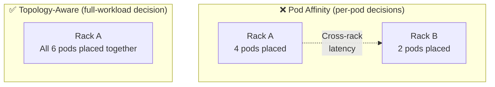

> 💡 **Quick Answer:** Run:ai topology-aware scheduling uses Kubernetes node labels to represent your cluster's physical network hierarchy (region → zone → block → rack → hostname). The scheduler evaluates the full workload as a unit and places all pods at the closest available topology level — eliminating cross-rack fragmentation that pod affinity causes.

## The Problem

Distributed AI workloads (training and inference) involve tightly coupled pods that communicate constantly via NCCL, RDMA, or NVLink. Standard Kubernetes scheduling (including pod affinity) places pods one by one, checking "closeness" to already-placed pods without seeing the full picture. This leads to:

- **Workload fragmentation**: Pods split across racks, introducing unnecessary cross-rack latency
- **Bandwidth bottlenecks**: Cross-switch communication at 25-100 Gb/s instead of NVLink at 900 GB/s
- **Wasted GPU hours**: Training jobs take 2-3× longer due to communication overhead



## The Solution

### How Topology-Aware Scheduling Works

Run:ai evaluates the **entire workload** against available nodes before placing any pod. It uses the configured topology hierarchy to find the tightest grouping possible:

```
Topology hierarchy (farthest → closest):
  region → zone → block → rack → hostname

Workload needs 6 nodes:
  1. Can all 6 fit in one rack? Yes → Place in rack ✅
  2. If not: Can all 6 fit in one block? Try that
  3. If not: Can all 6 fit in one zone? Try that
  4. Last resort: Spread across zones
```

### Step 1: Label Your Nodes

Topology labels are standard Kubernetes node labels. Apply them to reflect physical network layout:

```bash
# Cloud environments often have these automatically
# On-prem: label manually or use NVIDIA Topograph

# Example: 2 racks, 4 nodes each
kubectl label node gpu-node-01 \
  topology.kubernetes.io/region=us-west \
  topology.kubernetes.io/zone=us-west-1a \
  cluster.local/rack=rack-01

kubectl label node gpu-node-02 \
  topology.kubernetes.io/region=us-west \
  topology.kubernetes.io/zone=us-west-1a \
  cluster.local/rack=rack-01

kubectl label node gpu-node-03 \
  topology.kubernetes.io/region=us-west \
  topology.kubernetes.io/zone=us-west-1a \
  cluster.local/rack=rack-02

kubectl label node gpu-node-04 \
  topology.kubernetes.io/region=us-west \
  topology.kubernetes.io/zone=us-west-1a \
  cluster.local/rack=rack-02

# Verify labels
kubectl get nodes -L topology.kubernetes.io/zone,cluster.local/rack
```

> **Tip:** For on-prem clusters, [NVIDIA Topograph](https://github.com/NVIDIA/topograph) can auto-discover topology from NVIDIA NetQ and apply labels automatically.

### Step 2: Create a Network Topology in Run:ai

Define the hierarchy via Run:ai API or UI. **Order matters** — first label is farthest, last is closest:

```json
{
  "levels": [
    "topology.kubernetes.io/region",
    "topology.kubernetes.io/zone",
    "cluster.local/rack",
    "kubernetes.io/hostname"
  ],
  "name": "datacenter-topology",
  "clusterId": "<CLUSTER_ID>"
}
```

Via the Run:ai UI:
1. Go to **Cluster Settings** → **Network Topologies**
2. Add label keys in order: region (farthest) → hostname (closest)
3. Name the topology (e.g., `datacenter-topology`)

### Step 3: Attach Topology to Node Pools

| Scenario | Action |
|----------|--------|
| Single node pool (default) | Attach topology to default pool |
| Multiple pools, same topology | Attach same topology to all pools |
| Multiple pools, different topologies | Attach matching topology to each pool |

> ⚠️ Submitting a workload to multiple node pools with different topologies is **not supported**.

### Step 4: Deploy Workloads

#### Automatic (Distributed Workloads via Run:ai)

For distributed workloads submitted through Run:ai UI, API, or CLI — topology-aware scheduling is **automatic**. No annotations needed. Run:ai applies `Preferred` at the lowest topology level.

#### Manual (kubectl YAML)

When submitting via `kubectl`, add annotations:

```yaml
apiVersion: batch/v1
kind: Job
metadata:
  name: distributed-training
  annotations:
    kai.scheduler/topology: "datacenter-topology"
    kai.scheduler/topology-preferred-placement: "cluster.local/rack"
  labels:
    runai/queue: team-a
spec:
  parallelism: 8
  completions: 8
  template:
    spec:
      containers:
        - name: trainer
          image: nvcr.io/nvidia/pytorch:24.04-py3
          resources:
            limits:
              nvidia.com/gpu: 8
      restartPolicy: Never
```

### Annotation Reference

| Annotation | Type | Effect |
|-----------|------|--------|
| `kai.scheduler/topology` | Required | Topology name (must match a defined topology) |
| `kai.scheduler/topology-preferred-placement` | Soft | Try to place all pods at this level; relax upward if impossible |
| `kai.scheduler/topology-required-placement` | Hard | All pods MUST be at this level; pend if impossible |

### Combining Required + Preferred

You can use both — but the hierarchy matters:

```yaml
annotations:
  kai.scheduler/topology: "datacenter-topology"
  kai.scheduler/topology-required-placement: "topology.kubernetes.io/zone"
  kai.scheduler/topology-preferred-placement: "cluster.local/rack"
```

**Rules:**
- Preferred at the **same level or higher** than Required → **no effect** (redundant)
- Preferred at a **lower (more specific) level** than Required → scheduler enforces Required, then **tries** to group at Preferred level

```
Example: required=zone, preferred=rack
  ✅ All pods guaranteed in same zone
  ✅ Scheduler TRIES to place in same rack within that zone
  ✅ If rack is full, pods spread across racks but stay in the zone
```

### LeaderWorkerSet (LWS) Topology

For Dynamo and other LWS-based workloads, topology is applied **per replica**:

```yaml
apiVersion: leaderworkerset.x-k8s.io/v1
kind: LeaderWorkerSet
metadata:
  name: dynamo-disagg
  namespace: runai-project-a
  annotations:
    kai.scheduler/topology: "datacenter-topology"
    kai.scheduler/topology-required-placement: "topology.kubernetes.io/zone"
    kai.scheduler/topology-preferred-placement: "cluster.local/rack"
  labels:
    runai/queue: inference-team
spec:
  replicas: 2           # 2 independent replicas
  leaderWorkerTemplate:
    size: 4              # Each replica: 1 leader + 3 workers
    restartPolicy: RecreateGroupOnPodRestart
    leaderTemplate:
      metadata:
        labels:
          role: leader
      spec:
        containers:
          - name: prefill
            image: nvcr.io/nvidia/ai-dynamo/vllm-runtime:0.5.1
            resources:
              limits:
                nvidia.com/gpu: 4
    workerTemplate:
      metadata:
        labels:
          role: worker
      spec:
        containers:
          - name: decode
            image: nvcr.io/nvidia/ai-dynamo/vllm-runtime:0.5.1
            resources:
              limits:
                nvidia.com/gpu: 1
```

Each replica (leader + 3 workers) is gang-scheduled together and placed per topology. Replica 1 and Replica 2 may land in different racks — but each replica's internal pods are co-located.

### GB200 and Multi-Node NVLink Domains

For GB200 NVL72 systems, topology-aware scheduling ensures workloads stay within NVLink domains:

```json
{
  "levels": [
    "topology.kubernetes.io/region",
    "topology.kubernetes.io/zone",
    "nvidia.com/nvlink-domain",
    "kubernetes.io/hostname"
  ],
  "name": "gb200-topology",
  "clusterId": "<CLUSTER_ID>"
}
```

```bash
# Label GB200 nodes with NVLink domain
kubectl label node gb200-node-01 nvidia.com/nvlink-domain=nvl72-rack-a
kubectl label node gb200-node-02 nvidia.com/nvlink-domain=nvl72-rack-a
# ... all 72 GPUs in the NVLink domain share the same label
```

### Pod Affinity vs Topology-Aware Scheduling

| Aspect | Pod Affinity | Topology-Aware |
|--------|:----------:|:--------------:|
| Evaluation scope | Per-pod | Full workload |
| Fragmentation risk | High — splits across racks | Low — evaluates total capacity first |
| Hierarchy awareness | Single level | Multi-level (rack → block → zone) |
| Automatic fallback | No | Yes — escalates up hierarchy |
| Configuration | Per-pod spec | Per-topology (cluster-level) |

**Real example from the docs:**

Two workloads already running (12 nodes + 15 nodes). New workload needs 6 nodes:
- **Pod affinity**: Splits 4 in Rack A + 2 in Rack B (cross-rack overhead)
- **Topology-aware**: Places all 6 in Rack A (sees full capacity before placing)

## Common Issues

| Issue | Cause | Fix |
|-------|-------|-----|
| Workload pending indefinitely | `required-placement` can't be satisfied | Switch to `preferred-placement` or add nodes at the required topology level |
| Topology not applied via kubectl | Missing annotations | Add all three annotations: `topology`, `topology-*-placement` |
| Preferred has no effect | Preferred at same or higher level than Required | Set Preferred at a lower (more specific) level than Required |
| Workloads unschedulable after topology deleted | Suspended workloads referencing deleted topology | Recreate the topology with the same name, or remove annotations |
| Multiple topologies on multi-pool submit | Not supported | Target a single node pool per workload |
| Labels not matching | Typo in label key between node and topology definition | Verify with `kubectl get nodes -L <label-key>` |

## Best Practices

- **Map labels to physical reality** — racks, switches, NVLink domains, not arbitrary groupings
- **Use `preferred` by default** — `required` causes unnecessary pending when cluster is busy
- **Combine `required` + `preferred`** for critical workloads — guarantee zone, prefer rack
- **Use Topograph for auto-discovery** — avoids manual labeling errors on large clusters
- **Test with small workloads first** — verify placement before committing large GPU counts
- **One topology per node pool** — don't mix topologies in a multi-pool submit
- **Monitor placement in Run:ai UI** — verify pods are co-located as expected

## Key Takeaways

- Topology-aware scheduling evaluates the full workload before placing any pod — fundamentally different from pod affinity
- Multi-level hierarchy (region → zone → block → rack → hostname) with automatic fallback up the tree
- `preferred` = soft constraint (relax if needed), `required` = hard constraint (pend if impossible)
- Distributed workloads submitted via Run:ai get automatic topology-aware scheduling — zero config
- LeaderWorkerSet workloads get per-replica topology placement — each replica co-located independently
- For GB200 NVL72, use `nvidia.com/nvlink-domain` as a topology level to keep workloads within NVLink domains
