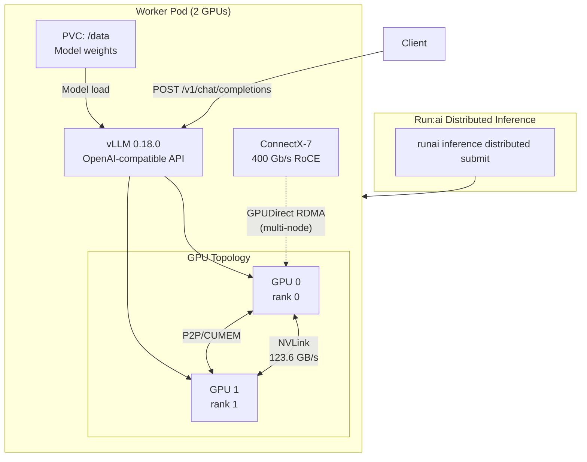
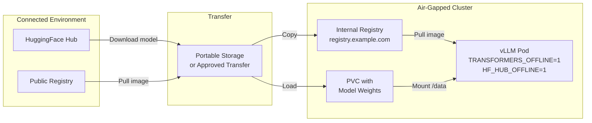

> 💡 **Quick Answer:** Use `runai inference distributed submit` with `--workers 2 -g 2 --tensor-parallel-size 2` to shard a large multimodal model across GPUs via vLLM. Set `NCCL_SOCKET_IFNAME=net1` for the RDMA secondary NIC, request `openshift.io/mellanoxnics=1` for GPUDirect RDMA, and run fully offline with `TRANSFORMERS_OFFLINE=1 HF_HUB_OFFLINE=1` for air-gapped environments. NCCL auto-discovers NVLink (123.6 GB/s) between local GPUs and uses P2P/CUMEM transport.

## The Problem

Large multimodal models (100B+ parameters with vision encoders) exceed single-GPU memory. You need tensor parallelism across multiple GPUs, NCCL for collective operations, and an air-gapped deployment that pulls models from a local PVC — not the internet. Run:ai's distributed inference CLI handles the orchestration, but getting NCCL, RDMA, and vLLM configured correctly requires precise environment variables and resource requests.



## The Solution

### Run:ai Distributed Inference Command

```bash
runai inference distributed submit my-model-dist \
  -p my-project \
  -i registry.example.com/ai-platform/vllm-openai:v0.18.0 \
  --existing-pvc claimname=my-project-pvc,path=/data \
  --workers 2 \
  -g 2 \
  --serving-port container=8000,authorization-type=authenticatedUsers \
  --environment-variable TRANSFORMERS_OFFLINE=1 \
  --environment-variable HF_HUB_OFFLINE=1 \
  --environment-variable NCCL_DEBUG=INFO \
  --environment-variable NCCL_DEBUG_SUBSYS=ALL \
  --environment-variable NCCL_SOCKET_IFNAME=net1 \
  --extended-resource "openshift.io/mellanoxnics=1" \
  --annotation "k8s.v1.cni.cncf.io/networks=rdma-net" \
  --run-as-uid 2000 \
  --run-as-gid 2000 \
  --run-as-non-root \
  --preemptibility preemptible \
  -- --model /data/input/Models/My-Model-119B \
  --served-model-name my-model \
  --tensor-parallel-size 2 \
  --port 8000
```

### Breaking Down the Flags

**Run:ai orchestration:**

| Flag | Value | Purpose |
|------|-------|---------|
| `--workers 2` | 2 worker pods | Distributed inference topology |
| `-g 2` | 2 GPUs per worker | GPU allocation per pod |
| `--serving-port` | `container=8000` | OpenAI-compatible endpoint |
| `--preemptibility` | `preemptible` | Can be preempted for higher-priority jobs |
| `--run-as-uid/gid 2000` | Non-root | Security compliance (OpenShift SCC) |

**Air-gapped environment:**

| Variable | Purpose |
|----------|---------|
| `TRANSFORMERS_OFFLINE=1` | Don't attempt HuggingFace Hub downloads |
| `HF_HUB_OFFLINE=1` | Fully offline — fail instead of reaching out |
| `--existing-pvc` | Model weights pre-loaded on PVC |

**NCCL and networking:**

| Variable | Purpose |
|----------|---------|
| `NCCL_DEBUG=INFO` | Enable NCCL debug logging |
| `NCCL_DEBUG_SUBSYS=ALL` | Log all NCCL subsystems (NET, INIT, TOPO) |
| `NCCL_SOCKET_IFNAME=net1` | Use secondary NIC (Multus) for NCCL bootstrap |
| `openshift.io/mellanoxnics=1` | Request RDMA shared device plugin NIC |
| `k8s.v1.cni.cncf.io/networks=rdma-net` | Attach Multus secondary network |

**vLLM engine (after `--`):**

| Flag | Value | Purpose |
|------|-------|---------|
| `--model` | `/data/input/Models/My-Model-119B` | Local model path on PVC |
| `--served-model-name` | `my-model` | API model name |
| `--tensor-parallel-size 2` | TP=2 | Shard across 2 GPUs |
| `--port 8000` | API port | OpenAI-compatible server |

### NCCL Tuning for Different Network Topologies

```bash
# Intra-node only (NVLink available) — default, no special config needed
# NCCL auto-detects NVLink and uses P2P/CUMEM transport

# Multi-node with IB/RoCE RDMA
--environment-variable NCCL_NET=IB \
--environment-variable NCCL_IB_HCA=mlx5_0:1 \
--environment-variable NCCL_IB_DISABLE=0 \
--environment-variable NCCL_P2P_DISABLE=0 \

# Multi-node without RDMA (TCP fallback — much slower)
--environment-variable NCCL_IB_DISABLE=1 \
--environment-variable NCCL_SOCKET_IFNAME=eth1 \
```

## Reading NCCL Debug Output

When `NCCL_DEBUG=INFO` and `NCCL_DEBUG_SUBSYS=ALL` are set, the logs tell you everything about the communication topology. Here's what to look for:

### ✅ Good Signs

```
# NCCL found the IB/RoCE device
NET/IB: [0] mlx5_130:uverbs132:1/RoCE provider=Mlx5 speed=400000
NET/IB : Using [0]mlx5_130:1/RoCE [RO]; OOB net1:10.x.x.x<0>

# GPUDirect RDMA is active
GPU Direct RDMA Enabled for HCA 0 'mlx5_130'
GPU Direct RDMA Enabled for GPU 0 / HCA 0 (distance 4 <= 5)
DMA-BUF is available on GPU device 0

# NVLink detected between GPUs (123.6 GB/s)
GPU/0-118000 :GPU/0-1b3000 (1/123.6/NVL)

# P2P/CUMEM transport (GPU-to-GPU via NVLink, not going through CPU)
Channel 00/0 : 0[0] -> 1[1] via P2P/CUMEM
Channel 01/0 : 0[0] -> 1[1] via P2P/CUMEM

# Init completed successfully
ncclCommInitRank comm 0x... rank 0 nranks 2 ... - Init COMPLETE
Init timings - total 0.33s
```

### ⚠️ Warning Signs

```
# Missing NCCL net plugin (not necessarily a problem for intra-node)
NET/Plugin: Could not find: libnccl-net.so.

# Missing mlx5 symbols (older libmlx5 — no data-direct or DMA-BUF MR)
dlvsym failed on mlx5dv_get_data_direct_sysfs_path
dlvsym failed on mlx5dv_reg_dmabuf_mr

# If you see NET/Socket instead of NET/IB, RDMA is NOT being used
NET/Socket : Using [0]eth0:10.x.x.x<0>  ← TCP fallback!
```

### Understanding the Topology Tree

```
# NCCL topology output shows the PCI hierarchy:
=== System : maxBw 123.6 totalBw 123.6 ===
CPU/0-1 (1/1/3)
+ PCI[48.0] - PCI/0-115000
              + PCI[48.0] - GPU/0-118000 (0)        ← GPU 0
                            + NVL[123.6] - GPU/0-1b3000  ← NVLink to GPU 1
              + PCI[48.0] - NIC/0-119000             ← ConnectX NIC
+ PCI[48.0] - PCI/0-1b0000
              + PCI[48.0] - GPU/0-1b3000 (1)        ← GPU 1
                            + NVL[123.6] - GPU/0-118000  ← NVLink to GPU 0

# This tells you:
# - 2 GPUs connected via NVLink at 123.6 GB/s
# - NIC is on the same PCI switch as GPU 0 (distance 4)
# - Both GPUs can do GPUDirect RDMA via the NIC
```

### Communication Patterns

NCCL selects algorithms based on topology:

```
# Ring: Good for AllReduce (TP main operation)
Ring 00 : 0 -> 1 -> 0
Ring 01 : 0 -> 1 -> 0

# Tree: Good for Broadcast/Reduce
Tree 0 : -1 -> 0 -> 1/-1/-1
Tree 2 :  1 -> 0 -> -1/-1/-1

# 8 collective channels, 8 P2P channels
8 coll channels, 8 collnet channels, 0 nvls channels, 8 p2p channels

# Bandwidth matrix shows what NCCL can achieve:
#   Algorithm   |     Ring (Simple)  |    Tree (Simple)
#   AllReduce   |     120.0 GB/s     |     77.4 GB/s
#   AllGather   |     240.0 GB/s     |     N/A
# ReduceScatter |     240.0 GB/s     |     N/A
```

## vLLM Configuration Details

### What vLLM Auto-Detects

From the logs, vLLM 0.18.0 automatically:

```yaml
# Inferred from model files:
dtype: torch.bfloat16           # From consolidated*.safetensors
architecture: PixtralForConditionalGeneration  # Multimodal (vision + language)
quantization: fp8               # Auto-detected FP8 quantization
max_seq_len: 1048576            # 1M context (from model config)

# Enabled optimizations:
chunked_prefill: true           # max_num_batched_tokens=8192
async_scheduling: true          # Asynchronous request scheduling
enable_prefix_caching: true     # KV cache reuse for shared prefixes
compilation_mode: VLLM_COMPILE  # Torch compilation + CUDAGraph
custom_fusions: allreduce_rms   # Fused AllReduce + RMSNorm kernel

# CUDAGraph captures for batch sizes: 1,2,4,8,...,512
cudagraph_capture_sizes: [1, 2, 4, 8, 16, 24, 32, ..., 512]
```

### Important: Model Path Warning

vLLM 0.18.0 deprecates `--model` as a flag:

```
WARNING: With `vllm serve`, you should provide the model as a 
positional argument or in a config file instead of via the `--model` 
option. The `--model` option will be removed in v0.13.
```

For future versions, use:
```bash
-- vllm serve /data/input/Models/My-Model-119B \
  --served-model-name my-model \
  --tensor-parallel-size 2 \
  --port 8000
```

### Setting Max Model Length

For models with very long context (1M tokens), you may need to limit it:

```bash
# Default uses model config (1M tokens = massive KV cache memory)
# Reduce if you don't need full context:
--max-model-len 32768

# ⚠️ REQUIRED for some hardware (e.g., Huawei Ascend NPUs):
# O(n²) attention mask causes OOM at large max_model_len
--max-model-len 4096
```

## Air-Gapped Deployment Pattern



### Pre-Loading Models to PVC

```bash
# On a connected machine, download the model:
huggingface-cli download org/My-Model-119B \
  --local-dir /mnt/transfer/Models/My-Model-119B

# Transfer to air-gapped environment
# (USB drive, approved file transfer, etc.)

# Create PVC and copy model
kubectl create -f - <<EOF
apiVersion: v1
kind: PersistentVolumeClaim
metadata:
  name: my-project-pvc
spec:
  accessModes: [ReadWriteMany]
  storageClassName: nfs-client
  resources:
    requests:
      storage: 500Gi
EOF

# Copy model to PVC via a temporary pod
kubectl run model-loader --image=busybox --restart=Never \
  --overrides='{"spec":{"containers":[{"name":"loader","image":"busybox","command":["sleep","3600"],"volumeMounts":[{"name":"data","mountPath":"/data"}]}],"volumes":[{"name":"data","persistentVolumeClaim":{"claimName":"my-project-pvc"}}]}}'

kubectl cp /mnt/transfer/Models/My-Model-119B \
  model-loader:/data/input/Models/My-Model-119B

kubectl delete pod model-loader
```

### Mirroring vLLM Image to Internal Registry

```bash
# On connected machine
skopeo copy \
  docker://vllm/vllm-openai:v0.18.0 \
  docker://registry.example.com/ai-platform/vllm-openai:v0.18.0

# Or using podman
podman pull vllm/vllm-openai:v0.18.0
podman tag vllm/vllm-openai:v0.18.0 \
  registry.example.com/ai-platform/vllm-openai:v0.18.0
podman push registry.example.com/ai-platform/vllm-openai:v0.18.0
```

## Security: Non-Root Execution

Run:ai + OpenShift require non-root by default:

```bash
--run-as-uid 2000 \
--run-as-gid 2000 \
--run-as-non-root
```

This maps to the pod security context:

```yaml
securityContext:
  runAsUser: 2000
  runAsGroup: 2000
  runAsNonRoot: true
  fsGroup: 2000
```

**Common issue:** If model files on PVC are owned by root, the vLLM process (UID 2000) can't read them. Fix:

```bash
# In the model-loader pod:
chown -R 2000:2000 /data/input/Models/
# Or use fsGroupChangePolicy in PVC:
```

## Multus Secondary Network for NCCL

The `--annotation "k8s.v1.cni.cncf.io/networks=rdma-net"` attaches a secondary NIC via Multus:

```yaml
# NetworkAttachmentDefinition
apiVersion: k8s.cni.cncf.io/v1
kind: NetworkAttachmentDefinition
metadata:
  name: rdma-net
  namespace: my-project
spec:
  config: |
    {
      "cniVersion": "0.3.1",
      "type": "macvlan",
      "master": "ens8f0np0",
      "mode": "bridge",
      "ipam": {
        "type": "whereabouts",
        "range": "10.232.0.0/16"
      }
    }
```

This creates `net1` inside the pod — which is why `NCCL_SOCKET_IFNAME=net1` points NCCL to the RDMA-capable interface.

## Scaling: Single-Node vs Multi-Node

### Single-Node TP (What This Example Does)

Both GPUs on the same node, communicating via NVLink:

```
nNodes=1, localRanks=2
Transport: P2P/CUMEM (GPU-to-GPU direct memory)
Bandwidth: 123.6 GB/s per NVLink link
Latency: ~1-2 μs
```

**Best for:** Models that fit in 2-8 GPUs on one node.

### Multi-Node TP (Scaling Beyond One Node)

When you need more GPUs than one node has:

```bash
runai inference distributed submit my-large-model \
  -p my-project \
  -i registry.example.com/ai-platform/vllm-openai:v0.18.0 \
  --existing-pvc claimname=my-project-pvc,path=/data \
  --workers 4 \
  -g 8 \
  --environment-variable NCCL_NET=IB \
  --environment-variable NCCL_IB_HCA=mlx5_0:1 \
  --environment-variable NCCL_SOCKET_IFNAME=net1 \
  --environment-variable NCCL_DEBUG=INFO \
  --extended-resource "openshift.io/mellanoxnics=1" \
  --annotation "k8s.v1.cni.cncf.io/networks=rdma-net" \
  -- --model /data/input/Models/My-Huge-Model-700B \
  --served-model-name huge-model \
  --tensor-parallel-size 8 \
  --pipeline-parallel-size 4 \
  --port 8000
```

**Key differences for multi-node:**
- `NCCL_NET=IB` — force IB/RoCE transport for inter-node
- `NCCL_IB_HCA=mlx5_0:1` — specify which HCA port to use
- TP handles intra-node (NVLink), PP handles inter-node (RDMA)

## Common Issues

| Issue | Cause | Fix |
|-------|-------|-----|
| `NET/Socket` in NCCL logs | RDMA not configured | Check `openshift.io/mellanoxnics` resource + Multus annotation |
| `libnccl-net.so` not found | Missing NCCL net plugin | Usually OK for intra-node; install `nccl-rdma-sharp-plugins` for multi-node |
| `mlx5dv_reg_dmabuf_mr` symbol missing | Old libmlx5 in container | Rebuild image with newer MLNX OFED or use NVIDIA GPU Cloud base images |
| Model download fails | Forgot offline flags | Set both `TRANSFORMERS_OFFLINE=1` and `HF_HUB_OFFLINE=1` |
| Permission denied on model files | PVC files owned by root | `chown -R 2000:2000` or set `fsGroup: 2000` |
| OOM on model load | 1M context KV cache | Add `--max-model-len 32768` to reduce KV cache size |
| NCCL timeout on multi-node | Firewall blocking NCCL ports | Open port range 29400-29500 between worker nodes |
| Slow inference despite NVLink | CUDAGraph not capturing | Check logs for `cudagraph_capture_sizes`, ensure warm-up completed |
| `--model` deprecation warning | vLLM 0.18+ | Use positional arg: `vllm serve /path/to/model` |

## Best Practices

- **Always set `NCCL_DEBUG=INFO` initially** — verify the transport is what you expect, then remove for production
- **Pin vLLM image versions** — use `v0.18.0` not `latest`; breaking changes happen between versions
- **Use `TRANSFORMERS_OFFLINE=1` even in connected environments** — prevents unexpected downloads during inference
- **Request RDMA resources explicitly** — `openshift.io/mellanoxnics=1` ensures the pod lands on an RDMA-capable node
- **Match TP size to GPU count per node** — TP=2 for 2 GPUs, TP=8 for 8 GPUs; add PP for multi-node
- **Set `--max-model-len` for production** — don't use the model's full context unless you need it
- **Non-root is mandatory on OpenShift** — pre-set file ownership on PVCs
- **Preemptible for dev/test** — saves GPU quota; use non-preemptible for production endpoints

## Key Takeaways

- `runai inference distributed submit` orchestrates multi-GPU vLLM deployment with one command
- NCCL auto-discovers NVLink (123.6 GB/s) for intra-node GPU communication
- GPUDirect RDMA requires: Multus secondary NIC + RDMA shared device plugin + NCCL_SOCKET_IFNAME
- Air-gapped deployment: pre-load model to PVC, mirror image to internal registry, set offline flags
- Read NCCL logs: `NET/IB` = RDMA ✅, `NET/Socket` = TCP fallback ❌, `P2P/CUMEM` = NVLink ✅
- vLLM 0.18.0 auto-detects: dtype, quantization (FP8), architecture, enables chunked prefill + CUDAGraph
- Pin image versions, limit context length, and run non-root for production deployments
