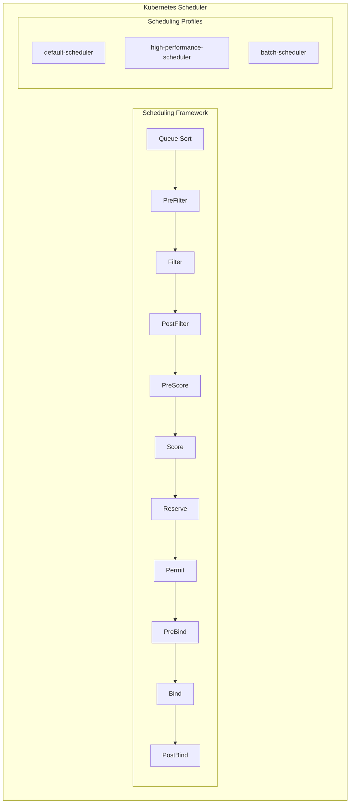

> 💡 **Quick Answer:** Customize scheduling via `KubeSchedulerConfiguration` with **profiles** (different policies for different workloads), **plugins** (enable/disable scoring, filtering), and **extenders** (call external webhooks). Reference custom profiles with `schedulerName` in pod spec.
>
> **Key concepts:** Filter plugins (which nodes are viable), Score plugins (rank viable nodes), Bind plugins (finalize placement).
>
> **Gotcha:** Custom schedulers run alongside default—use `schedulerName` to target specific scheduler; misconfigured schedulers leave pods Pending.

## Problem

The default Kubernetes scheduler may not meet your specific workload requirements. You need fine-grained control over pod placement, custom scheduling logic, or multiple scheduling policies for different workload types.

## Solution

Configure the Kubernetes scheduler with custom scheduling profiles, plugins, and extensions to implement advanced placement strategies that match your specific requirements.

### Architecture



### Step 1: Create Custom Scheduler Configuration

Define a scheduler configuration with multiple profiles:

```yaml
# scheduler-config.yaml
apiVersion: kubescheduler.config.k8s.io/v1
kind: KubeSchedulerConfiguration
clientConnection:
  kubeconfig: /etc/kubernetes/scheduler.conf
leaderElection:
  leaderElect: true
profiles:
# Default profile with standard plugins
- schedulerName: default-scheduler
  plugins:
    preFilter:
      enabled:
      - name: NodeResourcesFit
      - name: NodePorts
      - name: PodTopologySpread
      - name: InterPodAffinity
      - name: VolumeBinding
    filter:
      enabled:
      - name: NodeResourcesFit
      - name: NodeName
      - name: NodePorts
      - name: NodeAffinity
      - name: VolumeRestrictions
      - name: TaintToleration
      - name: NodeUnschedulable
      - name: PodTopologySpread
    score:
      enabled:
      - name: NodeResourcesBalancedAllocation
        weight: 1
      - name: ImageLocality
        weight: 1
      - name: InterPodAffinity
        weight: 1
      - name: NodeAffinity
        weight: 1
      - name: PodTopologySpread
        weight: 2
  pluginConfig:
  - name: NodeResourcesFit
    args:
      scoringStrategy:
        type: LeastAllocated
        resources:
        - name: cpu
          weight: 1
        - name: memory
          weight: 1

# High-performance profile: prioritize faster nodes
- schedulerName: high-performance-scheduler
  plugins:
    score:
      enabled:
      - name: NodeResourcesFit
        weight: 1
      - name: NodeAffinity
        weight: 5  # Heavily weigh node affinity
  pluginConfig:
  - name: NodeResourcesFit
    args:
      scoringStrategy:
        type: MostAllocated  # Pack pods tightly for performance
        resources:
        - name: cpu
          weight: 2
        - name: memory
          weight: 1
  - name: NodeAffinity
    args:
      addedAffinity:
        requiredDuringSchedulingIgnoredDuringExecution:
          nodeSelectorTerms:
          - matchExpressions:
            - key: node-type
              operator: In
              values:
              - high-performance

# Batch scheduler: optimize for resource efficiency
- schedulerName: batch-scheduler
  plugins:
    score:
      enabled:
      - name: NodeResourcesBalancedAllocation
        weight: 3
      - name: NodeResourcesFit
        weight: 2
      disabled:
      - name: ImageLocality  # Don't optimize for image locality
  pluginConfig:
  - name: NodeResourcesFit
    args:
      scoringStrategy:
        type: LeastAllocated  # Spread pods for better utilization
        resources:
        - name: cpu
          weight: 1
        - name: memory
          weight: 2
```

### Step 2: Deploy Custom Scheduler

Create a custom scheduler deployment:

```yaml
apiVersion: v1
kind: ServiceAccount
metadata:
  name: custom-scheduler
  namespace: kube-system
---
apiVersion: rbac.authorization.k8s.io/v1
kind: ClusterRoleBinding
metadata:
  name: custom-scheduler
roleRef:
  apiGroup: rbac.authorization.k8s.io
  kind: ClusterRole
  name: system:kube-scheduler
subjects:
- kind: ServiceAccount
  name: custom-scheduler
  namespace: kube-system
---
apiVersion: v1
kind: ConfigMap
metadata:
  name: scheduler-config
  namespace: kube-system
data:
  scheduler-config.yaml: |
    apiVersion: kubescheduler.config.k8s.io/v1
    kind: KubeSchedulerConfiguration
    profiles:
    - schedulerName: high-performance-scheduler
      plugins:
        score:
          enabled:
          - name: NodeResourcesFit
            weight: 1
          - name: NodeAffinity
            weight: 5
      pluginConfig:
      - name: NodeResourcesFit
        args:
          scoringStrategy:
            type: MostAllocated
---
apiVersion: apps/v1
kind: Deployment
metadata:
  name: custom-scheduler
  namespace: kube-system
spec:
  replicas: 1
  selector:
    matchLabels:
      component: custom-scheduler
  template:
    metadata:
      labels:
        component: custom-scheduler
    spec:
      serviceAccountName: custom-scheduler
      containers:
      - name: scheduler
        image: registry.k8s.io/kube-scheduler:v1.28.0
        command:
        - kube-scheduler
        - --config=/etc/kubernetes/scheduler-config.yaml
        - --v=2
        volumeMounts:
        - name: config
          mountPath: /etc/kubernetes
      volumes:
      - name: config
        configMap:
          name: scheduler-config
```

### Step 3: Use Custom Scheduler in Pods

Specify scheduler in pod spec:

```yaml
apiVersion: apps/v1
kind: Deployment
metadata:
  name: high-perf-app
  namespace: production
spec:
  replicas: 3
  selector:
    matchLabels:
      app: high-perf-app
  template:
    metadata:
      labels:
        app: high-perf-app
    spec:
      schedulerName: high-performance-scheduler  # Use custom scheduler
      containers:
      - name: app
        image: high-perf-app:v1.0
        resources:
          requests:
            memory: "2Gi"
            cpu: "2000m"
          limits:
            memory: "4Gi"
            cpu: "4000m"
      affinity:
        nodeAffinity:
          preferredDuringSchedulingIgnoredDuringExecution:
          - weight: 100
            preference:
              matchExpressions:
              - key: node-type
                operator: In
                values:
                - high-performance
```

### Step 4: Configure Scoring Weights

Fine-tune scheduling decisions with custom weights:

```yaml
apiVersion: kubescheduler.config.k8s.io/v1
kind: KubeSchedulerConfiguration
profiles:
- schedulerName: balanced-scheduler
  pluginConfig:
  - name: NodeResourcesFit
    args:
      scoringStrategy:
        type: LeastAllocated
        resources:
        - name: cpu
          weight: 1
        - name: memory
          weight: 1
        - name: nvidia.com/gpu
          weight: 5  # Heavily optimize GPU placement
  - name: PodTopologySpread
    args:
      defaultConstraints:
      - maxSkew: 1
        topologyKey: kubernetes.io/hostname
        whenUnsatisfiable: ScheduleAnyway
      - maxSkew: 2
        topologyKey: topology.kubernetes.io/zone
        whenUnsatisfiable: ScheduleAnyway
```

### Step 5: Configure Scheduler Extenders

Use HTTP-based scheduler extenders for custom logic:

```yaml
apiVersion: kubescheduler.config.k8s.io/v1
kind: KubeSchedulerConfiguration
extenders:
- urlPrefix: "http://scheduler-extender.kube-system.svc:8080"
  filterVerb: "filter"
  prioritizeVerb: "prioritize"
  preemptVerb: "preempt"
  bindVerb: ""
  weight: 5
  enableHTTPS: false
  nodeCacheCapable: true
  managedResources:
  - name: gpu
    ignoredByScheduler: false
  ignorable: false
profiles:
- schedulerName: default-scheduler
```

Scheduler extender service:

```yaml
apiVersion: v1
kind: Service
metadata:
  name: scheduler-extender
  namespace: kube-system
spec:
  selector:
    app: scheduler-extender
  ports:
  - port: 8080
    targetPort: 8080
---
apiVersion: apps/v1
kind: Deployment
metadata:
  name: scheduler-extender
  namespace: kube-system
spec:
  replicas: 2
  selector:
    matchLabels:
      app: scheduler-extender
  template:
    metadata:
      labels:
        app: scheduler-extender
    spec:
      containers:
      - name: extender
        image: scheduler-extender:v1.0
        ports:
        - containerPort: 8080
        env:
        - name: PORT
          value: "8080"
```

### Step 6: Configure Percentage of Nodes to Score

Optimize scheduler performance for large clusters:

```yaml
apiVersion: kubescheduler.config.k8s.io/v1
kind: KubeSchedulerConfiguration
percentageOfNodesToScore: 50  # Only score top 50% of feasible nodes
profiles:
- schedulerName: default-scheduler
  pluginConfig:
  - name: NodeResourcesFit
    args:
      scoringStrategy:
        type: LeastAllocated
```

### Step 7: Monitor Scheduler Performance

Deploy scheduler metrics monitoring:

```yaml
apiVersion: v1
kind: Service
metadata:
  name: scheduler-metrics
  namespace: kube-system
  labels:
    component: kube-scheduler
spec:
  selector:
    component: kube-scheduler
  ports:
  - name: metrics
    port: 10259
    targetPort: 10259
---
apiVersion: monitoring.coreos.com/v1
kind: ServiceMonitor
metadata:
  name: kube-scheduler
  namespace: kube-system
spec:
  selector:
    matchLabels:
      component: kube-scheduler
  endpoints:
  - port: metrics
    interval: 30s
    scheme: https
    tlsConfig:
      insecureSkipVerify: true
    bearerTokenFile: /var/run/secrets/kubernetes.io/serviceaccount/token
```

## Verification

Check scheduler status:

```bash
# View scheduler pods
kubectl get pods -n kube-system -l component=kube-scheduler

# Check scheduler logs
kubectl logs -n kube-system -l component=kube-scheduler --tail=100

# View scheduler events
kubectl get events --all-namespaces --field-selector reason=Scheduled

# Check which scheduler scheduled a pod
kubectl get pod <pod-name> -o jsonpath='{.spec.schedulerName}'
```

Test custom scheduler:

```bash
# Create pod with custom scheduler
kubectl run test-pod --image=nginx \
  --overrides='{"spec":{"schedulerName":"high-performance-scheduler"}}'

# Check scheduling events
kubectl describe pod test-pod | grep -A5 Events

# View which node was selected
kubectl get pod test-pod -o wide
```

Monitor scheduler metrics:

```bash
# Port-forward to scheduler metrics
kubectl port-forward -n kube-system \
  <scheduler-pod> 10259:10259

# Query metrics
curl -k https://localhost:10259/metrics

# Key metrics:
# scheduler_scheduling_duration_seconds
# scheduler_pending_pods
# scheduler_schedule_attempts_total
# scheduler_e2e_scheduling_duration_seconds
```

Analyze scheduling decisions:

```bash
# View scheduler queue
kubectl get pods --all-namespaces \
  --field-selector status.phase=Pending

# Check pod scheduling attempts
kubectl describe pod <pod-name> | \
  grep "Failed.*Scheduling"

# View scheduler throughput
kubectl get events --all-namespaces \
  --field-selector reason=Scheduled \
  --sort-by='.lastTimestamp'
```

## Best Practices

1. **Start with default scheduler** and customize incrementally
2. **Test custom configurations** in non-production first
3. **Monitor scheduler latency** and throughput
4. **Use scheduling profiles** for different workload types
5. **Set appropriate percentageOfNodesToScore** for large clusters
6. **Enable scheduler metrics** for observability
7. **Use extenders sparingly** (they add latency)
8. **Configure proper weights** based on priorities
9. **Implement high availability** for custom schedulers
10. **Document scheduler policies** for operations teams

## Common Issues

**Pods stuck in Pending with custom scheduler:**
- Verify scheduler is running
- Check scheduler logs for errors
- Ensure RBAC permissions are correct

**Poor scheduling decisions:**
- Review plugin weights and scoring strategy
- Check node labels and taints
- Verify resource requests are set

**Scheduler performance degradation:**
- Reduce percentageOfNodesToScore
- Disable unnecessary plugins
- Check for scheduler extender latency

## Related Resources

- [Scheduler Configuration](https://kubernetes.io/docs/reference/scheduling/config/)
- [Scheduling Framework](https://kubernetes.io/docs/concepts/scheduling-eviction/scheduling-framework/)
- [Multiple Schedulers](https://kubernetes.io/docs/tasks/extend-kubernetes/configure-multiple-schedulers/)
- [Scheduler Performance Tuning](https://kubernetes.io/docs/concepts/scheduling-eviction/scheduler-perf-tuning/)

---

## 📘 Go Further with Kubernetes Recipes

**Love this recipe? There's so much more!** This is just one of **100+ hands-on recipes** in our comprehensive **[Kubernetes Recipes book](https://amzn.to/3DzC8QA)**.

Inside the book, you'll master:
- ✅ Production-ready deployment strategies
- ✅ Advanced networking and security patterns  
- ✅ Observability, monitoring, and troubleshooting
- ✅ Real-world best practices from industry experts

> *"The practical, recipe-based approach made complex Kubernetes concepts finally click for me."*

**👉 [Get Your Copy Now](https://amzn.to/3DzC8QA)** — Start building production-grade Kubernetes skills today!
