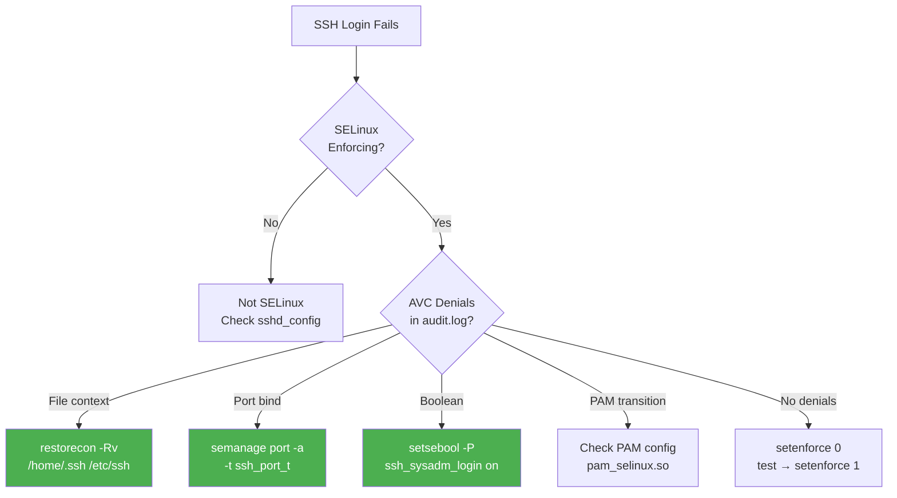

> 💡 **Quick Answer:** When SELinux is enforcing and SSH login breaks, 99% of the time it's a file context (label) issue. Check `audit.log` for AVC denials: `ausearch -m avc -ts recent | grep ssh`. Fix with `restorecon -Rv /etc/ssh /home /root/.ssh`. Common triggers: moving `authorized_keys` instead of copying (wrong label), custom SSH port without `semanage port`, or a MachineConfig that wrote SSH files with no SELinux context.

## The Problem

SELinux in enforcing mode blocks SSH when:

- `authorized_keys` has wrong SELinux context (moved instead of copied)
- Custom SSH port not registered with SELinux
- Home directory has incorrect labels after restore/migration
- MachineConfig or automation wrote SSH config files without proper context
- SELinux boolean `ssh_sysadm_login` is disabled
- PAM SELinux module denies the login transition
- `/etc/ssh/sshd_config` has wrong context after manual edit
- SSH host keys regenerated with wrong labels

## The Solution

### Step 1: Confirm SELinux Is the Cause

```bash
# Check SELinux mode
getenforce
# Enforcing

# Check for SSH-related AVC denials (last 10 minutes)
ausearch -m avc -ts recent | grep -E "ssh|sshd"

# Or use audit2why for human-readable explanation
ausearch -m avc -ts recent | audit2why

# Quick test: temporarily set permissive
# (DO NOT leave permissive in production)
setenforce 0
# Try SSH login — if it works, SELinux is the cause
setenforce 1
```

### Step 2: Diagnose the Specific Denial

```bash
# Common AVC denial patterns:

# Pattern 1: Wrong context on authorized_keys
# type=AVC msg=audit(...): avc: denied { read } for
#   comm="sshd" name="authorized_keys"
#   scontext=system_u:system_r:sshd_t:s0
#   tcontext=unconfined_u:object_r:user_home_t:s0
#   tclass=file permissive=0

# Pattern 2: Wrong context on .ssh directory
# type=AVC msg=audit(...): avc: denied { search } for
#   comm="sshd" name=".ssh"
#   tcontext=unconfined_u:object_r:default_t:s0

# Pattern 3: Custom SSH port blocked
# type=AVC msg=audit(...): avc: denied { name_bind } for
#   comm="sshd" src=2222
#   scontext=system_u:system_r:sshd_t:s0

# Pattern 4: PAM login transition denied
# type=AVC msg=audit(...): avc: denied { dyntransition } for
#   comm="sshd" scontext=system_u:system_r:sshd_t:s0
```

### Fix: Restore File Contexts (Most Common)

```bash
# Fix authorized_keys and .ssh directory labels
restorecon -Rv /root/.ssh
restorecon -Rv /home/*/.ssh

# Fix SSH server config files
restorecon -Rv /etc/ssh

# Fix SSH host keys
restorecon -v /etc/ssh/ssh_host_*

# Verify correct contexts
ls -laZ /root/.ssh/
# -rw-------. root root system_u:object_r:ssh_home_t:s0 authorized_keys
# drwx------. root root system_u:object_r:ssh_home_t:s0 .

ls -laZ /etc/ssh/sshd_config
# -rw-------. root root system_u:object_r:etc_t:s0 sshd_config
```

### Expected SELinux Contexts

| File | Expected Context |
|------|-----------------|
| `/home/user/.ssh/` | `ssh_home_t` |
| `/home/user/.ssh/authorized_keys` | `ssh_home_t` |
| `/root/.ssh/authorized_keys` | `ssh_home_t` |
| `/etc/ssh/sshd_config` | `etc_t` |
| `/etc/ssh/ssh_host_*` | `sshd_key_t` |
| `/var/run/sshd.pid` | `sshd_var_run_t` |

### Fix: Custom SSH Port

```bash
# Check current allowed SSH ports
semanage port -l | grep ssh
# ssh_port_t    tcp    22

# Add custom port (e.g., 2222)
semanage port -a -t ssh_port_t -p tcp 2222

# Verify
semanage port -l | grep ssh
# ssh_port_t    tcp    2222, 22

# Restart sshd
systemctl restart sshd
```

### Fix: SELinux Booleans

```bash
# List SSH-related booleans
getsebool -a | grep ssh
# ssh_chroot_rw_homedirs --> off
# ssh_keysign --> off
# ssh_sysadm_login --> off

# Enable sysadm login via SSH (needed for root on some policies)
setsebool -P ssh_sysadm_login on

# Enable if using chroot SFTP
setsebool -P ssh_chroot_rw_homedirs on
```

### Fix: Home Directory Labels After Migration

```bash
# After restoring /home from backup or moving between systems
# the SELinux labels may be wrong

# Relabel entire home directory
restorecon -Rv /home

# Or for a specific user
restorecon -Rv /home/luca

# If home is on NFS or non-standard mount
semanage fcontext -a -t user_home_dir_t "/custom/home(/.*)?"
restorecon -Rv /custom/home
```

### OpenShift Node — SSH After MachineConfig

MachineConfigs writing SSH files may not set SELinux contexts:

```yaml
# ❌ BROKEN — MachineConfig writes authorized_keys without context
apiVersion: machineconfiguration.openshift.io/v1
kind: MachineConfig
metadata:
  name: 99-ssh-keys
  labels:
    machineconfiguration.openshift.io/role: worker
spec:
  config:
    ignition:
      version: 3.2.0
    passwd:
      users:
      - name: core
        sshAuthorizedKeys:
        - "ssh-rsa AAAA... admin@example.com"
        # ✅ This is the CORRECT way — Ignition handles contexts
```

```yaml
# ❌ BROKEN — writing authorized_keys as a file (wrong approach)
spec:
  config:
    storage:
      files:
      - path: /home/core/.ssh/authorized_keys
        mode: 0600
        contents:
          source: data:,ssh-rsa%20AAAA...
        # Missing SELinux context — gets default_t instead of ssh_home_t
```

The fix: use `passwd.users[].sshAuthorizedKeys` in MachineConfig, NOT `storage.files` for SSH keys. Ignition's passwd handler sets correct SELinux labels automatically.

If you must use `storage.files`, fix labels after:

```bash
# On the node (via oc debug)
oc debug node/worker-1
chroot /host
restorecon -Rv /home/core/.ssh
```

### Kubernetes Node — SSH Fix Script

```bash
#!/bin/bash
# fix-selinux-ssh.sh — Run on any RHEL/CoreOS node with SSH issues
set -euo pipefail

echo "=== SELinux SSH Fix ==="

# 1. Check for AVC denials
echo "[1] Checking AVC denials..."
DENIALS=$(ausearch -m avc -ts recent 2>/dev/null | grep -c ssh || true)
echo "   Found $DENIALS SSH-related AVC denials"

# 2. Restore file contexts
echo "[2] Restoring SSH file contexts..."
restorecon -Rv /etc/ssh
restorecon -Rv /root/.ssh 2>/dev/null || true
for dir in /home/*/.ssh; do
    [ -d "$dir" ] && restorecon -Rv "$dir"
done

# 3. Check booleans
echo "[3] Checking SSH booleans..."
SYSADM=$(getsebool ssh_sysadm_login | awk '{print $NF}')
if [ "$SYSADM" = "off" ]; then
    echo "   Enabling ssh_sysadm_login..."
    setsebool -P ssh_sysadm_login on
fi

# 4. Verify sshd context
echo "[4] Verifying sshd process context..."
ps -eZ | grep sshd | head -3

# 5. Restart sshd
echo "[5] Restarting sshd..."
systemctl restart sshd

echo "=== Done. Try SSH login now. ==="
```

### Diagnostic Commands Summary

```bash
# Full diagnostic one-liner
echo "=== SELinux ===" && getenforce && \
echo "=== AVC Denials ===" && ausearch -m avc -ts recent 2>/dev/null | grep ssh | tail -5 && \
echo "=== File Contexts ===" && ls -laZ /root/.ssh/ /etc/ssh/sshd_config 2>/dev/null && \
echo "=== Booleans ===" && getsebool -a | grep ssh && \
echo "=== SSH Ports ===" && semanage port -l | grep ssh && \
echo "=== sshd Status ===" && systemctl status sshd --no-pager -l | tail -5
```



## Common Issues

**"Permission denied (publickey)" but key is correct**

SELinux is blocking sshd from reading `authorized_keys`. The file has `user_home_t` instead of `ssh_home_t`. Fix: `restorecon -v ~/.ssh/authorized_keys`.

**SSH works with password but not key-based auth**

Same root cause — SELinux allows password auth (PAM handles it) but blocks sshd from reading key files with wrong context.

**Login works as regular user but not root**

`ssh_sysadm_login` boolean is off (default on some RHEL policies). Enable with `setsebool -P ssh_sysadm_login on`.

**SSH breaks after node OS upgrade on OpenShift**

MCO may regenerate SSH files during upgrade. If contexts are lost, RHCOS should auto-relabel on next boot. Force with `touch /.autorelabel && reboot`.

## Best Practices

- **Never `setenforce 0` in production** — fix the labels instead
- **Use `restorecon` not `chcon`** — chcon is temporary, restorecon uses policy defaults
- **Copy, don't move authorized_keys** — `cp` inherits parent context, `mv` keeps source context
- **Use MachineConfig `passwd.users` for SSH keys** — not `storage.files`
- **Check `audit.log` first** — `ausearch -m avc` tells you exactly what's denied
- **`audit2allow` as last resort** — creates custom policy; prefer fixing labels

## Key Takeaways

- SELinux SSH failures are almost always file context (`_t` label) issues
- `restorecon -Rv /etc/ssh /home/*/.ssh` fixes 90% of SSH+SELinux problems
- Custom SSH ports need `semanage port -a -t ssh_port_t`
- `ssh_sysadm_login` boolean must be on for root SSH on some policies
- `mv` breaks SELinux contexts, `cp` preserves them — always copy SSH key files
- On OpenShift, use `passwd.users.sshAuthorizedKeys` in MachineConfig, not `storage.files`
- Never disable SELinux — fix the cause, not the symptom
