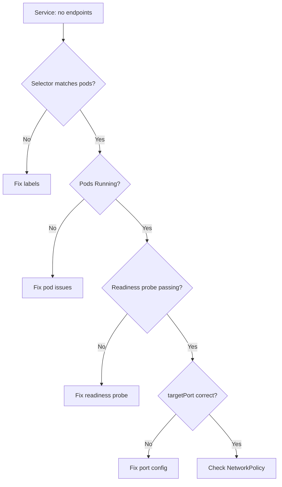

> 💡 **Quick Answer:** Run `kubectl get endpoints <service-name>` — if empty, the Service selector doesn't match any Ready pods. Check: (1) `kubectl get pods --show-labels` matches Service selector, (2) pods are Running AND passing readiness probes, (3) Service `targetPort` matches container port.

## The Problem

Your Service exists but returns "connection refused" or times out. `kubectl get endpoints <svc>` shows `<none>`. Traffic has nowhere to go because the Service can't find any matching, ready backend pods.

## The Solution

### Step 1: Check Endpoints

```bash
kubectl get endpoints my-service -n myapp
# NAME         ENDPOINTS   AGE
# my-service   <none>      5d    ← No backends!
```

### Step 2: Compare Labels

```bash
# Get the Service selector
kubectl get svc my-service -n myapp -o jsonpath='{.spec.selector}'
# {"app":"myapp","tier":"backend"}

# Check pod labels
kubectl get pods -n myapp --show-labels
# NAME              READY   STATUS    LABELS
# myapp-backend-1   1/1     Running   app=myapp,tier=api    ← "tier=api" ≠ "tier=backend"!
```

Fix: update the Service selector or pod labels to match.

### Step 3: Check Readiness

```bash
# Pods must be Ready (READY column shows X/X)
kubectl get pods -n myapp -l app=myapp
# NAME              READY   STATUS    RESTARTS
# myapp-backend-1   0/1     Running   0         ← Not ready! Failing readiness probe

# Check readiness probe
kubectl describe pod myapp-backend-1 -n myapp | grep -A5 "Readiness:"
```

### Step 4: Verify Ports

```bash
# Service targetPort must match container port
kubectl get svc my-service -n myapp -o json | jq '.spec.ports'
# [{"port": 80, "targetPort": 8080}]

# Container must listen on 8080
kubectl exec myapp-backend-1 -n myapp -- ss -tlnp | grep 8080
# If nothing listens on 8080, the port is wrong
```



## Common Issues

### Named Port Mismatch

```yaml
# Service references port by name
spec:
  ports:
    - port: 80
      targetPort: http   # Looks for container port NAMED "http"
# Container must declare:
  ports:
    - name: http         # Must match exactly
      containerPort: 8080
```

### Pods in Different Namespace

Services only select pods in the same namespace (unless using EndpointSlices or ExternalName).

## Best Practices

- **Always verify endpoints after creating a Service** — `kubectl get endpoints`
- **Use label consistency** — define labels in a shared values file or kustomization
- **Set readiness probes** — without them, pods are "ready" even if the app isn't serving
- **Name your ports** — easier to reference in Services and avoids port number mismatches

## Key Takeaways

- No endpoints = selector mismatch, pods not Ready, or port misconfiguration
- Labels must match exactly — `app=myapp` ≠ `app=my-app`
- Readiness probes gate endpoint registration — failing probes = no traffic
- `targetPort` must match the container's listening port (number or name)
