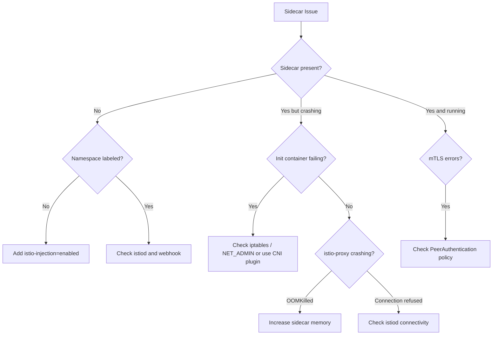

> 💡 **Quick Answer:** Missing sidecars mean the injection webhook isn't firing. Check: namespace has `istio-injection=enabled` label, `istio-sidecar-injector` MutatingWebhookConfiguration exists, and the istiod pod is healthy. For mTLS errors, check `PeerAuthentication` policies and certificate validity.

## The Problem

```bash
# Pod running without sidecar
$ kubectl get pods myapp-abc123 -o jsonpath='{.spec.containers[*].name}'
myapp
# Expected: myapp istio-proxy

# Or sidecar present but failing
$ kubectl get pods
NAME                    READY   STATUS                  RESTARTS   AGE
myapp-abc123            1/2     Init:CrashLoopBackOff   3          2m
```

## The Solution

### Missing Sidecar — Fix Injection

```bash
# Check namespace label
kubectl get namespace default --show-labels | grep istio
# Must have: istio-injection=enabled

# Enable injection
kubectl label namespace default istio-injection=enabled

# Check webhook exists
kubectl get mutatingwebhookconfiguration | grep istio

# Check istiod is running
kubectl get pods -n istio-system -l app=istiod

# Restart pods to trigger injection
kubectl rollout restart deployment myapp
```

### Sidecar CrashLoopBackOff — Fix Init Container

```bash
# Check init container logs
kubectl logs myapp-abc123 -c istio-init

# Common: iptables rules failed
# Fix: pod needs NET_ADMIN capability
# Or use Istio CNI plugin to avoid init container entirely
```

### mTLS Connection Errors

```bash
# Check if mTLS is enforced
kubectl get peerauthentication -A

# Test from inside the mesh
kubectl exec myapp-abc123 -c istio-proxy -- \
  curl -v http://backend-svc:8080

# Check certificate validity
kubectl exec myapp-abc123 -c istio-proxy -- \
  openssl s_client -connect backend-svc:8080 -showcerts 2>/dev/null | \
  openssl x509 -noout -dates
```



## Common Issues

### Some pods get sidecars, others don't
Check for `sidecar.istio.io/inject: "false"` annotation on the pod or deployment.

### Sidecar uses too much memory
Set proxy resource limits:
```yaml
annotations:
  sidecar.istio.io/proxyMemory: "128Mi"
  sidecar.istio.io/proxyMemoryLimit: "256Mi"
```

### Connection refused after enabling STRICT mTLS
Services outside the mesh can't connect. Use `PERMISSIVE` mode during migration:
```yaml
apiVersion: security.istio.io/v1
kind: PeerAuthentication
metadata:
  name: default
  namespace: istio-system
spec:
  mtls:
    mode: PERMISSIVE
```

## Best Practices

- **Use Istio CNI plugin** to avoid `NET_ADMIN` requirement and init container issues
- **Start with PERMISSIVE mTLS** and switch to STRICT after verifying all services work
- **Set sidecar resource limits** to prevent proxy memory leaks from affecting pods
- **Use `istioctl analyze`** to catch configuration errors before they cause runtime issues

## Key Takeaways

- No sidecar = check namespace label + webhook + istiod health
- Init container crash = iptables permission issue — use CNI plugin
- mTLS errors = check PeerAuthentication policies and cert expiry
- `istioctl analyze` catches most config issues proactively
