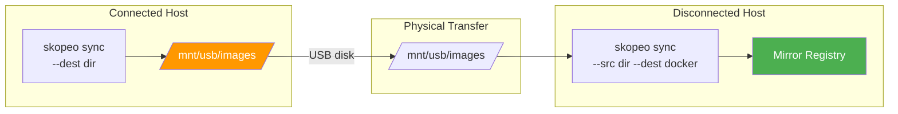

> 💡 **Quick Answer:** Skopeo is a CLI tool that inspects, copies, syncs, and deletes container images without requiring a daemon or root privileges. Use `skopeo copy` to mirror individual images between registries, `skopeo inspect` to check manifests and digests remotely, and `skopeo sync` to bulk-mirror repositories — all without pulling images to local storage first.

## The Problem

Managing container images across registries — especially in disconnected or multi-registry environments — requires:

- Copying images between registries without pulling to local storage
- Inspecting image metadata (digests, layers, labels) without downloading
- Bulk-syncing repositories for air-gapped transfers
- Verifying images exist in mirror registries before disconnecting
- Working with multiple transport types (docker, OCI, dir, docker-archive)
- No daemon dependency (unlike `docker` CLI)

## The Solution

### Install Skopeo

```bash
# RHEL/CentOS/Fedora
sudo dnf install -y skopeo

# Ubuntu/Debian
sudo apt-get install -y skopeo

# macOS
brew install skopeo

# Verify
skopeo --version
```

### Inspect Images (Remote, No Download)

```bash
# Inspect image metadata from registry
skopeo inspect docker://registry.redhat.io/ubi9/ubi:latest

# Get just the digest
skopeo inspect docker://quay.io/openshift-release-dev/ocp-release:4.18.15-x86_64 \
  --format '{{.Digest}}'

# Inspect raw manifest (multi-arch)
skopeo inspect --raw docker://registry.redhat.io/ubi9/ubi:latest | jq .

# List tags for a repository
skopeo list-tags docker://registry.example.com/myapp

# Inspect from private registry
skopeo inspect docker://registry.example.com:8443/ocp/release:4.18.15 \
  --authfile /run/user/1000/containers/auth.json
```

### Copy Images Between Registries

```bash
# Copy single image between registries (no local storage needed)
skopeo copy \
  docker://registry.redhat.io/ubi9/ubi:latest \
  docker://registry.example.com:8443/ubi9/ubi:latest

# Copy with authentication
skopeo copy \
  --src-authfile /path/to/source-auth.json \
  --dest-authfile /path/to/dest-auth.json \
  docker://quay.io/myorg/myapp:v1.0 \
  docker://internal-registry.example.com/myorg/myapp:v1.0

# Copy by digest (pinned, immutable)
skopeo copy \
  docker://registry.redhat.io/ubi9/ubi@sha256:abc123... \
  docker://registry.example.com:8443/ubi9/ubi@sha256:abc123...

# Copy preserving all architectures (multi-arch)
skopeo copy --all \
  docker://registry.redhat.io/ubi9/ubi:latest \
  docker://registry.example.com:8443/ubi9/ubi:latest

# Copy to a local directory (OCI layout)
skopeo copy \
  docker://registry.redhat.io/ubi9/ubi:latest \
  oci:/tmp/ubi-image:latest

# Copy to a tar archive
skopeo copy \
  docker://registry.redhat.io/ubi9/ubi:latest \
  docker-archive:/tmp/ubi-latest.tar:ubi9/ubi:latest

# Copy from tar to registry (air-gapped transfer)
skopeo copy \
  docker-archive:/tmp/ubi-latest.tar \
  docker://registry.example.com:8443/ubi9/ubi:latest
```

### Sync Entire Repositories

```bash
# Sync all tags from source to destination registry
skopeo sync --src docker --dest docker \
  registry.redhat.io/ubi9/ubi \
  registry.example.com:8443/

# Sync to local directory (for air-gapped transfer)
skopeo sync --src docker --dest dir \
  registry.redhat.io/ubi9/ubi \
  /mnt/transfer-disk/images/

# Sync from local directory to registry
skopeo sync --src dir --dest docker \
  /mnt/transfer-disk/images/ \
  registry.example.com:8443/

# Sync using a YAML source file
cat > sync-config.yaml << EOF
registry.redhat.io:
  images:
    ubi9/ubi:
    - latest
    - "9.4"
    ubi9/ubi-minimal:
    - latest
quay.io:
  images:
    prometheus/prometheus:
    - v2.53.0
    grafana/grafana:
    - "11.0.0"
EOF

skopeo sync --src yaml --dest docker \
  sync-config.yaml \
  registry.example.com:8443/
```

### Delete Images

```bash
# Delete an image tag from a registry
skopeo delete docker://registry.example.com:8443/myapp:old-tag

# Delete by digest
skopeo delete docker://registry.example.com:8443/myapp@sha256:abc123...
```

### Transport Types

| Transport | Format | Use Case |
|-----------|--------|----------|
| `docker://` | Registry v2 API | Remote registry operations |
| `oci:` | OCI layout on disk | Standards-compliant local storage |
| `dir:` | Flat directory | Simple local copy |
| `docker-archive:` | Docker tar format | Portable archive for transfer |
| `docker-daemon:` | Local Docker daemon | Import/export from Docker |
| `containers-storage:` | Podman/CRI-O storage | Local container storage |

### Disconnected Workflow Example



```bash
# On connected host: sync to disk
skopeo sync --src yaml --dest dir \
  images-to-mirror.yaml \
  /mnt/usb-drive/images/

# Transfer USB drive to disconnected network

# On disconnected host: sync from disk to registry
skopeo sync --src dir --dest docker \
  /mnt/usb-drive/images/ \
  registry.example.com:8443/

# Verify
skopeo inspect docker://registry.example.com:8443/ubi9/ubi:latest
```

### TLS and Authentication

```bash
# Skip TLS verification (self-signed certs)
skopeo copy --src-tls-verify=false --dest-tls-verify=false \
  docker://source-registry:5000/myapp:v1 \
  docker://dest-registry:5000/myapp:v1

# Use custom CA certificate
skopeo copy --dest-cert-dir=/etc/docker/certs.d/registry.example.com:8443 \
  docker://quay.io/myapp:v1 \
  docker://registry.example.com:8443/myapp:v1

# Login (saves to containers/auth.json)
skopeo login registry.example.com:8443

# Login with credentials
skopeo login -u admin -p secret registry.example.com:8443
```

## Common Issues

**"manifest unknown" when copying**

The source image doesn't exist or the tag is wrong. Verify first with `skopeo inspect` before copying.

**"unauthorized: authentication required"**

Missing or invalid credentials. Ensure `--authfile` points to the correct auth.json, or run `skopeo login` first.

**Multi-arch copy loses architectures**

Use `--all` flag with `skopeo copy` to preserve all platform manifests. Without it, only the current platform's image is copied.

**Sync misses images with special characters in tags**

YAML sync config requires quoting tags that look like numbers (e.g., `"9.4"` not `9.4`).

## Best Practices

- **Use `skopeo inspect` before copy** — verify source exists and check digest
- **Always use `--all` for multi-arch** — especially for OpenShift release images
- **Pin by digest for production** — tags are mutable, digests are not
- **Use YAML sync files** — document exactly which images you're mirroring
- **Prefer `skopeo` over `docker pull/push`** — no daemon needed, no local storage consumed
- **Use `skopeo copy` for individual images, `oc-mirror` for bulk OpenShift content**

## Key Takeaways

- Skopeo copies images between registries without pulling to local storage
- Supports 6 transport types: docker, OCI, dir, docker-archive, docker-daemon, containers-storage
- `skopeo sync` with YAML config enables reproducible bulk mirroring
- Essential for air-gapped transfers: sync to dir → transfer media → sync from dir
- No daemon required — works in rootless, restricted, and CI/CD environments
- Complements oc-mirror: use skopeo for individual images, oc-mirror for full OpenShift content sets
