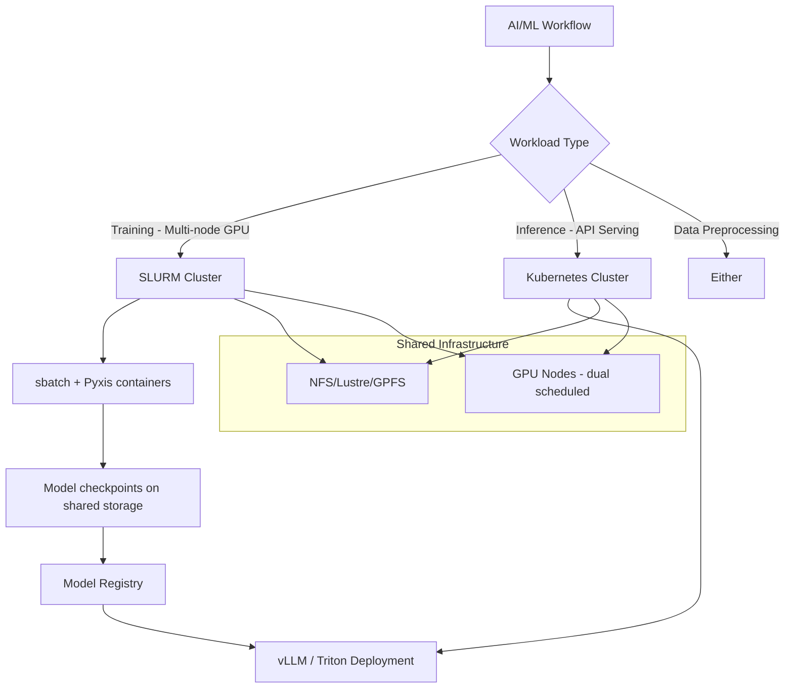

> 💡 **Quick Answer:** Bridge SLURM and Kubernetes using three approaches: **SLURM-on-K8s** (run slurmctld/slurmd in pods), **Sunk** (submit SLURM jobs from K8s), or **hybrid scheduling** (SLURM for HPC training, K8s for inference serving). For GPU AI workloads, combine with NVIDIA Pyxis for container-native SLURM jobs.

## The Problem

Many organizations run both SLURM (for HPC/AI training) and Kubernetes (for serving/microservices):

- **SLURM excels at** — large-scale batch jobs, multi-node GPU training, fair-share scheduling, job preemption
- **Kubernetes excels at** — service orchestration, autoscaling, rolling deploys, API serving
- **The gap** — training runs on SLURM, inference serves on K8s, but there's no unified workflow
- **Migration pressure** — teams want Kubernetes flexibility but can't abandon SLURM's HPC capabilities

## The Solution

### Approach 1: SLURM Inside Kubernetes

```yaml
# Run SLURM controller as a K8s StatefulSet
apiVersion: apps/v1
kind: StatefulSet
metadata:
  name: slurmctld
  namespace: slurm
spec:
  serviceName: slurmctld
  replicas: 1
  selector:
    matchLabels:
      app: slurmctld
  template:
    metadata:
      labels:
        app: slurmctld
    spec:
      containers:
        - name: slurmctld
          image: nvcr.io/nvidia/clara/slurm:latest
          # Or custom image with SLURM compiled
          command: ["/usr/sbin/slurmctld", "-D", "-vvv"]
          ports:
            - containerPort: 6817
              name: slurmctld
          env:
            - name: SLURM_CLUSTER_NAME
              value: "k8s-hpc"
          volumeMounts:
            - name: slurm-conf
              mountPath: /etc/slurm
            - name: slurm-state
              mountPath: /var/spool/slurmctld
            - name: shared-storage
              mountPath: /shared
          resources:
            requests:
              cpu: "2"
              memory: 4Gi
      volumes:
        - name: slurm-conf
          configMap:
            name: slurm-config
        - name: shared-storage
          persistentVolumeClaim:
            claimName: slurm-shared-nfs
  volumeClaimTemplates:
    - metadata:
        name: slurm-state
      spec:
        accessModes: ["ReadWriteOnce"]
        resources:
          requests:
            storage: 10Gi
---
# SLURM compute nodes as a DaemonSet on GPU nodes
apiVersion: apps/v1
kind: DaemonSet
metadata:
  name: slurmd
  namespace: slurm
spec:
  selector:
    matchLabels:
      app: slurmd
  template:
    metadata:
      labels:
        app: slurmd
    spec:
      hostNetwork: true
      hostPID: true
      containers:
        - name: slurmd
          image: nvcr.io/nvidia/clara/slurm:latest
          command: ["/usr/sbin/slurmd", "-D", "-vvv"]
          securityContext:
            privileged: true
          env:
            - name: SLURM_NODENAME
              valueFrom:
                fieldRef:
                  fieldPath: spec.nodeName
          volumeMounts:
            - name: slurm-conf
              mountPath: /etc/slurm
            - name: shared-storage
              mountPath: /shared
          resources:
            limits:
              nvidia.com/gpu: "8"
              memory: 256Gi
              cpu: "64"
      nodeSelector:
        nvidia.com/gpu.present: "true"
      volumes:
        - name: slurm-conf
          configMap:
            name: slurm-config
        - name: shared-storage
          persistentVolumeClaim:
            claimName: slurm-shared-nfs
---
apiVersion: v1
kind: Service
metadata:
  name: slurmctld
  namespace: slurm
spec:
  selector:
    app: slurmctld
  ports:
    - port: 6817
      name: slurmctld
  clusterIP: None
```

### SLURM Configuration

```yaml
apiVersion: v1
kind: ConfigMap
metadata:
  name: slurm-config
  namespace: slurm
data:
  slurm.conf: |
    ClusterName=k8s-hpc
    SlurmctldHost=slurmctld-0.slurmctld.slurm.svc.cluster.local
    
    # Scheduling
    SchedulerType=sched/backfill
    SelectType=select/cons_tres
    SelectTypeParameters=CR_Core_Memory
    
    # GPU support
    GresTypes=gpu
    
    # Accounting
    AccountingStorageType=accounting_storage/slurmdbd
    JobAcctGatherType=jobacct_gather/cgroup
    
    # Nodes (auto-discovered from K8s GPU nodes)
    NodeName=DEFAULT CPUs=64 RealMemory=256000 Gres=gpu:8 State=UNKNOWN
    PartitionName=gpu Nodes=ALL Default=YES MaxTime=INFINITE State=UP
    
  gres.conf: |
    AutoDetect=nvml
    
  cgroup.conf: |
    CgroupPlugin=cgroup/v2
    ConstrainCores=yes
    ConstrainDevices=yes
    ConstrainRAMSpace=yes
    ConstrainSwapSpace=yes
```

### Approach 2: Submit SLURM Jobs from Kubernetes

```yaml
# Job submission pod — sbatch from within K8s
apiVersion: batch/v1
kind: Job
metadata:
  name: slurm-training-submit
  namespace: slurm
spec:
  template:
    spec:
      restartPolicy: Never
      containers:
        - name: submit
          image: python:3.11-slim
          command:
            - /bin/bash
            - -c
            - |
              apt-get update && apt-get install -y slurm-client
              
              # Create SLURM batch script
              cat << 'SBATCH' > /tmp/train.sh
              #!/bin/bash
              #SBATCH --job-name=llm-training
              #SBATCH --nodes=4
              #SBATCH --ntasks-per-node=8
              #SBATCH --gres=gpu:8
              #SBATCH --time=24:00:00
              #SBATCH --partition=gpu
              #SBATCH --output=/shared/logs/%j.out
              
              # Load container via Pyxis
              srun --container-image=nvcr.io/nvidia/pytorch:24.12-py3 \
                   --container-mounts=/shared:/shared \
                   torchrun \
                   --nnodes=$SLURM_NNODES \
                   --nproc-per-node=8 \
                   --rdzv-backend=c10d \
                   --rdzv-endpoint=$SLURM_NODELIST:29500 \
                   /shared/train.py \
                   --model llama-3.1-8b \
                   --data /shared/dataset \
                   --output /shared/checkpoints
              SBATCH
              
              # Submit the job
              sbatch /tmp/train.sh
              echo "Job submitted. Check with: squeue"
          volumeMounts:
            - name: slurm-conf
              mountPath: /etc/slurm
            - name: shared-storage
              mountPath: /shared
      volumes:
        - name: slurm-conf
          configMap:
            name: slurm-config
        - name: shared-storage
          persistentVolumeClaim:
            claimName: slurm-shared-nfs
```

### Approach 3: Hybrid Architecture



### SLURM vs Kubernetes for AI Workloads

```text
| Feature              | SLURM                    | Kubernetes               |
|----------------------|--------------------------|--------------------------|
| Batch scheduling     | Excellent (backfill)     | Good (Volcano, Kueue)    |
| Multi-node GPU       | Native (srun, MPI)       | Needs operators          |
| Fair-share           | Built-in                 | Kueue                    |
| Job preemption       | Native                   | PriorityClass            |
| Service serving      | Not designed for it      | Excellent                |
| Autoscaling          | Manual                   | HPA/KEDA                 |
| Container support    | Pyxis/Enroot             | Native                   |
| Rolling updates      | No                       | Native                   |
| Health checks        | Basic (prolog/epilog)    | Probes                   |
| Ecosystem            | HPC tools                | Cloud-native tools       |
```

## Common Issues

### Shared storage between SLURM and K8s

```bash
# Both SLURM and K8s pods need access to the same filesystem
# Options:
# 1. NFS — simple, works for most cases
# 2. Lustre — high-performance parallel filesystem
# 3. GPFS/Spectrum Scale — enterprise
# 4. BeeGFS — open-source parallel FS

# NFS PVC for K8s:
apiVersion: v1
kind: PersistentVolume
metadata:
  name: slurm-shared
spec:
  capacity:
    storage: 10Ti
  accessModes:
    - ReadWriteMany
  nfs:
    server: nfs.internal.example.com
    path: /shared/slurm
```

### GPU resource conflict

```bash
# If SLURM and K8s both manage the same GPUs:
# Option 1: Dedicated nodes — label nodes for SLURM or K8s, not both
# Option 2: Time-sharing — SLURM during training hours, K8s for inference
# Option 3: GPU partitioning — SLURM gets GPUs 0-3, K8s gets 4-7

# Taint GPU nodes for SLURM-only:
kubectl taint nodes gpu-node-01 slurm=true:NoSchedule
```

## Best Practices

- **Hybrid architecture** — SLURM for training, K8s for inference
- **Shared filesystem** — NFS or Lustre accessible from both SLURM and K8s
- **Pyxis** for SLURM containers — run NGC containers natively in SLURM jobs
- **Dedicated GPU pools** — avoid scheduling conflicts between SLURM and K8s
- **Model registry bridge** — checkpoints from SLURM training → K8s inference serving
- **Consider Kueue** — Kubernetes-native batch scheduling as SLURM alternative

## Key Takeaways

- **SLURM + Kubernetes** is the standard hybrid architecture for AI/HPC organizations
- Three approaches: **SLURM-in-K8s**, **K8s-submits-to-SLURM**, or **hybrid side-by-side**
- SLURM excels at **multi-node GPU training** with backfill scheduling
- Kubernetes excels at **inference serving** with autoscaling and rolling updates
- **Shared storage** (NFS/Lustre) is the bridge between both systems
- Use **NVIDIA Pyxis** for container-native SLURM jobs
