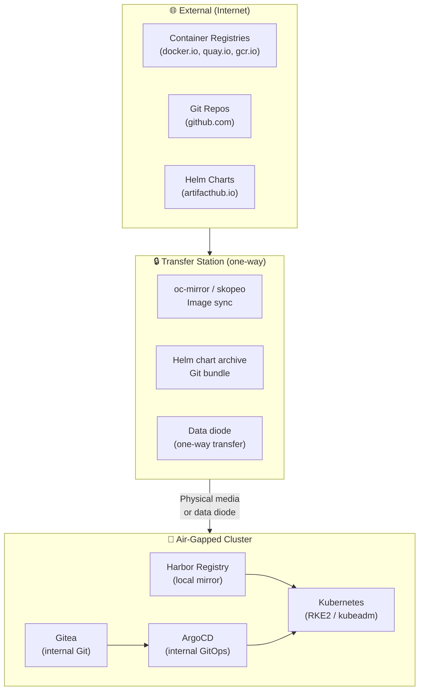

> 💡 **Quick Answer:** Air-gapped Kubernetes runs completely disconnected from the internet — required for government, defense, and critical infrastructure. Install with pre-packaged binaries (kubeadm bundle or RKE2), mirror all images to a local registry (Harbor), use oc-mirror/skopeo for image sync, and run GitOps against internal Git servers. Sovereign = you control the entire stack, no external dependencies.

## The Problem

Gartner's 2026 trend of "geopatriation" extends to sovereign tech stacks — countries and enterprises are building fully self-contained infrastructure with no external dependencies. Air-gapped Kubernetes is the extreme: no internet access, no cloud API calls, no external DNS, no package downloads. Every dependency must be pre-staged. This is mandatory for defense, intelligence, healthcare, critical infrastructure, and some financial systems.



## The Solution

### Phase 1: Mirror Images (Connected Side)

```bash
# Option A: oc-mirror (OpenShift/OKD)
oc-mirror --config imageset-config.yaml file://mirror-bundle

# imageset-config.yaml
kind: ImageSetConfiguration
mirror:
  platform:
    channels:
      - name: stable-4.15
  additionalImages:
    - name: registry.k8s.io/kube-apiserver:v1.30.0
    - name: registry.k8s.io/kube-controller-manager:v1.30.0
    - name: registry.k8s.io/kube-scheduler:v1.30.0
    - name: registry.k8s.io/etcd:3.5.15-0
    - name: registry.k8s.io/coredns/coredns:v1.11.1
    - name: registry.k8s.io/pause:3.9
    - name: docker.io/calico/cni:v3.28.0
    - name: docker.io/calico/node:v3.28.0
    - name: quay.io/argoproj/argocd:v2.12.0
    # GPU Operator
    - name: nvcr.io/nvidia/gpu-operator:v24.3.0
    - name: nvcr.io/nvidia/driver:550.90.07

# Option B: skopeo copy (image-by-image)
skopeo copy \
  docker://registry.k8s.io/kube-apiserver:v1.30.0 \
  dir:///transfer/kube-apiserver-v1.30.0

# Option C: crane (bulk)
crane pull registry.k8s.io/kube-apiserver:v1.30.0 \
  /transfer/kube-apiserver-v1.30.0.tar
```

### Phase 2: Transfer to Air-Gapped Network

```bash
# Pack everything for physical transfer
tar czf k8s-airgap-bundle-$(date +%Y%m%d).tar.gz \
  /transfer/images/ \
  /transfer/charts/ \
  /transfer/binaries/ \
  /transfer/git-bundles/

# Transfer via:
# - USB drive / external SSD
# - Data diode (one-way network device)
# - Cross-domain solution (CDS)
# - Burnt DVD/Blu-ray (for audit trail)

# Verify integrity after transfer
sha256sum -c checksums.sha256
```

### Phase 3: Load into Air-Gapped Registry

```bash
# Push images to internal Harbor
for image_dir in /transfer/images/*/; do
  IMAGE_NAME=$(basename $image_dir)
  skopeo copy \
    dir://$image_dir \
    docker://harbor.internal.local/$IMAGE_NAME
done

# Or use oc-mirror to load
oc-mirror --from /transfer/mirror-bundle \
  docker://harbor.internal.local
```

### Harbor Registry (Air-Gapped)

```yaml
# Harbor deployed inside air-gapped cluster
apiVersion: apps/v1
kind: Deployment
metadata:
  name: harbor-core
  namespace: registry
spec:
  template:
    spec:
      containers:
        - name: harbor
          image: harbor.internal.local/goharbor/harbor-core:v2.11.0
          env:
            - name: REGISTRY_STORAGE_FILESYSTEM_ROOTDIRECTORY
              value: "/storage"
          volumeMounts:
            - name: storage
              mountPath: /storage
      volumes:
        - name: storage
          persistentVolumeClaim:
            claimName: harbor-storage   # Large PVC for all mirrored images
```

### RKE2 Offline Installation

```bash
# On connected machine: download RKE2 bundle
curl -sfL https://get.rke2.io --output install.sh
# Download images tarball
curl -sfL https://github.com/rancher/rke2/releases/download/v1.30.0+rke2r1/rke2-images.linux-amd64.tar.zst \
  -o rke2-images.tar.zst

# Transfer to air-gapped node, then:
# 1. Place images
mkdir -p /var/lib/rancher/rke2/agent/images/
cp rke2-images.tar.zst /var/lib/rancher/rke2/agent/images/

# 2. Install RKE2
INSTALL_RKE2_ARTIFACT_PATH=/transfer/binaries \
  sh install.sh

# 3. Configure private registry
cat > /etc/rancher/rke2/registries.yaml <<EOF
mirrors:
  "docker.io":
    endpoint:
      - "https://harbor.internal.local"
  "registry.k8s.io":
    endpoint:
      - "https://harbor.internal.local"
  "quay.io":
    endpoint:
      - "https://harbor.internal.local"
configs:
  "harbor.internal.local":
    tls:
      ca_file: /etc/pki/ca-trust/source/anchors/harbor-ca.crt
EOF

# 4. Start RKE2
systemctl enable rke2-server
systemctl start rke2-server
```

### Internal GitOps (ArgoCD + Gitea)

```yaml
# Gitea — lightweight internal Git server
apiVersion: apps/v1
kind: Deployment
metadata:
  name: gitea
  namespace: git
spec:
  template:
    spec:
      containers:
        - name: gitea
          image: harbor.internal.local/gitea/gitea:1.22
          ports:
            - containerPort: 3000
            - containerPort: 22
          volumeMounts:
            - name: data
              mountPath: /data
---
# ArgoCD pointed at internal Gitea
apiVersion: argoproj.io/v1alpha1
kind: Application
metadata:
  name: platform-apps
  namespace: argocd
spec:
  source:
    repoURL: https://gitea.internal.local/platform/manifests.git
    path: apps/
    targetRevision: main
  destination:
    server: https://kubernetes.default.svc
  syncPolicy:
    automated:
      selfHeal: true
```

### ImageContentSourcePolicy (IDMS)

Redirect all image pulls to internal registry:

```yaml
# For OpenShift
apiVersion: config.openshift.io/v1
kind: ImageDigestMirrorSet
metadata:
  name: airgap-mirrors
spec:
  imageDigestMirrors:
    - source: docker.io
      mirrors:
        - harbor.internal.local/dockerhub
    - source: registry.k8s.io
      mirrors:
        - harbor.internal.local/k8s
    - source: quay.io
      mirrors:
        - harbor.internal.local/quay
    - source: nvcr.io
      mirrors:
        - harbor.internal.local/nvidia
```

### Offline Helm Charts

```bash
# Connected side: package charts
helm pull argo/argo-cd --version 7.3.0
helm pull prometheus-community/kube-prometheus-stack --version 61.0.0
helm pull nvidia/gpu-operator --version v24.3.0

# Transfer .tgz files to air-gapped cluster
# Install from local files
helm install argocd /charts/argo-cd-7.3.0.tgz \
  --set global.image.repository=harbor.internal.local/argoproj/argocd \
  -n argocd --create-namespace
```

### Update Process

```bash
# Monthly sync procedure:
# 1. (Connected) Pull new images + charts + patches
./sync-images.sh --since-last-sync

# 2. (Connected) Create transfer bundle
./create-bundle.sh --output /media/usb/bundle-$(date +%Y%m).tar.gz

# 3. (Transfer) Physical media through security checkpoint
# Scan bundle for malware/anomalies

# 4. (Air-gapped) Load bundle
./load-bundle.sh --input /media/usb/bundle-202604.tar.gz

# 5. (Air-gapped) Update cluster
helm upgrade --reuse-values argocd /charts/argo-cd-7.4.0.tgz
kubectl rollout restart deployment -n monitoring
```

## Common Issues

| Issue | Cause | Fix |
|-------|-------|-----|
| \`ImagePullBackOff\` | Image not in local registry | Mirror the missing image |
| Certificate errors | Harbor CA not trusted by nodes | Distribute CA cert to all nodes |
| Helm chart needs internet | Chart has external dependencies | Pre-pull all sub-charts |
| DNS resolution fails | No external DNS | Use CoreDNS with internal-only zones |
| Time sync drift | No NTP servers | Deploy internal NTP (chrony) or GPS clock |
| CVE updates delayed | Manual sync process | Establish regular sync cadence (weekly/monthly) |

## Best Practices

- **Automate the mirror process** — scripted, reproducible, auditable
- **Verify checksums after transfer** — detect corruption from physical media
- **Use data diodes** — hardware-enforced one-way data flow for highest security
- **Mirror by digest, not tag** — tags can be reassigned; digests are immutable
- **Test updates in staging** — air-gapped staging cluster before production
- **Document every transfer** — compliance requires chain of custody

## Key Takeaways

- Air-gapped K8s = zero internet access — every dependency must be pre-staged
- Mirror images with oc-mirror/skopeo, transfer via physical media or data diode
- Harbor provides the internal container registry; Gitea provides internal Git
- RKE2 and kubeadm support offline installation with pre-loaded images
- ImageDigestMirrorSet redirects all pulls to internal registry transparently
- 2026 trend: sovereign tech stacks with no external dependencies
