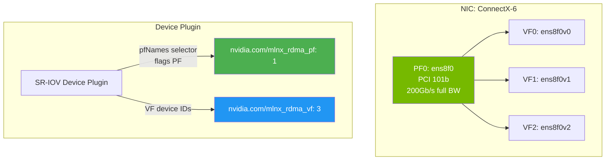

> 💡 **Quick Answer:** The SR-IOV Network Device Plugin can flag Physical Functions (PFs) as allocatable resources alongside or instead of VFs. Set `"isRdma": true` on the PF resource pool to expose the PF's RDMA device directly, or use the `"pfNames"` selector to target specific PFs. This is critical for single-tenant GPU clusters where pods need the full PF bandwidth for GPUDirect RDMA without VF overhead.

## The Problem

By default, the SR-IOV device plugin only exposes Virtual Functions (VFs) as Kubernetes resources. But some workloads need direct Physical Function access:

- **GPUDirect RDMA** at full line rate — VFs add overhead and limit MTU/features
- **DPDK applications** that need PF-level control
- **Single-tenant GPU nodes** where VF splitting is unnecessary
- **RDMA verbs on the PF** — some NICs don't support RDMA on VFs without extra config
- **Monitoring and diagnostics** — PF exposes full hardware counters
- **NFSoRDMA or storage-path networking** — PF provides maximum throughput

## The Solution

### Device Plugin ConfigMap — Flagging PFs

```yaml
apiVersion: v1
kind: ConfigMap
metadata:
  name: sriovdp-config
  namespace: kube-system
data:
  config.json: |
    {
      "resourceList": [
        {
          "resourceName": "mlnx_rdma_pf",
          "resourcePrefix": "nvidia.com",
          "selectors": {
            "vendors": ["15b3"],
            "devices": ["101b"],
            "pfNames": ["ens8f0", "ens8f1"],
            "isRdma": true,
            "needVhostNet": false
          }
        },
        {
          "resourceName": "mlnx_rdma_vf",
          "resourcePrefix": "nvidia.com",
          "selectors": {
            "vendors": ["15b3"],
            "devices": ["101e"],
            "drivers": ["mlx5_core"],
            "isRdma": true
          }
        }
      ]
    }
```

Key: the `"pfNames"` selector combined with the PF's PCI device ID (e.g., `101b` for ConnectX-6) tells the device plugin to register the **PF itself** as an allocatable resource — not its VFs.

### How PF Flagging Works



### Pod Requesting PF Directly

```yaml
apiVersion: v1
kind: Pod
metadata:
  name: rdma-gpu-training
spec:
  containers:
  - name: pytorch
    image: nvcr.io/nvidia/pytorch:25.11-py3
    resources:
      limits:
        nvidia.com/gpu: 8
        nvidia.com/mlnx_rdma_pf: 1    # Full PF, not a VF
    env:
    - name: NCCL_IB_HCA
      value: "mlx5_0"                  # PF RDMA device
    - name: NCCL_NET_GDR_LEVEL
      value: "SYS"
    securityContext:
      capabilities:
        add: ["IPC_LOCK"]
```

### PF vs VF: When to Use Each

| Aspect | PF (Physical Function) | VF (Virtual Function) |
|--------|----------------------|----------------------|
| **Bandwidth** | Full line rate (200/400Gb/s) | Shared, limited by VF count |
| **Features** | All NIC features available | Subset of PF features |
| **RDMA** | Always supported | Requires `isRdma: true` + driver |
| **Isolation** | No hardware isolation | Hardware-level isolation |
| **Use case** | Single-tenant GPU, max BW | Multi-tenant, shared nodes |
| **Device type** | `netdevice` | `netdevice` or `vfio-pci` |
| **GPUDirect** | Best perf, direct DMA path | Slight overhead |

### Verifying PF Allocation

```bash
# Check node allocatable resources
kubectl get node gpu-node-1 -o json | jq '.status.allocatable' | grep mlnx
# "nvidia.com/mlnx_rdma_pf": "2"    ← 2 PFs available

# Check device plugin pods
kubectl get pods -n kube-system -l app=sriovdp

# Verify RDMA device inside pod
kubectl exec -it rdma-gpu-training -- ibv_devinfo
# hca_id: mlx5_0
# transport: InfiniBand (0)
# fw_ver: 28.39.1002
# node_guid: 0x...
# sys_image_guid: 0x...
# phys_port_cnt: 1
#   port: 1
#     state: PORT_ACTIVE (4)
#     max_mtu: 4096 (5)
#     active_mtu: 4096 (5)
#     link_layer: Ethernet

# Verify PF bandwidth (not VF-limited)
kubectl exec -it rdma-gpu-training -- ibv_devinfo -v | grep active_speed
# active_speed: 200 Gb/sec (128)

# Check NCCL picks up RDMA
kubectl exec -it rdma-gpu-training -- \
  NCCL_DEBUG=INFO NCCL_DEBUG_SUBSYS=NET python -c "import torch.distributed"
# NCCL INFO NET/IB : Using [0]mlx5_0:1/RoCE   ← RDMA confirmed
```

### Shared RDMA Device Plugin (Alternative)

For simpler setups where you just need RDMA access without SR-IOV VF management:

```yaml
apiVersion: v1
kind: ConfigMap
metadata:
  name: rdma-devices
  namespace: kube-system
data:
  config.json: |
    {
      "periodicUpdate": 300,
      "configList": [
        {
          "resourceName": "rdma_shared_device",
          "resourcePrefix": "nvidia.com",
          "rdmaHcaMax": 100,
          "devices": ["ens8f0", "ens8f1"]
        }
      ]
    }
```

The shared RDMA device plugin exposes PF RDMA devices as shared resources (many pods share one PF). Use this for single-tenant nodes; use SR-IOV PF flagging when you need the device plugin to manage exclusive PF access.

### OpenShift SR-IOV Operator — PF Policy

```yaml
apiVersion: sriovnetwork.openshift.io/v1
kind: SriovNetworkNodePolicy
metadata:
  name: pf-rdma-policy
  namespace: openshift-sriov-network-operator
spec:
  nodeSelector:
    feature.node.kubernetes.io/network-sriov.capable: "true"
  resourceName: mlnxRdmaPf
  numVfs: 0                    # Zero VFs = expose PF only
  nicSelector:
    pfNames:
    - ens8f0
    - ens8f1
    vendor: "15b3"
    deviceID: "101b"
  deviceType: netdevice        # Must be netdevice for RDMA
  isRdma: true
```

Setting `numVfs: 0` with `isRdma: true` tells the SR-IOV operator to expose the PF as an RDMA resource without creating any VFs.

### Network Attachment for PF

```yaml
apiVersion: k8s.cni.cncf.io/v1
kind: NetworkAttachmentDefinition
metadata:
  name: rdma-pf-net
  namespace: gpu-workloads
  annotations:
    k8s.v1.cni.cncf.io/resourceName: nvidia.com/mlnx_rdma_pf
spec:
  config: |
    {
      "cniVersion": "0.3.1",
      "name": "rdma-pf-network",
      "type": "host-device",
      "device": "ens8f0",
      "ipam": {
        "type": "whereabouts",
        "range": "10.10.10.0/24"
      }
    }
```

Pod annotation to attach:

```yaml
metadata:
  annotations:
    k8s.v1.cni.cncf.io/networks: rdma-pf-net
```

## Common Issues

**PF not showing as allocatable resource**

Device plugin selector doesn't match the PF's PCI device ID. Check `lspci -nn | grep Mellanox` — PF and VF have different device IDs (e.g., `101b` vs `101e` for ConnectX-6).

**Pod gets PF but no RDMA device inside**

`isRdma: true` missing in the device plugin config, or the container runtime doesn't mount `/dev/infiniband/` devices. Ensure the RDMA subsystem is in shared mode: `rdma system set netns shared`.

**PF allocated but bandwidth is VF-limited**

VFs are still created and consuming PF bandwidth. Set `numVfs: 0` in the SR-IOV policy to ensure no VFs exist, giving the PF full line rate.

**"resource already allocated" error**

PF is a single resource — only one pod can claim it exclusively. For shared access, use the RDMA shared device plugin instead.

## Best Practices

- **PF for single-tenant GPU nodes** — maximum bandwidth, no VF overhead
- **VFs for multi-tenant** — hardware isolation between tenants
- **Set `numVfs: 0` when exposing PF** — VFs steal bandwidth and features
- **`isRdma: true` is mandatory** — without it, RDMA devices aren't mounted
- **`deviceType: netdevice` for RDMA** — `vfio-pci` bypasses kernel, no RDMA verbs
- **Use shared RDMA plugin for simplicity** — when you don't need exclusive PF allocation
- **Verify with `ibv_devinfo`** — confirm RDMA device is visible and active inside the pod

## Key Takeaways

- SR-IOV device plugin can flag PFs as allocatable resources using `pfNames` selector
- PF flagging gives pods full NIC bandwidth without VF overhead
- Set `numVfs: 0` in SR-IOV policy to expose PF only (no VFs)
- Critical for GPUDirect RDMA at maximum line rate in single-tenant GPU clusters
- `isRdma: true` + `deviceType: netdevice` are mandatory for RDMA on PF
- Shared RDMA device plugin is the simpler alternative for non-exclusive PF access
- PF is a single allocatable resource — one pod per PF for exclusive access
