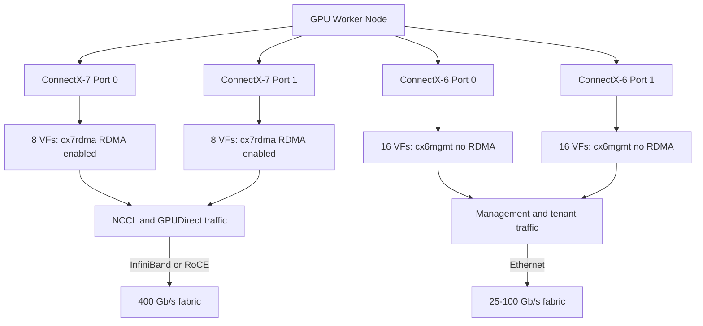

> 💡 **Quick Answer:** Use ConnectX-7 NICs for RDMA/GPUDirect data plane (SR-IOV VFs with RDMA capability) and ConnectX-6 NICs for management/tenant traffic (SR-IOV VFs without RDMA). Separate SriovNetworkNodePolicy per NIC type with different `resourceName` values.

## The Problem

GPU worker nodes typically have mixed NIC generations. RDMA-capable ConnectX-7 handles GPUDirect and NCCL traffic, while ConnectX-6 handles management, tenant ingress, and storage. Using SR-IOV on both requires separate policies, resource names, and network attachments to avoid routing RDMA traffic through the wrong NIC.

## The Solution

### Identify NICs

```bash
# List NICs and their PCI addresses
oc debug node/gpu-worker-1 -- chroot /host lspci | grep -i mellanox
# 17:00.0 Ethernet controller: Mellanox ConnectX-7 (RDMA)
# 17:00.1 Ethernet controller: Mellanox ConnectX-7 (RDMA)
# 3b:00.0 Ethernet controller: Mellanox ConnectX-6 Dx (Mgmt)
# 3b:00.1 Ethernet controller: Mellanox ConnectX-6 Dx (Mgmt)

# Check RDMA capability
oc debug node/gpu-worker-1 -- chroot /host ibstat
# Port 1 of mlx5_0 (ConnectX-7): Active, Rate 400 Gb/s
# Port 1 of mlx5_2 (ConnectX-6): Active, Rate 100 Gb/s
```

### SR-IOV Policy: ConnectX-7 (RDMA Data Plane)

```yaml
apiVersion: sriovnetwork.openshift.io/v1
kind: SriovNetworkNodePolicy
metadata:
  name: cx7-rdma-policy
  namespace: openshift-sriov-network-operator
spec:
  nodeSelector:
    feature.node.kubernetes.io/network-sriov.capable: "true"
    nvidia.com/gpu-sharing: "full"
  resourceName: cx7rdma
  numVfs: 8
  nicSelector:
    vendor: "15b3"
    deviceID: "a2dc"          # ConnectX-7
    pfNames: ["ens17f0", "ens17f1"]
  deviceType: netdevice
  isRdma: true                # Enable RDMA on VFs
  linkType: IB                # or ETH for RoCE
  mtu: 9000
```

### SR-IOV Policy: ConnectX-6 (Management Traffic)

```yaml
apiVersion: sriovnetwork.openshift.io/v1
kind: SriovNetworkNodePolicy
metadata:
  name: cx6-mgmt-policy
  namespace: openshift-sriov-network-operator
spec:
  nodeSelector:
    feature.node.kubernetes.io/network-sriov.capable: "true"
  resourceName: cx6mgmt
  numVfs: 16
  nicSelector:
    vendor: "15b3"
    deviceID: "101d"          # ConnectX-6 Dx
    pfNames: ["ens3bf0", "ens3bf1"]
  deviceType: netdevice
  isRdma: false               # No RDMA for management
  linkType: ETH
  mtu: 1500
```

### Network Attachments

```yaml
# RDMA network for NCCL / GPUDirect
apiVersion: sriovnetwork.openshift.io/v1
kind: SriovNetwork
metadata:
  name: rdma-net
  namespace: openshift-sriov-network-operator
spec:
  resourceName: cx7rdma
  networkNamespace: tenant-alpha
  ipam: |
    {
      "type": "host-local",
      "subnet": "192.168.100.0/24",
      "rangeStart": "192.168.100.10",
      "rangeEnd": "192.168.100.200"
    }
  capabilities: '{ "rdma": true }'
---
# Management network for tenant services
apiVersion: sriovnetwork.openshift.io/v1
kind: SriovNetwork
metadata:
  name: tenant-mgmt-net
  namespace: openshift-sriov-network-operator
spec:
  resourceName: cx6mgmt
  networkNamespace: tenant-alpha
  ipam: |
    {
      "type": "host-local",
      "subnet": "10.10.0.0/24",
      "rangeStart": "10.10.0.10",
      "rangeEnd": "10.10.0.200"
    }
```

### Pod with Mixed NICs

```yaml
apiVersion: v1
kind: Pod
metadata:
  name: training-job
  namespace: tenant-alpha
  annotations:
    k8s.v1.cni.cncf.io/networks: |
      [
        {
          "name": "rdma-net",
          "namespace": "tenant-alpha"
        },
        {
          "name": "tenant-mgmt-net",
          "namespace": "tenant-alpha"
        }
      ]
spec:
  containers:
    - name: trainer
      image: nvcr.io/nvidia/pytorch:24.03-py3
      resources:
        limits:
          nvidia.com/gpu: 8
          openshift.io/cx7rdma: 1      # RDMA VF from ConnectX-7
          openshift.io/cx6mgmt: 1      # Mgmt VF from ConnectX-6
      env:
        # NCCL uses RDMA NIC
        - name: NCCL_IB_HCA
          value: "mlx5_0,mlx5_1"
        - name: NCCL_NET_GDR_LEVEL
          value: "5"
        # Storage traffic on management NIC
        - name: NFS_INTERFACE
          value: "net2"
```

### Verify VF Allocation

```bash
# Check VFs created
oc debug node/gpu-worker-1 -- chroot /host \
  cat /sys/class/net/ens17f0/device/sriov_numvfs
# 8

# Check RDMA devices
oc debug node/gpu-worker-1 -- chroot /host ibstat
# mlx5_0: ConnectX-7, RDMA Active
# mlx5_2: ConnectX-6, No RDMA

# Verify pod got correct VFs
kubectl exec training-job -- ip link show
# net1: RDMA VF from CX-7 (192.168.100.x)
# net2: Mgmt VF from CX-6 (10.10.0.x)
```



## Common Issues

- **RDMA VFs not created** — SR-IOV Global Enable must be on in BIOS; verify firmware supports SR-IOV on that NIC model
- **Wrong NIC selected for NCCL** — set `NCCL_IB_HCA` explicitly to ConnectX-7 device names; without it, NCCL may pick the wrong NIC
- **VF count exceeds maximum** — ConnectX-7 supports up to 252 VFs per PF; ConnectX-6 up to 127; but practical limit is usually 8-16 per PF
- **MachineConfigPool not updating** — SR-IOV operator triggers MCO; check `oc get mcp` for rollout status
- **Mixed link types (IB + ETH)** — each SriovNetworkNodePolicy must specify correct `linkType`; don't mix IB and ETH on same policy

## Best Practices

- Separate SR-IOV policies per NIC generation — different `resourceName` per NIC type
- ConnectX-7 for RDMA (GPUDirect, NCCL); ConnectX-6 for management and storage
- Use `isRdma: true` only on NICs that need RDMA — unnecessary RDMA VFs waste resources
- Set `NCCL_IB_HCA` explicitly in pod env — don't rely on NCCL auto-detection
- Match MTU to fabric: 9000 for RDMA/jumbo frames, 1500 for management
- Label nodes with NIC capabilities for pod scheduling affinity

## Key Takeaways

- Mixed NIC generations need separate SR-IOV policies with distinct `resourceName` values
- ConnectX-7 (RDMA) for data plane, ConnectX-6 for management — never mix traffic paths
- Pods request specific VF types via resource limits (`openshift.io/cx7rdma`)
- NCCL must be explicitly pointed to RDMA-capable NICs via `NCCL_IB_HCA`
- BIOS SR-IOV Global Enable is a prerequisite — without it, no VFs are created
