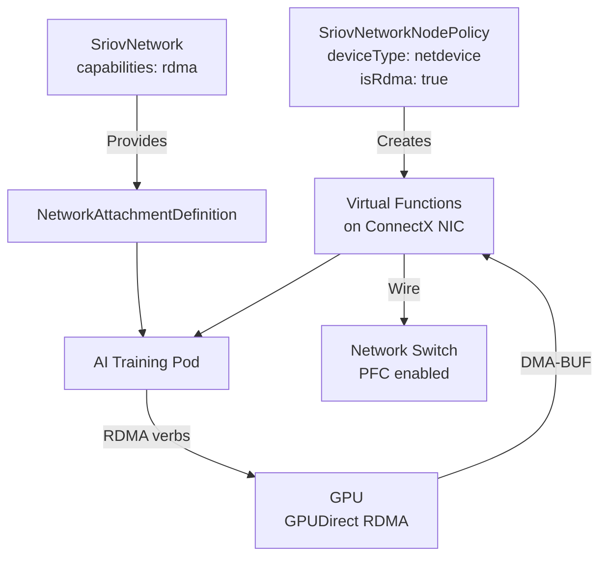

> 💡 **Quick Answer:** Create a `SriovNetworkNodePolicy` with `deviceType: netdevice` and `isRdma: true` to provision RDMA-capable Virtual Functions on Mellanox ConnectX adapters — required for GPUDirect RDMA in multi-node AI training.

## The Problem

Multi-node GPU workloads (distributed training, tensor parallelism) need low-latency, high-bandwidth pod-to-pod communication. Standard Kubernetes networking adds kernel overhead and can't provide the 100-400 Gb/s throughput that NCCL expects. You need SR-IOV Virtual Functions with RDMA verbs so GPUs can transfer data directly over InfiniBand or RoCE without CPU involvement.

Key challenges:
- VFs must be created with the correct `deviceType` — `vfio-pci` bypasses the kernel and **breaks RDMA verbs**
- The NIC vendor/device IDs must match your exact hardware
- Priority ordering matters when multiple policies target the same NIC
- RDMA must be explicitly enabled (`isRdma: true`)

## The Solution

### Prerequisites

Install the SR-IOV Network Operator and verify NIC discovery:

```bash
# Check operator is running
oc get pods -n openshift-sriov-network-operator

# Verify node NIC discovery
oc get sriovnetworknodestates -n openshift-sriov-network-operator -o yaml
```

Look for your Mellanox NICs in the output — note the `vendor`, `deviceID`, PF names, and PCI addresses.

### Identify Your Hardware

```bash
# On a worker node (via debug pod)
oc debug node/worker-gpu-01 -- chroot /host lspci -nn | grep Mellanox

# Example output:
# 3b:00.0 Ethernet controller [0200]: Mellanox Technologies ConnectX-6 Dx [15b3:101d]
# 3b:00.1 Ethernet controller [0200]: Mellanox Technologies ConnectX-6 Dx [15b3:101d]
```

Common Mellanox device IDs:

| NIC Model | Vendor | Device ID |
|-----------|--------|-----------|
| ConnectX-5 | 15b3 | 1017 |
| ConnectX-5 Ex | 15b3 | 1019 |
| ConnectX-6 | 15b3 | 101b |
| ConnectX-6 Dx | 15b3 | 101d |
| ConnectX-6 Lx | 15b3 | 101f |
| ConnectX-7 | 15b3 | 1021 |
| BlueField-2 | 15b3 | a2d6 |

### SriovNetworkNodePolicy

```yaml
apiVersion: sriovnetwork.openshift.io/v1
kind: SriovNetworkNodePolicy
metadata:
  name: mlx-rdma-policy
  namespace: openshift-sriov-network-operator
spec:
  resourceName: mlxrdma
  nodeSelector:
    feature.node.kubernetes.io/network-sriov.capable: "true"
  priority: 10
  numVfs: 8
  nicSelector:
    vendor: "15b3"
    deviceID: "101d"
    pfNames: ["ens8f0", "ens8f1"]
    rootDevices: ["0000:3b:00.0", "0000:3b:00.1"]
  deviceType: netdevice
  isRdma: true
```

#### Field Reference

| Field | Value | Why |
|-------|-------|-----|
| `deviceType` | `netdevice` | **Must be netdevice for RDMA.** `vfio-pci` passes the VF to userspace via VFIO — no kernel network stack, no RDMA verbs. |
| `isRdma` | `true` | Mounts RDMA device files (`/dev/infiniband/`) into pods requesting this resource. |
| `priority` | `10` | Lower number = higher priority. Use when multiple policies could match the same NIC. Range: 0-99. |
| `numVfs` | `8` | Number of VFs to create per PF. Match to max pods-per-node needing RDMA. Don't exceed NIC max (typically 127 for ConnectX-6+). |
| `vendor` | `15b3` | Mellanox/NVIDIA PCI vendor ID. |
| `deviceID` | `101d` | ConnectX-6 Dx. Change to match your NIC model (see table above). |
| `pfNames` | `["ens8f0"]` | Physical Function interface names. Use to target specific ports. |
| `rootDevices` | `["0000:3b:00.0"]` | PCI bus addresses. Alternative to pfNames for precise targeting. |

### Create the SriovNetwork

```yaml
apiVersion: sriovnetwork.openshift.io/v1
kind: SriovNetwork
metadata:
  name: rdma-net
  namespace: openshift-sriov-network-operator
spec:
  resourceName: mlxrdma
  networkNamespace: ai-training
  ipam: |-
    {
      "type": "whereabouts",
      "range": "10.56.0.0/16",
      "exclude": ["10.56.0.0/24"]
    }
  capabilities: '{ "rdma": true }'
```

### Pod Requesting RDMA VF

```yaml
apiVersion: v1
kind: Pod
metadata:
  name: nccl-test
  namespace: ai-training
  annotations:
    k8s.v1.cni.cncf.io/networks: rdma-net
spec:
  containers:
    - name: nccl
      image: nvcr.io/nvidia/pytorch:24.05-py3
      resources:
        requests:
          nvidia.com/gpu: 1
          openshift.io/mlxrdma: "1"
        limits:
          nvidia.com/gpu: 1
          openshift.io/mlxrdma: "1"
      securityContext:
        capabilities:
          add: ["IPC_LOCK"]
      env:
        - name: NCCL_DEBUG
          value: "INFO"
        - name: NCCL_IB_HCA
          value: "mlx5"
```

### Verify VFs Are Created

```bash
# Check VFs on worker node
oc debug node/worker-gpu-01 -- chroot /host ip link show ens8f0

# Should show VF entries:
#   vf 0 ... , link-state auto
#   vf 1 ... , link-state auto
#   ...

# Check RDMA devices
oc debug node/worker-gpu-01 -- chroot /host rdma link show

# Verify SR-IOV operator allocated resources
oc get sriovnetworknodestates -n openshift-sriov-network-operator \
  -o jsonpath='{.items[0].status.syncStatus}'
```

### Verify RDMA Inside Pod

```bash
# Exec into the pod
oc exec -it nccl-test -- bash

# Check RDMA devices are visible
ibv_devinfo
rdma link show

# Run a quick bandwidth test
ib_write_bw -d mlx5_2 &   # On one pod
ib_write_bw -d mlx5_2 <peer-ip>  # On the other
```



## Common Issues

**VFs created but no RDMA devices in pod**

Ensure `isRdma: true` is set. Without it, the RDMA device files aren't mounted:
```bash
# Check if /dev/infiniband/ exists in the pod
oc exec nccl-test -- ls /dev/infiniband/
# Should list: rdma_cm, uverbs0, etc.
```

**Using `deviceType: vfio-pci` breaks RDMA**

`vfio-pci` passes the VF as a raw PCIe device to userspace via VFIO. This is for DPDK or KubeVirt VM passthrough — it bypasses the kernel network stack entirely, so RDMA verbs (`ibv_*`) don't work. Always use `netdevice` for RDMA.

**Node reboots after applying policy**

The SR-IOV operator drains and reboots nodes to apply firmware-level VF changes. This is expected. Control the blast radius:
```bash
# Check which nodes will be affected
oc get sriovnetworknodestates -n openshift-sriov-network-operator

# Apply during maintenance windows
# Or use node selectors to target one node at a time
```

**`numVfs` exceeds NIC maximum**

Check your NIC's VF limit:
```bash
oc debug node/worker-gpu-01 -- chroot /host \
  cat /sys/class/net/ens8f0/device/sriov_totalvfs
```

**Policy priority conflicts**

When two policies match the same NIC, lower `priority` number wins. If `priority` is equal, behavior is undefined. Always use distinct priorities:
```yaml
# GPU nodes: 8 VFs for RDMA
priority: 10
# Storage nodes: 4 VFs for NVMe-oF
priority: 20
```

**NCCL falls back to TCP instead of RDMA**

Check NCCL debug output for `NET/IB` (RDMA) vs `NET/Socket` (TCP):
```bash
# Good: NCCL INFO NET/IB : Using [0]mlx5_2:1/RoCE
# Bad:  NCCL INFO NET/Socket : Using [0]eth0
```

If TCP fallback occurs:
1. Verify `IPC_LOCK` capability is granted
2. Check `NCCL_IB_HCA=mlx5` environment variable
3. Confirm RDMA device is visible: `ibv_devinfo`

## Best Practices

- **Always use `deviceType: netdevice`** for RDMA workloads — `vfio-pci` is for DPDK/VM passthrough only
- Set `numVfs` to match your max pods-per-node, not the NIC maximum — unused VFs waste resources
- Use `pfNames` OR `rootDevices` to target specific ports — using both is redundant but harmless
- Grant `IPC_LOCK` capability (via SCC or securityContext) for RDMA memory registration
- Enable open GPU kernel modules (`useOpenKernelModules: true` in ClusterPolicy) for DMA-BUF / GPUDirect RDMA
- Install NFD before the GPU Operator: NFD → GPU Operator → Network Operator → SR-IOV Operator
- Configure PFC on the switch for lossless RoCE traffic (priority 3)
- Test with `ib_write_bw` before running NCCL to isolate networking issues from GPU issues
- Use the Shared RDMA Device Plugin for single-tenant clusters; SR-IOV for multi-tenant isolation

## Key Takeaways

- `SriovNetworkNodePolicy` creates VFs at the firmware level — nodes reboot during apply
- `deviceType: netdevice` + `isRdma: true` is the only valid combination for RDMA
- `vfio-pci` bypasses kernel networking — no RDMA verbs, no `ibv_devinfo`
- The `SriovNetwork` resource creates a `NetworkAttachmentDefinition` for Multus
- Pods request VFs via resource name (`openshift.io/<resourceName>`) and network annotation
- `priority` field resolves conflicts when multiple policies match the same NIC
- NCCL needs `IPC_LOCK`, `NCCL_IB_HCA=mlx5`, and visible `/dev/infiniband/` devices
