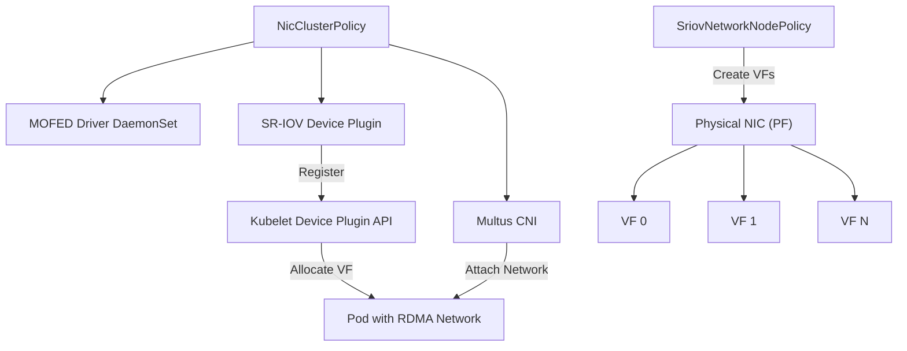

> 💡 **Quick Answer:** Define a NicClusterPolicy with SR-IOV device plugin and configure an SriovNetworkNodePolicy to create Virtual Functions on specific PCI devices, then attach VFs to pods via NetworkAttachmentDefinitions.

## The Problem

High-performance AI and HPC workloads need dedicated network interfaces with bare-metal performance inside pods. Standard CNI networking adds overhead through software bridges and kernel network stacks.

SR-IOV (Single Root I/O Virtualization) solves this by creating Virtual Functions (VFs) from a physical NIC, giving each pod direct hardware access. But configuring SR-IOV on Kubernetes requires coordinating:

- **VF creation** on physical NICs across nodes
- **Device plugin** to expose VFs to the scheduler
- **Network definitions** for pods to consume VFs
- **RDMA support** for GPUDirect workloads

## The Solution

### Step 1: Verify SR-IOV Support

```bash
# Check if SR-IOV is enabled on the NIC
lspci -vvv | grep -i "single root"
# Expected: Single Root I/O Virtualization (SR-IOV)

# Verify IOMMU is enabled
dmesg | grep -i iommu
# Expected: IOMMU enabled

# Check current VF count
cat /sys/class/net/ens3f0np0/device/sriov_numvfs
# Expected: 0 (before configuration)

# Check max VF count
cat /sys/class/net/ens3f0np0/device/sriov_totalvfs
# Expected: 128 (depends on NIC model)
```

### Step 2: Install the NVIDIA Network Operator

```bash
helm repo add nvidia https://helm.ngc.nvidia.com/nvidia
helm repo update

helm install network-operator nvidia/network-operator \
  -n nvidia-network-operator --create-namespace \
  --set nfd.enabled=true \
  --set sriovNetworkOperator.enabled=true
```

### Step 3: Configure NicClusterPolicy

The NicClusterPolicy defines cluster-wide NIC configuration including MOFED, device plugins, and secondary networks:

```yaml
apiVersion: mellanox.com/v1alpha1
kind: NicClusterPolicy
metadata:
  name: nic-cluster-policy
spec:
  ofedDriver:
    image: mofed
    repository: nvcr.io/nvstaging/mellanox
    version: "24.07-0.6.1.0"
    startupProbe:
      initialDelaySeconds: 10
      periodSeconds: 20
    livenessProbe:
      initialDelaySeconds: 30
      periodSeconds: 30
  sriovDevicePlugin:
    image: sriov-network-device-plugin
    repository: ghcr.io/k8snetworkplumbingwg
    version: "v3.7.0"
    config: |
      {
        "resourceList": [
          {
            "resourcePrefix": "nvidia.com",
            "resourceName": "rdma_vf",
            "selectors": {
              "vendors": ["15b3"],
              "devices": ["101e"],
              "drivers": ["mlx5_core"],
              "pfNames": ["ens3f0np0#0-7"],
              "isRdma": true
            }
          },
          {
            "resourcePrefix": "nvidia.com",
            "resourceName": "eth_vf",
            "selectors": {
              "vendors": ["15b3"],
              "devices": ["101e"],
              "drivers": ["mlx5_core"],
              "pfNames": ["ens3f1np1#0-7"],
              "isRdma": false
            }
          }
        ]
      }
  secondaryNetwork:
    cniPlugins:
      image: plugins
      repository: ghcr.io/k8snetworkplumbingwg
      version: "v1.5.0"
    multus:
      image: multus-cni
      repository: ghcr.io/k8snetworkplumbingwg
      version: "v4.1.0"
    ipamPlugin:
      image: nvidia-k8s-ipam
      repository: ghcr.io/mellanox
      version: "v0.3.0"
```

```bash
kubectl apply -f nic-cluster-policy.yaml
```

### Step 4: Create SriovNetworkNodePolicy

Define how many VFs to create and on which NICs:

```yaml
apiVersion: sriovnetwork.openshift.io/v1
kind: SriovNetworkNodePolicy
metadata:
  name: rdma-vfs
  namespace: nvidia-network-operator
spec:
  nodeSelector:
    feature.node.kubernetes.io/network-sriov.capable: "true"
  resourceName: rdma_vf
  numVfs: 8
  nicSelector:
    vendor: "15b3"
    pfNames:
      - "ens3f0np0"
    rootDevices:
      - "0000:d8:00.0"
  deviceType: netdevice
  isRdma: true
  linkType: ETH
  mtu: 9000
```

```bash
kubectl apply -f sriov-node-policy.yaml

# Monitor VF creation (node may reboot)
kubectl get sriovnetworknodestates -n nvidia-network-operator -w
```

### Step 5: Create NetworkAttachmentDefinition

```yaml
apiVersion: k8s.cni.cncf.io/v1
kind: NetworkAttachmentDefinition
metadata:
  name: rdma-net
  namespace: default
  annotations:
    k8s.v1.cni.cncf.io/resourceName: nvidia.com/rdma_vf
spec:
  config: |
    {
      "cniVersion": "0.3.1",
      "name": "rdma-net",
      "type": "host-device",
      "ipam": {
        "type": "nv-ipam",
        "poolName": "rdma-pool"
      }
    }
```

### Step 6: Consume VFs in Pods

```yaml
apiVersion: v1
kind: Pod
metadata:
  name: rdma-workload
  annotations:
    k8s.v1.cni.cncf.io/networks: rdma-net
spec:
  containers:
    - name: worker
      image: nvcr.io/nvidia/pytorch:24.07-py3
      resources:
        requests:
          nvidia.com/rdma_vf: "1"
        limits:
          nvidia.com/rdma_vf: "1"
      securityContext:
        capabilities:
          add: ["IPC_LOCK"]
```

### Step 7: Verify VF Assignment

```bash
# Check VFs are created on nodes
kubectl get sriovnetworknodestates -n nvidia-network-operator -o yaml | \
  grep -A5 "numVfs"

# Check allocatable resources
kubectl get node <gpu-node> -o json | jq '.status.allocatable | with_entries(select(.key | contains("nvidia")))'

# Verify RDMA inside the pod
kubectl exec rdma-workload -- ibv_devices
kubectl exec rdma-workload -- ibv_devinfo
```



## Common Issues

### VFs Not Created

```bash
# Check the SriovNetworkNodeState for errors
kubectl get sriovnetworknodestates -n nvidia-network-operator -o yaml

# Verify IOMMU is enabled in BIOS and kernel
cat /proc/cmdline | grep iommu
# Should contain: intel_iommu=on iommu=pt (Intel) or amd_iommu=on (AMD)
```

### Device Plugin Not Reporting Resources

```bash
# Check device plugin logs
kubectl logs -n nvidia-network-operator -l app=sriov-device-plugin

# Verify PCI vendor/device IDs match
lspci -nn | grep Mellanox
# Match the vendor (15b3) and device IDs in your config
```

### MTU Mismatch

VF MTU must not exceed PF MTU:

```bash
# Set PF MTU first
ip link set ens3f0np0 mtu 9000

# Then VFs inherit or can be set lower
ip link set ens3f0np0v0 mtu 9000
```

## Best Practices

- **Pin PF names with PCI addresses** — use `rootDevices` in addition to `pfNames` for deterministic selection
- **Start with fewer VFs** — begin with 4-8 VFs and increase based on workload density
- **Enable RDMA only where needed** — `isRdma: true` adds overhead; use plain VFs for non-RDMA workloads
- **Set MTU to 9000** for jumbo frames — required for optimal RDMA throughput
- **Use nv-ipam for IP management** — avoids conflicts with the primary CNI
- **Label nodes** — use node selectors to target only SR-IOV-capable hardware

## Key Takeaways

- NicClusterPolicy configures the cluster-wide NIC stack: MOFED, SR-IOV device plugin, Multus, and IPAM
- SriovNetworkNodePolicy creates VFs on physical NICs — specify count, PCI address, and RDMA mode
- Pods consume VFs via `k8s.v1.cni.cncf.io/networks` annotations and resource requests
- Always verify with `ibv_devices` and `ibv_devinfo` inside pods for RDMA workloads
