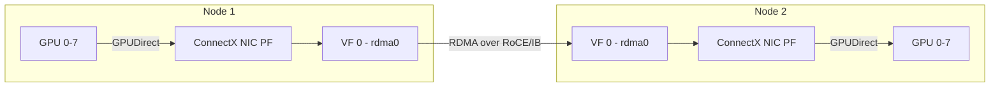

> 💡 **Quick Answer:** Attach SR-IOV RDMA VFs to AI training pods via Multus network annotations, configure NCCL to use the RDMA interface, and set `NCCL_IB_HCA` to target the correct HCA for GPUDirect communication.

## The Problem

Distributed AI training with frameworks like PyTorch DDP or DeepSpeed needs RDMA networking between GPU nodes for NCCL collective operations (AllReduce, AllGather). Pod networking must:

- Provide **bare-metal RDMA performance** — no software bridge overhead
- Support **GPUDirect RDMA** — GPU-to-GPU transfers via the NIC, bypassing CPU
- Handle **multi-NIC configurations** — separate data and RDMA traffic
- Scale across **dozens of nodes** — consistent VF allocation and IP management

## The Solution

### Step 1: Create the RDMA Network

Define a NetworkAttachmentDefinition for the RDMA VF network:

```yaml
apiVersion: k8s.cni.cncf.io/v1
kind: NetworkAttachmentDefinition
metadata:
  name: rdma-net-gpu
  namespace: ai-training
  annotations:
    k8s.v1.cni.cncf.io/resourceName: nvidia.com/rdma_vf
spec:
  config: |
    {
      "cniVersion": "0.3.1",
      "name": "rdma-net-gpu",
      "type": "host-device",
      "ipam": {
        "type": "nv-ipam",
        "poolName": "rdma-pool-1",
        "poolType": "cidrpool"
      }
    }
```

### Step 2: Create IP Pool

```yaml
apiVersion: nv-ipam.nvidia.com/v1alpha1
kind: CIDRPool
metadata:
  name: rdma-pool-1
  namespace: nvidia-network-operator
spec:
  cidr: 10.10.0.0/16
  gatewayIndex: 1
  perNodeNetworkPrefix: 24
  nodeSelector:
    nodeSelectorTerms:
      - matchExpressions:
          - key: feature.node.kubernetes.io/network-sriov.capable
            operator: Exists
```

### Step 3: Multi-NIC AI Training Pod

```yaml
apiVersion: v1
kind: Pod
metadata:
  name: ddp-worker-0
  namespace: ai-training
  annotations:
    k8s.v1.cni.cncf.io/networks: |
      [
        {
          "name": "rdma-net-gpu",
          "namespace": "ai-training",
          "interface": "rdma0"
        }
      ]
spec:
  containers:
    - name: trainer
      image: nvcr.io/nvidia/pytorch:24.07-py3
      command: ["torchrun"]
      args:
        - "--nproc_per_node=8"
        - "--nnodes=2"
        - "--node_rank=0"
        - "--master_addr=ddp-master"
        - "--master_port=29500"
        - "train.py"
      env:
        # NCCL RDMA configuration
        - name: NCCL_IB_DISABLE
          value: "0"
        - name: NCCL_IB_HCA
          value: "mlx5"
        - name: NCCL_NET_GDR_LEVEL
          value: "5"
        - name: NCCL_IB_GID_INDEX
          value: "3"
        - name: NCCL_SOCKET_IFNAME
          value: "eth0"
        - name: NCCL_DEBUG
          value: "INFO"
      resources:
        limits:
          nvidia.com/gpu: "8"
          nvidia.com/rdma_vf: "1"
        requests:
          nvidia.com/gpu: "8"
          nvidia.com/rdma_vf: "1"
      securityContext:
        capabilities:
          add: ["IPC_LOCK"]
```

### Step 4: PyTorchJob with SR-IOV VFs

For production training, use the Kubeflow Training Operator:

```yaml
apiVersion: kubeflow.org/v1
kind: PyTorchJob
metadata:
  name: llm-finetune
  namespace: ai-training
spec:
  pytorchReplicaSpecs:
    Master:
      replicas: 1
      template:
        metadata:
          annotations:
            k8s.v1.cni.cncf.io/networks: rdma-net-gpu
        spec:
          containers:
            - name: trainer
              image: nvcr.io/nvidia/pytorch:24.07-py3
              command: ["torchrun"]
              args: ["--nproc_per_node=8", "train.py"]
              env:
                - name: NCCL_IB_DISABLE
                  value: "0"
                - name: NCCL_IB_HCA
                  value: "mlx5"
                - name: NCCL_NET_GDR_LEVEL
                  value: "5"
              resources:
                limits:
                  nvidia.com/gpu: "8"
                  nvidia.com/rdma_vf: "1"
              securityContext:
                capabilities:
                  add: ["IPC_LOCK"]
          restartPolicy: OnFailure
    Worker:
      replicas: 3
      template:
        metadata:
          annotations:
            k8s.v1.cni.cncf.io/networks: rdma-net-gpu
        spec:
          containers:
            - name: trainer
              image: nvcr.io/nvidia/pytorch:24.07-py3
              command: ["torchrun"]
              args: ["--nproc_per_node=8", "train.py"]
              env:
                - name: NCCL_IB_DISABLE
                  value: "0"
                - name: NCCL_IB_HCA
                  value: "mlx5"
                - name: NCCL_NET_GDR_LEVEL
                  value: "5"
              resources:
                limits:
                  nvidia.com/gpu: "8"
                  nvidia.com/rdma_vf: "1"
              securityContext:
                capabilities:
                  add: ["IPC_LOCK"]
          restartPolicy: OnFailure
```

### Step 5: Verify RDMA in Pods

```bash
# Check the RDMA interface is present
kubectl exec -n ai-training ddp-worker-0 -- ip addr show rdma0

# Verify RDMA devices
kubectl exec -n ai-training ddp-worker-0 -- ibv_devices

# Test RDMA bandwidth between pods
# On pod 1 (server):
kubectl exec -n ai-training ddp-worker-0 -- ib_write_bw --use_cuda=0

# On pod 2 (client):
kubectl exec -n ai-training ddp-worker-1 -- ib_write_bw --use_cuda=0 <pod1-rdma-ip>
```



## Common Issues

### NCCL Falls Back to TCP

If NCCL uses TCP instead of RDMA, check:

```bash
# Look for "NCCL INFO NET/IB" in logs (RDMA) vs "NCCL INFO NET/Socket" (TCP)
kubectl logs ddp-worker-0 -n ai-training | grep "NCCL INFO NET"

# Common fixes:
# 1. Verify IPC_LOCK capability is set
# 2. Check NCCL_IB_HCA matches your device name (ibv_devices)
# 3. Set NCCL_IB_GID_INDEX for RoCE (usually 3)
```

### VF Not Visible in Pod

```bash
# Check resource allocation
kubectl describe pod ddp-worker-0 -n ai-training | grep -A5 "Allocated"

# Verify VF count on node
kubectl get sriovnetworknodestates -n nvidia-network-operator -o yaml
```

## Best Practices

- **One VF per pod** for training — each pod gets dedicated RDMA bandwidth
- **Set `NCCL_NET_GDR_LEVEL=5`** for maximum GPUDirect RDMA performance
- **Use `IPC_LOCK` capability** — required for RDMA memory registration
- **Separate data and RDMA networks** — use different PFs for storage and inter-GPU traffic
- **Set MTU 9000** on VFs for jumbo frames
- **Monitor with `ibstat` and NCCL debug logs** during initial setup

## Key Takeaways

- SR-IOV VFs with RDMA provide bare-metal networking performance for distributed AI training
- Attach VFs to pods via Multus annotations and resource requests
- Configure NCCL environment variables to use RDMA instead of TCP
- GPUDirect RDMA enables direct GPU-to-GPU transfers across nodes via the NIC
