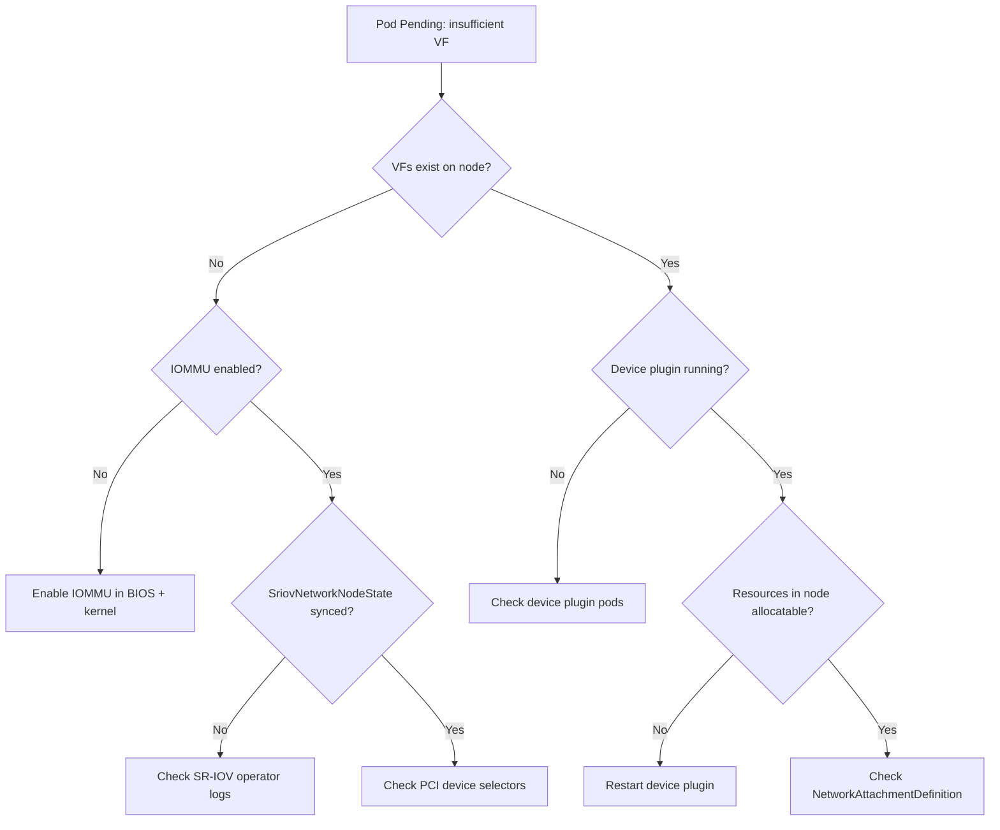

> 💡 **Quick Answer:** Check the SriovNetworkNodeState for sync status and errors, verify IOMMU is enabled, confirm device plugin pods are running, and validate VF creation with `cat /sys/class/net/<pf>/device/sriov_numvfs`.

## The Problem

SR-IOV configuration involves multiple layers — hardware, kernel, operator, device plugin, and CNI. When something fails, the error could be at any layer. Common symptoms:

- Pods stuck in `Pending` with "insufficient nvidia.com/rdma_vf" 
- VFs not appearing on nodes after applying SriovNetworkNodePolicy
- RDMA not working inside pods despite VF allocation
- Device plugin not reporting resources

## The Solution

### Diagnostic Flowchart



### Layer 1: Hardware and Kernel

```bash
# 1. Verify IOMMU is enabled
cat /proc/cmdline | grep -oE 'intel_iommu=on|amd_iommu=on|iommu=pt'
# Must show: intel_iommu=on iommu=pt (Intel) or amd_iommu=on iommu=pt (AMD)

# If missing, add kernel parameters:
# Intel: intel_iommu=on iommu=pt
# AMD: amd_iommu=on iommu=pt
# Then reboot

# 2. Verify SR-IOV capable NIC
lspci -vvv -s $(lspci | grep Mellanox | head -1 | awk '{print $1}') | grep -i "single root"
# Must show: Single Root I/O Virtualization (SR-IOV)

# 3. Check VF limits
cat /sys/class/net/ens3f0np0/device/sriov_totalvfs
# Shows maximum VF count

# 4. Check current VF count
cat /sys/class/net/ens3f0np0/device/sriov_numvfs
# Should match your SriovNetworkNodePolicy numVfs

# 5. Verify driver is loaded
lsmod | grep mlx5_core
```

### Layer 2: SR-IOV Operator

```bash
# Check SriovNetworkNodeState sync status
kubectl get sriovnetworknodestates -n nvidia-network-operator -o wide

# Detailed state per node
kubectl get sriovnetworknodestate <node-name> -n nvidia-network-operator -o yaml

# Look for:
# - syncStatus: Succeeded (good)
# - syncStatus: InProgress (still configuring)
# - syncStatus: Failed (check lastSyncError)

# Check SR-IOV operator pod logs
kubectl logs -n nvidia-network-operator deployment/sriov-network-operator --tail=100

# Check config daemon logs (runs on each node)
kubectl logs -n nvidia-network-operator -l app=sriov-network-config-daemon \
  --all-containers --tail=50
```

### Layer 3: Device Plugin

```bash
# Check device plugin pods
kubectl get pods -n nvidia-network-operator -l app=sriov-device-plugin -o wide

# Device plugin logs
kubectl logs -n nvidia-network-operator -l app=sriov-device-plugin --tail=50

# Check if resources are registered with kubelet
kubectl get node <node-name> -o json | jq '
  .status.allocatable | to_entries[] | select(.key | contains("nvidia.com"))
'
# Expected: "nvidia.com/rdma_vf": "8"

# If resources show 0, check device plugin config
kubectl get configmap -n nvidia-network-operator sriovdp-config -o yaml
```

### Layer 4: Network Attachment

```bash
# Verify NetworkAttachmentDefinition exists
kubectl get net-attach-def -A

# Check NAD config is valid JSON
kubectl get net-attach-def rdma-net -n ai-training -o jsonpath='{.spec.config}' | jq .

# Check Multus logs
kubectl logs -n kube-system -l app=multus --tail=50

# Verify pod annotation format
kubectl get pod <pod-name> -o jsonpath='{.metadata.annotations.k8s\.v1\.cni\.cncf\.io/networks}'
```

### Layer 5: RDMA Inside Pods

```bash
# Check RDMA devices are visible
kubectl exec <pod-name> -- ibv_devices
# Should list mlx5_X devices

# Check device info
kubectl exec <pod-name> -- ibv_devinfo
# Look for:
#   port: 1
#   state: PORT_ACTIVE
#   link_layer: Ethernet (RoCE) or InfiniBand

# Test RDMA connectivity
# Server pod:
kubectl exec pod-1 -- ib_write_bw -d mlx5_0 --use_cuda=0
# Client pod:
kubectl exec pod-2 -- ib_write_bw -d mlx5_0 --use_cuda=0 <server-rdma-ip>

# Check if IPC_LOCK capability is set
kubectl exec <pod-name> -- grep CapEff /proc/1/status
# Bit 14 (IPC_LOCK) must be set
```

### Common Error Messages and Fixes

**"0/3 nodes are available: insufficient nvidia.com/rdma_vf"**

```bash
# Causes:
# 1. VFs not created yet — check SriovNetworkNodeState
# 2. Device plugin not running — check pod status
# 3. All VFs already allocated — check with:
kubectl describe node <node> | grep -A10 "Allocated resources"
```

**"failed to create VFs: write to sriov_numvfs failed"**

```bash
# Causes:
# 1. IOMMU not enabled
# 2. NIC firmware doesn't support requested VF count
# 3. Existing VFs in use — drain node first

# Fix: enable IOMMU, reduce numVfs, or update firmware
mlxfwmanager --query  # Check firmware version
```

**"RDMA device not found" inside pod**

```bash
# Causes:
# 1. isRdma: false in SriovNetworkNodePolicy
# 2. Missing IPC_LOCK capability
# 3. MOFED not running

# Verify MOFED:
kubectl get pods -n gpu-operator -l app=mofed-ubuntu
# Verify policy:
kubectl get sriovnetworknodepolicies -n nvidia-network-operator -o yaml | grep isRdma
```

**"failed to set up sandbox" / Multus errors**

```bash
# Check Multus is installed and running
kubectl get pods -n kube-system -l app=multus

# Validate NAD references correct resource name
kubectl get net-attach-def <name> -o yaml
# annotation k8s.v1.cni.cncf.io/resourceName must match device plugin resource
```

### Quick Health Check Script

```bash
#!/bin/bash
# sriov-healthcheck.sh — Quick SR-IOV stack validation

echo "=== SR-IOV Health Check ==="

echo -e "\n--- SR-IOV Operator ---"
kubectl get pods -n nvidia-network-operator -l app=sriov-network-operator --no-headers

echo -e "\n--- Config Daemon ---"
kubectl get pods -n nvidia-network-operator -l app=sriov-network-config-daemon --no-headers

echo -e "\n--- Device Plugin ---"
kubectl get pods -n nvidia-network-operator -l app=sriov-device-plugin --no-headers

echo -e "\n--- Node States ---"
kubectl get sriovnetworknodestates -n nvidia-network-operator --no-headers

echo -e "\n--- VF Resources per Node ---"
for node in $(kubectl get nodes -l feature.node.kubernetes.io/network-sriov.capable -o name); do
  NODE_NAME=$(echo "$node" | cut -d/ -f2)
  VFS=$(kubectl get node "$NODE_NAME" -o jsonpath='{.status.allocatable.nvidia\.com/rdma_vf}' 2>/dev/null || echo "0")
  echo "  $NODE_NAME: $VFS VFs available"
done

echo -e "\n--- Network Attachment Definitions ---"
kubectl get net-attach-def -A --no-headers

echo -e "\n--- Pods using VFs ---"
kubectl get pods -A -o json | jq -r '
  .items[] | select(.spec.containers[].resources.limits["nvidia.com/rdma_vf"] != null) |
  "\(.metadata.namespace)/\(.metadata.name)"
'
```

## Best Practices

- **Always check SriovNetworkNodeState first** — it shows the sync status and any errors per node
- **Enable IOMMU before installing SR-IOV operator** — adding it later requires node reboot
- **Use the health check script** regularly — catch issues before workloads are affected
- **Check all 5 layers systematically** — don't skip from hardware to pod level
- **Keep NCCL_DEBUG=INFO** during initial setup — shows whether RDMA or TCP is being used
- **Document your PCI addresses** — they change across hardware generations

## Key Takeaways

- SR-IOV troubleshooting spans 5 layers: hardware, kernel, operator, device plugin, and pod networking
- Start from the bottom (IOMMU, NIC capability) and work up to pod level
- SriovNetworkNodeState is the most important diagnostic resource
- Most issues come from IOMMU not enabled, PCI selector mismatches, or missing IPC_LOCK capability
