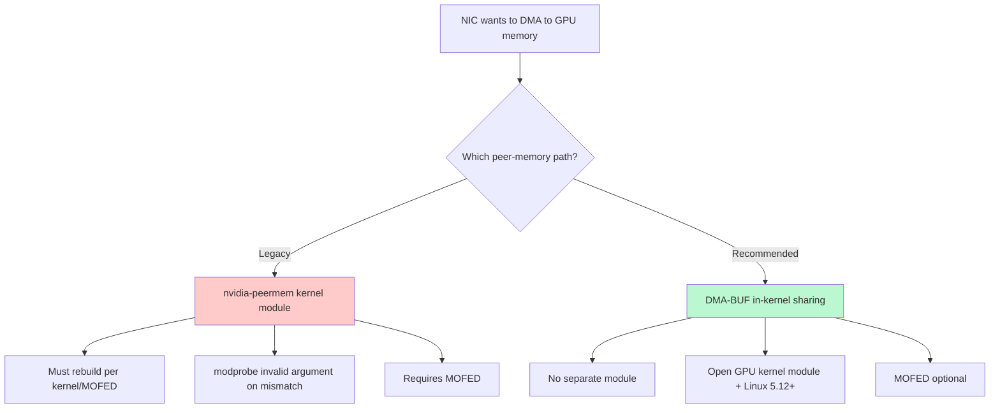

> 💡 **Quick Answer:** Do **not** set `driver.rdma.enabled=true` — that activates the legacy `nvidia-peermem` kernel module. Instead set `driver.kernelModuleType=open` and leave `driver.rdma.enabled=false` so the GPU Operator uses the modern **DMA-BUF** GPUDirect RDMA path. Verify with `NCCL_DEBUG=INFO` that the logs show DMA-BUF and that no `nvidia-peermem` module is loaded.

## The Problem

GPUDirect RDMA lets a network adapter (NIC) read and write GPU memory **directly over PCIe**, bypassing a bounce buffer in host RAM. It is what makes multi-node GPU training fast — without it, every byte of gradient data takes an extra trip through CPU memory.

Historically this required the **`nvidia-peermem`** kernel module (formerly `nv_peer_mem`), which registers GPU memory with the Mellanox/InfiniBand stack. That module is a frequent source of pain: it must be rebuilt against every kernel and MOFED upgrade, and a mismatch produces the classic failure:

```text
modprobe: ERROR: could not insert 'nvidia_peermem': Invalid argument
```

Since the open GPU kernel modules and Linux 5.12+, NVIDIA recommends the **DMA-BUF** path instead. DMA-BUF uses an in-kernel buffer-sharing framework, needs **no separate peer-memory module**, and is far more robust across kernel and driver upgrades. This recipe migrates you from `nvidia-peermem` to DMA-BUF using the NVIDIA GPU Operator.

## Two Paths to GPUDirect RDMA



Both deliver the same hardware data path (NIC ↔ GPU over PCIe); the difference is **how GPU memory is registered**. DMA-BUF removes the brittle out-of-tree module.

## Prerequisites Comparison

| Requirement | DMA-BUF (recommended) | Legacy nvidia-peermem |
|---|---|---|
| GPU Driver | Open Kernel Module | Proprietary or open |
| CUDA | 11.7+ | No minimum |
| GPU | Turing+ data center | All data center |
| MOFED | Optional | Required |
| Linux Kernel | 5.12+ | No minimum |
| Per-kernel rebuild | Not needed | Needed |

> ℹ️ DMA-BUF requires the **open** GPU kernel module (`driver.kernelModuleType=open`). On data-center GPUs (Turing and newer) this is fully supported and is the default direction NVIDIA is moving toward.

## Step 1 — Verify Prerequisites

```bash
# Kernel version must be 5.12+
uname -r

# Check GPU architecture
nvidia-smi --query-gpu=gpu_name,compute_cap --format=csv

# Verify current module state
lsmod | grep peermem
```

## Step 2 — Install GPU Operator for DMA-BUF

For new installations, simply omit `driver.rdma.enabled=true`:

```bash
# With Network Operator managing NIC drivers
helm install --wait --generate-name \
  -n gpu-operator --create-namespace \
  nvidia/gpu-operator \
  --version=v25.10.1

# With host-installed MOFED
helm install --wait --generate-name \
  -n gpu-operator --create-namespace \
  nvidia/gpu-operator \
  --version=v25.10.1 \
  --set driver.rdma.useHostMofed=true
```

## Step 3 — Migrate Existing Installation

If you previously had `driver.rdma.enabled=true`, update the ClusterPolicy:

```bash
oc edit clusterpolicy gpu-cluster-policy
```

```yaml
spec:
  driver:
    kernelModuleType: open
    rdma:
      enabled: false    # Disables legacy nvidia-peermem
```

Restart driver pods:

```bash
oc delete pod -n gpu-operator -l app=nvidia-driver-daemonset
```

## Step 4 — Verify DMA-BUF is Active

Confirm `nvidia-peermem-ctr` container is absent:

```bash
kubectl get ds -n gpu-operator nvidia-driver-daemonset -o yaml | grep -i peermem
# Expected: no output
```

Check node annotations:

```bash
oc get nodes -o json | jq '.items[].metadata.annotations["nvidia.com/gpudirect-dmabuf"]'
```

## Step 5 — Validate with NCCL

Run an `all_reduce_perf` job with NCCL logging enabled and inspect the transport:

```bash
NCCL_DEBUG=INFO \
NCCL_DEBUG_SUBSYS=NET,INIT \
NCCL_IB_HCA=mlx5_0 \
NCCL_NET_GDR_LEVEL=SYS \
all_reduce_perf -b 8 -e 8G -f 2 -g 8
```

```text
# ✅ DMA-BUF GPUDirect RDMA is active
[0] NCCL INFO NET/IB : GPU Direct RDMA (DMA-BUF) Enabled for HCA 0 'mlx5_0'
[0] NCCL INFO NET/IB : Using [0]mlx5_0:1/RoCE ; GDR enabled

# ❌ Still on the legacy module (migration incomplete)
[0] NCCL INFO NET/IB : Using peer memory driver (nvidia-peermem)
```

If bandwidth is healthy, `busbw` should plateau near your fabric's line rate at large message sizes — see [Tune NCCL Env Variables for RDMA & Ethernet](/recipes/configuration/tune-nccl-env-rdma-ethernet/) for how to read the benchmark.

## Troubleshooting Matrix

| Symptom | Likely cause | Fix |
|---------|--------------|-----|
| `modprobe: ERROR: could not insert 'nvidia_peermem': Invalid argument` | Legacy module mismatched with kernel/MOFED | Migrate to DMA-BUF (this recipe); stop loading `nvidia-peermem` |
| NCCL logs still show `peer memory driver` | `driver.rdma.enabled=true` still set | Set `rdma.enabled=false`, `kernelModuleType=open`, restart driver pods |
| `GPU Direct RDMA (DMA-BUF)` line absent | Proprietary driver in use | Switch to the open kernel module (`kernelModuleType=open`) |
| DMA-BUF enabled but bandwidth low | GDR level too conservative or PCIe topology | Set `NCCL_NET_GDR_LEVEL=SYS`; check NIC↔GPU PCIe affinity |
| Driver pod crashloops after change | Kernel older than 5.12 | Upgrade the node kernel to 5.12+ |
| Works on some nodes only | Mixed GPU architectures (pre-Turing) | DMA-BUF needs Turing+; isolate older GPUs with node labels |

> 🔧 For the standalone module failure see [Fix nvidia-peermem Not Detected](/recipes/troubleshooting/fix-nvidia-peermem-not-detected/), and validate throughput with [Validate GPUDirect RDMA Performance](/recipes/networking/validate-gpudirect-rdma-performance/).

## Frequently Asked Questions

**Is `nvidia-peermem` deprecated?**
It is not removed, but DMA-BUF is the recommended path going forward. New deployments on Turing+ GPUs with Linux 5.12+ should use DMA-BUF and avoid the separate peer-memory module entirely.

**Why do I get `modprobe nvidia_peermem invalid argument`?**
The module was built against a different kernel or MOFED version than the one currently running. Rather than chase the rebuild, migrate to DMA-BUF, which needs no peer-memory module at all.

**Do I still need MOFED for DMA-BUF?**
No — MOFED is optional for DMA-BUF. You can use inbox RDMA drivers or let the NVIDIA Network Operator manage them. MOFED was mandatory only for the legacy `nvidia-peermem` path.

**Does DMA-BUF change application code?**
No. NCCL, UCX, and CUDA-aware MPI use the same APIs. Only the kernel-level memory-registration mechanism changes; your training code is unaffected.

**Can I run both paths at once?**
No. Choose one. Running `nvidia-peermem` alongside DMA-BUF leads to ambiguous registration and the slower path may win silently. Disable `rdma.enabled` to commit to DMA-BUF.

## Why This Matters

DMA-BUF is the modern, NVIDIA-recommended path. It eliminates the `nvidia-peermem` kernel-module dependency, ends the cycle of per-kernel rebuilds and `Invalid argument` modprobe failures, makes MOFED optional, and delivers the same line-rate GPUDirect RDMA performance with far better long-term maintainability.
