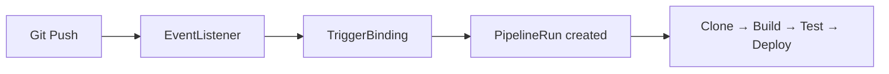

> 💡 **Quick Answer:** deployments

## The Problem

Engineers need production-ready guides for these essential Kubernetes ecosystem tools. Incomplete documentation leads to misconfiguration and security gaps.

## The Solution

### Install Tekton

```bash
kubectl apply -f https://storage.googleapis.com/tekton-releases/pipeline/latest/release.yaml
kubectl apply -f https://storage.googleapis.com/tekton-releases/triggers/latest/release.yaml
kubectl apply -f https://storage.googleapis.com/tekton-releases/dashboard/latest/release.yaml

# Dashboard
kubectl port-forward -n tekton-pipelines svc/tekton-dashboard 9097:9097
```

### Task (Reusable Step)

```yaml
apiVersion: tekton.dev/v1
kind: Task
metadata:
  name: build-and-push
spec:
  params:
    - name: image
      type: string
    - name: dockerfile
      type: string
      default: ./Dockerfile
  workspaces:
    - name: source
  steps:
    - name: build
      image: gcr.io/kaniko-project/executor:latest
      args:
        - --dockerfile=$(params.dockerfile)
        - --destination=$(params.image)
        - --context=$(workspaces.source.path)
```

### Pipeline

```yaml
apiVersion: tekton.dev/v1
kind: Pipeline
metadata:
  name: build-deploy
spec:
  params:
    - name: repo-url
    - name: image
  workspaces:
    - name: shared-workspace
  tasks:
    - name: clone
      taskRef:
        name: git-clone     # From Tekton Hub
      params:
        - name: url
          value: $(params.repo-url)
      workspaces:
        - name: output
          workspace: shared-workspace

    - name: build
      taskRef:
        name: build-and-push
      runAfter: [clone]
      params:
        - name: image
          value: $(params.image)
      workspaces:
        - name: source
          workspace: shared-workspace

    - name: deploy
      taskRef:
        name: kubectl-deploy
      runAfter: [build]
```

### Trigger on Git Push

```yaml
apiVersion: triggers.tekton.dev/v1beta1
kind: EventListener
metadata:
  name: github-listener
spec:
  triggers:
    - name: github-push
      bindings:
        - ref: github-push-binding
      template:
        ref: pipeline-template
---
apiVersion: triggers.tekton.dev/v1beta1
kind: TriggerBinding
metadata:
  name: github-push-binding
spec:
  params:
    - name: repo-url
      value: $(body.repository.clone_url)
    - name: revision
      value: $(body.head_commit.id)
```



## Frequently Asked Questions

### Tekton vs GitHub Actions?

Tekton runs on your cluster (no vendor lock-in, full control). GitHub Actions is managed and easier. Use Tekton for on-prem, air-gapped, or multi-cloud CI/CD.

## Best Practices

- Start with default configurations and customize as needed
- Test in a non-production cluster first
- Monitor resource usage after deployment
- Keep components updated for security patches

## Key Takeaways

- This tool fills a critical gap in the Kubernetes ecosystem
- Follow the principle of least privilege for all configurations
- Automate where possible to reduce manual errors
- Monitor and alert on operational metrics
