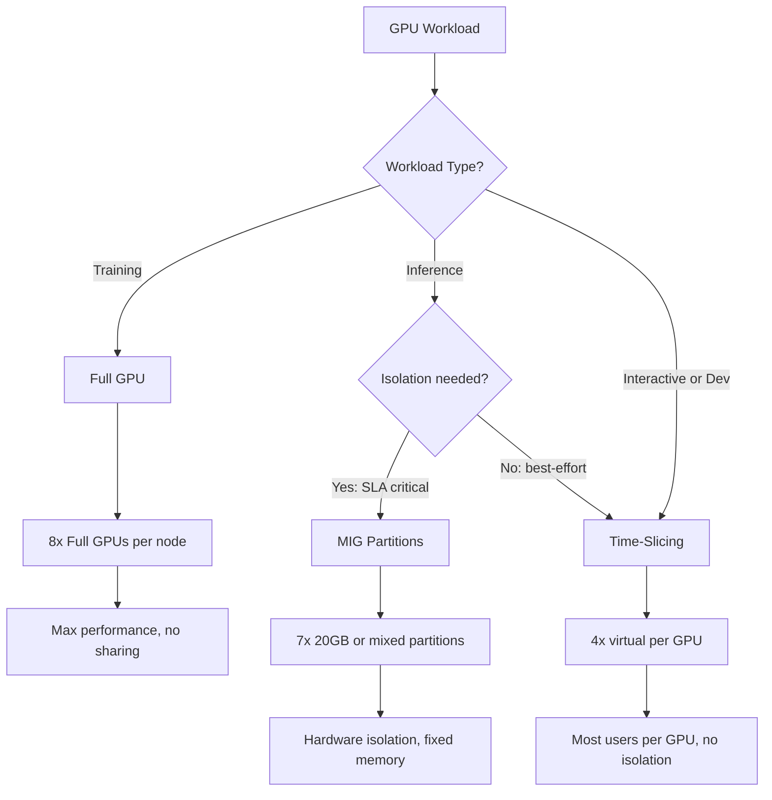

> 💡 **Quick Answer:** Use **full GPU** for training (max performance, no sharing overhead). Use **MIG** for inference with isolation (separate memory/compute, no noisy neighbor). Use **time-slicing** for interactive notebooks and development (cheapest sharing, but no memory isolation).

## The Problem

GPUs are expensive. Giving every notebook user a full H200 (141GB) is wasteful when they use 5% of compute. But sharing GPUs without isolation causes noisy-neighbor problems where one user's OOM kills another's process. You need different sharing strategies for different workload types.

## The Solution

### Comparison Matrix

```yaml
full_gpu:
  isolation: "Complete — dedicated GPU"
  memory: "Full VRAM (141GB on H200)"
  compute: "100% SM access"
  overhead: "None"
  use_case: "Training, large model inference"
  fault_isolation: "Complete"
  supported_gpus: "All NVIDIA GPUs"

mig:
  isolation: "Hardware — separate memory and compute partitions"
  memory: "Partitioned (e.g., 7x 20GB on H200)"
  compute: "Partitioned SMs per instance"
  overhead: "Minimal (~2-3%)"
  use_case: "Inference serving, CI/CD GPU tests"
  fault_isolation: "Complete — OOM in one partition doesn't affect others"
  supported_gpus: "A100, H100, H200 only"

time_slicing:
  isolation: "None — shared memory space"
  memory: "Shared (all users see full VRAM)"
  compute: "Time-multiplexed (round-robin)"
  overhead: "Context switching (~10-15%)"
  use_case: "Notebooks, development, light workloads"
  fault_isolation: "None — OOM affects all users"
  supported_gpus: "All NVIDIA GPUs"
```

### Full GPU (Training)

```yaml
apiVersion: kubeflow.org/v1
kind: PyTorchJob
metadata:
  name: llm-training
  namespace: tenant-alpha
spec:
  pytorchReplicaSpecs:
    Worker:
      replicas: 1
      template:
        spec:
          containers:
            - name: trainer
              image: nvcr.io/nvidia/pytorch:24.03-py3
              resources:
                limits:
                  nvidia.com/gpu: 8    # 8 full GPUs, no sharing
```

### MIG Configuration (Inference)

```yaml
# ClusterPolicy MIG configuration
apiVersion: nvidia.com/v1
kind: ClusterPolicy
metadata:
  name: gpu-cluster-policy
spec:
  mig:
    strategy: mixed    # Some nodes MIG, some full GPU
  devicePlugin:
    config:
      name: mig-config
      default: all-balanced
---
# MIG config profiles
apiVersion: v1
kind: ConfigMap
metadata:
  name: mig-config
  namespace: gpu-operator
data:
  # 7 equal partitions for inference
  all-balanced: |
    version: v1
    mig-configs:
      all-balanced:
        - device-filter: ["0x2339"]    # H200
          devices: all
          mig-enabled: true
          mig-devices:
            "1g.20gb": 7

  # Mixed: 1 large + 3 small
  mixed-workload: |
    version: v1
    mig-configs:
      mixed-workload:
        - device-filter: ["0x2339"]
          devices: all
          mig-enabled: true
          mig-devices:
            "4g.80gb": 1      # Large inference model
            "1g.20gb": 3      # Small models or preprocessing
```

### MIG Pod Request

```yaml
# Request a specific MIG partition
apiVersion: v1
kind: Pod
metadata:
  name: inference-small
  namespace: tenant-beta
spec:
  containers:
    - name: model
      image: vllm/vllm-openai:v0.6.6
      resources:
        limits:
          nvidia.com/mig-1g.20gb: 1    # Request 1x 20GB MIG slice
---
apiVersion: v1
kind: Pod
metadata:
  name: inference-large
spec:
  containers:
    - name: model
      resources:
        limits:
          nvidia.com/mig-4g.80gb: 1    # Request 1x 80GB MIG slice
```

### Time-Slicing Configuration (Notebooks)

```yaml
# ClusterPolicy time-slicing
apiVersion: nvidia.com/v1
kind: ClusterPolicy
metadata:
  name: gpu-cluster-policy
spec:
  devicePlugin:
    config:
      name: time-slicing-config
---
apiVersion: v1
kind: ConfigMap
metadata:
  name: time-slicing-config
  namespace: gpu-operator
data:
  any: |
    version: v1
    flags:
      migStrategy: none
    sharing:
      timeSlicing:
        renameByDefault: false
        failRequestsGreaterThanOne: false
        resources:
          - name: nvidia.com/gpu
            replicas: 4    # Each GPU appears as 4 virtual GPUs
```

### Time-Sliced Pod

```yaml
# Request a time-sliced GPU share
apiVersion: v1
kind: Pod
metadata:
  name: jupyter-notebook
  namespace: tenant-alpha
spec:
  containers:
    - name: jupyter
      image: jupyter/pytorch-notebook:latest
      resources:
        limits:
          nvidia.com/gpu: 1    # Gets 1/4 of a GPU (time-sliced)
```

### Node Labeling for Mixed Strategy

```bash
# Label nodes by GPU sharing strategy
oc label node gpu-worker-1 gpu-worker-2 nvidia.com/gpu-sharing=full
oc label node gpu-worker-3 nvidia.com/gpu-sharing=mig
oc label node gpu-worker-4 nvidia.com/gpu-sharing=time-slicing

# Use nodeSelector in pods:
# Training → gpu-sharing=full
# Inference → gpu-sharing=mig
# Notebooks → gpu-sharing=time-slicing
```

### Decision Matrix



## Common Issues

- **MIG not supported** — only A100, H100, H200 support MIG; older GPUs (V100, T4) must use time-slicing
- **Time-sliced GPU OOM** — all users share memory; one large allocation can OOM others; use LimitRange to cap per-container memory
- **MIG reconfiguration requires drain** — changing MIG profiles needs GPU idle; drain node, reconfigure, uncordon
- **Mixed strategy complexity** — label nodes clearly; use nodeSelector to route workloads to correct sharing type

## Best Practices

- Full GPU for training — sharing overhead defeats the purpose of distributed training
- MIG for production inference — hardware isolation ensures SLA compliance
- Time-slicing for notebooks and dev — cheapest sharing, acceptable for interactive use
- Label nodes by sharing strategy — don't mix strategies on the same GPU
- Use MIG mixed profiles when serving both large and small models on the same node
- Document the sharing strategy in tenant onboarding — teams need to know what they're getting

## Key Takeaways

- Three GPU sharing strategies: full (training), MIG (inference), time-slicing (dev)
- MIG provides hardware isolation with partitioned memory and compute — no noisy neighbor
- Time-slicing provides maximum density but no memory isolation — only for interactive use
- Label nodes by strategy and use nodeSelector for deterministic routing
- H200 MIG: 7x 20GB partitions or flexible mixed profiles
- Strategy choice directly impacts performance, isolation, and cost per user
