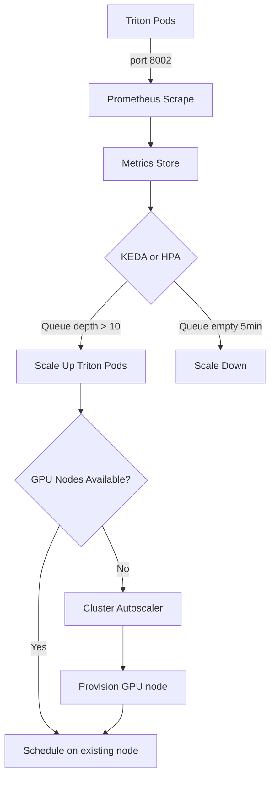

> 💡 **Quick Answer:** Scrape Triton's `:8002/metrics` endpoint with Prometheus, then autoscale with KEDA using `nv_inference_queue_duration_us` (queue wait time) or `nv_inference_request_success` (throughput). Scale on request queue depth — not GPU utilization — for optimal responsiveness.

## The Problem

Static GPU allocation for inference is wasteful:

- **Off-peak hours** — GPUs sit idle at 5% utilization but still cost money
- **Traffic spikes** — fixed replicas can't handle sudden load, causing timeouts
- **Queue buildup** — users wait in long queues while new GPUs could spin up
- **Cost optimization** — cloud GPU instances cost $2-30/hour, every idle minute matters

GPU utilization alone is a poor scaling metric — by the time GPU hits 90%, the queue is already deep. Better to scale on **request queue depth** and **inference latency**.

## The Solution

### Step 1: Enable Triton Metrics

Triton exposes Prometheus metrics on port 8002 by default:

```yaml
# Verify metrics are exposed
# curl http://triton:8002/metrics

# Key metrics for autoscaling:
# nv_inference_request_success     — successful inference count
# nv_inference_request_failure     — failed inference count
# nv_inference_queue_duration_us   — time spent in queue (microseconds)
# nv_inference_compute_infer_duration_us — GPU compute time
# nv_inference_pending_request_count — current queue depth
```

```yaml
# ServiceMonitor for Prometheus
apiVersion: monitoring.coreos.com/v1
kind: ServiceMonitor
metadata:
  name: triton-metrics
  namespace: ai-inference
spec:
  selector:
    matchLabels:
      app: triton-trtllm
  endpoints:
    - port: metrics
      interval: 15s
      path: /metrics
```

### Step 2: KEDA ScaledObject (Recommended)

```yaml
apiVersion: keda.sh/v1alpha1
kind: ScaledObject
metadata:
  name: triton-scaler
  namespace: ai-inference
spec:
  scaleTargetRef:
    name: triton-trtllm
  minReplicaCount: 1
  maxReplicaCount: 8
  cooldownPeriod: 300
  pollingInterval: 15
  triggers:
    # Scale on queue depth — most responsive metric
    - type: prometheus
      metadata:
        serverAddress: http://prometheus.monitoring:9090
        metricName: triton_queue_depth
        query: |
          sum(nv_inference_pending_request_count{model_name="llama3-8b"})
        threshold: "10"
        activationThreshold: "2"

    # Scale on queue wait time — user experience metric
    - type: prometheus
      metadata:
        serverAddress: http://prometheus.monitoring:9090
        metricName: triton_queue_latency
        query: |
          rate(nv_inference_queue_duration_us_sum{model_name="llama3-8b"}[2m])
          /
          rate(nv_inference_queue_duration_us_count{model_name="llama3-8b"}[2m])
        threshold: "500000"

    # Scale on request rate
    - type: prometheus
      metadata:
        serverAddress: http://prometheus.monitoring:9090
        metricName: triton_request_rate
        query: |
          sum(rate(nv_inference_request_success{model_name="llama3-8b"}[2m]))
        threshold: "50"
```

### Step 3: HPA with Prometheus Adapter Alternative

```yaml
# Prometheus Adapter config (in prometheus-adapter ConfigMap)
rules:
  - seriesQuery: 'nv_inference_pending_request_count{namespace="ai-inference"}'
    resources:
      overrides:
        namespace: {resource: "namespace"}
        pod: {resource: "pod"}
    name:
      matches: "^(.*)"
      as: "triton_pending_requests"
    metricsQuery: 'sum(<<.Series>>{<<.LabelMatchers>>}) by (<<.GroupBy>>)'
---
apiVersion: autoscaling/v2
kind: HorizontalPodAutoscaler
metadata:
  name: triton-hpa
  namespace: ai-inference
spec:
  scaleTargetRef:
    apiVersion: apps/v1
    kind: Deployment
    name: triton-trtllm
  minReplicas: 1
  maxReplicas: 8
  behavior:
    scaleUp:
      stabilizationWindowSeconds: 60
      policies:
        - type: Pods
          value: 2
          periodSeconds: 60
    scaleDown:
      stabilizationWindowSeconds: 300
      policies:
        - type: Pods
          value: 1
          periodSeconds: 120
  metrics:
    - type: Pods
      pods:
        metric:
          name: triton_pending_requests
        target:
          type: AverageValue
          averageValue: "10"
```

### Step 4: GPU-Aware Node Autoscaling

Scale the cluster itself when no GPU nodes are available:

```yaml
# Cluster Autoscaler annotation on GPU node pool
apiVersion: v1
kind: ConfigMap
metadata:
  name: cluster-autoscaler-priority
  namespace: kube-system
data:
  priorities: |
    10:
      - gpu-a100-pool
    20:
      - gpu-l40s-pool
---
# Karpenter NodePool for GPU (EKS)
apiVersion: karpenter.sh/v1beta1
kind: NodePool
metadata:
  name: gpu-inference
spec:
  template:
    spec:
      requirements:
        - key: "node.kubernetes.io/instance-type"
          operator: In
          values: ["p4d.24xlarge", "g5.12xlarge"]
        - key: "nvidia.com/gpu.product"
          operator: In
          values: ["NVIDIA-A100-SXM4-40GB", "NVIDIA-L40S"]
      taints:
        - key: nvidia.com/gpu
          effect: NoSchedule
  limits:
    nvidia.com/gpu: 32
  disruption:
    consolidationPolicy: WhenEmpty
    consolidateAfter: 10m
```

### Step 5: Grafana Dashboard Queries

```promql
# Requests per second
sum(rate(nv_inference_request_success[5m])) by (model_name)

# Average queue wait time (ms)
rate(nv_inference_queue_duration_us_sum[5m])
/ rate(nv_inference_queue_duration_us_count[5m])
/ 1000

# P99 inference latency
histogram_quantile(0.99,
  rate(nv_inference_compute_infer_duration_us_bucket[5m]))
/ 1000

# GPU utilization per replica
DCGM_FI_DEV_GPU_UTIL{pod=~"triton.*"}

# Queue depth
nv_inference_pending_request_count
```



## Common Issues

### Slow scale-up — model loading takes minutes

```yaml
# Pre-pull Triton images on GPU nodes
apiVersion: apps/v1
kind: DaemonSet
metadata:
  name: triton-image-cache
spec:
  template:
    spec:
      initContainers:
        - name: pull-image
          image: nvcr.io/nvidia/tritonserver:24.12-trtllm-python-py3
          command: ["echo", "image cached"]
      containers:
        - name: pause
          image: registry.k8s.io/pause:3.9
      nodeSelector:
        nvidia.com/gpu.present: "true"
```

### Scale-down kills active requests

```yaml
# Use preStop hook with graceful drain
lifecycle:
  preStop:
    exec:
      command:
        - /bin/sh
        - -c
        - "sleep 30"  # Allow in-flight requests to complete
terminationGracePeriodSeconds: 60
```

### Metrics lag causes oscillation

```yaml
# KEDA: increase pollingInterval and cooldownPeriod
pollingInterval: 30      # Check every 30s, not 15s
cooldownPeriod: 600      # Wait 10min before scale-down

# HPA: use stabilization windows
behavior:
  scaleUp:
    stabilizationWindowSeconds: 120
  scaleDown:
    stabilizationWindowSeconds: 600
```

## Best Practices

- **Scale on queue depth, not GPU utilization** — queue depth reacts faster than GPU metrics
- **Set generous cooldown periods** — GPU model loading takes 2-5 minutes, frequent scaling wastes time
- **Pre-pull container images** — Triton images are 15-20GB, pulling takes minutes on cold nodes
- **Use `preStop` hooks** — allow in-flight requests to complete before pod termination
- **Combine pod and node autoscaling** — KEDA/HPA for pods, Karpenter/Cluster Autoscaler for nodes
- **Monitor P99 latency** — better user experience indicator than average latency

## Key Takeaways

- Scale Triton on **`nv_inference_pending_request_count`** (queue depth) for fastest response
- KEDA with Prometheus trigger is the recommended approach — more flexible than native HPA
- **Long cooldowns** (5-10 min) prevent thrashing — GPU model loading is expensive
- Combine **pod autoscaling** (KEDA) with **node autoscaling** (Karpenter) for full elasticity
- Pre-pull images and cache models on PVCs to minimize cold-start time
