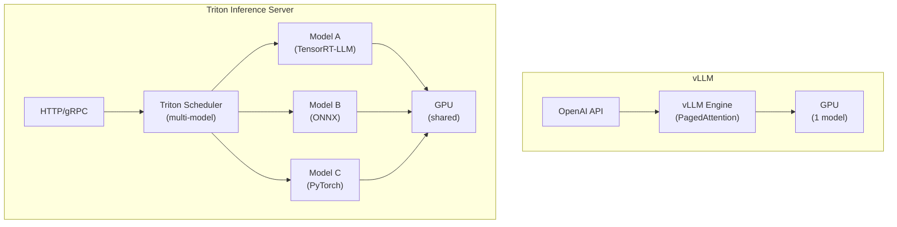

> 💡 **Quick Answer:** **vLLM** is purpose-built for LLM inference — simple to deploy, excellent throughput via PagedAttention + continuous batching. **Triton** is a general-purpose model server supporting multiple frameworks (TensorRT, ONNX, PyTorch, vLLM) and multiple models per GPU. Choose vLLM for pure LLM serving; choose Triton for multi-model pipelines, ensemble models, or when you need TensorRT-LLM optimization.

## The Problem

Both Triton and vLLM serve LLMs on Kubernetes, but they solve different problems. Teams waste weeks benchmarking the wrong tool. This guide compares them across the dimensions that actually matter for production deployments.



## Head-to-Head Comparison

| Feature | vLLM | Triton Inference Server |
|---------|------|----------------------|
| **Primary use case** | LLM serving | Any ML model serving |
| **Setup complexity** | ⭐ Simple (1 command) | ⭐⭐⭐ Complex (model repo) |
| **LLM throughput** | ⭐⭐⭐ Excellent (PagedAttention) | ⭐⭐ Good (via TensorRT-LLM backend) |
| **Multi-model** | ❌ One model per instance | ✅ Multiple models per GPU |
| **Model formats** | HuggingFace (auto-convert) | TensorRT, ONNX, PyTorch, TF, vLLM |
| **API** | OpenAI-compatible | HTTP + gRPC + OpenAI (v24.08+) |
| **Batching** | Continuous batching | Dynamic batching + sequence batching |
| **GPU memory** | PagedAttention (efficient KV cache) | Model-specific (TensorRT-LLM has paged) |
| **Quantization** | AWQ, GPTQ, FP8, GGUF | TensorRT INT8/FP8, quantized ONNX |
| **Streaming** | ✅ SSE native | ✅ Via decoupled models |
| **Ensemble pipelines** | ❌ | ✅ Pre/post-processing chains |
| **Kubernetes integration** | Deployment + Service | Triton Operator or custom Deployment |
| **Observability** | Prometheus /metrics | Prometheus + detailed per-model metrics |
| **Community** | Fast-growing, LLM-focused | Mature, NVIDIA-backed |
| **License** | Apache 2.0 | BSD 3-Clause |

## When to Choose vLLM

```yaml
# vLLM: Simple LLM serving with OpenAI API
apiVersion: apps/v1
kind: Deployment
metadata:
  name: vllm-llama
spec:
  template:
    spec:
      containers:
        - name: vllm
          image: ghcr.io/vllm-project/vllm-openai:v0.8.0
          args:
            - --model=meta-llama/Llama-3.1-8B-Instruct
            - --tensor-parallel-size=1
          resources:
            limits:
              nvidia.com/gpu: 1
```

**Choose vLLM when:**
- Serving a single LLM (or one model per pod)
- You need OpenAI API compatibility (drop-in replacement)
- Fast prototyping — running in 5 minutes
- Maximum LLM throughput is the priority
- HuggingFace models without manual conversion
- You want continuous batching + PagedAttention out of the box

## When to Choose Triton

```yaml
# Triton: Multi-model serving with TensorRT optimization
apiVersion: apps/v1
kind: Deployment
metadata:
  name: triton-server
spec:
  template:
    spec:
      containers:
        - name: triton
          image: nvcr.io/nvidia/tritonserver:24.08-trtllm-python-py3
          args:
            - tritonserver
            - --model-repository=/models
            - --http-port=8000
            - --grpc-port=8001
            - --metrics-port=8002
          resources:
            limits:
              nvidia.com/gpu: 1
          volumeMounts:
            - name: models
              mountPath: /models
```

**Choose Triton when:**
- Serving multiple models on the same GPU (embedding + LLM + classifier)
- You need ensemble pipelines (tokenize → infer → post-process)
- TensorRT-LLM optimization is required for maximum performance
- Non-LLM models (vision, speech, tabular) alongside LLMs
- gRPC is required (high-performance internal services)
- Multi-framework support (ONNX + PyTorch + TensorRT in one server)

## Performance Benchmarks

```bash
# Benchmark vLLM
genai-perf profile \
  -m meta-llama/Llama-3.1-8B-Instruct \
  --service-kind openai \
  --endpoint v1/chat/completions \
  --url http://vllm-server:8000 \
  --concurrency 32 \
  --input-tokens 512 --output-tokens 128

# Benchmark Triton + TensorRT-LLM
genai-perf profile \
  -m llama-3.1-8b \
  --service-kind triton \
  --backend tensorrtllm \
  --url triton-server:8001 \
  --concurrency 32 \
  --input-tokens 512 --output-tokens 128
```

**Typical results (A100 80GB, Llama 3.1 8B, 32 concurrent users):**

| Metric | vLLM | Triton + TensorRT-LLM |
|--------|------|----------------------|
| Throughput (tokens/s) | ~3,500 | ~4,200 |
| P50 latency (ms) | ~45 | ~38 |
| P99 latency (ms) | ~120 | ~95 |
| Time to first token (ms) | ~25 | ~20 |
| Setup time | 5 min | 2-4 hours |

TensorRT-LLM is ~15-20% faster but requires model compilation (hours) and complex model repository setup.

## Hybrid Architecture

```yaml
# Best of both: vLLM for chat, Triton for embeddings + reranking
# Route via AI Gateway Inference Extension

# vLLM handles chat/completion (PagedAttention, continuous batching)
# Triton handles embeddings + classifiers (multi-model, GPU sharing)

# Gateway routes by model type:
# /v1/chat/completions → vLLM
# /v1/embeddings → Triton
# /v1/rerank → Triton
```

## Common Issues

| Issue | Cause | Fix |
|-------|-------|-----|
| vLLM can't serve multiple models | Single-model design | Deploy separate pods per model |
| Triton model loading slow | TensorRT compilation | Pre-compile models in CI/CD pipeline |
| Triton OpenAI API not working | Feature added in v24.08+ | Update Triton image version |
| vLLM lower throughput than Triton | No TensorRT optimization | Accept tradeoff or switch to Triton |
| Neither handles 405B well | Model too large for single node | Use tensor parallelism across nodes |

## Decision Matrix

| Scenario | Recommendation |
|----------|---------------|
| Chat API for one LLM | **vLLM** |
| Multiple models, shared GPU | **Triton** |
| RAG pipeline (embed + generate + rerank) | **Triton** (or hybrid) |
| Quick prototype / demo | **vLLM** |
| Maximum throughput, willing to invest setup | **Triton + TensorRT-LLM** |
| OpenAI SDK drop-in replacement | **vLLM** |
| Mixed ML models (vision + text + tabular) | **Triton** |
| Edge deployment, minimal resources | **vLLM** (lighter footprint) |

## Key Takeaways

- vLLM = simple, fast, LLM-focused. Triton = versatile, multi-model, multi-framework
- vLLM wins on simplicity and developer experience (5-min setup)
- Triton + TensorRT-LLM wins on raw throughput (~15-20% faster after compilation)
- For most teams: start with vLLM, graduate to Triton when you need multi-model or TensorRT
- Hybrid architecture (vLLM for LLMs + Triton for embeddings) is increasingly common
- Both integrate well with Kubernetes and expose Prometheus metrics
