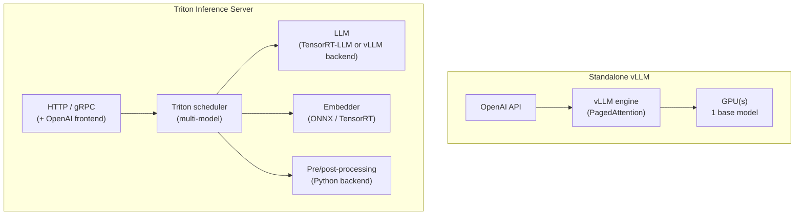

> 💡 **Quick Answer:** **vLLM** is an LLM inference *engine* with its own OpenAI-compatible server — one model per server, PagedAttention and continuous batching out of the box, running in minutes. **Triton Inference Server** is a general-purpose model *server* that hosts many models and frameworks at once (TensorRT-LLM, vLLM, ONNX, PyTorch, Python) behind HTTP/gRPC, with ensembles and per-model metrics. They are not strictly competitors: Triton can run vLLM as a backend. Choose standalone vLLM for pure LLM serving; choose Triton when you need multi-model/multi-framework serving, ensemble pipelines, or TensorRT-LLM.

## Engine vs Server: the Distinction That Matters

"Triton vs vLLM" mixes two layers:

- **Serving layer** — Triton (model repository, scheduler, HTTP/gRPC, metrics) vs vLLM's built-in `vllm serve` OpenAI server.
- **Engine layer** — what actually runs the transformer: **TensorRT-LLM** or **vLLM**. Triton can host either (`tensorrtllm` or `vllm` backend).

So there are really three common deployments: standalone vLLM, Triton + vLLM backend, and Triton + TensorRT-LLM backend.


```mermaid
flowchart TB
    subgraph VLLM["Standalone vLLM"]
        V_IN["OpenAI API"] --> V_ENGINE["vLLM engine<br/>(PagedAttention)"]
        V_ENGINE --> V_GPU["GPU(s)<br/>1 base model"]
    end

    subgraph TRITON["Triton Inference Server"]
        T_IN["HTTP / gRPC<br/>(+ OpenAI frontend)"] --> T_SCHED["Triton scheduler<br/>(multi-model)"]
        T_SCHED --> T_M1["LLM<br/>(TensorRT-LLM or vLLM backend)"]
        T_SCHED --> T_M2["Embedder<br/>(ONNX / TensorRT)"]
        T_SCHED --> T_M3["Pre/post-processing<br/>(Python backend)"]
    end
```

## Head-to-Head: Triton vs vLLM

| Feature | vLLM (standalone) | Triton Inference Server |
|---------|-------------------|-------------------------|
| **Primary use case** | LLM serving | Any model: LLM, vision, speech, tabular |
| **Setup** | One container, one command | Model repository + `config.pbtxt` per model |
| **Models per server** | One base model (+ LoRA adapters) | Many models, many frameworks |
| **LLM engines** | vLLM | TensorRT-LLM, vLLM (backends) |
| **Model formats** | Hugging Face checkpoints directly | TensorRT engines, ONNX, PyTorch, TF, Python, vLLM |
| **API** | OpenAI-compatible (`/v1/chat/completions`, ...) | KServe v2 HTTP/gRPC, `generate` extension; OpenAI-compatible frontend in recent releases |
| **Batching** | Continuous batching | Dynamic/sequence batching; in-flight batching with TensorRT-LLM |
| **KV cache** | PagedAttention | Paged KV cache (TensorRT-LLM) or vLLM's PagedAttention |
| **Quantization** | AWQ, GPTQ, FP8, bitsandbytes, others | TensorRT-LLM FP8/INT8/INT4 (FP4 on Blackwell), or vLLM's formats |
| **Pipelines** | No | Ensembles and BLS (tokenize → infer → post-process) |
| **Metrics** | Prometheus `/metrics` | Prometheus `:8002/metrics`, per-model detail |
| **License** | Apache 2.0 | BSD 3-Clause |

## TensorRT-LLM vs vLLM (the Engine Choice)

| Factor | TensorRT-LLM | vLLM |
|--------|--------------|------|
| **Time to first deploy** | Longer: checkpoint conversion + engine build (classic flow) | Minutes: loads Hugging Face weights directly |
| **Peak throughput / latency** | Usually the leader on NVIDIA GPUs, especially at high concurrency and with FP8 on Hopper/Blackwell | Close behind in many workloads; gap depends on model, GPU, batch and version |
| **Model swap** | Rebuild engine (classic flow) | Change `--model` / `model.json` |
| **Quantization** | Applied at build/quantize time | Runtime or pre-quantized checkpoints (AWQ, GPTQ, FP8) |
| **Portability** | Engines are tied to GPU architecture and TensorRT-LLM version | Same config runs on any supported GPU |
| **Best for** | Stable, high-traffic production models | Fast iteration, model churn, mixed GPU fleets |

Recent TensorRT-LLM releases also ship a PyTorch-based workflow and `trtllm-serve` (OpenAI-compatible), which removes the explicit engine-build step for many models. The trade-offs above describe the classic engine-based Triton backend.

Don't trust anyone's published speedup numbers — including ours. Benchmark both engines with your model, prompt lengths and concurrency (see [Benchmark Both](#benchmark-both)).

## When to Choose vLLM

```yaml
apiVersion: apps/v1
kind: Deployment
metadata:
  name: vllm-llama
spec:
  replicas: 1
  selector:
    matchLabels:
      app: vllm-llama
  template:
    metadata:
      labels:
        app: vllm-llama
    spec:
      containers:
        - name: vllm
          image: vllm/vllm-openai:latest   # pin a release tag in production
          args:
            - --model=meta-llama/Llama-3.1-8B-Instruct
            - --tensor-parallel-size=1
          ports:
            - containerPort: 8000
          resources:
            limits:
              nvidia.com/gpu: 1
```

**Choose vLLM when:**
- You serve one LLM per deployment (optionally with multiple LoRA adapters)
- You want an OpenAI-compatible drop-in endpoint with no conversion step
- Models change often, or you run a mixed GPU fleet
- Team size or timeline doesn't justify an engine-build pipeline

## When to Choose Triton

```yaml
apiVersion: apps/v1
kind: Deployment
metadata:
  name: triton-server
spec:
  replicas: 1
  selector:
    matchLabels:
      app: triton-server
  template:
    metadata:
      labels:
        app: triton-server
    spec:
      containers:
        - name: triton
          image: nvcr.io/nvidia/tritonserver:24.12-trtllm-python-py3
          args:
            - tritonserver
            - --model-repository=/models
            - --http-port=8000
            - --grpc-port=8001
            - --metrics-port=8002
          resources:
            limits:
              nvidia.com/gpu: 1
          volumeMounts:
            - name: models
              mountPath: /models
      volumes:
        - name: models
          persistentVolumeClaim:
            claimName: triton-model-repo
```

A minimal TensorRT-LLM backend `config.pbtxt` (abbreviated — the full template ships in the `tensorrtllm_backend` repo):

```text
backend: "tensorrtllm"
max_batch_size: 128
model_transaction_policy { decoupled: true }   # required for streaming
parameters { key: "gpt_model_type"  value: { string_value: "inflight_fused_batching" } }
parameters { key: "gpt_model_path"  value: { string_value: "/models/tensorrt_llm/1/engine" } }
parameters { key: "batch_scheduler_policy" value: { string_value: "max_utilization" } }
parameters { key: "kv_cache_free_gpu_mem_fraction" value: { string_value: "0.90" } }
```

**Choose Triton when:**
- Several models share GPUs (embedder + LLM + reranker + classifier)
- You need ensemble/BLS pipelines (tokenize → infer → post-process) server-side
- You want TensorRT-LLM for maximum throughput on a stable model
- Non-LLM models (vision, ASR, tabular) run alongside LLMs
- Internal clients need gRPC

Full deployment walkthroughs: [Triton + TensorRT-LLM](/recipes/ai/triton-tensorrt-llm-kubernetes/) and [Triton + vLLM backend](/recipes/ai/triton-vllm-kubernetes/).

## Benchmark Both

Use NVIDIA's LLM benchmarking tools against each endpoint with identical input/output lengths and concurrency. AIPerf is the actively developed tool; GenAI-Perf still works for Triton-native (KServe) endpoints.

```bash
# vLLM (OpenAI-compatible)
aiperf profile \
  --model meta-llama/Llama-3.1-8B-Instruct \
  --tokenizer meta-llama/Llama-3.1-8B-Instruct \
  --endpoint-type chat --streaming \
  --url http://vllm-llama:8000 \
  --concurrency 32 --request-count 500 \
  --synthetic-input-tokens-mean 512 --output-tokens-mean 128

# Triton via its OpenAI-compatible frontend (same command, different URL/model)
aiperf profile \
  --model llama-3.1-8b \
  --tokenizer meta-llama/Llama-3.1-8B-Instruct \
  --endpoint-type chat --streaming \
  --url http://triton-openai:9000 \
  --concurrency 32 --request-count 500 \
  --synthetic-input-tokens-mean 512 --output-tokens-mean 128
```

Compare TTFT, inter-token latency and output token throughput at several concurrency levels — the TensorRT-LLM advantage, if any, tends to show at high concurrency; at batch 1–4 the engines are often close. Details: [AIPerf](/recipes/ai/aiperf-benchmark-llm-kubernetes/), [GenAI-Perf](/recipes/ai/genai-perf-nvidia-inference-benchmarking/).

## Migrating vLLM → TensorRT-LLM Without Downtime

1. **Start on vLLM** — validate the model and capture baseline metrics with real traffic.
2. **Build the TensorRT-LLM engine** in a Job on the *same GPU type* you serve on, and deploy it side by side.
3. **Canary** a slice of traffic, compare latency/throughput and output quality.
4. **Cut over**, keeping the vLLM deployment as a fallback (useful when an upgrade invalidates engines).

```yaml
apiVersion: networking.istio.io/v1beta1
kind: VirtualService
metadata:
  name: llm-canary
spec:
  hosts:
    - llm-inference
  http:
    - route:
        - destination:
            host: triton-trtllm
          weight: 20
        - destination:
            host: vllm-llama
          weight: 80
```

Both endpoints must expose the same API for a transparent split — use Triton's OpenAI-compatible frontend, or split at an [AI gateway](/recipes/ai/kubernetes-ai-gateway-inference-extension/) that normalizes requests.

## Hybrid Architecture

A common production pattern: vLLM for chat/completions, Triton for embeddings, rerankers and classic models, routed by path or model name at the gateway:

- `/v1/chat/completions` → vLLM
- `/v1/embeddings` → Triton (ONNX/TensorRT embedder)
- rerank / classification → Triton

## Common Issues

| Issue | Cause | Fix |
|-------|-------|-----|
| vLLM can't serve two base models | One base model per server | One Deployment per model; route at the gateway |
| TensorRT-LLM engine fails after upgrade | Engines are tied to TensorRT-LLM version and GPU arch | Rebuild engines in CI per Triton release; record version/GPU metadata |
| Triton OpenAI endpoint missing | Frontend not enabled / older release | Use a recent release and start the OpenAI frontend; or use the `generate` endpoint |
| Similar performance for both engines | Low concurrency test | Benchmark at realistic concurrency (32+), with streaming |
| Model too large for one node | 405B-class in BF16 | Tensor + pipeline parallelism across nodes ([LeaderWorkerSet](/recipes/ai/leaderworkerset-operator/)) |

## Decision Matrix

| Scenario | Recommendation |
|----------|----------------|
| Chat API for one LLM | **vLLM** |
| OpenAI SDK drop-in replacement | **vLLM** (or Triton's OpenAI frontend) |
| Frequent model changes, mixed GPU fleet | **vLLM** (standalone or as Triton backend) |
| Multiple models sharing GPUs | **Triton** |
| RAG pipeline (embed + generate + rerank) | **Triton**, or hybrid |
| Maximum throughput on a stable model | **Triton + TensorRT-LLM** |
| Vision/speech/tabular models alongside LLMs | **Triton** |

## Frequently Asked Questions

### How does Triton Inference Server compare to vLLM for LLM serving?

vLLM is a specialised LLM engine and server: you point it at a Hugging Face model and get an OpenAI-compatible endpoint with PagedAttention and continuous batching, one base model per server. Triton is a general model server: it hosts many models and frameworks on shared GPUs over HTTP/gRPC, supports ensembles, and runs LLMs through a backend — TensorRT-LLM for maximum performance on NVIDIA GPUs, or vLLM itself. Pick vLLM for simple, fast LLM serving; pick Triton for multi-model platforms, pipelines, or TensorRT-LLM.

### Is Triton faster than vLLM?

Triton itself doesn't generate tokens — the backend does. Triton with the vLLM backend performs about the same as standalone vLLM. Triton with TensorRT-LLM is often faster, particularly at high concurrency and with FP8 on Hopper or Blackwell, but the gap varies by model, GPU and software version. Measure with your own workload.

### Can Triton run vLLM?

Yes. The `vllm` backend (container tags `*-vllm-python-py3`) loads Hugging Face models via a `model.json` that takes vLLM engine arguments. See [Triton with vLLM backend](/recipes/ai/triton-vllm-kubernetes/).

### TensorRT-LLM or vLLM — which should I start with?

Start with vLLM to validate the model and traffic pattern quickly. Move a model to TensorRT-LLM when it is stable, high-traffic, and the throughput or latency gain justifies the build pipeline.

### Does Triton have an OpenAI-compatible API?

Recent Triton releases include an OpenAI-compatible frontend (`/v1/chat/completions`, `/v1/completions`, `/v1/models`) in addition to the KServe v2 protocol and the `generate` extension. Standalone vLLM exposes the OpenAI API by default.

### Where does NVIDIA Dynamo fit?

NVIDIA Dynamo is NVIDIA's distributed inference framework (disaggregated prefill/decode, KV-aware routing) that runs vLLM, SGLang or TensorRT-LLM as engines; NVIDIA now brands Triton as part of the Dynamo platform. For multi-node, disaggregated LLM serving see [NVIDIA Dynamo on Kubernetes](/recipes/ai/nvidia-dynamo-distributed-inference-kubernetes/).
