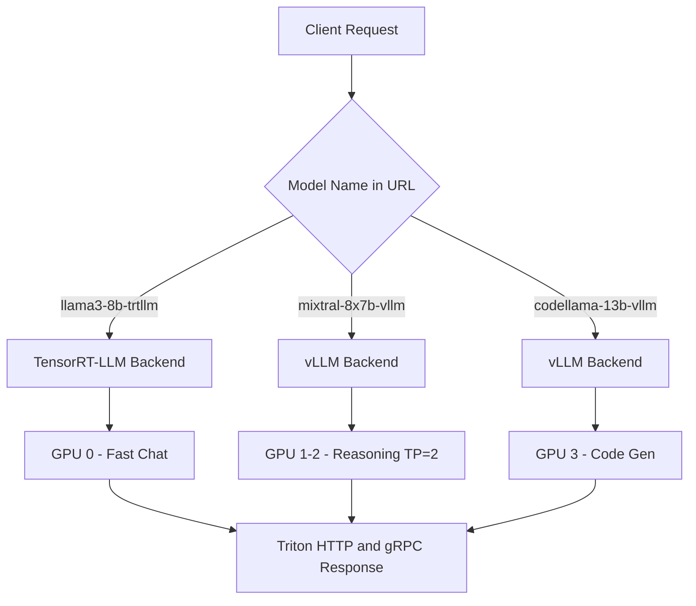

> 💡 **Quick Answer:** Place multiple model directories in the Triton model repository — each with its own `config.pbtxt` and backend (`tensorrtllm` or `vllm`). Triton loads all models and routes requests by model name in the URL path. Use `--load-model` flags for selective loading.

## The Problem

Production AI platforms need to serve multiple models simultaneously:

- **Different model sizes** — a fast 7B for chat, a powerful 70B for complex reasoning
- **Mixed backends** — TensorRT-LLM for latency-critical models, vLLM for rapid iteration
- **A/B testing** — compare model versions side by side
- **Multi-tenant** — different teams get different models on shared GPU infrastructure
- **Specialized models** — code generation, summarization, and chat each need different models

Running a separate Triton instance per model wastes GPU memory and complicates routing.

## The Solution

### Step 1: Multi-Model Repository Structure

```bash
model_repository/
├── llama3-8b-trtllm/        # Fast model — TensorRT-LLM
│   ├── config.pbtxt
│   └── 1/
├── mixtral-8x7b-vllm/       # Large model — vLLM with AWQ
│   ├── config.pbtxt
│   └── 1/
│       └── model.json
└── codellama-13b-vllm/      # Code model — vLLM
    ├── config.pbtxt
    └── 1/
        └── model.json
```

### Step 2: Model Configurations

```yaml
apiVersion: v1
kind: ConfigMap
metadata:
  name: triton-multi-model-config
  namespace: ai-inference
data:
  # TensorRT-LLM model (pre-compiled engine)
  llama3-config.pbtxt: |
    backend: "tensorrtllm"
    max_batch_size: 64
    model_transaction_policy { decoupled: True }
    input [
      { name: "text_input", data_type: TYPE_STRING, dims: [ 1 ] },
      { name: "max_tokens", data_type: TYPE_INT32, dims: [ 1 ] },
      { name: "stream", data_type: TYPE_BOOL, dims: [ 1 ] }
    ]
    output [
      { name: "text_output", data_type: TYPE_STRING, dims: [ -1 ] }
    ]
    parameters {
      key: "engine_dir"
      value: { string_value: "/engines/llama3-8b" }
    }
    parameters {
      key: "batch_scheduler_policy"
      value: { string_value: "max_utilization" }
    }
    parameters {
      key: "kv_cache_free_gpu_mem_fraction"
      value: { string_value: "0.85" }
    }

  # vLLM Mixtral (AWQ quantized)
  mixtral-config.pbtxt: |
    backend: "vllm"
    max_batch_size: 0
    model_transaction_policy { decoupled: True }
    input [
      { name: "text_input", data_type: TYPE_STRING, dims: [ 1 ] },
      { name: "stream", data_type: TYPE_BOOL, dims: [ 1 ] },
      { name: "sampling_parameters", data_type: TYPE_STRING, dims: [ 1 ], optional: true }
    ]
    output [
      { name: "text_output", data_type: TYPE_STRING, dims: [ -1 ] }
    ]

  mixtral-model.json: |
    {
      "model": "TheBloke/Mixtral-8x7B-Instruct-v0.1-AWQ",
      "quantization": "awq",
      "gpu_memory_utilization": 0.85,
      "max_model_len": 8192,
      "tensor_parallel_size": 2
    }

  # vLLM CodeLlama
  codellama-config.pbtxt: |
    backend: "vllm"
    max_batch_size: 0
    model_transaction_policy { decoupled: True }
    input [
      { name: "text_input", data_type: TYPE_STRING, dims: [ 1 ] },
      { name: "stream", data_type: TYPE_BOOL, dims: [ 1 ] },
      { name: "sampling_parameters", data_type: TYPE_STRING, dims: [ 1 ], optional: true }
    ]
    output [
      { name: "text_output", data_type: TYPE_STRING, dims: [ -1 ] }
    ]

  codellama-model.json: |
    {
      "model": "codellama/CodeLlama-13b-Instruct-hf",
      "gpu_memory_utilization": 0.85,
      "max_model_len": 16384,
      "dtype": "float16"
    }
```

### Step 3: Multi-GPU Deployment

```yaml
apiVersion: apps/v1
kind: Deployment
metadata:
  name: triton-multi-model
  namespace: ai-inference
spec:
  replicas: 1
  selector:
    matchLabels:
      app: triton-multi-model
  template:
    metadata:
      labels:
        app: triton-multi-model
    spec:
      containers:
        - name: triton
          image: nvcr.io/nvidia/tritonserver:24.12-trtllm-python-py3
          args:
            - tritonserver
            - --model-repository=/model-repository
            - --log-verbose=1
            # Optionally load specific models only
            # - --load-model=llama3-8b-trtllm
            # - --load-model=codellama-13b-vllm
          ports:
            - containerPort: 8000
              name: http
            - containerPort: 8001
              name: grpc
            - containerPort: 8002
              name: metrics
          env:
            - name: HUGGING_FACE_HUB_TOKEN
              valueFrom:
                secretKeyRef:
                  name: hf-token
                  key: token
            - name: TRANSFORMERS_CACHE
              value: /cache/huggingface
          resources:
            limits:
              nvidia.com/gpu: 4
              memory: 128Gi
              cpu: "16"
          volumeMounts:
            # TensorRT-LLM model
            - name: config
              mountPath: /model-repository/llama3-8b-trtllm/config.pbtxt
              subPath: llama3-config.pbtxt
            - name: llama3-dir
              mountPath: /model-repository/llama3-8b-trtllm/1
            - name: engines
              mountPath: /engines
            # vLLM Mixtral
            - name: config
              mountPath: /model-repository/mixtral-8x7b-vllm/config.pbtxt
              subPath: mixtral-config.pbtxt
            - name: config
              mountPath: /model-repository/mixtral-8x7b-vllm/1/model.json
              subPath: mixtral-model.json
            # vLLM CodeLlama
            - name: config
              mountPath: /model-repository/codellama-13b-vllm/config.pbtxt
              subPath: codellama-config.pbtxt
            - name: config
              mountPath: /model-repository/codellama-13b-vllm/1/model.json
              subPath: codellama-model.json
            - name: cache
              mountPath: /cache
            - name: shm
              mountPath: /dev/shm
          readinessProbe:
            httpGet:
              path: /v2/health/ready
              port: 8000
            initialDelaySeconds: 300
            periodSeconds: 10
      volumes:
        - name: config
          configMap:
            name: triton-multi-model-config
        - name: llama3-dir
          emptyDir: {}
        - name: engines
          persistentVolumeClaim:
            claimName: trtllm-engines
        - name: cache
          persistentVolumeClaim:
            claimName: model-cache
        - name: shm
          emptyDir:
            medium: Memory
            sizeLimit: 16Gi
---
apiVersion: v1
kind: Service
metadata:
  name: triton-multi
  namespace: ai-inference
spec:
  selector:
    app: triton-multi-model
  ports:
    - name: http
      port: 8000
    - name: grpc
      port: 8001
    - name: metrics
      port: 8002
```

### Step 4: Route Requests by Model

```bash
# List loaded models
curl http://triton-multi.ai-inference:8000/v2/models

# Chat model (TensorRT-LLM — lowest latency)
curl -X POST http://triton-multi.ai-inference:8000/v2/models/llama3-8b-trtllm/generate \
  -d '{"text_input": "Hello!", "max_tokens": 128, "stream": false}'

# Reasoning model (vLLM Mixtral — highest quality)
curl -X POST http://triton-multi.ai-inference:8000/v2/models/mixtral-8x7b-vllm/generate \
  -d '{"text_input": "Analyze this architecture...", "stream": false, "sampling_parameters": "{\"max_tokens\": 512}"}'

# Code model (vLLM CodeLlama)
curl -X POST http://triton-multi.ai-inference:8000/v2/models/codellama-13b-vllm/generate \
  -d '{"text_input": "[INST] Write a Python FastAPI server [/INST]", "stream": false, "sampling_parameters": "{\"max_tokens\": 1024, \"temperature\": 0.2}"}'
```



## Common Issues

### Not enough GPU memory for all models

```bash
# Option 1: Use --load-model to load only specific models
tritonserver --model-repository=/model-repo \
  --load-model=llama3-8b-trtllm \
  --load-model=codellama-13b-vllm

# Option 2: Use model load/unload API dynamically
curl -X POST http://triton:8000/v2/repository/models/mixtral-8x7b-vllm/load
curl -X POST http://triton:8000/v2/repository/models/mixtral-8x7b-vllm/unload
```

### GPU assignment conflicts

```yaml
# vLLM models use CUDA_VISIBLE_DEVICES internally
# TensorRT-LLM uses device mapping from engine build
# When mixing backends, monitor GPU memory per device:
# nvidia-smi --query-gpu=index,memory.used,memory.total --format=csv
```

### Mixed backend container image

```bash
# The trtllm image includes vLLM backend too
# Use: nvcr.io/nvidia/tritonserver:24.12-trtllm-python-py3
# This supports both backends in one container
```

## Best Practices

- **Use TensorRT-LLM for latency-critical models** — chat, autocomplete, real-time responses
- **Use vLLM for flexibility** — rapid model iteration, quantized models, A/B testing
- **Plan GPU memory carefully** — map which GPUs serve which models before deploying
- **Use dynamic model loading** — load/unload models via Triton's repository API
- **Increase readiness probe timeout** — multi-model loading can take 5+ minutes
- **Monitor per-model metrics** — Triton exposes per-model latency, throughput, and queue depth

## Key Takeaways

- Triton serves **multiple models simultaneously** — each in its own directory with independent backend config
- **Mix TensorRT-LLM and vLLM** in the same Triton instance for different use cases
- Route requests by **model name in the URL** — `/v2/models/<name>/generate`
- Use `--load-model` flags or the **repository API** to control which models are loaded
- Plan GPU memory allocation — each model needs dedicated GPU memory, especially with paged KV cache
