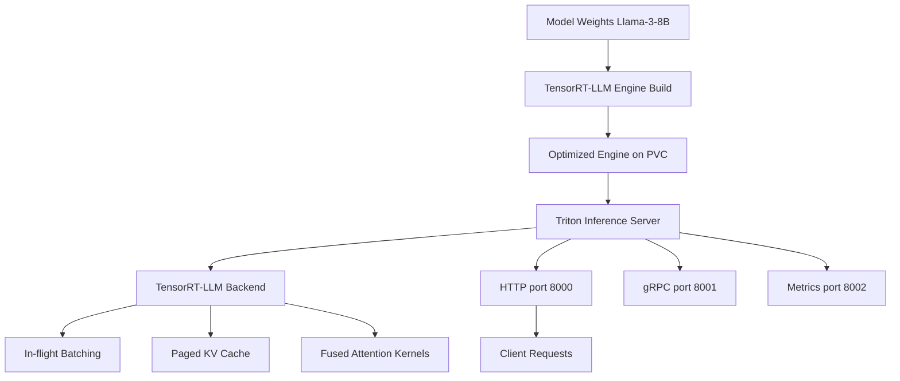

> 💡 **Quick Answer:** Deploy Triton with the TensorRT-LLM backend using the `nvcr.io/nvidia/tritonserver:24.12-trtllm-python-py3` image. Build TensorRT-LLM engines from your model weights, mount them via PVC, and configure the model repository with a `config.pbtxt` specifying the `tensorrtllm` backend.

## The Problem

Serving large language models in production requires:

- **Maximum GPU utilization** — raw PyTorch inference wastes 50-70% of GPU compute
- **Low latency** — interactive applications need sub-second time-to-first-token
- **High throughput** — serve hundreds of concurrent users per GPU
- **In-flight batching** — batch requests dynamically without waiting for a full batch
- **Quantization** — run larger models on fewer GPUs with INT8/FP8

TensorRT-LLM compiles models into optimized GPU kernels with fused attention, KV-cache management, and tensor parallelism — delivering 2-5x throughput over vanilla PyTorch.

## The Solution

### Step 1: Build TensorRT-LLM Engine

First, convert model weights to TensorRT-LLM format. Run this as a Kubernetes Job:

```yaml
apiVersion: batch/v1
kind: Job
metadata:
  name: build-trtllm-engine
  namespace: ai-inference
spec:
  template:
    spec:
      restartPolicy: Never
      containers:
        - name: builder
          image: nvcr.io/nvidia/tritonserver:24.12-trtllm-python-py3
          command:
            - /bin/bash
            - -c
            - |
              # Convert Llama-3-8B to TensorRT-LLM
              cd /opt/tritonserver/tensorrtllm_backend

              # Download and convert checkpoint
              python3 /opt/tritonserver/tensorrtllm_backend/tensorrt_llm/examples/llama/convert_checkpoint.py \
                --model_dir /models/Llama-3-8B \
                --output_dir /engines/llama3-8b-ckpt \
                --dtype float16 \
                --tp_size 1

              # Build TensorRT engine
              trtllm-build \
                --checkpoint_dir /engines/llama3-8b-ckpt \
                --output_dir /engines/llama3-8b-engine \
                --gemm_plugin float16 \
                --max_batch_size 64 \
                --max_input_len 4096 \
                --max_seq_len 8192 \
                --paged_kv_cache enable \
                --use_fused_mlp enable \
                --remove_input_padding enable
          resources:
            limits:
              nvidia.com/gpu: 1
              memory: 64Gi
          volumeMounts:
            - name: models
              mountPath: /models
            - name: engines
              mountPath: /engines
      volumes:
        - name: models
          persistentVolumeClaim:
            claimName: model-weights
        - name: engines
          persistentVolumeClaim:
            claimName: trtllm-engines
```

### Step 2: Prepare Model Repository

```bash
# Model repository structure
model_repository/
└── llama3-8b/
    ├── config.pbtxt
    └── 1/
        └── (empty — engine loaded from engine_dir)
```

```yaml
# ConfigMap for config.pbtxt
apiVersion: v1
kind: ConfigMap
metadata:
  name: triton-model-config
  namespace: ai-inference
data:
  config.pbtxt: |
    backend: "tensorrtllm"
    max_batch_size: 64

    model_transaction_policy {
      decoupled: True
    }

    input [
      {
        name: "text_input"
        data_type: TYPE_STRING
        dims: [ 1 ]
      },
      {
        name: "max_tokens"
        data_type: TYPE_INT32
        dims: [ 1 ]
      },
      {
        name: "temperature"
        data_type: TYPE_FP32
        dims: [ 1 ]
      },
      {
        name: "top_p"
        data_type: TYPE_FP32
        dims: [ 1 ]
      },
      {
        name: "stream"
        data_type: TYPE_BOOL
        dims: [ 1 ]
      }
    ]

    output [
      {
        name: "text_output"
        data_type: TYPE_STRING
        dims: [ -1 ]
      }
    ]

    parameters {
      key: "engine_dir"
      value: {
        string_value: "/engines/llama3-8b-engine"
      }
    }
    parameters {
      key: "max_tokens_in_paged_kv_cache"
      value: {
        string_value: "32768"
      }
    }
    parameters {
      key: "batch_scheduler_policy"
      value: {
        string_value: "max_utilization"
      }
    }
    parameters {
      key: "kv_cache_free_gpu_mem_fraction"
      value: {
        string_value: "0.85"
      }
    }
```

### Step 3: Deploy Triton with TensorRT-LLM

```yaml
apiVersion: apps/v1
kind: Deployment
metadata:
  name: triton-trtllm
  namespace: ai-inference
spec:
  replicas: 1
  selector:
    matchLabels:
      app: triton-trtllm
  template:
    metadata:
      labels:
        app: triton-trtllm
    spec:
      containers:
        - name: triton
          image: nvcr.io/nvidia/tritonserver:24.12-trtllm-python-py3
          args:
            - tritonserver
            - --model-repository=/model-repository
            - --log-verbose=1
            - --http-port=8000
            - --grpc-port=8001
            - --metrics-port=8002
          ports:
            - containerPort: 8000
              name: http
            - containerPort: 8001
              name: grpc
            - containerPort: 8002
              name: metrics
          resources:
            limits:
              nvidia.com/gpu: 1
              memory: 64Gi
              cpu: "8"
            requests:
              memory: 32Gi
              cpu: "4"
          volumeMounts:
            - name: model-repo
              mountPath: /model-repository/llama3-8b/config.pbtxt
              subPath: config.pbtxt
            - name: model-repo-dir
              mountPath: /model-repository/llama3-8b/1
            - name: engines
              mountPath: /engines
          readinessProbe:
            httpGet:
              path: /v2/health/ready
              port: 8000
            initialDelaySeconds: 120
            periodSeconds: 10
          livenessProbe:
            httpGet:
              path: /v2/health/live
              port: 8000
            initialDelaySeconds: 120
            periodSeconds: 30
      volumes:
        - name: model-repo
          configMap:
            name: triton-model-config
        - name: model-repo-dir
          emptyDir: {}
        - name: engines
          persistentVolumeClaim:
            claimName: trtllm-engines
---
apiVersion: v1
kind: Service
metadata:
  name: triton-trtllm
  namespace: ai-inference
spec:
  selector:
    app: triton-trtllm
  ports:
    - name: http
      port: 8000
    - name: grpc
      port: 8001
    - name: metrics
      port: 8002
```

### Step 4: Test Inference

```bash
# Health check
curl http://triton-trtllm.ai-inference:8000/v2/health/ready

# Generate text
curl -X POST http://triton-trtllm.ai-inference:8000/v2/models/llama3-8b/generate \
  -H "Content-Type: application/json" \
  -d '{
    "text_input": "Explain Kubernetes in one paragraph:",
    "max_tokens": 256,
    "temperature": 0.7,
    "top_p": 0.9,
    "stream": false
  }'

# Streaming inference
curl -X POST http://triton-trtllm.ai-inference:8000/v2/models/llama3-8b/generate_stream \
  -H "Content-Type: application/json" \
  -d '{
    "text_input": "Write a haiku about containers:",
    "max_tokens": 64,
    "stream": true
  }'
```



## Common Issues

### Engine build OOM

```bash
# Reduce max_batch_size or max_seq_len
trtllm-build \
  --max_batch_size 32 \     # Lower from 64
  --max_input_len 2048 \    # Lower from 4096
  --max_seq_len 4096        # Lower from 8192

# Or use INT8 quantization to reduce memory
trtllm-build --use_weight_only --weight_only_precision int8
```

### Triton fails to load model

```bash
# Check Triton logs
kubectl logs -n ai-inference deployment/triton-trtllm

# Common: engine built with different GPU than runtime
# Engine must be built on same GPU architecture (A100 engine won't run on H100)
# Rebuild on target GPU
```

### Low throughput

```yaml
# Increase KV cache allocation
parameters {
  key: "kv_cache_free_gpu_mem_fraction"
  value: { string_value: "0.90" }  # Use 90% of free GPU memory
}

# Enable max_utilization scheduler
parameters {
  key: "batch_scheduler_policy"
  value: { string_value: "max_utilization" }
}
```

## Best Practices

- **Build engines on the same GPU architecture** — A100 engines don't run on H100 and vice versa
- **Use paged KV cache** — dramatically increases concurrent user capacity
- **Set `max_utilization` scheduler** — maximizes GPU utilization with in-flight batching
- **Allocate 85-90% GPU memory for KV cache** — leave 10-15% for runtime overhead
- **Use FP8 on H100** — Hopper architecture supports FP8 for 2x throughput over FP16
- **Separate engine build from serving** — build as a Job, serve as a Deployment

## Key Takeaways

- TensorRT-LLM delivers **2-5x throughput** over vanilla PyTorch inference
- Engine build is a **one-time process** — build once, serve many times from PVC
- **In-flight batching** + **paged KV cache** are the key performance enablers
- Engines are **GPU-architecture specific** — must be built on target GPU type
- Use Triton's `/v2/health/ready` endpoint for Kubernetes readiness probes
