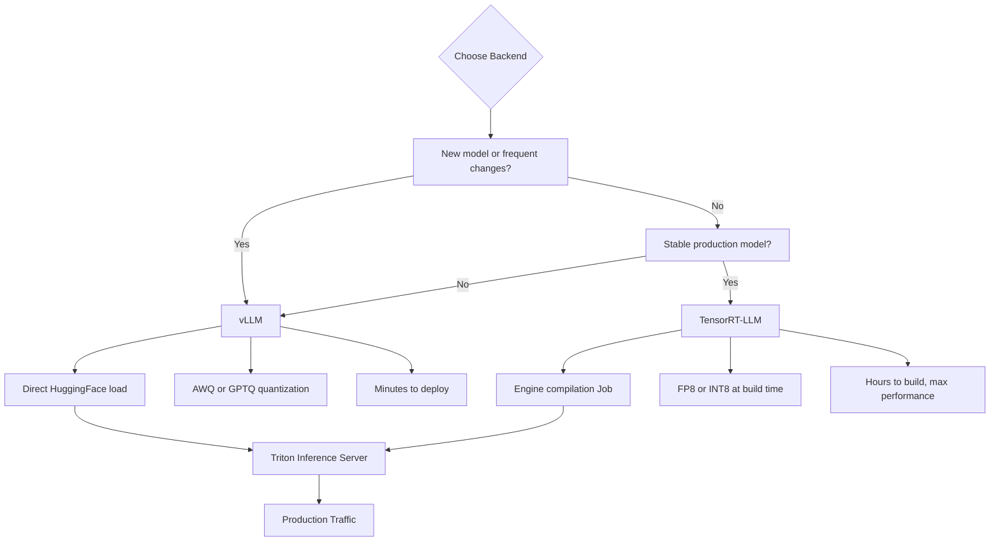

> 💡 **Quick Answer:** Use **TensorRT-LLM** for maximum throughput on stable production models (10-30% faster). Use **vLLM** for rapid iteration, pre-quantized models, and simpler deployment (no engine compilation). Both run on Triton — you can mix them.

## The Problem

Choosing between TensorRT-LLM and vLLM for Triton is a common decision. Each has trade-offs:

- **TensorRT-LLM** — highest performance, but requires engine compilation per model and GPU
- **vLLM** — near-TensorRT performance, loads HuggingFace models directly, faster to iterate
- **Teams disagree** — ML engineers want flexibility, platform engineers want performance

Understanding when to use each (and how to run both) prevents wasted effort and suboptimal deployments.

## The Solution

### Decision Matrix

| Factor | TensorRT-LLM | vLLM |
|--------|--------------|------|
| **Setup time** | Hours (engine build) | Minutes (direct load) |
| **Throughput** | Highest (baseline) | 80-90% of TRT-LLM |
| **Latency (TTFT)** | Lowest | ~10-20% higher |
| **Model swap** | Rebuild engine | Change model.json |
| **Quantization** | Build-time (INT8, FP8) | Runtime (AWQ, GPTQ) |
| **Tensor parallel** | Build-time config | Runtime config |
| **GPU portability** | Engine per GPU arch | Any GPU, any model |
| **HuggingFace models** | Convert + compile | Direct load |
| **Custom models** | Requires conversion scripts | Python model support |
| **Best for** | Stable production models | Dev, testing, rapid iteration |

### When to Use TensorRT-LLM

```yaml
# Best for: stable production model serving maximum users
# - Model won't change for weeks/months
# - Need lowest possible latency (real-time chat, autocomplete)
# - Running on known GPU hardware (A100 or H100, not mixed)
# - FP8 on H100 for maximum throughput
# - Large-scale deployment justifying build time investment

apiVersion: v1
kind: ConfigMap
metadata:
  name: trtllm-production
data:
  config.pbtxt: |
    backend: "tensorrtllm"
    max_batch_size: 128
    parameters {
      key: "engine_dir"
      value: { string_value: "/engines/llama3-70b-fp8" }
    }
    parameters {
      key: "batch_scheduler_policy"
      value: { string_value: "max_utilization" }
    }
    parameters {
      key: "kv_cache_free_gpu_mem_fraction"
      value: { string_value: "0.90" }
    }
```

### When to Use vLLM

```yaml
# Best for: flexibility, rapid iteration, multi-model experimentation
# - Testing new models weekly
# - Using pre-quantized AWQ/GPTQ models
# - Mixed GPU fleet (some A100, some L40S)
# - Small team, can't afford engine build pipeline
# - Development and staging environments

apiVersion: v1
kind: ConfigMap
metadata:
  name: vllm-flexible
data:
  model.json: |
    {
      "model": "meta-llama/Llama-3-70B-Instruct",
      "gpu_memory_utilization": 0.90,
      "tensor_parallel_size": 4,
      "max_model_len": 8192,
      "enable_chunked_prefill": true,
      "max_num_seqs": 128
    }
```

### Benchmark Setup: Head-to-Head

```yaml
# Deploy both backends for the same model
apiVersion: batch/v1
kind: Job
metadata:
  name: triton-benchmark
  namespace: ai-inference
spec:
  template:
    spec:
      containers:
        - name: benchmark
          image: python:3.11-slim
          command:
            - /bin/bash
            - -c
            - |
              pip install aiohttp numpy

              python3 << 'EOF'
              import asyncio
              import aiohttp
              import time
              import json
              import numpy as np

              TRITON_TRTLLM = "http://triton-trtllm:8000"
              TRITON_VLLM = "http://triton-vllm:8000"

              PROMPTS = [
                  "Explain quantum computing in simple terms",
                  "Write a Python function to sort a list",
                  "What is Kubernetes and why is it useful",
              ] * 20  # 60 total requests

              async def send_request(session, url, model, prompt):
                  start = time.monotonic()
                  payload = {
                      "text_input": prompt,
                      "max_tokens": 256,
                      "stream": False,
                  }
                  if "vllm" in url:
                      payload["sampling_parameters"] = json.dumps({
                          "temperature": 0.7,
                          "max_tokens": 256
                      })

                  async with session.post(
                      f"{url}/v2/models/{model}/generate",
                      json=payload
                  ) as resp:
                      result = await resp.json()
                      elapsed = time.monotonic() - start
                      return elapsed

              async def benchmark(url, model, name):
                  async with aiohttp.ClientSession() as session:
                      # Warmup
                      await send_request(session, url, model, "Hello")

                      # Concurrent benchmark
                      start = time.monotonic()
                      tasks = [
                          send_request(session, url, model, p)
                          for p in PROMPTS
                      ]
                      latencies = await asyncio.gather(*tasks)
                      total = time.monotonic() - start

                      arr = np.array(latencies)
                      print(f"\n=== {name} ===")
                      print(f"Total time: {total:.1f}s")
                      print(f"Throughput: {len(PROMPTS)/total:.1f} req/s")
                      print(f"P50 latency: {np.percentile(arr, 50)*1000:.0f}ms")
                      print(f"P99 latency: {np.percentile(arr, 99)*1000:.0f}ms")

              asyncio.run(benchmark(
                  TRITON_TRTLLM, "llama3-8b", "TensorRT-LLM"))
              asyncio.run(benchmark(
                  TRITON_VLLM, "mistral-7b", "vLLM"))
              EOF
      restartPolicy: Never
```

### Migration Strategy: vLLM to TensorRT-LLM

```bash
# Phase 1: Start with vLLM (day 1)
# - Fast deployment, validate model choice
# - Test with real traffic patterns
# - Establish baseline metrics

# Phase 2: Build TRT-LLM engine (week 2)
# - Run engine build Job on target GPU
# - Deploy TRT-LLM alongside vLLM
# - A/B test with canary traffic split

# Phase 3: Cutover (week 3)
# - Shift 100% traffic to TRT-LLM
# - Keep vLLM as fallback
# - Monitor for regressions
```

```yaml
# Istio traffic split for A/B testing
apiVersion: networking.istio.io/v1beta1
kind: VirtualService
metadata:
  name: triton-ab-test
spec:
  hosts:
    - triton-inference
  http:
    - route:
        - destination:
            host: triton-trtllm
          weight: 80
        - destination:
            host: triton-vllm
          weight: 20
```



## Common Issues

### TensorRT-LLM engine incompatible after upgrade

```bash
# TRT-LLM engines are tied to specific versions
# When upgrading Triton container, rebuild engines
# Keep engine version metadata:
echo "trtllm-version: 0.9.0, gpu: A100, built: 2026-02-26" > /engines/llama3-8b/metadata.txt
```

### vLLM slower than expected

```json
{
  "enforce_eager": false,
  "enable_chunked_prefill": true,
  "max_num_seqs": 128,
  "gpu_memory_utilization": 0.90
}
```

### Both backends show similar performance

```bash
# For small batch sizes (1-4), difference is minimal
# TRT-LLM advantage shows at high concurrency (32+ requests)
# Benchmark with realistic concurrent load, not sequential requests
```

## Best Practices

- **Start with vLLM, graduate to TensorRT-LLM** — validate model choice before investing in compilation
- **Run both in Triton** — use the same infrastructure, just different backend configs
- **Benchmark with realistic load** — sequential requests hide the throughput difference
- **Keep vLLM as fallback** — if TensorRT-LLM engine breaks after upgrade, switch to vLLM instantly
- **Use FP8 on H100 with TensorRT-LLM** — the biggest performance advantage over vLLM
- **Use AWQ on vLLM** — best quantization method for vLLM, minimal quality loss

## Key Takeaways

- **TensorRT-LLM**: 10-30% faster throughput, but requires hours of engine compilation per model and GPU
- **vLLM**: loads HuggingFace models directly, minutes to deploy, 80-90% of TRT-LLM performance
- Both run on **Triton Inference Server** — mix and match in the same deployment
- **Start with vLLM** for development and testing, **graduate to TRT-LLM** for stable production models
- The performance gap is most visible at **high concurrency** (32+ concurrent requests)
- Use **Istio or Gateway API** for A/B testing between backends before committing
