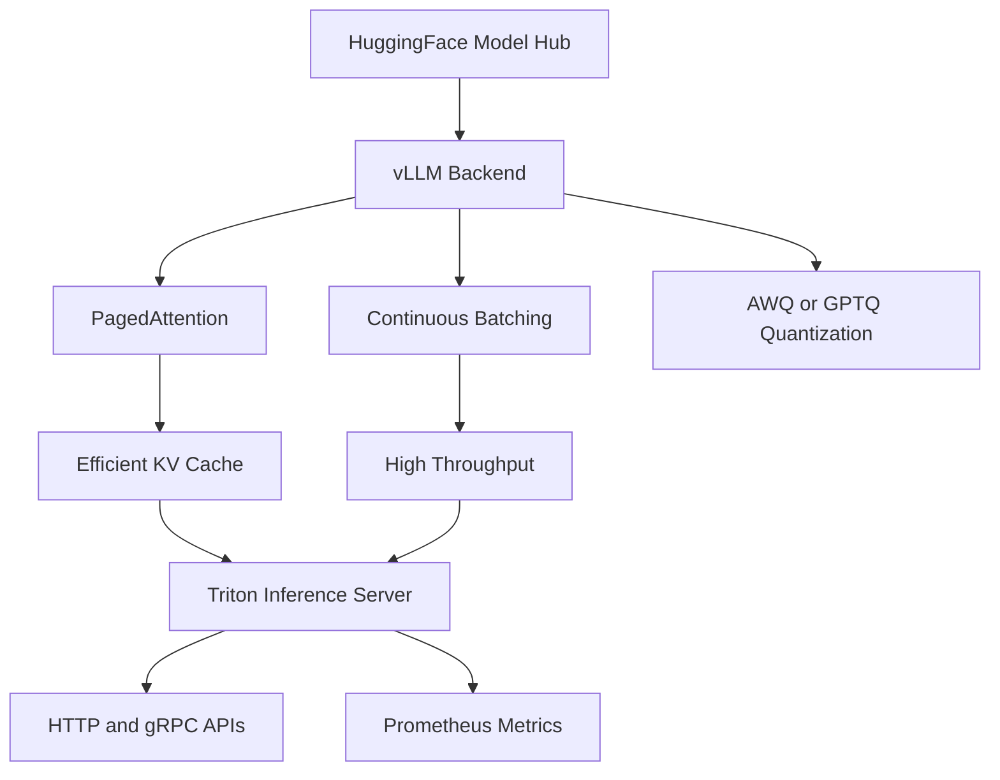

> 💡 **Quick Answer:** Deploy Triton with the vLLM backend using `nvcr.io/nvidia/tritonserver:24.12-vllm-python-py3`. Point `model.json` at your HuggingFace model — no engine compilation needed. vLLM handles PagedAttention, continuous batching, and quantization at runtime.

## The Problem

TensorRT-LLM provides maximum performance but requires:

- **Engine compilation** — hours of build time per model/GPU combination
- **Rebuilds on new hardware** — engines are GPU-architecture specific
- **Complex pipeline** — convert checkpoint → build engine → deploy

vLLM offers a simpler alternative with excellent performance:

- **No compilation step** — load HuggingFace models directly
- **PagedAttention** — efficient KV cache management (inspired by OS virtual memory)
- **AWQ/GPTQ quantization** — load pre-quantized models without engine builds
- **Fast iteration** — swap models by changing a config, not rebuilding engines

## The Solution

### Step 1: Model Repository Structure

```bash
model_repository/
└── mistral-7b/
    ├── config.pbtxt
    └── 1/
        └── model.json
```

### Step 2: Create Model Configuration

```yaml
apiVersion: v1
kind: ConfigMap
metadata:
  name: triton-vllm-config
  namespace: ai-inference
data:
  config.pbtxt: |
    backend: "vllm"
    max_batch_size: 0

    model_transaction_policy {
      decoupled: True
    }

    input [
      {
        name: "text_input"
        data_type: TYPE_STRING
        dims: [ 1 ]
      },
      {
        name: "stream"
        data_type: TYPE_BOOL
        dims: [ 1 ]
      },
      {
        name: "sampling_parameters"
        data_type: TYPE_STRING
        dims: [ 1 ]
        optional: true
      }
    ]

    output [
      {
        name: "text_output"
        data_type: TYPE_STRING
        dims: [ -1 ]
      }
    ]

  model.json: |
    {
      "model": "mistralai/Mistral-7B-Instruct-v0.3",
      "disable_log_requests": true,
      "gpu_memory_utilization": 0.85,
      "max_model_len": 8192,
      "tensor_parallel_size": 1,
      "dtype": "float16",
      "enable_chunked_prefill": true,
      "max_num_seqs": 128,
      "enforce_eager": false
    }
```

### Step 3: Deploy Triton with vLLM

```yaml
apiVersion: apps/v1
kind: Deployment
metadata:
  name: triton-vllm
  namespace: ai-inference
spec:
  replicas: 1
  selector:
    matchLabels:
      app: triton-vllm
  template:
    metadata:
      labels:
        app: triton-vllm
    spec:
      containers:
        - name: triton
          image: nvcr.io/nvidia/tritonserver:24.12-vllm-python-py3
          args:
            - tritonserver
            - --model-repository=/model-repository
            - --log-verbose=1
          ports:
            - containerPort: 8000
              name: http
            - containerPort: 8001
              name: grpc
            - containerPort: 8002
              name: metrics
          env:
            - name: HUGGING_FACE_HUB_TOKEN
              valueFrom:
                secretKeyRef:
                  name: hf-token
                  key: token
            - name: TRANSFORMERS_CACHE
              value: /cache/huggingface
          resources:
            limits:
              nvidia.com/gpu: 1
              memory: 48Gi
              cpu: "8"
            requests:
              memory: 24Gi
              cpu: "4"
          volumeMounts:
            - name: config
              mountPath: /model-repository/mistral-7b/config.pbtxt
              subPath: config.pbtxt
            - name: config
              mountPath: /model-repository/mistral-7b/1/model.json
              subPath: model.json
            - name: cache
              mountPath: /cache
            - name: shm
              mountPath: /dev/shm
          readinessProbe:
            httpGet:
              path: /v2/health/ready
              port: 8000
            initialDelaySeconds: 180
            periodSeconds: 10
          livenessProbe:
            httpGet:
              path: /v2/health/live
              port: 8000
            initialDelaySeconds: 180
            periodSeconds: 30
      volumes:
        - name: config
          configMap:
            name: triton-vllm-config
        - name: cache
          persistentVolumeClaim:
            claimName: model-cache
        - name: shm
          emptyDir:
            medium: Memory
            sizeLimit: 8Gi
---
apiVersion: v1
kind: Service
metadata:
  name: triton-vllm
  namespace: ai-inference
spec:
  selector:
    app: triton-vllm
  ports:
    - name: http
      port: 8000
    - name: grpc
      port: 8001
    - name: metrics
      port: 8002
```

### Step 4: HuggingFace Token Secret

```yaml
apiVersion: v1
kind: Secret
metadata:
  name: hf-token
  namespace: ai-inference
type: Opaque
stringData:
  token: "hf_your_token_here"
```

### Step 5: AWQ Quantized Model (Fit Larger Models)

```json
{
  "model": "TheBloke/Mixtral-8x7B-Instruct-v0.1-AWQ",
  "quantization": "awq",
  "gpu_memory_utilization": 0.90,
  "max_model_len": 16384,
  "tensor_parallel_size": 2,
  "dtype": "float16",
  "max_num_seqs": 64
}
```

For tensor parallelism across 2 GPUs, update the Deployment:

```yaml
resources:
  limits:
    nvidia.com/gpu: 2
```

### Step 6: Test Inference

```bash
# Generate text
curl -X POST http://triton-vllm.ai-inference:8000/v2/models/mistral-7b/generate \
  -H "Content-Type: application/json" \
  -d '{
    "text_input": "<s>[INST] Explain RDMA in simple terms [/INST]",
    "stream": false,
    "sampling_parameters": "{\"temperature\": 0.7, \"max_tokens\": 256}"
  }'

# Streaming
curl -X POST http://triton-vllm.ai-inference:8000/v2/models/mistral-7b/generate_stream \
  -H "Content-Type: application/json" \
  -d '{
    "text_input": "<s>[INST] Write a Kubernetes YAML for nginx [/INST]",
    "stream": true,
    "sampling_parameters": "{\"temperature\": 0.3, \"max_tokens\": 512}"
  }'
```



## Common Issues

### Model download timeout

```yaml
# Pre-download to PVC cache instead of downloading at startup
# Run a one-time Job:
apiVersion: batch/v1
kind: Job
metadata:
  name: download-model
spec:
  template:
    spec:
      containers:
        - name: download
          image: python:3.11-slim
          command: ["python3", "-c", "from huggingface_hub import snapshot_download; snapshot_download('mistralai/Mistral-7B-Instruct-v0.3', cache_dir='/cache/huggingface')"]
          env:
            - name: HUGGING_FACE_HUB_TOKEN
              valueFrom:
                secretKeyRef:
                  name: hf-token
                  key: token
          volumeMounts:
            - name: cache
              mountPath: /cache
      volumes:
        - name: cache
          persistentVolumeClaim:
            claimName: model-cache
      restartPolicy: Never
```

### OOM on GPU

```json
{
  "gpu_memory_utilization": 0.80,
  "max_model_len": 4096,
  "max_num_seqs": 32,
  "enforce_eager": true
}
```

### `/dev/shm` too small

```yaml
# vLLM uses shared memory for tensor parallel
# Mount emptyDir with Memory medium
- name: shm
  emptyDir:
    medium: Memory
    sizeLimit: 16Gi  # Increase if using tensor parallelism
```

## Best Practices

- **Mount `/dev/shm` as Memory emptyDir** — vLLM needs shared memory for NCCL communication
- **Pre-download models** to a PVC — avoids download timeouts and repeated downloads across replicas
- **Use `enable_chunked_prefill: true`** — improves TTFT (time to first token) for long prompts
- **Set `gpu_memory_utilization: 0.85`** — leave headroom for CUDA context and runtime allocations
- **Use AWQ quantization** for larger models — 4-bit AWQ fits 70B models on 2x A100
- **Cache HuggingFace models** on a shared PVC — `TRANSFORMERS_CACHE` should point to persistent storage

## Key Takeaways

- vLLM on Triton provides **zero-compilation LLM serving** — load HuggingFace models directly
- **PagedAttention** enables 2-4x more concurrent sequences than naive KV cache
- Configure everything in `model.json` — model name, quantization, parallelism, memory limits
- **AWQ/GPTQ quantized models** run directly without engine builds — great for fitting large models
- vLLM trades ~10-20% peak throughput vs TensorRT-LLM for **dramatically simpler deployment**
